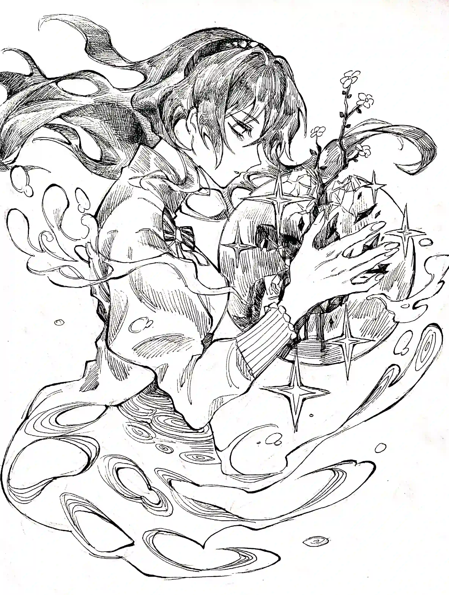

风眷恋着云，云却超越了时光{.textkai}

时光凝聚我眼，成了瓦尔基里的悲伤{.textkai}

悲伤哀婉，随之大雨倾盆{.textkai}

于是大地的被褥中，开出了宇宙之花{.textkai}

<!-- more -->

“死亡的意义是什么，凯尔希老师？”这便是你的徒孙，未来的第四代向我提出的问题。

不得不说，有孩子的时光真是白驹过隙，就好像他前几天还在我的怀里，还不会说“老师”两个字，而是用那稚嫩的嗓音称我为“妈妈”。而待我转过眼来，那个在石棺中诞生的婴儿便成长至这般。现在的他已不再满足于被赐予的知识，开始探究哲学，思考生死了。

每每看到这个孩子，我的心总会变得柔软起来，对他的喜爱之情是怎么也掩不住的。不过，我相信你可以理解我:在面对他时，我的心情总是复杂的。

他今年刚刚十二岁，但他的言谈举止已经沉稳得像个大学生了，这或许是因为他那逐渐被唤醒的大量知识，又或许是因为他在这罗德岛上亲历的战争与疾苦，而不论是二者其一还是二者兼有，他的成熟都是他命运中的不幸带来的结果。

每每看到它早熟的眼神，看到他年轻如此便已能担任岛内要职，相比于对他成长自豪与欣慰，我的心中更多是酸楚——对他那坎坷童年的自责与痛心，是对他那已定未来的无奈与担忧。

同我们一样，永生与复活早已为他身为引航者的生涯铺好了路，但也因此，他的未来早已成了定局:在容颜定格在十八岁时，他也将开启万年的羁旅，那时与他相伴的便只有所谓引导文明发展的远大目标，以及那鸩酒般愈发浓烈的孤独与离别之苦——这是长生者的宿命，这也是我们的人生。

他本应像普通人一样，有着自己短暂却充满幸福的人生，但现在他竟只能走我们的老路，走向那无底的深渊，被那不死的魔咒折磨至彻底崩溃，被那不公的命运卷入争斗的漩涡中。而身为老师的我却只能止于预测，只能眼睁睁地看着他痛苦地度过数万年。

说实话，我从未如此情绪化过。果真和他们说的一样，我在遇见他之后便不再那样冷漠，心变得柔软了起来，有时候就像现在这样感情有较大的起伏。不过，正是因为这个孩子，我对那伟大而温柔的先贤又多了一些理解和共情。

“你害怕吗？”

我明知故问，他的答案自然是否认的。

“不会……于我们而言，反而是永生更令人恐惧吧。”

是呢。

让人在充满希望时死去，和让人在绝望中永远存在，究竟哪种更令人痛苦，哪种更令人抓狂呢？

“就像是……”

“普瑞赛斯。”

他抢答道，说出了你伟大的老师的名字。

对于普瑞赛斯，想必你比我更了解她，毕竟我未曾见过她本人。但不容否认的是，她度过了漫长的，艰辛的一生。

在那曾经极盛的，被源石的风暴沦为荒墟的大地上，比漫天黄沙繁多的是孤独，而比鲜活生命稀少的便是希望。

普瑞赛斯独自一人留在了那废土上，利用石棺成为了“神明”的神明，将控制与压抑巨兽的力量刻在了心脏上，写在了血液中，借它们的手动用那双刃的源石，让地衣攀附上裸岩，让黄沙凝结成泥土。

排除裹挟着沙砾的气流刮过耳边的声响，普瑞赛斯的世界便只剩死寂。白日直射阳光的炙烤让她苦不堪言，夜晚无边的黑暗让她充满不安。孤独感会爬上她的后背，刺入她的肉体，压迫着她的心脏，让她多次发现活着是多么痛苦的事。

而不仅仅是对于她，于我们而言，死亡和重生的间隔是最甘美的，是最令人向往的。

在短暂的疼痛后，我们便好似坠入了深海。温暖而柔软的海水包覆着我们的肢体，抚摸着我们的肌肤，就好像自己回到了襁褓之中，舒适而有令人心安。或许他人在尚有意识时会因失去一切而痛苦，但讽刺至极的是，一无所有的我们又能被夺走什么呢？

然而，意识弥留的时间只有几秒钟，而时间感会随之一齐逝去。在一瞬之后，我们便会在培养液中醒来，同时发现一切都偏离了原本的轨迹。

百年间，水源会再次被辐射污染，绿洲会再次凋落成荒漠，而苦心创造的生物也只剩下巨大的骨架——一切都要从百年，甚至万年之前重新开始。

命运让那被阳光炙烤的人瞥见静谧的夜晚，而后却将其再次拉回“光明”中，这是如此的扭曲，如此的病态，就好像是居心叵测者有意为之的一样。

但略微能给人些安慰的是，待第二代引航者的身体与精神质量达标，可在自己的石棺中复活时，普瑞赛斯便有权限关闭自己的程序，而后何去何从便是她自己的自由了。

兴许和普瑞赛斯的一样，我的计划便是将下一代养大成人后直接撒手人寰，毕竟那短暂疼痛后的安宁一直是我苟活的信念，甚至在将这孩子带回舰内后也是。

但这一切，在那一声“妈妈”之后便不复存在了。

“妈妈”……多么美妙的词汇，即使只是“老师”的替代品，但在第一次被赋予如此身份时，我的心还是像入春一般温暖了起来。

我一开始想要否认，毕竟我们最多是师徒关系，而究其根本，兴许是逐渐升腾的幸福感开始侵蚀我求死的心，让我原本的希望逐渐化为灰烬。但在几秒后，新的希望逐渐占据主导，柔和与温暖充斥着我的心脏，让我终于不能自已，时隔数千年再度哭泣了起来。

在见到这孩子的那一刻，我便明白：今天是我此生最幸福的一天。而对于孤军奋战上万年的普瑞赛斯来说，这一切定是深沉千倍百倍。即使你没有流着她的血，但就像我和这少年一样，你就是她的孩子，她的挚爱，她最伟大的成果。

从小培养一个孩子绝对是十分治愈的。看着他第一次在繁茂的草地上奔跑，听到他第一次开口说话，回答他向自己提出的第一个问题，发现他开始思考属于自己的哲学……每每回想起这些，我总是感动不已，就像在宣告先前的痛苦与艰辛都值得，都是为现今幸福做的铺垫。

然而，和寻常的母亲一样，我也不禁担心起了孩子的未来，尤其是在他五岁的那年，在他看到“姐姐”的尸体时。

“姐姐”是个温柔的年轻人，虽然多少毛躁了点，但办公方面还是无可挑剔的。同时，她也是个爱孩子的人，在我工作繁忙时，“姐姐”总是悉心照顾他，和他做类似读绘本一类简单但“妈妈”做不到的事情。可以说，如果没有她，这孩子的童年就真的残缺不全了。

我对她充满了信任和感激，而她也为了回应我毫无保留地奉献着自己，为的便是我们那共同的梦，那彻底克服掌控源石的梦。

然而，正是这么好的人，竟在战场上被榴弹击中，半截身躯就像沸水一样化为蒸汽，遗体染红了白色的布料，残缺的肢体暴露在了那孩子的眼前。

或许是我的情绪让我也不再理智，我有些无理取闹地将没看住孩子的人训斥了一顿，而那一席话，或多或少也是对我自己说的——对没有负起责任的失望，对没能保护好他的愤怒。

处理完大小的事项后已是后半夜，期间他异常冷静地辅助着我，毫无差错的完成了自己的任务。但回到家后，那孩子的悲伤还是突破了内心的封锁，终于让他放声大哭了起来。

他在我怀中颤抖着，的泪水浸湿了我的衣服，那红肿的眼睛让我的内心不可能平静下来。“姐姐”的名字带着哭腔传入我的耳膜，仿佛击穿了我的天空，让我也险些不能自已。

他的每一声啜泣都像是对我的责备，每一滴眼泪都在斥责我的无能，斥责我的失职，斥责我让这五岁的孩子去承受如此的痛苦，面对外人时还主动压抑自己的内心，将感情封在平静的外表之下。

而与此同时，我也绝望地发现:这于他而言只是第一次。在这之后，类似的甚至更为夸张的生死离别将不断发生，无数美好而令人留恋的都会在某个瞬间离他而去。

在这寿命普遍短暂的世界，时间的利刃和他人的地狱会一直觊觎着他所珍视的一切，让他最终只得在人群孑然一身。而在这期间，我只是一个旁观者，纵使比他多出几万年的阅历，我也对这令人发指的一切无能为力，只能用自己并不宽厚的臂弯将他揽入怀中。

此时的我连一句安慰的话也要想上半天，就好似没有知识的文盲，词汇量匮乏至此，能想到的话语无论怎样都不能抚平他的伤痛。

而最后，我终于选择了最有效，最高明的一句:

“别怕，有老师在……”

有老师在，你便不会受伤。

有老师在，你便不必恐惧。

有老师在，你便有一个地方可以依偎，可以像这样放声哭泣……

我选择了最简单的一句话，而正因其简单，其中的意义才可以被无限扩大。

而正是这句话，成功安抚了我那痛苦着的孩子。

那时，他的哭声减缓了。

那时，他拥抱我的力量逐渐提高，甚至让我的肋骨有些疼痛。

泪水和身体的温度传达了过来，让我感到有何物解冻了，融化了。

那时，我深刻领悟到了一件事:

我要活下去。

在抛弃身为引航者的责任后，我最新的使命便是继续活下去，让一颗古老的灵魂继续发光发热。

不论我经历过怎样的痛苦，不论我还将要遭受怎样的磨难，不论现在的我是否因感情而变得脆弱，我都必须要活下去，和我怀中的孩子一起活下去，去用自己的存在告诉他:就算世界崩塌，就算文明寂灭，我也永远会站在他身后，支持着他，祝福着他。

我应该像普瑞赛斯一样，为自己的学生，自己的挚爱抛弃自己的死，和他一同面对那充满未知的未来，和他一起履行自己的使命。

和我所承诺的一样，我陪伴着他走到了今天，和他一起生活，一起工作着。而每个难以入眠的夜晚后，我都会和他站上罗德岛的天台——早晨初生的太阳永远是最壮丽的。

不出一会，黑暗的天空便会被箭矢般的金色打破，随即太阳再次出现在了地平线上，光芒会照亮整片大地，会照亮罗德岛上的两人。

第一次看到日出的他终于破涕为笑了……我果然还是喜欢看他笑着的样子，如此可爱，如此令人感慨，如此让人充满希望。

站在晨光中的我总能看到未来——看到他建立属于自己的伟业，看到他的名字传遍整片大地；看着他遇到那长生的佳人，在我的祝福下喜结连理；看到他历尽沧桑后成了养父，将他的下一代揽入怀中，感受我们当年感受过的震撼。

我想要亲眼见证这一切，想要陪伴他去走剩下的路，想要成为他所能够依靠的力量，就像普瑞赛思和你一起发掘这移动城市一样。

间隔一代的我们在不同时间处在了相同的地方，感受着阳光驱散夜晚的恶寒与黑暗。面对成长着的希望，曾经那一心求死的博学之人站在自己的学生身边，打算和他一起活下去。

我们的双手在朝阳下紧握着，一方经时光磨砺下却未见苍老，而另一方则随着年月不断成长着，愈发粗糙，愈发有力，愈发稳重。

“是啊，人的本质还是不想死的，因此人只要有物质和希望就能活下去。”

十二岁的他如此总结到，而他的下一句话，想必也是有关普瑞赛斯的。

“那么，在充满希望时不得不死去，也是一种痛苦吧……”

谈及生死，我们间的气氛不可避免地沉重了下来，更何况是谈论那为你而死的伟人。

普瑞赛斯和我一样对未来充满了期待，但可惜的是，一场意外让这一切化为了虚浮的泡影。

你在二十岁那年患上了绝症——巨兽不满于引航者的控制，抓住了普瑞赛斯所设机制的缺陷。他们的阴谋聚焦于你那孱弱的身躯，聚焦在了普瑞赛斯的弱点上。

起初你只是头痛和发烧，普瑞赛斯并没有太过担心，但之后你便咳出了鲜血，在石棺中昏迷了数个月。

看着因石棺的治疗不堪重负的你，普瑞赛斯意识到:自己的生命就要，也该走到尽头了——否则，你便会处于死亡与重生的循环中，直到整个星球的资源耗尽为止。

她要将自己的心脏彻底献给你，她要将自己的存在毫无保留地送给她的学生，她的孩子。

求死之人因自己的后代选择活下去，而如今那想要存活的人却也要因他而死，我们命运似乎永远是这样扭曲，这样病态。

就像往常一样，那天她扶你躺入了石棺中。而让你的倦意褪去的除了机器发动前响起的警报，还有普瑞赛斯那不舍却依旧温柔如水的笑容。

你意识到了什么，但你病变的喉咙让你无法发声，虚弱的肢体让你连起身都做不到，让你只能瞪大双眼看着普瑞赛斯打开了手术程序。

她并没有和你商议此事，因为她知道，你是坚决不会同意的。

相比你当时肯定拼命挣扎着，想要从石棺中爬出，想要打破命运的囚笼，但事与愿违，大量的体力消耗让你的眼前愈发模糊，让你更加难以支撑那早已支离破碎的身体。

只见普瑞赛斯输入了最后的指令，安详而舒缓地向你走来，就像那坦然面对命运的圣人，而她唯一的门徒此刻的痛苦不知或许能够没过那十二人的悲哀。

 {style="float:right;max-width:50%;margin-left:1em"}

然而，在临行时，普瑞赛斯握住了你的手，说出了让你难以置信的话语：

她说，这是她生命的终结，但她却永远不会消逝——

她会前往星空外的云端，前往那文明的尽头。

那里没有痛苦，没有疾病，没有荒地太阳的曝晒，没有沙漠夜晚的苦寒。  

在那里能俯瞰整个世界，探查每一处细节，追溯一段历史。

她说，无论你是光鲜亮丽还是狼狈不堪，她都会默默地注视着你，祝福着你。  

她说，她永远会等待着你，等待着你们的重聚，与先贤们一起在那远方注视着这片复苏的大地。  

就算海洋沸腾，大气消失。

就算卫星坠入重力的漩涡。  

就算太阳凶恶地膨胀，无情地吃掉它的孩子直到万籁俱寂。  

你们也一样能再见面，在那黑暗与星光并存之处，在那没有痛苦，没有悲伤的地方。

“不许忘记我。”

这最后一句话结束时，麻醉剂的作用让你逐渐无力，你没能推开那厚重的舱盖，在恩师兼养母的注视下沉睡了过去。

待一切准备妥当，石棺内恢复了原本的寂静，寂静得就像只有普瑞赛斯一个人一样，就像这二十年只是一个梦，一个美好而又残酷的梦，待她醒来之后还要继续面对那令她崩溃的现实，在求死和无法死亡的矛盾中徘徊。

我不清楚，在历经这梦一般的时光后，她是否会畏惧死亡，畏惧其带来的失去，畏惧着不能与她挚爱的孩子相伴，不能再看见你的笑容和你那刚刚褪去青涩的容颜。或许在你彻底昏迷后，她会躲在角落里默默哭泣，咒骂这令人发指的不公命运，拼命而徒劳地思考着所谓的万全之计。但最后，就像她在二十年前放弃自己的死一样，普瑞赛斯为了她的挚爱献出了自己的生，让那凶恶的神明自本能屈服于你。

普瑞赛斯的肉体消散了，但你坚信，她并没有灭亡。也许，她的意识真的上传到了云端，她真的注视着你在悲伤后走出了石棺，完成了自己的使命，看着一个白发的菲林女性成为了她的徒孙，与你共度了一段欢乐的时光。

“是啊……这是最让人惋惜的。”

“不过，她也成功地为下一代开创了精彩且波澜壮阔的未来。”

谈论完普瑞赛斯，我又不禁想起了你，想起了我和你的种种往事。

和普瑞赛斯一样，出于职责，在将我唤醒后，你便成为了我的老师，引导着我的成长，让我成为了有感情与灵魂的真正的人。

相比于“老师”和“养父”这种充满距离感的称呼，我们的关系倒更像是友人，甚至在听到你一遍遍地讲着“死后会前往云端”之类毫无依据的理论时，我都会将不满与不屑溢于言表，甚至在心中调侃普瑞赛斯是不是有着守护餐桌的职责，那样的话你便有抄袭北欧神话的嫌疑了。

同样的二十年间我们无话不谈，而我知道，你那些波澜壮阔的故事是没那么容易讲完的，就像你对恩师的祝福与怀念一样。

我至今还记得你对我讲述的往事——一个不死的军师，一个伟大的政治家度过了怎样幸福的童年，如何引导部落与国家的建立，如何让生产力蓬勃发展，如何启发人们思考艺术和哲学，以及那些宛若昙花一现，但却也留下一笔惊艳的伟人们灿烂的一生。

老实说，你是不幸的，因为和性格冷淡的我不同，你是一个温柔而感性的人。然而，过度的感性正是长生者的大忌。

孤独与离别永远是寿命论绕不开的话题，其带来的痛苦随岁月积攒而愈发沉重，甚至高过死亡带来的恐惧。

而我想，属于我们两人的幸运，想必便是你遇到了师娘吧。

她是乌萨斯贵族的长女，容貌精致，年龄也可长达数万年，有知识，有气质，有能力，唯一的缺点兴许就是身子骨弱，不能产子。但这也是为什么她会对我，一个与她无亲无故的菲林孩子疼爱有加，就像对待自己的亲生女儿一样。或许在我刚开始说话时也曾称她为母亲，在幼年也曾在她的怀中哭泣过吧。

在你们的呵护下，我度过了相较安稳的十八年。站在炎国山峰上的我可以看到世间的一切，身临其境时也就多了几分从容，而在我投身其中之前，我的行李中多了几件你和师娘做的衣服。

每当我感到痛苦时，想起还有一个温柔的人在挂念着你，在等待着我，便感觉所经历的苦难全部都值得，一切都还有希望。但我们都清楚，身世与血脉总会为我们的安宁带来隐患。

而在不幸的最终，我们所视若珍宝的安宁也终于被夺走了。

控制巨兽的力量让几乎所有人都觊觎你的血液，因此便有了歹人设计引虎归山的计谋——我那柔弱的师娘与她年迈的父母挡不住歹人的攻势，惨死在了府中。

而他们严重低估了你的战斗力，在我闻讯赶到时，那里便只余破碎的木片，几具残缺的尸体和被血液淋透的你了。在当时极度的悲痛下，你并没有哭泣，甚至连悲伤的表情都没有。你的眼中早已没有了光，而散发着令我浑身一震的恶寒。

他们杀死的不仅仅是你的妻子和你的家庭，更是你那最后的良知，是你最后的希望，是那无尽孤苦与心酸以及其转化出的无尽杀意的封印。

找到此事的主谋于你而言绝非难事，几天后，一颗人头出现在了他的寝室里。你拿起了妻子的佩剑孤身一人闯入了仇敌的堡垒中，用岳父传授给你的技艺开出了一条血路，将那躲藏的贵族生擒，并用极刑让他惨死在了你的手下。

当附有源石技艺的刀刃刺入那歹人的皮肤，剜下其血肉，令其发出响彻整个房间的哀嚎时，你的心中定没有一丝恐惧和罪恶感，反而是在离奇的平静中感受到一丝愉悦，就像是在房间中打开留声机，躺在床上听一段优雅的歌剧一样。

和酒精以及麻醉药品一样，麻痹神经，能让人短暂脱离现实的事物是最令人上瘾的。而对于那颗因创伤而早已扭曲的心而言，血液与生命流逝的画面便是最好的止痛剂。

但这一切还不够，你需要更多的刺激，需要更有效的方式来毁灭更多的生命。

你的眼光看向了战争，看向了急需一场血肉横飞的大战的卡兹戴尔，看向了那最适合你展示军事才能的舞台，好像饥渴了数天的狼看见了一头肥美的猎物，毫不犹豫地加入了政权。你带着你的组织与王庭合作，并用圣经中那通往天堂之塔为名以作美化，开始了那最为黑暗的百年。

这个世界于你而言只是一盘棋，甚至比一盘棋还要简单，每个人的死亡都可能只是微小的一步，就连你自己也可以作为一颗棋子被使用和牺牲。从设计陷害一名与你不和的贵族，到让一座繁荣的城市化作历史上最大的绞肉机，在你那无尽的知识与举世无双的指挥能力下都不在话下。在几场大获全胜的战役后，你那古老的战术征服了所有人，让你自然而然地成为了女王的心腹。

卡兹戴尔从未如此强盛过，但萨卡兹这一族群也从未如此令人生畏，令人憎恶过。当恶魔的军靴声在远处响起时，整个城市就仿佛处于恶灵的注视下，他与此距离甚远，但却好似站在每个人的身后。

虽然这一切为一个国家带来了前所未有的昌盛，但这一切也只是一个野心家满足自身欲望的副产物罢了。即使与自己的师长为敌是极令我心痛的，但我心里清楚，终止这一切便是引航者的责任，便是我的责任。

我拿起了那源石技艺凝结成的剑，将剑锋指向了萨卡兹的部队。你肯定记得，霎时间，高塔术士的法术划破天空，高卢炮兵的火器齐声轰鸣，巨大的甲胄喷射灼热的空气，率先向那滚滚而来的黑云发起冲锋。

三大军事强国的先锋精锐集结联合，以高涨的气势和绝对的实力冲向了卡兹戴尔，如飓风般席卷过了这片早已被血液染黑的土地，纵使那魔王亲自踏上战场也并不能改变这场战争的结果。但与“巴别塔的恶灵”站在对立面，与自己的老师针锋相对，即使有碾压对方的兵力，我的胜算仍在五成以下。

不过我没有想到的是，你的指挥竟然有也会有失误的时候，巨大的低级错误让我有了可乘之机，让这场战役的胜利彻底偏向了我方。

破碎的肢体掩盖了大地，腐坏的血液渗入了泥土。在一番血战后，我终于将那魔王斩首，杀到了你的面前，准备将你打晕生擒，或是直接割断你的喉咙，将你封印在石棺中至少几百年。

但或许是疲劳让我的神经开始衰弱，又或者是面前的你让我的情感产生了波澜，我没有注意到背后的温迪戈，在你面前被洞穿身体倒在了地上。

魔王的死已经宣告了你的失败，野心勃勃的萨卡兹族群也遭到了重创，我的再一次消亡便并不会有太多影响。只不过，在意识尚清晰时脖颈的肌肉和骨骼被硬生生扯断，感受到自己的身体离自己而去，头颅被插在坚硬的木棍上示众，实在是极其痛苦的死法。

我不知第一次历经如此惨败的你会有何举动，是重振军队卷土重来，还是用派出杀手这种下三滥的手法，亦或是主动求和，希望我加入你的行列。

但最后，那巨大的转折在我心中刻下了一道伤痕，让我此生都不可能忘记。

百年之后，待我再度从石棺中苏醒时，迎接我的却是女王的专机和早已在巴别塔等候多时的你。

当时的你你早已形似一具行尸走肉了。惨白的面上没有一丝血色，凹陷的眼窝形成了阴影，黑色素聚集在你的眼袋下方。当时的你似乎很久没有整理胡须了，那邋遢的形象与我印象中的你大相径庭。但与之相比，最令我难忘的，还是你那糅合了喜悦，无奈与无尽愧疚的表情——那个被你硬挤出来的，十分难看的，让我心酸不已的笑容。

从见到你的神态的那一刻起，我便明白了一切——那病态的血性下隐藏着的，是一个独自躲在角落里哭泣的人。

你无法真正地投身到满足自身上，但你的欲望仍然压制了你的理性。你身处在善恶两个极端的夹缝中，这是最可悲的，这是最致命的。

你说，你在百年间从未停止过责备自己，每次闭上眼睛，都会再次来到那血染的战场上，看着与自己相识万年的学生将刃锋刺向自己，而后惨死在自己的面前。震惊，沉痛与悔恨在你脑中循环着，像痛斥罪行的天使，又像折磨肉体的恶魔。

你说，你梦中的爱人和你一样批判了你的所做所为，而后对你那憔悴不堪的外表感到心痛。而你在云端那金碧辉煌的大厅中见到了普瑞赛斯，看着她为你痛苦的一生流下泪水，而后无力地放你堕落回了人间。

我在你的话语中感受不到一丝生气，一丝想要活下去的愿望。我面前陷入绝望的老师让身为学生的我也痛心不已。

越是强大，越是脆弱。

甲胄越是坚硬，其下的肉体便越是柔软。

正如被杀戮和残暴所掩盖保护的那早已被暴君般的命运扭曲得不像样的心，貌似早已化为铁石，但血与泪却无时无刻不在渗出流淌着。

而你请我来到这罗德岛的目的是我从未想到的——你要求我彻底杀死你，且不要让你以任何形式存于人世中。

百年的时光可以改变很多事情，萨卡兹这一族群逐渐理解了我的初衷，和你一样开始了反思，终于认清了那恶毒的野心和虚伪的正义。但这一切并不存在于平民百姓中，彻底改变他们的看法还需要我们的一场戏:

一部刺客杀死刽子手，将他的罪行公布于众的剧本。

在这百年之内，你将自己的军事知识与指挥逻辑载入了PRTS中，让代理指挥系统可以完美替代你的位置。在百般不舍中，王庭最后同意了你的决断与计划，让你回到了你的出生地，关闭了那复活的程序，终于有机会去选择自己的未来。

你的意图不难理解——你想要为我找一个借口，以便让我留在这里，为我提供更好平台的同时，也不必再颠沛流离下去。

你希望我能一个可以停下休息片刻，整理思路，或者锁上门发泄情绪的地方——

你希望我能有一个家。

尽管其动机更为复杂，你最终也和普瑞赛斯一样，用生命来奠定了自己学生的未来。而正因如此，面对那冰冷而沉重的铳械，我感到了前所未有的压力。

你将一把左轮和子弹放到我的面前，而后毫不犹豫地转身离开了，没有给我劝你留下的机会，也没有为自己留下反悔的余地。不知，那天晚上的你是否和我一样，在不安中无法入眠。

那是一个阴沉的雨天，或许是受潮气的影响，我感到我的行动受阻，仿佛有无形之力拼命地将我向后拉去。王庭的领导者们面色凝重，不仅是因为对那为他们开创了现今与未来的人的留恋，更是因为那对一个被造化逼迫成了如今样子的良善之人的惋惜与哀伤。

在绝对的肃穆下，在女王准许之后，我上好了六颗子弹，打开门走入了雨中。

雨水打湿了我的头发，流过了我的脸庞，雾气让我无法看清眼前那将由我来杀死的可怜之人。那把手枪不知为何竟是如此的沉重，沉重到即使我双手持握也无法端稳，沉重到那做过千万场外科手术的手竟不住地颤抖起来。

只见那模糊的漆黑身影处闪出了寒光，缓慢而犹豫不决地上升，最后将火舌喷出枪膛。子弹飞过我的耳边，击下了几缕头发，令其被积水冲走。

我从情绪中清醒过来，视野因紧张与惊吓而变得清晰，让我可以看见你的脸，看见你面上的表情:那是一种安详与放松，其中夹杂着我在孩提时最为熟悉的温暖与慈祥，像是在安慰，像是在劝导，像是一个父亲在告诉自己的孩子:淋雨会让你感冒的，所以尽快回去吧。

当时的我真想将枪口对准自己，或是夹杂着我从未用过的粗口大骂你一顿:相比于对那副亲切而令人怀念的面孔开枪，饮弹自尽与我而言绝对要简单得多。

我用枪声代替我歇斯底里的哭喊和怒吼，失去理智似的胡乱地射击着，就像在家长面前哭闹的小孩子，想要发泄，又想要逃离。六发子弹没有一颗命中，而我早已听不见那弹鼓空转的声音了。

撞针击发底火的声音几乎与弹头撞击地面的声音同时发出，让我的耳膜有些刺痛。刚才的温暖转变成了一种严肃冰冷，和逐渐被雨水打湿的衣服一样让我打了个寒战。

那是对我的责任的提醒，提醒我去面对眼前的现实，提醒我让眼前的恶灵遭到应有报应，提醒我作为引航者不应因私人情感变得优柔寡断。

手中的左轮似乎开始进水生锈，让我逐渐无法支撑起其重量，只得无力地将其放下。

此时，枪声再次响起，精准地擦过鬓角，划破了我的皮肤，残留着火药燃烧的炽热，让流过的雨水带来的疼痛感大幅加剧。

痛楚让我开始与你感同身受，让我重新意识到你所经历的苦难，其就像永不愈合的伤口一样，让你无时无刻不处于绝望之中。温热的液体不断地流出，划过脸颊，滴在地面上，融入雨水中。我眼前的世界再次朦胧起来，就好像你已经消失了，只留我一个人站在这大雨中。

我记得我们也算是有过一个家，有过一个你和师娘都在的地方，有过一个可以为我提供温暖，解答我的疑惑，包容我的脆弱的地方。而命运连那朴素的一隅也没有为我们留下，竟让那对师生像现在这样以火器对峙着，让二人都在痛苦中挣扎着。

我从未感到过如此寒冷，就像处于乌萨斯的北境，手指早已因低温不能屈伸，扣下扳机要废很大的力气。

但在那之后，我看见你将右手举向天空，将第四，五发子弹射到了阴云当中，射向了几个小时后星空所在的地方。

那便是你口中的“云端”，我口中的“英灵殿”所在的地方。

啊……

是啊。

你的肉体将要溃散，但你并不会灭亡。

你会前往星空外的云端。你会与那最爱你的普瑞赛斯相会，与她畅谈你在地上的所见所闻。

你会在那没有痛苦的地方默默注视着我，注视着我走完属于自己的路，拥有自己的孩子，完成自己的使命。

你将了结你在人间的苦难，在爱徒的子弹下得到这万年换来的安宁与幸福。

倒也讽刺……这我一向不屑的言论，竟在如今成了我最大的安慰，其美好让我不得不去相信它是真实存在的，就像相信圣诞老人会为自己投下礼物的小孩子一样。

雨逐渐变小了，在你的身后甚至可以看到那尚未落下的太阳，它从阴云中挣脱，重新染红了天际。金属反射着夕阳的光，令这冰冷的一幕和你的本心一样温暖而温柔起来。

我能看到雨水流经你沧桑的脸，不知其中混着的泪水是本能最后的挣扎，还是终于能魂归寂静的喜悦与感慨。在最后的时刻，你将最后的一颗子弹取出扔给了我，将你所剩下的毫无保留地送给了我。

我想要说些什么，兴许是不希望我们的离别太过沉重，不希望你往生的开始太过伤感。

最后，我半开玩笑半认真似的说道:

“你会等我吗？”

你会等我吗？你会在云端看着我吗？待我终于进入永眠时，你会第一个来迎接我吗……

就和几千年前一样，就和我们还在那个屋檐下一样，那个菲林女孩子向自己的老师提出了问题，睁大眼睛等待着他的回答。

你明显楞了一下，而后便复杂地笑了。兴许你也没有想到平日那冷漠的学生会如此向你提问，会将悲伤与祝福融入话语中直接吐露出来。

你的答案自然是肯定的，只不过和普瑞赛斯那深情的告白不同，简短精辟，而又让人永生难忘。

“我会等你来做瓦尔基里的，孩子。”

不愧是你，最后哑口无言的道成了我。你也终于承认那理论有抄袭的嫌疑了。

我们在雨中放声大笑着，笑此刻命运的无能，笑此时死亡的无力，或许也因再次听到那声亲切“孩子”而感到喜悦，感到无比怀念。

最后，在雨停下之前，我最后一次举起手来，将枪口对准你。

“不许忘记我。”

在最后的几秒，你带着微笑向我说道，即使我没有听清楚，但当时你的口型是不会错的。而我本应说的“永远不会”四个字则再次被我融入了火药之中，随着爆裂声宣告给了所有人。

在一番心理上的挣扎后，那颗子弹终于穿透了你的心脏。你应声倒下，鲜血自创口中汩汩流出，融入积水，自天台边缘流到地面，渗入了你为之奋斗一生的大地里。

你平静地闭上了眼睛，就像是一个在风沙中独自行进了三天三夜，在找到归宿后终于睡着了一样，安详平和，好似充满了幸福。

各王庭的领导者冲上了我们告别的天台，或感慨你那波澜壮阔的人生，或感伤你那贯穿一生的痛苦，或因没能让你重燃希望而感到悔恨。但最后，待那场雨停下，他们都同我一起在偌大的教堂中为你祈祷，为你送上最后的祝福。

按照你的遗嘱，我们并没有让你在泥土中化为尘埃。你那天价的遗产分为了两半，一般给了我，一半用于支付保存和保护那具极富研究价值的肉体。

你死后的一切按照你的计划顺利进行着，而作为你的遗愿和政治上的需要，我受邀成为了巴别塔的一员，让萨卡兹在这片大地上重新生根。

而如今，在巴别塔完成她的使命的万年后，在名为罗德岛的制药公司中，一对师徒正在讨论死亡的意义这一深奥的问题。

“在你问我之前，想必你已经有了答案吧。”

他的性格便是这样，谈及哲学时，他会想要将我们的答案做对比。

这次，我倒也想听一听他的答案，看看这少年是怎样想的。

“我觉得，死亡和永生一样，其目的都是为了创造意义。”

令我感到惊讶是，我们的答案是相似的。

世界因死亡而具有意义，因死亡而珍贵。

节日的烟花，就像春天的花朵，就像少年的青春，人们耽于其美好，并因其易逝而格外珍惜。

而在伟人的眼中，死亡可以用来换取意义，为了某个人，某个集体，甚至整个世界的利益献出自己的生命，甚至放弃自己的死亡。

死亡与永生是对立的，死亡与永生又有统一之处，而永生因其可以超越死亡而令人向往，其价值又是死亡所创造的。

死亡让这片大地陷入苍白，而死亡也让这片大地生机勃勃，这是如此的微妙，如此的令人着迷。

“看来我们得到了相同的答案。”

看着眼前可爱的少年再次扩展了自己的人生哲学，我自然感到十分欣慰，十分感动。

“对此，那云端中的两位先辈肯定会很满意的。”

“云端？”

这还是我第一次向他提出这一概念，而他作为唯物主义者想必也不会相信“英灵殿”的存在。我想，他或许也会和我一样，不屑地反驳我迷信的言论。

然而，他的答案实在是让我意想不到。

“那么，博士和普瑞赛斯一定正在看着我们吧。”

他说，无法证明其存在，也无法证明其不存在，那么相信与否便只是个人好恶的问题了。

“毕竟，和天堂一样，其实在是太过美好了，美好到让所谓的证据都苍白无力。”

不知你能否能听到这句话，不知你是否对此有所感慨。

很明显，这孩子比我要温柔得多，十分抱歉曾经那么刻薄地对待你，但若我有朝一日对你细声细语起来，你也许会感到有些惊悚吧……

但是，倘若那云端真的存在，你现在正在其中望着我和这孩子吗？

你现在过得还好吗？与普瑞赛斯相处融洽吗？是否有见到前人类中的贤者，与他们讨论科技，继续探究那些尚未解答的哲学问题呢？

你会等待着我吗？

待我们再会，你会如何评价我的一生，以及我的死亡呢？

我会像你说的那样，成为那“英灵殿”的瓦尔基里吗？<eod />

（责任编辑：aleph的法则；网页排版：武乙凌薇；绘图：汤罐浣熊）

<FakeAds />