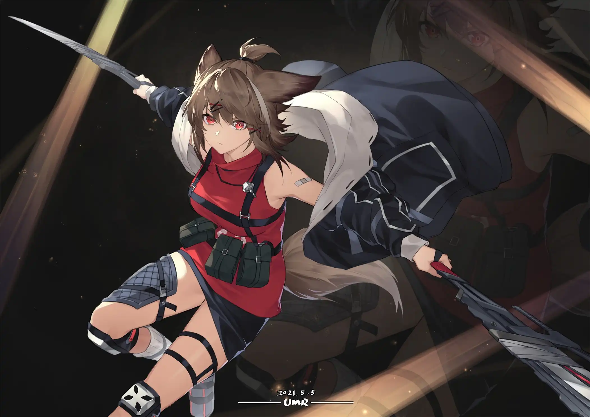

我们将遗留下来的微弱之物紧抱于怀，直面自己的失败，以勇敢的名义走过白色的海洋。{.textkai}

<!-- more -->

刻刀感觉自己快要死了。

---

 {.image-right-float style="max-width: 60%;"}

刻刀坠落在在土坡的后面，挣扎着，痛苦地呻吟着，不停地喘气，往肺里泵入空气。白桦林的尖刺围拢着她，让她的求救声变成破碎的音节，消散在炮火，弩箭和敌人的呼喊声里。

血堵在她的喉咙，她不再口渴了，但她要溺死在乌萨斯白色的海里了。

---

她只能感觉到一点点，刚才那一发炮弹在她身后爆炸的冲击余波瞬间造成的伤害，灼热的弹片刺破她的血肉烧灼着她的感官，然后什么都感觉不到了；她感觉一会冷一会热，她的眼眶盈满了雪花和水，交织出她人生最后一点温度，大概。

---

然后她听到了雪被踩破的声音，和更加吵闹但熟悉的声音。

---

“放轻松，放轻松刻刀！别急，别急，让我看看，看看……唉！”

她感觉自己失去知觉的右肩被扯起，套入长长的布段，然后被厚实地包裹起来，拧紧。从身体流出的血液完全浸透了它，湿湿粘粘的，很难受。她又感觉自己的右下腹部被塞进了什么东西，堵住了某个空溜溜的洞口，让她的身体不再被寒风穿过，让她晃悠悠的肠子温暖起来。。

---

她挣扎着拼出最后一丝力气劝身前这个人：

“快………………走…………”

---

“担架担架担架……树枝，好…好，苦艾！（乌萨斯粗口）帮我绑起来！”

刺啦——

是衣服被撕开的声音。

“还有200米。”弩箭激发和短刀相接的声音从未断绝。

“我知道！……我知道。绑在这，这，好！苦艾！先把这个预防药喝了！你抬前面！低下身子！我们往那个方向走！”

刻刀被人抬了起来，略带谨慎地放到了带着褶皱的布片上。

她看到眼前的景色正在快速地向后退，而她在被上下颠着运送着，这让她涌出了一股呕吐感。

---

她逐渐失去知觉。

---

“（乌萨斯粗口）！（乌萨斯粗口）！（乌萨斯粗口）！刻刀！（乌萨斯粗口）！四月！你还在吧！”

“我在！他也在！”

“好！这群乌萨斯杂种！十秒后通讯失效，听到了吗！往B23撤出！往B23撤出！格劳克斯！”

---

通讯戛然而止，随之而来的是后方大量无人机砸落的坠地声，和乌萨斯人的叫骂声。随电磁脉冲而至的还有在枝条间爆炸升腾的药剂雾霾。她们仍旧没有脱离危险区域，炮火先兆者并不会因为这种程度的电磁脉冲就被摧毁，烟雾的阻扰也只是一时，在激光瞄准机构恢复正常之前，她们至少要逃进下一片森林中。

---

“啊？！——”

“（乌萨斯粗口）！有人在放陷阱！留心脚下！”

“啊？！——”

“在那边！”

---

黑！可别死啊！

亚叶尽力不让自己踏空地向前快步走去。

---

身后传来狗的吠声。

越来越近。

箭矢从亚叶的身边急速破空而出，她没有停下脚步。

---

“嗷呜？！”

“博士你直接向前跑！向前跑！亚叶也是！”

卡特斯被穿着兜帽风衣的男人抛在身后，她搭箭，拉弦，撒放。

又一支箭矢破空而去

“嗷呜？！”

---

狗的吠叫，人的叫骂，陷阱的开合，同伴的呼叫，靴子踏过乌萨斯的泥土发出的声音，火焰的燃烧，箭矢的破空声，伤员的呻吟，这些东西对于亚叶来说并不陌生，她甚至因为熟悉这一切稍稍安心：

不要紧，不要紧，我们一定能出去的。

---

她与苦艾沿着大片的岩壁走着，身后的流弹险险地打在松软的泥土上，没能长成麦子和玉米。她一刻不停地计算着曲折的岩体结束的终点，试图争取多几秒回转的余地，直到引擎的轰鸣由远及近。乌萨斯军不会如此张扬，边境的小打小闹也入不了他们的法眼，锈锤不会贪恋文明的造物，聚落不会豢养无油的废铁。她的呼吸屏住了一瞬。

---

“轰！”

“亚叶！亚叶！”

---

她听到了熟悉的声音，罗德岛标识的源石越野车越过小丘砸到她的面前，车门耷拉着甩开，绿色长发长锤的医师跳下车，帮她把刻刀抬到改装的担架滑轨上，嘉维尔撕开无菌纱布袋，一边给刻刀作进一步的包扎，一边吼着：

“走！快走！亚叶你喝了抑制剂没有！在那边！自己拿一瓶！苦艾也是！”

“她的源石反应没有变化！她还没死呢！”

“我知道！（萨尔贡粗话）！我当然知道！”

“博士呢？！”

“在前头的车里……估计已经开出去了。”嘉维尔正在给刻刀身上贴上传感器，一边紧张地盯着仪器的读数。“……Stormeye跟其他人去支援黑和格劳克斯了，他们解决完痕迹就回本舰会合。”

---

“苦艾你坐远一点，给，这是一次性防护衣。”

“……我没关系的——”

“穿上！”

“咿？！”

“亚叶！冷静一点！”

“……对不起，对不起苦艾，穿上好吗？”

“好……好。”

---

“侦察小队已抵达安全区域。”

指挥室里，凯尔希，Touch，Logos从紧张的指挥通讯中解放出来。

“干员们，你们都出去吧，紧急情况解除了，大家做的很好。我们和博士有事情要谈。”

“征战骑士也出去吧，你在护卫感染者队伍方面做得很好，游击队方面给我们的反馈是‘只有少部分乌萨斯贵族军对感染者进行了追击，已经安顿好了大部分感染者’，至于博士的护卫，在博士作出决定的那一刻你就不用为此担责了。”

“……”身上铠甲和制服破破烂烂地挂在身上的扎拉克点了点头，无言地跟着其他人退了出去，然后关上了指挥室的门。

“PRTS，开启指挥室的隔绝层。”

---

空气的流动在这一刻开始变得迟缓，室内的声音也被放大，显示屏从无人机提供的远程视野切换到了泛着蓝光的罗德岛标识，天花板附近的长灯缓缓亮起，让三个人的面容隐没在阴影里。而交织的视线则不再游移，集中到在指挥室中央肃然站立的名义的最高指挥官身上。

---

“让我们开始吧。”

“首先理一下事件发生的顺序。”

---

“七个小时之前，指挥部收到了来自后方与荒野聚落处理交换事宜，以及帮助他们调整简易天灾观测仪的普罗旺斯和月禾对于边境天灾的观测结果，事实上，大片的源石雷暴云和源石龙卷正在从本舰后方逼近，我们无法在六个小时内向后方移动，所需要的源石矿和淡水资源也面临告竭。”

“在莱塔尼亚的补给遭到了当地术师仆从团的阻扰，我们已经尽量展现了罗德岛的诚意，但和当地伯爵的沟通很不愉快。”Logos甩了甩自己的手套，似乎有些恶心。

---

“鉴于前方是敏感的龙门-乌萨斯边境地带，本舰人员研判后决定，放慢行驶速度到云团速度，一部分萨卡兹干员协助信使转移后方航线上聚落人员，处理可能跟卡兹戴尔周边人员的冲突。另一方面派遣侦察小队先行对前方突击收集信息，尽量……不要打草惊蛇。”

“由于情况紧急，我同意了你作为战地指挥官同行。”

---

“五个小时之前，我们收到了你们发来的地形信息，关隘点分布，以及观察到的乌萨斯边防军驻防点，虽然你们被边防军发现了，但你们通过一些……交换，得到了驻防军换防的时间窗口信息，以及边防军临时的放行许诺。你们也被警告不要试图救助附近的感染者。当然，这也包含着另一层信息，于是你决定，在有限时间内为当地感染者隐蔽处提供救援。”

---

“罗德岛本身就将救助感染者作为责任之一，你的决定无可厚非。”

---

“至于当地的贵族军迫近并，与感染者聚落所联络的游击队交战，并把正在提供救援的我们一同攻击并造成我方严重，伤亡。这份情报则并不是边防军所应提供的，只能说，如果你没有提前与本舰联络，你们将完全丧失获得救援的机会。”

---

房间里马上因为短暂的沉默冷了下来。

---

乌萨斯的中央军，边防军，贵族军不总是铁板一块，团结一致，那位边防军长官的傲慢是他的保护伞，而他欲言又止又吐露的只言片语本来应该是他给予我们最宝贵的绳索，却被指挥者忽略过去了。这当然是他用以制衡的手段，但情报怎么使用，也是这位指挥官该思考的问题。

---

“聚落中被我们帮助的萨卡兹佣兵集团为我们以低价和药物所短期雇佣，护送我方人员和乌萨斯感染者撤退到边境荒野地带；而边防军与我们达成的交易则让你们有短暂的逃生通道，并在官方态度上取得正当性。”

“我们很幸运地拥有这些‘巧合’，但幸运不会每次都眷顾我们，而我们向龙门发出的停泊要请则很可能因为刚刚发生的‘事故’被驳回。”

---

“博士在这次任务中的交涉和指挥仍然发挥出了你的能力，但，”Touch握着她的法杖，深呼吸，“我不认为带着医护人员以及轻装小队，在政治敏感区进行大规模人员转移是明智的选择。我希望博士你对这类问题再慎重考虑一些。”

兜帽人攥紧了拳头，然后又松开，他无话可说，但他没有低垂着头，他目光灼灼，接受着质询。

---

“我们只是一家医药公司，我们与任何政治实体产生接触都应该小心翼翼，你已经通过多次策划行动亲身实践了这条定理。作为战地指挥官，你的任务已经完成，但作为罗德岛的领导者，接下来还有更漫长的事务要你解决，你需要负起责任；我们无法处罚你，但有人因为你受到了伤害，如今的你明白这一点。”

---

“管理自己和干员的关系是你的义务，当然，你显然比过去的你做得更好。”

凯尔希想起了眼前这个人曾经说过的话，她缓缓开口进行总结：

“博士，我希望你在接下来用行动回应质疑。”

---

遮蔽的异铁幕帘层叠收起，走廊的灯光从缝隙中慵懒地挤进来重新拥抱着他，让他渐渐看清眼前三人脸上的神情。他们并没有感到失望，也没有沮丧，只是因为长时间的连续指挥神经紧绷，有些疲惫，以及事情阶段性结束的轻松。

“你还要回莱塔尼亚？”

“巫王残党的活跃造成的伤亡这阵子在增多，他们演奏的乐曲让我感到……不适。”

“你呢？”

“我要去谢拉格汲取部分雪山底植物蕴藏的法术源能，我的技艺力量有些被污染而减退。”

“我让极光护送你一程，顺便帮你打点些温室的草药……”

“那个小姑娘没事吧？”

“你的法术很有用，源石结晶化被抑制，但是她失血过多中途休克了。手术还没结束，但应该没有生命危险。”

“那就好……”

他们轻声交谈着，交换着信息，然后向着同伴和博士告别，踏上下一段奔波的旅途。

---

精英干员这个头衔，意味着他们已见过太多的生死，他们比这片大地上的绝大多数人都要懂得如何挽救同伴，担当责任，并且不因自身的情感而动摇。

但亚叶还没有做好这样的准备。

“博士！怎么办！怎么办！我们要撤离吗！”

博士想起了她歇斯底里但仍然执行着战地医疗程序并撤退的样子，他要去找她。

---

亚叶正坐在手术室外的长椅上，而她身边小车上放着弃置的手术器械，几把镊子，以及几团染血的纱布，赫默的医疗无人机留置在外面为她提供协助，赫默和苏苏洛则在手术室内抢救亚叶撕开了自己右边的袖管，一边咬着布团一边为自己清理伤口，她嘶着凉气，拿起持针钳为自己缝合，她抬起头看了从走廊那一头走来的人一眼，然后又专注于缝合中。

“这个不疼，有话快——唉……有什么事吗？”

她抑制着愤怒，但手仍然在颤抖。

---

“我很抱歉。”博士组织着语言。

“不如说是我的错，”她似乎是找到了释放的出口，开始阐明她想吐露的话语，“我早就应该知道的，在乌萨斯的土地呆越久，被它咬碎的概率就越大。在你提出要靠这支小队帮助感染者聚落转移的时候，我就知道会有伤亡，”她有些自暴自弃，“但我们还是同意了。可能是长久以来成功带给我们的错觉吧。”

“咔嚓”她的缝线完成了。无人机给伤口泼洒上了药液。

---

“……我的应急指挥处理还不够好，原本…她不用受那么重的伤的，那些感染者也不用死……”

“你在说什么？”她突然抬起头。

亚叶并不是凯尔希那样的性格，她的脸上不会挂有漫长生命养成的嘲讽或者不屑，她没有对别人的轻视，这使得她的情感表达更为直接，纯粹，富有力量。此时她的脸上存有的，是纯粹的愤怒，不含悲哀，不含无奈，仅仅只有对象明确的愤怒。

“抱歉，但是，博士，你在说什么？”

她站了起来，耳朵因为强忍着愤怒而竖立。然后她走了过来，右手高高扬起。

---

“还不明白吗？！”

“啪！”

---

左脸狠狠地挨了一巴掌，很疼。

“亚叶。”

倚靠在手术室门前的黑拉住了亚叶，但亚叶没有进一步做什么的打算，她已经脱力，刚刚缝好的伤口不能承受进一步的撕扯。黑也很清楚，她只是一边拉着亚叶，一边扶着微微下滑的她。

“别勉强。”

---

“……谢谢。”她重新站起，垂下头，躲过我的视线，“……之后我会自己跟凯尔希医生领处罚，现在，去做你应该做的事，而不是在这里安慰我。”

“亚叶，你去帮护送队检测源石含量吧，这里我来等着就行。”

“……麻烦你了。”

---

亚叶把器具车推到墙边，小声叮嘱了黑几句，然后就径直路过博士的身边从手术区离开。两个人看着她的背影随着长廊的延伸而消失，空间里又冷了下来。

---

“不要怪亚叶医生，不是每个人都能接受，如果我没有那样的过去，我也会是那个样子。”

“我会等待刻刀的手术结果，一有消息我就会告诉你。我知道你现在有些混乱，让你去休息估计会和亚叶一样断然拒绝。”黑仍然富有条理地整理着逻辑和事务。

“陨星已经在你办公室等着你了，你确实有很多事情要做，行程也很紧张，我试着帮你整理了一下，总之先让事情回到你熟悉的模式。”

---

平时的黑不会对行动有过多的干预，她总是沉默着完成工作，而她的战斗技巧让人忽略了她作为市长SP的履历。

“好，那我去了。”

博士越发感觉到沉默在此时的重要。

---

“博士，这是后勤部整理的物资清单。”陨星把一张纸递过去。

办公室里，陨星仍旧帮他整理着今天本来要处理的文件，新的由信使送来的信件，还有七个小时中所派生出的各种事项的记录。

做过检查的苦艾并不用参加今天的训练，跟陨星整理的时候困得在沙发上睡着了，他的毯子正盖在她身上，她睡得正香——她还是在一个孩子的年纪，刻刀也是。

而博士坐在椅子上，大脑逐渐清醒，高速运转的思考回路正在推算如何消弭矛盾，做好准备。

---

要以罗德岛的名义跟乌萨斯官方抗辩此次行动防止贵族军反咬一口，掐灭他们再次袭击的借口；要让情报部在乌萨斯活动的干员探查乌萨斯对此事的处理，给自己留有在乌萨斯交涉的余地；要跟龙门方面交涉，申请区块停泊，恰当说明此次事件的前因后果，防止外交冲突；舰体在天灾中有一定程度的受损，工程部已经列好了相关清单，需要批准；还需要整理这次行动的报告和损失到PRTS中枢存档……

“有黑的消息吗？”

“没有。”

“呃……我在这里能行，要不你去——”

陨星摇了摇头。

“别分心。你去医疗部只会拖慢我们的行程，给医生们压力；你也得让小亚叶自己冷静一下，小蜜莓和莱娜在跟她一起为她调整心态，PRTS通讯终端一直开着，一有消息你就会知道。现在，你能帮上忙的就是坐在这里好好工作。”
“好吧，我听你的。”

---

我还能做什么？他继续思考着。

---

他突然想起亚叶曾经也少有的，在大家面前显露过脆弱的自己，那是从沃伦姆德回来的时候，无助而迷茫的她强撑着把自己投入工作中，但他还是目击了她在生物综合处理室，无力地哭倒在那根法杖前的样子。

博士当然去问了凯尔希，而他也得知了又一位干员，朋友离我们而去，干员名单上又一个记号被抹去，就如同陌生又熟悉的ACE大哥一样，反而在悠久的岁月中越来越清晰。

陷入回忆的他，再记起亚叶的痛楚，他的心与以往不同，被撕扯，被扭曲。。

---

重新苏醒的他试图去进入名为罗德岛的他不了解的别人的生活，尝试分担干员们的苦痛，像罗德岛分担感染者的苦痛一样。

但最近，当他和干员们建立了联系，知道他们的喜怒哀乐，所有字符代表的形象生动起来之后，他却变成了无法被分担苦痛的人。

是不是因为熟悉，才越发不期望不愿意别人去承受？就连死亡这样一瞬间的结果，都在他的面前展开，生长，变成可知的悲怆。

---

我好像，好像确实是比大多数干员要脆弱，博士这么想着——有很多干员早已亲历生死，而他们都把姓名交托到了我的手里。

---

他下意识地握了握手，感觉到无力。

---

“我们出发了。”

“尽量快些。”

舱门边，后勤干员看着莱恩哈特和断崖开着车赶向龙门方向，他们带着罗德岛的诚意，思索和信件。

戴着呼吸机和满身传感器的刻刀输着液，仪器平稳地读数，如同她平稳的呼吸，她在梦里似乎也睡得很香。

亚叶在医疗部办公室支起了小床，她没有来得及洗漱，也没有换制服，就在那睡着了，桌上的灯还没有关。

闪灵推着夜莺，小轮转动着路过每一间病房，医生们得以短暂结束白天的忙碌，而使徒在守望着黑夜的安宁。

博士已经处理好了一切，接下来只剩下等待；叙拉古的挂钟在墙上，齿轮和指针转动的声音挑动着他的想法。

---

Tita，tita。

---

漫长而难熬的等待。

---

亚叶被歌声从睡梦中唤醒，她做了一个长梦，梦见昨天的自己没有逃出来，她终于倒在了乌萨斯的土地上，在血泊中解脱，不用再躲藏，不用再斗争。而当她醒来，她感到一丝被自己所厌恶的惋惜。她想起昨晚自己太过疲累睡去了，她并没有知晓刻刀手术的结果。她揉了揉眼睛，坐在床边，她渐渐明晰了她所听到的是什么。

---

那是阿纳萨的歌谣，那是为亡者歌唱的安魂曲。

不会的。

她剧烈地喘息起来。她挣扎着起身，嘴里干涸而难言，一路小跑着奔向手术室。她奔跑着想要抓住什么。

当然，她在经过几个拐角之后一眼就望见了躺在那里的刻刀。

她的呼吸不再紊乱。

她伸手去触碰刻刀，温热的触感宣告这个小女孩仍然活在这片大地上，源石的镰刀险之又险地从她的脖子旁擦了过去。

她向甲板走去。

---

阴沉的源石云已经远去，少有的澄澈的天空，和远处地平线隐约可见的炎国防御工事告诉她，龙门已近在咫尺，而乌萨斯已经远去。年轻的阿纳萨仍然唱着悠长的歌谣，而重岳似乎是刚结束晨练，背手站在一旁，轻风吹过他的衣角，他神色不渝，肃穆倾听。

亚叶站到了他的旁边，直到歌声停息。她此刻有些安心，但她也为这份安心感到可耻。重岳看了她一眼，读出了些什么。

---

“早上好，亚叶医师。”

“早上好，重岳先生。”

“今日之晨练已毕，我在此与截云怀缅逝者。刻刀姑娘和其他人脱离危险，应是值得高兴的事情，在困苦中为难得的喜讯而欢喜，是人之本性，你也无需过于苛责自己。”

“是。但我仍然为病人的离去保持悲伤。”

“悲悯是医师本心，你是出色的医者。”

“重岳先生谬赞了。”

“而医师的眼神，我在玉门见过许多。”

“……”

---

“玉门疆外征伐的日子，刀光剑影，朝生暮死，一身武招拳艺，军旅漂泊，以为能护住身后之人，三人，八人，再到后来的百人，千人，万人，直到招架不了世间种种。”

“黄沙埋骨且易，断情执戟且难，离死一线越近越为轻视，时时忠告自己勿要妄念超然，能担多少，不愧于心。”

“玉门将士中不识片字，舞刀弄棍熟稔者不在少数，衔枚卧甲，便又是一场恶战。你问他们有何念想，杯酒下肚，说来也仅有老母幼儿，家中发妻，三分草庐，半亩薄田。无分何处，你们这船上，大多数人也应许是这么想的。”

---

亚叶明白，有些人将自己看得很轻，他们觉得，活着是为了更好地让别人活着，去做更多的事情，而死如果是有意义的，那也无妨。

这令人愤怒，刻刀冲出去而他们没有阻止她，甚至他们知道这是很合理的举动，这令她感到愤怒。

她为不能避免这种局面而愤怒，也为乌萨斯的俯视而愤怒。

但她也知道自己错在哪里，她迁怒于博士。

不要去迁怒，要为所谓理所应当的死亡而感到愤怒，要为没有价值的死亡而感到愤怒，她理清楚了自己愤怒的原由。

“您说的是，重岳先生。”

她双手合十，驱使内心的平静，为逝者祈福，然后鞠躬离开，她还有很多事要做。

---

阿纳萨停止了歌唱，接过身旁重岳递来的黄沙与酒，掺在一起洒向半空，如同那飘散的无害化的源石粉尘。

“今日大哥难得有此兴致。”

“兴致？这可无从说来。”重岳看了一眼在舰岛边躺卧的令，“你我看着他们从生至死，动情会意，虽生灵万象不同，但纵身入局者何能不遭劫？”

---

“夕妹畏纷扰恶性而匿踪，也不忍人之哀而迁人入画，年则畏死之将袭而非死之痛楚，只是畏存在之消失，故更喧哗每日，发声而确认自身之迹。”

“与他人的情念，倒是比一时之兴起更可捉摸。”

“大哥为人千百载，倒是寻了些看破。”

“你不也为他掬酒送别？”

“倒是失了位酒友，新酿的湖松那老鲤鱼又不爱喝。”

“这酒，难咽。”

---

“外事部给魏长官递上去了？”

“今早的事。”

“那怎么我还看见那位在罗德岛办事处喝茶？”

“申请是申请，喝茶是喝茶，今早茶楼林先生还多点了两笼蒸排骨。”

“那应该没问题……但是真要这么写？大早上的罗德岛那边也挺会惹麻烦的。”

“Missy，就这么写。”

“那谁出人手？近卫局？林？”

“龙门在罗德岛任职的热心市民。”

“……”

---

“像这样，这样，对，把腿稍微抬起来一点，疼吗？”

“……还行，能走动就行。”

“虽然外骨骼能让你走动，但不能出舰，不能奔跑，不能跳跃，明白了？”

“明白。”

“不要担心薪水，在博士的钱里面扣就是了。”

“……噗。”

“羽兽蛋肉粥你也没吃多少，吃不习惯？”

“没有，胃口不是很好，觉得不是很饿。”

“这样啊……可是术后还是要补充营养的啊，伤脑筋……”

---

格劳克斯穿着她的外骨骼装备，而刻刀的双腿也穿着类似的由工程部开发的MK1型罗德岛腿部外骨骼术后康复系统。刻刀恢复得很快，也许是常年的哥伦比亚佣兵生涯让她的身体变得坚韧，也许是罗德岛医疗部的看护卓有成效，总之，从休眠中醒来的刻刀没用几天就能正常地交谈，行走了。石英则看着没吃几口的粥，苦恼着要不要去向那个看起来吊儿郎当的老鲤请教炎国特有的疗养食谱。

---

“行了石英，不是你做得不好吃，回头给刻刀带点夏栎姐的果脯兴许就吃的下了。”

“是个好主意，我也要吃点。”

---

自动门开了。

“啊，博士。”

---

他有些不自然。

“……刻刀，身体感觉怎么样？”

“博士，问候太多就会让人，感觉错乱了。这是我试毒多年的经验。”

“没关系，我感觉还行。”刻刀这么回答着他，展露了些许她的笑容，“大的伤口在慢慢恢复，弹片已经全部取出来了，幸好只是骨折和炸伤而已。”

“这可以说是幸运吗……不过以雇佣兵的角度来看的确没什么。”石英若有所思地说着。

“……虽然罗德岛确实有各种各样的人，不过大家还是要珍惜生命。”格劳克斯冷静地吐槽。

“当然，我还想活久点，铸铁姐给我做的料理手册我还没全部尝试过呢。”

---

“不要逞强着干活，没关系的。”

“我知道，杜宾教官告诉过我们，有时候积蓄自己的力量，比立刻支援伙伴更有益。”刻刀站着试着动了动右脚。“来到罗德岛之后我就知道要听别人的话，要懂得照顾自己，因为我不是雇佣兵了，我是干员。”

“霜叶曾经也在切城为了同伴奋不顾身，铅踝叔也经常从维多利亚赶来帮我们出任务，陨星姐就更不用说了。曾经身为雇佣兵的我们已经不是孤身一人了。”

---

刻刀是真的这么想的。

当雇佣兵的时候，有上顿没下顿，战斗技巧无非就是增加不让敌人碰到自己的几率，但接了委托又哪里能顾得上自己的命呢？成功要拿自己的命来换，失败就会影响名声接不到委托，一样会饿死，世道就是这样。

她知道，等到了自己复仇的时点，博士不会阻止她，也不会看着她去送死，但她现在已经不畏惧死亡。

因为死亡就在那里，是她已经触摸过并且认知过的东西，雇佣兵对于掌握情报的东西就会有应对之法。

就像当年她知道自己感染了一样。

---

“总之，下次不要一个人冲出去了，大家都很担心。”

刻刀眯着眼接受着博士的抚摸，一边有些犯迷糊。

她和雇佣兵是不一样的，她知道她会得救，因此她只要相信博士就好，相信博士能把她拉回来。

她看到了死亡，她仍然走了过去。

---

“呃，这又是一大笔花费……”星源看着眼前到处走动的人，堆叠的物资，小型工业机械的轰鸣这么感叹道。“该说罗德岛在救助感染者方面不遗余力呢，还是说罗德岛在其他方面经费审批都很严格呢。”她拧好了临时板房的螺丝。

“这比政治象征好多了吧？它还是能发挥作用的。至于之后的所有权归于谁，这就不关我们事了。”火哨一边招呼着同事一边给雪雉递来遥控器。

“呜……虽然说每次用起重机都会给我授权费，但是我的研究下个星期就要截稿了——”

---

虽然这么说，建材在雪雉专利的起重机稳妥的移动下，萨卡兹佣兵们扶着它完成了补给点地表部分西边施设的封顶，接下来就交给感染者们将其封紧加固。

---

“这个补给点协议好别扭。啊对，把这沓防风纱窗装在那，好。”星源一边拿着物资清单指挥一边继续发出自己的疑问，“‘乌萨斯-龙门’经贸协议，听起来就很怪，我觉得龙门的商旅宁可绕远路去哥伦比亚找点机会，也不想跟乌萨斯政府打交道。”

“而且上面说‘由乌萨斯-龙门共同运营’，龙门为资方和人员提供方，乌萨斯为建材和技术提供方，我看这也没乌萨斯的人来……”

“前几天博士他们逃出来的那个口子多了不少乌萨斯边防军倒是真的。”

---

“啊，好的，这些医疗物资先运到地下室吧，嗯你们押过去就好。”

“不用你们派个人看着？”

“啊？我觉得没什么需要——喂！我们不是拿来卖钱押镖啊！虽然我现在确实是被雇来干安保的。”

“你们这公司确实够奇怪的——”

---

“不过官方口径还是够一致的，‘罗德岛在协助乌萨斯边防军及周边平民防御天灾时，受到当地感染者暴民攻击，造成部分人员伤亡，乌萨斯地方贵族疑似参与煽动。’，怎么说呢，让我感觉回到了莱茵生命。”星源叹了口气。

“他们说没关系，我们也不好说什么。”大个萨卡兹扛着钢材这么搭话，“逃跑的时候他们死了不少人，全是为了拖着那群豺狼自愿去喂狗的遭炸的，可就算这样，他们逃到这里之后气色还是好了不少——贵族军把他们当狗一样遛，（卡兹戴尔粗口）。”

---

“上帝保佑，敬爱的各位小姐，萨卡兹兄弟们，请让我们谢谢你们。”一个面黄肌瘦的乌萨斯感染者过来向这几个人道谢。

“今年树林里冷得小腺兽都不出来啦，收成太坏了，麦仓里空荡荡的。成了感染者，聚起来，还是东躲西藏的，太难啦！不是被纠察官用棍子抽死，就是成了山里饿着的裂兽的口粮；又或者被抓到矿场里做一辈子工。如今这块地荒是荒了点，想点办法，总能种点东西的，没有税官，没有贵族，没有吓人的乌萨斯军，上帝保佑……”

“呃……要不我们再弄些小源石家具来？”

“好心的姑娘，我们有栋不漏风的房子取暖，地上铺几块布，就能活啦！那些新奇的电器，我们只在故事里听路过的大商人，叫卖的时候说过，大概还不如我们的老火炉暖和！——要是太惹人注目就更不好啦！”

“我们也同意。”萨卡兹们点了点头，“我知道你们有同情心，但有时候这样反而会害了他们。”

---

“你们之后打算回卡兹戴尔么？”火哨这几天已经和这群佣兵打成一片，她随意地问道。

“有些家伙听到你介绍的门路，准备去哥伦比亚碰碰运气，这附近着实不太行，锈锤疯子可不是好惹的；不过大部分人还是去维多利亚和卡西米尔吧，毕竟那边用得着雇佣兵的地方还挺多的。当然，我们会留几个人在这呆一阵子，就当你们那两箱药的报酬了。”

“他们呢？”星源指了指那边正在生火准备今晚晚饭的感染者们。

“待一两个月存点粮食，他们就准备跟着去哥伦比亚拓荒，或者去找锈锤，总不能信那纸不知道什么时候失效的协定吧。几个死了亲戚的倒是不走了，他们要在这等到消息再说——照我看早喂了小裂兽了……”

---

萨卡兹佣兵和感染者们就像讲起日常生活般的语气让三个人心里都不是滋味，她们当然在长期的感染者救助和接触里知道感染者的处境，但一个在研究室里呆着的研究员，一个虽然是快要破产的安保公司负责人，但总归也是个贵族之女，一个被龙门的环境保护得很好，三个人很难将这些当作日常。

“……过几天我去催催罗德岛哥伦比亚那边给你们办的假护照。”

“那可太谢谢了，哪天荒野上碰见我们再护送你们一段？”

“搭完这个就去吃饭！”

---

“星源，站在那干嘛呢？”火哨看见星源愣在原地，脸上的神情并不好看，凑过去小声地问她“还在想刚才的事情？”

“有，但不是全部。”星极被拖入了有些怜悯而伤感的情绪里，她知道这份没有来由的情绪的来源，由眼前的情景引发，由另一边人的相似的心境而催化。“我那个姐姐，这时候又为什么而伤心呢……”

她望向了远处罗德岛本舰的方向。

---

疗养庭院的调香室，也兼用治疗室和谈话室，和煦的香薰烟雾带着令人平静的气味，既不会让人感到呼吸困难，又能让人置身于另一个空间一般。陌生感是很重要的，不敢说出的话，不想表达的态度，不敢溢出的情感，在陌生的世界里都可以释放出来。调香师在温室里哼着歌跟波登可在照顾苗圃，今天庭院的主人给两人腾出了对话的空间。

---

天球仪的四周盈满了群星的光辉，闪亮的飞掠的流星调皮地围绕着它在四周悦动，而浩瀚的星图的虚影与泛起蓝光的广袤星空，此刻正映现在星极的身边，循着她的字句不断地交替闪烁。她双眼烁明，观察着眼前亚叶的外表与内心。

---

“我是不是对博士……太过严格了？”

“……亚叶医生，您的这句话，只是代表这里，许多人的期望而已。更何况，有时候博士也需要，旁人的提醒和督促。”

“我已经向老师交了我对事件的反思，老师也只是让我继续工作，我觉得我还要去呆在禁闭室冷静一下，我觉得我现在的状态不太适合帮助病人……”

“亚叶医生，荣耀的英仙告诉我，您对自我的惩罚并不是来自于您对战斗中过失的补偿，也并非为了精进自己的技艺和判断。您的内心就像过去我说的那样——当哥伦比亚的拓荒者寻求不到合理解释陷入迷茫时，他们就会转向占星寻求救赎。而您也是一样的。”

---

星极牵起亚叶的手，轻轻地抚摸着，这种恰当的身体接触有助于帮助对方舒缓。亚叶的手并不细腻，长期在乌萨斯身体力行的劳动，求学，在罗德岛的战斗，看护，让这双手也布满了风霜。星极感受着手茧的粗糙，感受着手心的纹路。

---

“……我不愿再过多地宽慰您，我无法解放您为自己所加上的自省的枷锁。南十字的耀星上并没有染尘，而您也已经消弭了自己的怒火。”

“……是的，我的愤怒不合时宜，也请洒在了错误的对象上。”

“我知道乌萨斯的一切都会蕴含着这样的愤怒，那里的事情总是让人沮丧。您是不是……当您参与到别人的生命里的时候，您会把别人的生死视作自己的责任？更进一步地说，您认为博士与你一样，也应该负起这份责任？”

“……是的，我是一名医生。”

“这是您作为一名医生的信念所在，也是您作为罗德岛一员的归属感所带来的规制，当然，博士也有这样的责任。”

“从官方角度来说，是这样的。”

“但您仍有负罪感。”

“我毕竟攻击了我的……我的同伴，而他并不是导致局面恶化的原因。”

“那我想，您可以推着刻刀，到处走走。”星极望向了庭院的门口。

---

杜宾教官正推着坐着轮椅的刻刀来到了疗养庭院门口，刻刀向亚叶招了招手。

“亚叶医生！陪我回医疗部复检吧！”

亚叶愣了一下，她起身，看到星极对她绽放出一个善意的微笑，她知道她的答案即将被揭开。她向星极表达感谢，深深地鞠躬，然后回应了刻刀。

“来了。”

她小步跑着赶上了她们。

---

随着亚叶一行人离开，天球仪的光芒迅速地黯淡下来，而星极的双眼深邃幽明，闪耀的星图融化消失，剩下的只有室内的白灯和拥抱着星极的芬芳。

她叹了口气，她与群星的联系时强时弱，昏暗不明，如果无法从星空中得到回响，那自己的剑术和生活方式将失去意义。她确实在创造新的没有星星的生活，但谈何容易呢？何况目前还有这么多人需要群星的指引……即使调香师制配了专属于她的香薰，引导她找寻星轨的痕迹，但她仍然很吃力。

---

亚叶医生，会感到害怕是正常的啊。她轻轻地吐出叹息，执起钢笔在自己的日记本上写下对亚叶的分析，感受，以及今天对自己的观察。而她前日的星象观测记录，又被打上了大段红色刺眼的圆圈。

---

“伤得很重啊，给，这是夏栎姐给你带的莓果干，那天石英一直念叨着，我也就去问了，不过说真的，石英做的甜品确实吃不了，你得劝劝她。”这是依然带着死鱼眼的斑点。

“啊小刻刀，最新一期的《异铁侠》漫画我给买来了，好了之后来我这，暴雨说她要跟你一起看。”这是难得在走廊看见的支支吾吾一看就是在等什么人的绮良。

“哇哦！是第二个装上酷炫装甲的小姐！要不要让我来点叙拉古特色改装！啊！好疼啊！”“刻刀小姐请不要管他，为表歉意，如果有需要可以找我来进行客制化改装，我们先走了。”这是贾维团伙。

…………

本舰的人很多，今天似乎是准备着舰的日子，龙门方面已经做好检修和临检准备，感染者追踪发信器也已备好。而干员们都闹腾起来，准备去龙门好好逛一逛，除了正在审批境内活动人员名单交予近卫局的人事部和指挥部人员，其他人都行动起来。于是一路上刻刀她们不停地迎接着各种各样的问候和关照。

亚叶身上的重量似乎也因此被卸下了一部分，欢快的气氛总是很有感染力。

---

“你看到信息公告了吗？”杜宾开口了。

“看到了，我没法评价这个结果的好坏，乌萨斯的犬牙仍然追于他们身后，我们也没法去直接救治他们。不过，已经很好了。”

“刻刀的伤势也在慢慢恢复，后天再做个小手术，休养一段时间等拆线就能活动了。”

“我们在龙门停泊的时间也不会太久，毕竟再拖久了难免会引发争执。趁这个机会下船看看吧？”

“博士呢？”

“博士……博士告诉凯尔希，让她这两天给你少排点班，这两天他就在办公室好好地上班，干着他该干的事。”

刻刀感觉到亚叶攥紧了自己的手，开始有痛感，但她没有松开，而是双手回握住了亚叶。

---

“没事的，亚叶医生。”

“没事的。”
“我们都活着回来了。”

---

声音很轻，掷地有声。

---

亚叶突然间知道她所背负的沉重的不知所明的星极所让她从刻刀身上获取的，在这时落地。

她害怕着死亡。

即使她能够面不改色地向敌人泼洒药液，即使她能够毫不留情地向敌人挥去棍棒，即使她已经和数不清的死亡对峙，她仍旧存有那种向死亡认输的无力感，由此而生的恐惧感。

只要是在这片大地上生存着，就一定会有的恐惧感。

在她身上，乌萨斯和死亡的侵扰如影随形。

---

她开始大哭，泪水循着她的眼睑流过脸颊，流过她那纯黑的丝巾，然后坠落到地面。刻刀有些慌乱，试图去安慰她，而杜宾只是淡淡地看着她，抚摸着她的背。

---

“啪嗒。”

---

她的眼泪不值钱，凯尔希老师领走她的时候，她的眼泪被她抛弃在童年的门里，随没有吃成的晚饭一起葬在昏聩的灯光下。她决定离开养父母踏上如今的道路的时候，她的眼泪洒落在乌萨斯黑色的白雪里，被乌萨斯嘲笑着吞没。

而现在，她跪倒，倚靠着冰冷的轮椅，在刻刀的怀里放声大哭。

---

“你不是说要给那位医生画幅画来着？”

“没必要了，”夕兴趣缺缺地撇着画笔，“我以为给她一场重逢，兴许她会了却心愿，又或者，此间虚妄，让她迷醉其中，麻木些许痛楚。虽然可叹，但遮目不见的人也不少。”

“如今？”

“她直指本心，刚正不折，不屈不挠，剖斩自身。即便入画，也是处处不合，兴许两三个时辰，便要勘破画而去。”

“普通人哪有那么大的本事？还是你作画的技艺退步了？”

“你是真的吵。我只是不感兴趣了。”

重岳半听着妹妹们难得讲起这艘船里的事情，一边想起自己说的话

---

【见死难，是征夫武人的日常。见死难仍动心忍性，不泯道义，而不是搪塞一句“世道如此”，才是他们的功课。世道千万年来都如此，只有那些庞大又傲慢的家伙，才会那样冷漠。】

---

他想起自己从混沌中遥望，他看见生灵因温饱不断生，不断死，他沉默着，他看见日月起落，春秋变化，他沉默着，他看见有人担下他人的苦难，因而逝去，于是他忍不住发问：

“是以何故？”

“汝知几何！”

于是他入了此局，懂得了悯怜生死，然后漠然，然后随和入世。

---

亚叶最终还是没有接受豆苗她们一起到龙门商业街走走的邀请，她决定动身去补给点探望那群感染者，她知道那里有乌萨斯边境人员入驻，她没有带武器，也没有带标识，她只是去看看，作为一个最普通的见证者。

她还要不断地磨砺自己，不断精进自己的战斗技巧，医疗技能，决断水平，下次战斗的时候，她还能做得更好。

她要控制自己的情绪，要像苏苏洛那样对病人多几分宽容，像老师那样对研究多几分斟酌，对自己和伤者像莱娜那样多几分慰解，对冲突和矛盾像芙蓉那样多几分平和。对博士也应多体谅他的难处，看到他的无奈，不仅在医疗上，也在罗德岛的方面看到他决定的原因并修正。

---

当然，她能够借助其他人的力量做得更好。

晓歌和谜图给感染者们准备了足量的哥伦比亚即贴式护照，让她一并带去；请教了棘刺之后，她的毒剂制作有了长足进步；而自己撑不住的时候，自己也会找蜜莓和星极谈谈心。

---

舱门很快变得空荡了起来，大多数的人都已离去，而她站在舱门向龙门相反的方向望去，乌萨斯的寒风似有似无地化为烟尘撞来，熟悉的气息，她迈向了正在等着她的迪伦和运输小队。

---

她今天系着蓝色的领巾，很漂亮，很怀念。<eod />

（责任编辑：瑶濯；网页排版：武乙凌薇；绘图：Yumero-梦路）

<FakeAds />