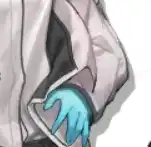

 {.centering}

时间不多了，而真相依然很远——所以才更加迫切地抓紧每一个机会、每一天。{.centering}

——锡兰{.aright}

<!-- more -->

**【0】特殊声明：本篇的部分题目不再特别区分“艾雅法拉”和“纯烬艾雅法拉”，请考生答题时根据题目背景进行理解。**

**【1】火山喷发时，炽热的岩浆会夺走生命，而喷发结束后，落下的火山灰又会带来新生。关于艾雅法拉的天赋，以下说法中不正确的一项是**

A. “炎息”可以让艾雅法拉在场时，所有术师干员的攻击力提升，开启模组“错过的声音”二级后携带艾雅法拉即可触发该效果

B. “乱火”可以让艾雅法拉部署后立即随机获得一定技力，该天赋在潜能3时获得效果强化

C. “氤氲”可以使受到治疗的目标获得持续增益治疗，叠加时会分别计算每次的效果和持续时间

D. “火山灰疗愈”可以使攻击范围内的友方单位生命上限增加，同时也会对纯烬艾雅法拉自身生效

**【2】艾雅法拉的本体和异格形态在各自的职业分支里都是比较出色的。以下关于艾雅法拉的技能描述，不正确的一项是**
 	 	 	 
|  |  |  |  |
| :---: | :---: | :---: | :---: |
| ① | ② | ③ | ④ |

A. 图标①对应的技能命中时，会先计算法术抗性的削减，再计算伤害

B. 图标②对应的技能在专精等级达到三时，其作用目标上限加一

C. 图标③对应的技能可以为不接受常规治疗的干员恢复元素损伤，比如泥岩

D. 图标④对应的技能开启后，会导致天赋“火山灰疗愈”失去生效目标

**【3】随着艾雅法拉的异格，行医这个子分支也有了4名干员。考虑满练度、满信赖、满潜能，技能专精等级三，不考虑其他任何加成，以下干员使用对应技能时，秒治疗量理论上限最高的是**

A. 褐果：厚土迸发

B. 蜜莓：振奋

C. 桑葚：安全区域

D. 纯烬艾雅法拉：火山回响

**【4】艾雅法拉的干员密录“学者之心”和“火山”记述了一次火山考察的过程。关于密录中涉及的剧情，说法不正确的一项是**

A. 作为艾雅法拉母亲的学生，卡恩拜托干员巴蒂尽量关照艾雅法拉，不仅是身体健康方面，也包含研究工作方面

B. 在登山路上，艾雅法拉使用源石技艺及时将落石熔化为岩浆，救了向导一命

C. 父母的死讯曾让年幼的艾雅法拉陷入崩溃的情绪中。当她看到火山之后，这种情绪一度加剧

D. 艾雅法拉最终仍然选择参与到火山研究中，不仅因为她父母留下的资料里有些内容只有她才能解读，更因为她不希望项目中断

**【5】在新汐斯塔的冒险旅途中，多利希望和艾雅法拉玩一场藏宝游戏，要求找齐“北风、种子、皮毛”这三样物品。以下哪个选项不在这三样物品中**

A. 汽水瓶盖

B. 火山防护服

C. 雨后的彩虹

D. 一段歌词

**【6】艾雅法拉作为开服六星干员，在相当长的一段时间里都没有时装。自2019年4月30实装之日起，至2021年7月20日时装开始售卖，共计812天。请问以下哪位干员从实装至第一套时装上架售卖的时间最长？**
 	 	 	 
|  |  |  |  |
| :---: | :---: | :---: | :---: |
| A | B | C | D |

**【7】在艾雅法拉的档案中，也有记载关于多利和他分身的相关内容。根据档案记载，以下说法中错误的一项是**

A. “小黑羊”的生理结构、行动模式都和寻常的动物类似，平时喜欢睡觉

B. “小黑羊”的体型和“猫猫”相仿，但生气或高兴的时候身体会变得极热

C. “小黑羊”很乐于助人，它们曾为迷路的薄绿带路，还主动和豆苗的磐蟹玩耍

D. “小黑羊”也很调皮，做出了一些危害纪律的行为，而坚雷并没有发现“真凶”

**【8】干员的语音是补充人物形象塑造的方法之一。以下语句不是出自艾雅法拉语音记录的一项是**

A. 玩伴吗？我和慕斯她们关系很好，所以一点也不寂寞~如果可以的话，我想和大家一起办读书会！

B. 博士您……失忆了？真的？凯尔希医生才告诉我这件事……嗯，今天就先休息一下吧。

C. 等等，不可以站在博士头上呀，这样很不礼貌的！

D. 我回来啦，这些是带给你们的礼物，我等下拿去送给凯尔希医生和阿米娅。

**【9】如果你经常开声音玩《明日方舟》的话，你可能会感觉艾雅法拉的日文配音有点耳熟。以下哪一个干员的日文配音演员同时也完成了艾雅法拉的配音工作**

|  |  |  |  |
| :---: | :---: | :---: | :---: |
| A | B | C | D |

{style="float:left;max-width:20%;margin-right:1em"}

*扫一扫二维码查看本期答案*

[点我也可以哟ヾ(≧▽≦*)o](https://www.wjx.cn/vm/wxeTY1N.aspx)<eod />

<FakeAds />