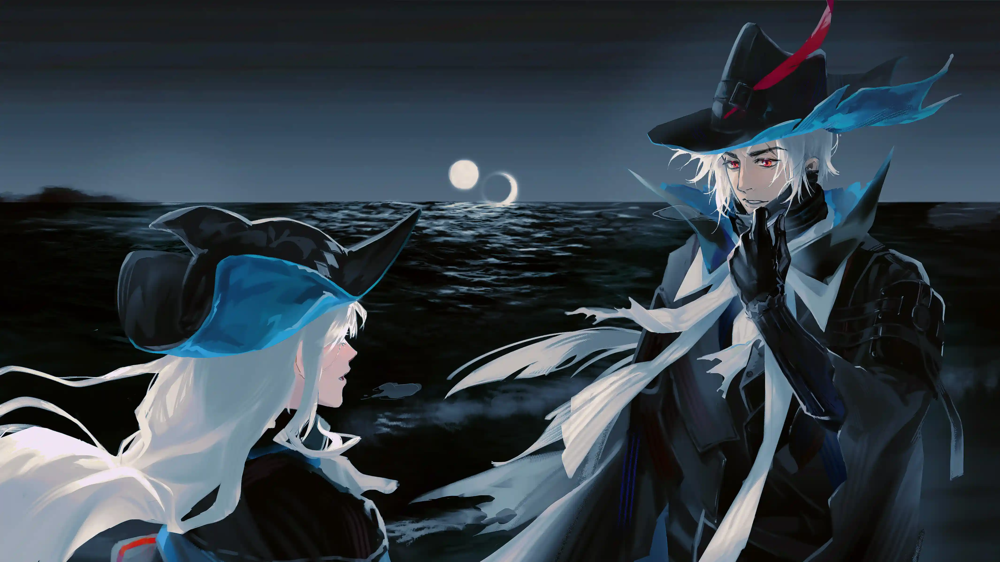

冰冷的海水，开始变得温暖。他们也不再是流浪的猎人。{.textkai}

<!-- more -->

　　四周除了海浪声和风声外，就没有其他的声音。乌尔比安微微张开口，他犹豫了一下还是闭上嘴巴，等斯卡蒂自己回神过来才开口说话。

　　斯卡蒂直盯盯地看着他，仍然怀疑自己所看见的是否真实，她多次欲言又止，有许多的问题想问乌尔比安，过了片刻后才问出一句话：「你为什么会在这里？」

　　「处理剩下的障碍后，准备去二队那边时，听到妳的歌声，就来了。」乌尔比安冷静叙述，他又说斯卡蒂比以往的反应更慢了，她不应该发呆这么长的时间，那怕只有一弹指间，敌人正是会趁着她放空的时候而杀死她。

　　斯卡蒂垂下头，听见类似的训话，没有感到紧张，反而是觉得很安心，仿佛心里其中一块长期吊在嗓子眼前的大石头突然就放下来，乌尔比安没有死，也没有背叛阿戈尔和同伴们。

　　以往乌尔比安训斥时，斯卡蒂就会像现在这样低下头，看起来有在听，实际上却是心不在焉；现在，她想认真聆听乌尔比安的训话，确信自己早前所认为的结果是真实，而非虚假，不是她主观臆想的。

　　乌尔比安眨了眨眼，侧过头看着平静的海面，说：「妳应该要跟二队她们一起行动，而不是独自行动。」

　　斯卡蒂摇头，但什么话也没说出口。乌尔比安聆听她的沉默不语，转头看着她，即便他知道这是歌蕾蒂娅的主意，他还是选择了回应斯卡蒂的沉默：「我知道此时的妳有很多问题想问我。包括我之前在为何不与妳们同行回去阿戈尔，之后跟执政官歌蕾蒂娅分别后又是去了哪里。」

　　斯卡蒂习惯性地对上乌尔比安的视线，点头赞同乌尔比安刚才所说的话，又等待他下一句话语。

　　乌尔比安暗自深呼吸一口，保持语气冷静地说：「以后有的是时间，妳想好问题就问。我会视妳所问的问题而回应不同程度的答案。」毕竟有些回答对她来说只不过是一种多余的负担。

　　「以后……？」斯卡蒂的双眼充满着不可置信，混杂她对此的期待和渴望。乌尔比安点了点头，重复说了一次，没有犹豫：「以后。」

　　现在，「未来」一词对他们来说，再也不是欺骗自己生存的理由和给予他人的空头支票。

　　乌尔比安走近海边，斯卡蒂随即跟在他的身后。乌尔比安低声说道：「妳是时候要习惯『未来』这一概念，它真实存在我们身边。」他早前也是跟此时的斯卡蒂不敢相信他们还能对未来抱着希望，直至阿戈尔与陆上国家重新联系为止，才接受这样的变化；他又说：「而且，我们的共同敌人并不是只有海怪和深海教会。所以，我们将来还会继续狩猎。」

　　「不是只有海怪和深海教会？」斯卡蒂疑惑问道。

　　「我们要处理阿戈尔内部剩下的敌人。」乌尔比安拉了下帽子，他也不敢预估现在还有多少个叛徒潜伏在阿戈尔和伊比利亚，哪怕只有一个也不能够放过他。

　　斯卡蒂认真地思考了乌尔比安的话几秒钟，很快就说自己明白了。她想，只要是听从队长的指令就不会有问题。

　　乌尔比安没有再说话，尽管他同样有很多话想跟自己的队员说，也准备一套说辞用来回答斯卡蒂的问题；斯卡蒂也想问乌尔比安那时候的他要去哪里，而他又是怎么活下来。但此时，他们只想一言不发地享受短暂的清静。

　　海水融入黑色的夜晚，带着零散的月光浮浮沉沉在浪潮中，冲涮着岸边无数的沙粒，来到猎人们的脚边又瞬间褪下。咸腥的气味跑到与人类眼泪相似的海水里，又跑到空气中，随风飘扬，与空气中的小水点带走猎人身上沾到的乾燥，仅此而已，没再作出下一步的行动，反复循环着，带走乾燥，带来潮湿。两人漫步在陆地与海洋的分界线上，跟在乌尔比安身后的斯卡蒂，看着他留下的足印，若有所思，然后，她轻轻一踢足印旁边的细沙。

　　乌尔比安停下脚步，转过身来，「斯卡蒂。」

　　斯卡蒂听到声音也立刻停下，以及挺直了腰背，生怕刚才那一踢会被队长看到。但是，乌尔比安似乎因为在思考一些事情而没有看见，又或者是他假装没有看见，若无其事地看着斯卡蒂，「妳这一段还是先别回去阿戈尔，继续留在陆地上。到时候与二队汇合后，我会亲自向歌蕾蒂娅说明情况。」

　　斯卡蒂瞪大了眼，她虽然很疑惑，却没有对此感到惊讶，也没有刻意追问为什么不能回去阿戈尔，简单哦了一声就当作是回应乌尔比安的话。她心想，如果不回去阿戈尔两三天，她可以先回到罗德岛，也可以去其他的村庄看看，打发时间。她习惯了流浪，有了家乡的消息后反而觉得一种不自然感。

　　如果是由其他人来当斯卡蒂的队长，可能会觉得斯卡蒂不会追问过多原因这一点是值得其他队员学习，然而，乌尔比安不完全赞同这一点，尤其是到现在为止，他们还没有完全破解出斯卡蒂体内所流的血液，不能再出现任何因素在斯卡蒂的身上，试图左右她的意志。对此，乌尔比安还说：「我也会过几天才回去阿戈尔。」

　　「什么？」斯卡蒂愣了一下，「队长你也不回去阿戈尔吗？为什么？」

　　乌尔比安沉默，他谨慎使用任何一词一句，也因为如此，他反复组织的语句到此刻还没能说出口，仍然在被他反复确认、组织，再确认。斯卡蒂紧张地环顾四周有没有她没察觉到的异常，直到乌尔比安低声咳嗽一声，说：「我们一起行动。这段期间再检查有没有遗漏，以及……」他顿了一下，「妳在陆地上，应该有些事情等着妳完成，也有些人等着妳回去探望。」

　　「你是怎么知道的……？」斯卡蒂想起自己经过、逗留过的所有地方，包括曾经送她竖琴的村民和安妮塔他们，她固然是想知道，那些跟自己有所接触的人，到现在是否一切安好。

 {.centering}

　　乌尔比安别过头，看着另一侧的沿岸楼房，「在妳们来到盐风城之前，我一直有留意到妳们。在那之前，妳还教过陆上的人们学会歌唱，不是吗？」他没有再继续细说更多的事情，避免解释越多出错越多的情况，而且，有些地方，应该是由斯卡蒂亲自去看，让她亲自相信、坚信着——自己不是为他人带来不幸灾厄。

　　「我……」斯卡蒂一时语塞，她承认自己有教过陆地的人学会歌唱一事，还解释说：「因为他们问我了，我就教他们了。」教会人家歌唱这事，斯卡蒂从来没有一次的犹豫。

　　「做得很好。」乌尔比安小声地说道。哪怕海浪几乎能覆盖住他这句话，斯卡蒂还是及时捕捉到刚刚乌尔比安说的话，她感到高兴，一直看着队长的侧颜。

　　传授和让更多人感受美也是艺术的意义之一。乌尔比安本来想说出这句，但他想了一下，认为这话未必能让斯卡蒂理解到，于是他换了一句：「教他们歌唱的同时，也不会让妳忘掉阿戈尔的歌。」

　　「那队长呢？」斯卡蒂怯怯地问他是否还能继续歌唱。

　　乌尔比安又一次沉默不语，仍旧看着远方的景色。

　　斯卡蒂很清楚，在弑神行动前，乌尔比安就开始不再歌唱，说话的声音也越来越沙哑。但是，她太了解歌唱对自己与乌尔比安的意义是多么重要，继言语之后，能用来交流的便是歌曲，便是唱歌，他们需要歌唱交流情感，也需要歌唱抒发情绪，更需要用此证明——他们从来不会向只有单程的命运服输。斯卡蒂想，如果乌尔比安无法歌唱和言语，无人再聆听乌尔比安的歌声，那么，谁又能理解他的情感？谁能感受彼此的孤独感？

　　他们曾经都像落单的鲸鱼，各自游走在没有尽头的汪洋中。没有同伴应答他们的歌声，旁人只能倾听而无法感受。

　　——

　　歌声在空荡的海洋与广阔的陆地间回响起来。低沉、稳定、且悠扬的歌声游走在边缘，而后传达到两方，「沙哑」仿佛就是用点缀乌尔比安的声音。

　　斯卡蒂睁大双眼，她听见乌尔比安低声歌唱了，而他所歌唱的，正是当时乌尔比安教会斯卡蒂和其他队员的第一首歌。一时之间，风、海浪与嘈杂的声音都安静下来，聆听着他的歌声，与他曾经所怀的情感。

　　乌尔比安用实际行动回应斯卡蒂的问题：他不曾遗忘阿戈尔的歌，没有忘记过他教过给同伴们的歌曲，更不会因为生理上的变化而放弃歌唱。

　　当他唱完一首歌曲后，回头望向斯卡蒂，发现她脸上带著几乎想哭出来的表情，本来想说话的乌尔比安把话吞回去，也没有问斯卡蒂怎么了。

　　斯卡蒂抑压下哭出来的冲动，她想跟着乌尔比安刚才的节奏歌唱起来，去回应他的歌声。于是她张开嘴，深深地吸了一口潮湿的空气，放声歌唱，歌唱第二首曲子，尽管她察觉到自己的气息有些不稳，音色颤抖，还是没有直接停下歌唱，最后流畅地唱完一整首歌曲。

　　乌尔比安无意识浅笑了下，他稍微拉低面罩，重复唱了一次斯卡蒂刚才唱的的曲子，间接重新教会她如何唱到正确的音准上。斯卡蒂很快就领悟了他的意思，同样也跟着唱起来。

　　这夜，失散且落单的流浪者终于在他们第一次来到的地方，终究与同伴重聚，为他们曾经共同经历的回忆而歌唱，为未知的将来而歌唱，冰冷的海水，开始变得温暖。他们也不再是流浪的猎人。<eod />

（责任编辑：瑶濯；网页排版：武乙凌薇；绘图：粥铺）

<FakeAds />