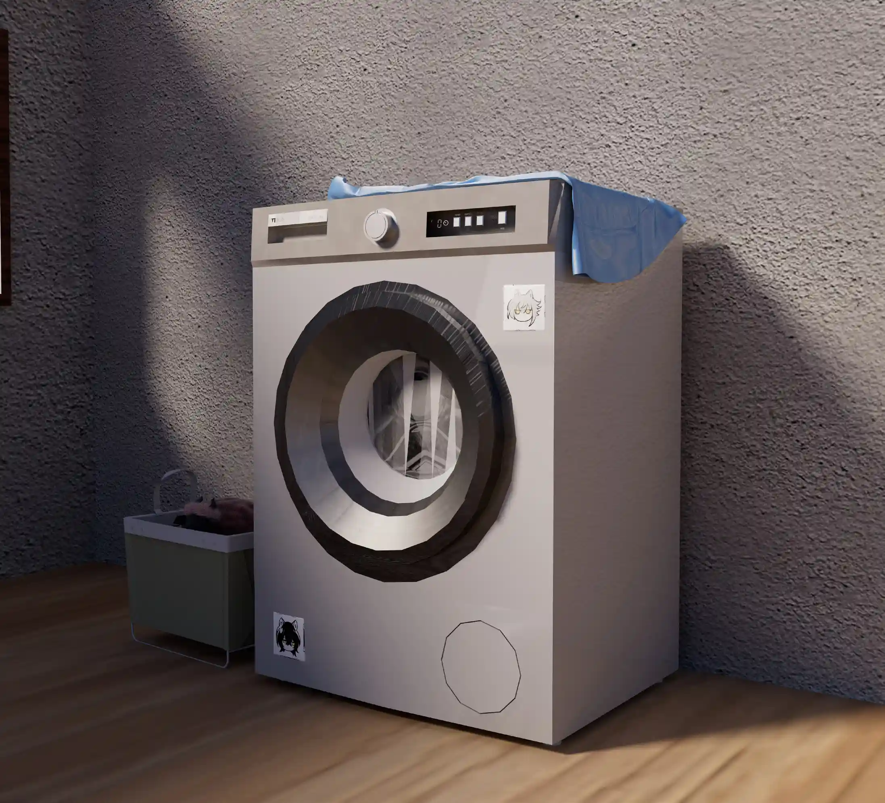

最重要的东西其实未曾丢去，“它”一直在你身边{.textkai}

<!-- more -->

奥斯塔到家的时候，布洛卡和贾维正对付着一大锅蒜蓉小钳兽，个大肉肥，油亮喷香，开门就能闻到。贾维嘴里咬着钳兽，从堆积的壳中扫出一片空当招呼他坐下。

奥斯塔摆摆手，背着包进了房间。身后传来贾维满嘴食物的声音：“奥斯塔，你不吃我们可要吃完了！”

“不了，我不太想吃。”奥斯塔把帆布包扔在麻织的格子床单上，左手摘下一边的耳机。一小时前，他独自在工作室和机械臂模型做斗争，窗外凄风苦雨，天气比出租屋阳台漏水还严重；随即突如其来一声巨响，霎亮的闪电照着惨白的面庞，办公楼里的灯齐刷刷地下班，电脑也罢工了。诡异的寂静笼罩着工作室，天空如厂房的钢板顶，抖动的轰隆声向远处扩散而去。奥斯塔在黑暗中坐了片刻，叹了口气。

奥斯塔把耳机放在一臂宽的写字桌上，上下摸索着口袋。布洛卡走了过来，递给他一条浅蓝色的毛巾。他嘟囔着说了句“谢谢”，揉面似的把头擦干，湿漉漉的耳朵耷拉着，贴在头皮两侧。电脑开不了机，其他人都下班了，他只好先回去。公交和地铁都停止运营了，他只能冒雨骑回家。

奥斯塔把毛巾扔在一边，打开床上的帆布包，快速翻找着。结果是显而易见的：耳机壳不在身上。

奥斯塔默默叹了口气。不该把耳机壳放在兜里的，他这么想着，一边走出了卧室。浴室里传来淅淅沥沥的水声，贾维哼着走调的《20支烟》；布洛卡正把桌上的钳兽壳扫进锅里，拿进厨房。他穿过布洛卡和贾维的卧室，在阳台上三人晾着的衣服间穿梭，用手快速地试试衣服下摆。这间屋子只有两间卧室，搬进来时抽签决定了奥斯塔一个人住小卧室，布洛卡和贾维住带阳台的主卧。阳台朝南，但楼层太矮，时常照不到阳光。

都不太干，奥斯塔今晚第四次叹了口气。这意味着明天要么穿身上这件淋过暴雨的衣服，要么穿又湿又凉没晒干的。奥斯塔快速地作了抉择，取下几件还算干燥的衣服。

奥斯塔抱着衣服走回客厅，小臂上湿冷的触感让暴雨淋过的身体倍感不适。他打了个寒战。洗手间的门正被关上，贾维脖子上搭着毛巾，手里握着洗漱杯。看见奥斯塔怀里的衣服，他挤了挤脸。

“这天气真是见了鬼。我们买台烘干机吧！”

“我们没有钱。”浴室传来布洛卡的声音。

“我们也没有地方放……房间太小了。”奥斯塔四下打量。老旧的出租屋只够容纳三个成年人的生活必需品，提升生活质量一概别想。布洛卡和贾维经营着汽修店；奥斯塔只是罗德岛的实习员工，薪资只够自己简单开销和一起交三个人的房租——布洛卡和贾维还让他少付了些，奥斯塔暗自补充，把圆领衬衫挂在衣橱把手上。如果要买也不是不可以，钱挤挤总是有的……奥斯塔把头从湿透的T恤里抽出来，脑内快速规划着下个月的开支。房租五千，三个人吃饭三千起步，只剩两千——活得极端点还是能买的，但是没有必要，贾维也存不住钱。奥斯塔拎着毛巾脸盆，边听着贾维兴致勃勃地向布洛卡规划，烘干机买来了应该放哪儿，边把采购的想法踢出脑袋。

等他洗漱完毕从洗手间出来的时候，贾维的话题已经转移到了边上哪里的房源最好。

“他说房间里放不下就换房子。”布洛卡捕捉到了奥斯塔眼中的疑惑，解释道。

“总之，小爷明天闭店休假，马上去看房！”贾维一脸迫不及待。

奥斯塔由衷地希望这是他今晚最后一次叹气，真的。他很久没这么烦心过了：社区市场几周来一直在停业整顿，他们不得不以超出原价五成的价格从连锁超市采购食材和生活必需品；布洛卡和贾维在汽修店一直没什么生意，只能多在社区中心挣上门维修的外快——十天半个月才有一单，委托人还经常是独居的老菲林，贾维干脆不收他们的委托费；他在罗德岛实习已经一个月了，不出意外很快就要被找个理由辞退，因为他不巧是个感染者；要是耳机不在工作室，他明天还得请出半天假来，沿着骑回来的路——整整五公里——找丢掉的耳机。那是他们三人在哥伦比亚游历时，贾维和布洛卡送他的礼物——庆祝他从哥伦比亚大学的机械工程学院毕业。由于感染者的身份，他们在哥伦比亚找不到像样的工作。风餐露宿数年，他们兜兜转转才在现在的城市落脚。奥斯塔没有听音乐的习惯，但总是随身带着耳机，甚至亲手做了一个耳机壳。耳机壳结实耐造，背面画上了三人的卡通头像。

奥斯塔深知贾维的决定一旦做出，除了他自己，没人能改变。他看向布洛卡，布洛卡回应一个眼神表示自己也会跟着去——奥斯塔感到了些许安慰。没有布洛卡，他迟早被贾维的各种鬼点子逼疯。

希望明天别下雨。奥斯塔躺在床上，听着从出租屋历任租客手里传下来的不知道几手的洗衣机隆隆作响，进入了梦乡。

---

被生物钟唤醒的时候，奥斯塔没有在眼皮上感受到刺眼的光。又是个坏天气。奥斯塔向狭窄的窗外看去。雨没有昨天那么夸张了，稀稀落落地往下掉。他抬了抬手腕，腕上的表告诉他，他最多还能错过两班地铁。奥斯塔取下挂在衣橱上的衬衫，往身上披。衬衫很凉，奥斯塔打了个哆嗦，迅速扣好扣子，走出卧室门。布洛卡和贾维已经出门了，临走前晒好了衣服。他打开空荡荡的冰箱，取走了最后一块圆面包——包装盒上贴着大大的“促销！”，标签上的价格被划掉数次，最终价格是原来的四分之一。奥斯塔转身去拿盒装咖啡，发现柜子也是空的。下午还要去趟超市，奥斯塔默默在日程表上记上一笔。他在坐上地铁前迅速嚼完面包，祈祷着电脑没被雷劈坏。

---

奥斯塔在五十五分打上卡。有点危险，奥斯塔捏了把汗，下次还是起早点吧。他的全勤一次也没有断过，这是为了给雇主留下好印象，可惜他们并不领情。他在工位前坐下，一旁的洛洛向他打声招呼，看着他地毯式地把桌上桌下翻了个遍。“早，在找什么吗？”

“一个无线耳机。”由于入职才一个月，奥斯塔桌上的东西并不多。他很快完成了查找，不得不接受耳机不在工位上的事实。“你有见到吗？”

“抱歉，好像没什么印象。”洛洛露出了关心的表情，注视着奥斯塔打开电脑，“昨晚又很晚吗？”

“和往常一样。”奥斯塔焦躁地登进系统，快速地点开一个个文件夹。模型文件只有下午的数据。奥斯塔的心往下一沉，点开了软件目录。

“呀……那回去可不容易呀。”洛洛转过身，端起不锈钢水杯，往杯里扔进一片茶包，“昨天的雨真够大的。”

“是啊。”奥斯塔把自动保存文件夹快速拉到底，点开最后更改的文件。仿真软件一阵卡顿，最终提供了勉强算完整的模型。奥斯塔叹口气，保存好文件，准备发送给异客——他的实习主管，而这份文件本该在昨天下班时就发送到他的邮箱。

“要来点茶吗？你的脸色看起来很不好。”洛洛接完热水，回到工位。奥斯塔简单写完文件说明与致歉，按下了发送键：“不了，谢谢，我不太喝……茶。”

他并不是有意放慢语速，因为他看见洛洛正把半罐糖浆倒进一小杯茶里。“不会太齁吗？”他指指茶杯。

“唔，还可以？”洛洛偏过头，略作思考，“爸爸一直都是这么喝的。工人们都这么提神。”

奥斯塔颇为敬畏地点了点头。办公室的猫寻着糖浆味踱步而来，围着奥斯塔的腿打了个转，在洛洛脚边坐下。奥斯塔记得它叫罗小黑。洛洛用茶勺在罐沿画个圈，刮下罐口的糖浆，把罐子放在罗小黑面前。黑猫用鼻子触触罐口，小口舔舐起来。

“我不知道猫还可以喂糖浆。”

“哦，大概是不行的——生物科的华法琳女士曾经科普过猫不能吃很多东西，包括糖浆。她很惊讶这个小家伙居然什么都吃。”洛洛轻抚黑猫，后者正把头埋进罐子里舔得欢，“对了，听说有人看到过它变成人。你相信吗？”

奥斯塔的脸上礼节性地浮现出一丝惊讶与好奇。与此同时，一封来自异客的邮件送到了他的桌面，要求他来自己的办公室。奥斯塔不安起来。

“没事的，异客先生虽然看起来不好接近，但他不会刻意为难人。”洛洛鼓励他。他点点头，带上u盘往异客的办公室去。

---

“听说你这几天一直在加班。”异客脸上挂着温和的笑容，手中搅拌着咖啡。金属的小勺与白瓷杯轻轻碰撞，发出细微叮叮当当声。

“是的，我在尽力用时间弥补经验上的不足。”奥斯塔小心地观察异客的表情。后者面不改色，抿了口咖啡。

“放轻松，奥斯塔，请坐吧。”异客把咖啡杯带着哑光的小勺轻轻放在黄铜镀边托盘上，“或许你也想来杯咖啡？”

“不了，谢谢您，异客先生。”奥斯塔在异客办公桌旁预留的椅子上坐下，这个角度正好能看到最大的那张显示屏，上面是他一个月以来的心血。他的手局促地在身体两侧蹭了蹭，“您对模型有意见吗？”

“意见？不，不，你做得相当不错。”异客的目光随着显示屏上视图的变化而转动，身体靠在办公椅上，扶手随着操作鼠标的手微微晃动，发出轻轻的吱啦声，“如果我没记错，你在哥伦比亚国立大学有所深造，对吗？”

“是的，两年前毕的业。”看着异客飞快地隐藏一个个图层，奥斯塔不由得擦了擦手心的汗。

异客的笑容不易察觉地扩大了些：“别紧张，你比他们许多毕业生优秀得多……只是我有些好奇，”鼠标最后停在了一个同轴振荡机构上，异客沉吟片刻，看向奥斯塔，“这是你自己设计的吗？”

“不，不是。汽车里经常出现这种构件，把转动变为摆动，我想这里也能用。”

“太谦虚了，奥斯塔。精妙的设计……我还以为国立大学变得接地气了。”异客操纵着键鼠快速划拉着，上上下下观察着连接件的每处细节，“如果额外要求，输入端是特定角速度时，输出端摆动的阻力恒定呢？”

奥斯塔一愣，反应过来异客在说他的模型。“呃——齿轮。输入杆和输出杆各用两个齿轮连接，输入杆上两个半齿，输出杆上两个全齿。”他紧张地抿了抿嘴，脑中飞快地思考有无补充，“之间连杆的长度可以根据需要调整。”

异客转向奥斯塔，轻轻挑了挑眉毛。“这也是经验使然？”

“算是吧。我有两个伙计，我们在哥伦比亚见过不少这种好用的点子。”

异客端起咖啡杯，啜了小口。“请原谅我的好奇。你的两位伙计，现在还和你在一起吗？”

奥斯塔点点头。“我们从叙拉古认识开始就一直在一起。”

“令人动容的情谊。”异客露出了赞美的笑容，奥斯塔却有些莫名的不安。“你们没有选择留在哥伦比亚发展？”

奥斯塔不知如何作答，他并没有准备好将贾维和布洛卡也是感染者的事和盘托出，却不能为他们为何离开哥伦比亚找到合适的借口。迟疑片刻，他听见异客轻笑一声：“抱歉。你想来杯咖啡吗？”

再拒绝就不礼貌了。他接过异客从右手边第二个抽屉取出的白色马克杯，说了句谢谢。冒着热气的棕黑色液体缓缓倾入杯中，郁馥的香气扑面而来。

“如果想加奶，很抱歉，只有奶球。”异客颔了颔下巴，指指半开的抽屉，“糖请自便。”

“不了，浓缩就好。”奥斯塔隔着嘴唇咬住杯壁，轻抿一口。滚烫的咖啡液沿着唇缝渗进牙间，丰富的味道交织在一起，奥斯塔没法用简单的酸或苦来形容。它不像叙拉古餐吧里用米黄色圆底陶杯盛的深色萃取液，苦得像西西里卖花女的苦日子；也不像哥伦比亚饮料店里用半顿饭钱买到的工业原料兑水，酸涩又寡淡，几乎可以当水喝——甚至比瓶装水便宜。

“你们从在叙拉古的时候起，就一直从事汽修工作？”

“对。偶尔会打打零工，但都和机器打交道。”

“他们两位现在也是？”

“是的。”奥斯塔嘟囔着，埋头喝了口咖啡，努力不让异客看到自己的表情。一想到三人微薄的收入和捉襟见肘的生活，他就忍不住叹气。

异客露出了表示他了解了的表情，张口欲言，却被急促的“噔噔”两声打断。他瞟了眼跳出的邮件窗口，一口喝干杯中的咖啡。

“感谢你的耐心，奥斯塔。”异客放下手中的白瓷杯，“恕我失陪，凯尔希女士似乎有事相见……”异客起身，用手掌指指奥斯塔手中的马克杯：“茶杯请先带回去吧，方便的时候还回来就行。”

奥斯塔忙起身道谢，让出一条道，随着异客走出办公室。关门前，异客想起来什么，转向奥斯塔：

“每周三和周五下午是灵活休假的，斥罪女士是否有向你告知？”

奥斯塔点点头：“本来我也想向您请下午的假。”

异客大手一挥，当场批准，提醒他十二点以后再刷门禁卡下班。奥斯塔注视着异客疾步走向走廊另一头，长发与白色衣摆翩然舞动。他端起马克杯，深饮了口咖啡。

咖啡是温吞的，没有加奶或糖，但和热可可一样好入口。

---

尽管奥斯塔已经做足了心理准备，但一个下午走走停停还是没找到耳机的事实不免令他失望。他开着蓝牙，半跪在沥青路面上朝汽车底盘下看，打着手电筒观察栅栏状的窨井里面，一遍一遍扫视石砖铺砌的人行道。他疲惫又失落，但一想到下一辆车的底盘下，下个窨井里、下一道人行道的砖缝里就可能藏着他的耳机，心中就又燃起了希望。然而，上天似乎并不青睐他的努力，直到家门口，他都没找到丢失的耳机。

一无所获，身上还湿透了。奥斯塔沮丧地回到家里，左耳的一只耳机还摆在桌上，孤苦伶仃。他直勾勾地盯着耳机，仿佛这样就能让另外半只和耳机壳凭空生出来。沉默半晌，奥斯塔轻叹口气，把仅剩的一只耳机小心包好，塞进床头柜里的衣服下，强迫自己不再去想这件事。

日子还是得过下去的，他努力说服自己，先去超市吧。

奥斯塔出门时，正撞见迎面走来的贾维和布洛卡。贾维还是一样兴高采烈，往奥斯塔背上大力一拍——奥斯塔感觉自己的意识一瞬间被震出了身体。

“哟，奥斯塔，你要去哪儿？”

“超市。”奥斯塔闷闷地回答，朝大路走去。贾维调转方向，和布洛卡一起跟上他。

“别那么垂头丧气的，开心点。”贾维的胳膊钩上奥斯塔的肩，“钱可不会因为唉声叹气就变多。”

“我知道，但不叹气就挣不到钱。”奥斯塔低着头，把杀回脑中的耳机再次赶出脑袋。

“告诉你个好消息吧，社区市场今天开放了。”贾维松开奥斯塔，双手背在头后，笑嘻嘻地说道。“前面左转。”

仿佛是为了映证贾维的话，嘈杂的交易声越来越响；穿过墙体斑驳的小巷，曾经的社区市场映入眼帘，锁上近一个月的大门终于打开，摊位内外来往的都是熟悉的面庞，市场里熙熙攘攘。

奥斯塔不由得驻足。他张了张口，话到嘴边又溜走了。“这……这是什么时候的事？”

“就是今天，住西边的老菲林告诉我的。”贾维骄傲地炫耀着他的战果，“我们上次修热水器那个。老菲林把我们的新家也安排好了，布洛卡和我去看过了，很宽敞，过两天你也去看看。”

恐怖的交涉魅力，奥斯塔默默感叹。他们步入久违的市集，雨后泥土的气息混杂着生鲜的气味，不算好闻，但总能勾起人购物的欲望。

奥斯塔走过一片片货台，脑中快速清点着要买的东西。咖啡，面包，通心粉，番茄酱……洗衣粉也不太够了，也许还可以顺便挑件便宜的速干衣。速干衣比较薄，就放在床头柜里好了——耳机放在衣服下应该不会压坏吧……

奥斯塔猛烈地摇了摇头。

“怎么了。”布洛卡在他身后伸出手，从货架上提出一箱咖啡，低声问道。

“耳机丢了。”奥斯塔犹豫片刻，把“没事”两个字吞进肚子，嘟囔着开了口。他不想把这件事告诉贾维和布洛卡两个人，一来他不知道怎么开口，二来他没法想象他们俩的反应——他自己都还没准备好接受这件事。但如果只是告诉布洛卡，他还能接受些——毕竟布洛卡什么都不会说，只会一脸严肃地坐在边上听他讲。

“什么，什么耳机？”贾维突然从两个人中间钻出，奥斯塔有些猝不及防，脸上一阵发烧。贾维反复打量着他俩：“耳机怎么了？”

“我们在哥伦比亚买的耳机。”布洛卡言简意赅地概括，“丢了。”

“嗨呀，那就丢了吧。”贾维不以为意地咧开嘴，又一次勾住了奥斯塔的肩，“我和布洛卡给你再买一个，比原来那个还好！”

奥斯塔不知道该说什么。他有点想哭，但一滴眼泪也流不出来——太丢人了，他想。他抬头看了看布洛卡，布洛卡站在一旁，脸上摆着叙拉古时就养成习惯的凶恶表情，点了点头。真糟糕，他在心里默默擤了把鼻子，现在自己脸上的表情一定很难看。贾维的手绕过他的脖子，在心腔附近结实地敲了两下，胳膊贴在他的脖颈与肩背上，干燥而温暖。他注意到贾维的手里攥着张红边白底的票单。

“啊哈，忘了说了，小爷刚去抽奖了。”看到奥斯塔的留意，贾维扬了扬手中的票根，“明天上午现场开奖。”

“你买了什么？”奥斯塔意识到了什么，有些紧张地转头，上下打量着贾维。

“别紧张，奥斯塔。”贾维今天第二次大力地拍了拍奥斯塔的背——奥斯塔怀疑自己的魂迟早有一天要从身体里被贾维拍出去。“只是一点土豆而已。”面对着奥斯塔狼一般的凝视，贾维的笑容突然变得微妙，“嗯，可能比‘一点’稍微多一点。”

他们采购了满满两袋子，还不包括贾维的一麻袋土豆，布洛卡提着都费劲，奥斯塔估摸着能吃个把月。晚上，他们煮了顿一个月以来最丰盛的一顿晚饭——预制的罗勒叶烤鸡，搭配新鲜的洋葱和彩椒，一人一份通心粉焗土豆，外加一块巨大的布丁。用餐之余，冰箱也被塞得满满当当。

没准真能买个烘干机。躺在床上时，奥斯塔思忖着。

---

第二天他还是赶在五十五分签上到。他急匆匆地赶到工位，打开电脑就看见斥罪给他发了邮件。顾不上多想，他径直往法务部办公室去。

“坐吧，奥斯塔先生。”斥罪从办公椅上起身，示意奥斯塔在沙发上坐下，从茶几上事先放好的黑色台型咖啡壶里给他倒了杯咖啡，在他的侧对角坐下，扶了扶领口的金色胸针。“我们今天来谈谈你的发展问题。”

“没问题，斥罪女士。”奥斯塔挺了挺背，偷偷在衣角擦了擦手心。斥罪从一打文件夹中挑出一夹，第一页印着奥斯塔毕业时拍的证件照，白衬衫，条纹领带。斥罪快速地清点了文件的份数，抽出其中一份。

“简单来说，你的实习表现很不错，异客先生也对你评价很高。这是你的劳动合同。”斥罪露出了赞扬的笑容，“恭喜你。”

“谢谢您。”奥斯塔颤抖着双手接过厚实的数张纸。合同用淡灰色抽杆夹装订成册，奥斯塔努力去看清上面细密的字，但一个字也看不进去。

斥罪把剩下的文件放回文件袋。“稍后我会向你说明合同里的关键条款和细节，你有权在充分的时间里阅读与理解条款，并要求我解释。如果你对部分条款有异议，你也有权利当场提出，与我们协商。”斥罪顿了顿，接着说道，“最后，我们尊重你选择其他就业机会的权利。我们不会强迫你留在罗德岛，如果你在两周内收到其他更好的就职机会，并决定接受他们的雇佣，请告知我们。在此期间，你仍是罗德岛的实习员工。两周内如果没有答复，我们将视为你放弃我们的任职邀请。”

“非常感谢……”奥斯塔的眼睛被纸张牢牢吸住，视线来回扫视这份完美的，崭新的文件，这份他一直渴求却从未想象过拿在手上的文件，“我——我没有什么意见。”

斥罪微微欠身，偏了偏头。“我理解你的激动，奥斯塔先生。如果有时间，我们还是建议您仔细阅读合同内容。如果有问题，请及时邮件联系我。”斥罪从文件袋里抽出一张便条，“此外，还有件事。”

奥斯塔恋恋不舍地合上合同。斥罪正要开口，办公室的门突然开了。一个黑色的身影信步闯入，跳上茶几坐下。

“办公室的猫，罗小黑。”斥罪向他介绍，挠了挠黑猫的耳朵。奥斯塔点点头，注意到黑猫嘴里叼着什么。

斥罪显然也注意到了，她伸手去接，黑猫把东西放到她的掌心。一个无线耳机。

“能麻烦你一会儿交到报失处吗？”斥罪打开耳机壳，简单翻看，“少了一只，但没太磨损——稍等，这上面画的是你吗？”

斥罪把耳机背面展示给他，奥斯塔忙俯身去看。耳机背面画着三个卡通头像，一个沃尔珀、一个菲林和一个鲁珀。

“是的。”奥斯塔的心砰砰直跳，“我的耳机前天丢了，正好只剩一只左耳的。”

“真巧。办公室的人都说罗小黑能带来幸运。”斥罪看向黑猫，后者正乖巧地坐在茶几上，左右摆动尾巴，瞪大眼睛，用纯良的眼神看着他们俩。

“言归正传……正如你所知，罗德岛有过半的员工是感染者；这一个月相信你也感受到了大家对感染者的态度。”斥罪朝奥斯塔抛出真挚的目光，“因此我有自信说，罗德岛是一个不歧视感染者的组织。”

奥斯塔点点头，紧紧攥着合同。斥罪指了指他的耳机，“这上面画的另外两位，是你先前向异客提到的两位同伴吗？”

奥斯塔再次点头，心提到了嗓子眼。斥罪接着说道：“如果方便，我们希望能与你的两位同伴进行交流。异客先生表示工程部正需要经验丰富的一线技术工人。”

奥斯塔的心猛跳不止，此生从未这么快过。他在衣摆下狠狠掐了把小臂，很疼。“好的，我会马上转达给他们。”奥斯塔努力控制着舌头，但它格外笨拙，使他说话结结巴巴，“对不起，我不知道该说什么——太感谢您了！”

---

奥斯塔回到出租屋的时候，天气一片晴好。天是深远的蓝，万里无云；羽兽站在枝头，灵巧地翘动白斑的黑色扇状长尾。奥斯塔开锁进门。桌上放着切开的半个西瓜，布洛卡站在一旁，靠在墙上，端着一片瓜嚼着；贾维瘫在沙发上，脸上神秘兮兮。

“奥斯塔，过来，我有一个好消息和一个坏消息，你要先听哪个？”

奥斯塔看向布洛卡，后者不置可否地耸耸肩。

“坏消息。”

“坏消息是，早上碰见老菲林的时候，她说我们看上的房子别人租去了，她得再花点时间找像样的房子。”

奥斯塔并未感到沮丧。这倒暂时省了搬家的工夫。

“那好消息呢？”

贾维抬起手，挥舞着手中的奖券：“好消息是，昨天抽奖我们中了头彩！洗烘一体机，10公斤容量，龙门新货！”<eod />

（责任编辑：瑶濯；网页排版：武乙凌薇；绘图：陈祚）

<FakeAds />
