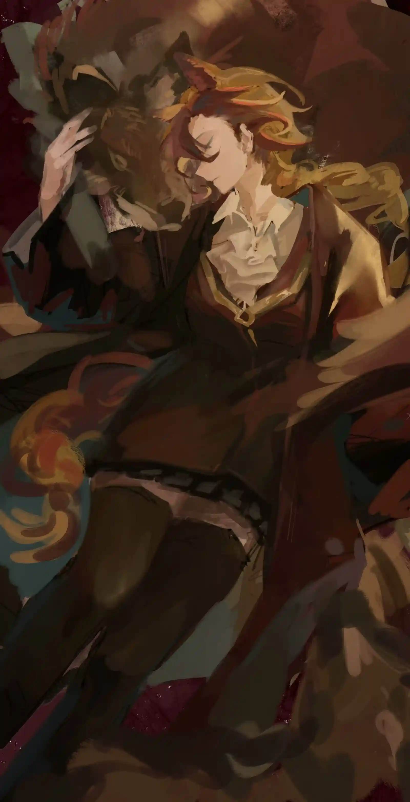

公平和正义是努力追求的结果，就像我们所踏足的大地上，没有没有披萨的地方{.textkai}

<!-- more -->

## 一

博尔托洛蒂突然想起母亲曾对他说过的一句话。

他向来对教区学校灌输的“受难”“救赎”等生死观嗤之以鼻，对炎国什么“走马灯”的说辞也不以为意。不过个中缘由在他将尽的一生中稍有变化：年轻时他鄙薄俗物，将正义与法律尊为凌驾一切的信仰，直到命运逼他亲手掰碎这个滑稽的套壳玩偶，然后将自己塞进一个更为百无禁忌的、名为“生存”的壳中。

而现在他亲身徘徊于生死。杀手含住一口气低头看去，胸口窟窿在冷光下像一口宁静的泉眼。血还有最多十分钟流尽，过量的求生欲在体内不安地奔涌；大脑开始无序地倾倒记忆，比起倒放，更像游戏厅因故障而乱吐一气的扭蛋机。

“因为公平和正义可是努力追求的结果呀。”

第一个扭蛋里蹦出母亲因年久而失真的嗓音，这让黑衣杀手花了好一会才摸到出处。孩提时的记忆比那些死去的脸更模糊，他最后隐约找到某个幼稚的假日聊天。

头等大奖。他不无报复地想着，咬肌从沾满血污的下颌纹起又舒张。花了半辈子去追求*叙拉古粗口*的公义，下场可不就是这副等死的模样？

脚步声由远及近，穷途末路的家族爪牙本能地提起一口气。来人在身旁刹住，杀手眯着眼，立即辨认出那件棕色的制式法官裙。

“你是上午追杀那个小文员的凶手。为什么被扔在这里？是谁试图杀你？”

难掩焦急的女中音让博尔托洛蒂只想发笑。“你根本什么都不知道，法官大人。”凶手在最后一个词加上重音，垂头睨着她沾满雨水与泥土的靴子，“我行使刑法典第十四条赋予的权利。哈，这样说听懂了吗？”

“…我认得你。” 不顾已浸泡在雨沼中的衣摆，拉维妮娅弯腰，目光几乎照亮杀手的脸。黑衣男人沉默着绷起嘴角，尽力将侧脸轮廓压回帽檐。但面前这位法官的记性显然比他以为的好得多。

“三年前，在索伦托市。博尔托洛蒂法官那场关于法律与底线的演讲博得了满堂喝彩。论坛结束后我找到他攀谈，才发现那位可敬的法官拥有与我同样的姓氏。”拉维妮娅的语气随回忆而扬升，仿佛彼时的惊喜与共鸣仍历历在目。她扎猛子般蹲下，在杀手西装的内袋上下翻掘；半躺在花台旁的男人侧身以鼻音威胁，最终不甘地归于安静。手腕不一会停住，唰地抽出一块深色的小本：标志性的皮革纹样已被剪去一角，污痕与裂口爬满黯淡无光的封面。拉维妮娅揭开这本再熟悉不过的叙拉古法官证，在第一页看到了那个曾令所有参会者振奋的名字，和其上已被扯去相片的虚线框。

“别以为你了解我，法官。”杀手的气息愈加不稳，像寒风中松动的窗沿。“我的前半生不过是一堆梦里的疯话，这害得我又花了剩下的小半生清醒。你以为你的美梦有贝洛内家族撑腰，就可以像现在这样俯视我，嗯？你什么都不知道。” 杀手想哂笑几声，但气管中的血沫使这变成了一种鲁莽的尝试。他被胸腔拖拽着咳出声，偏头啐出一口暗红。胸前的贯穿伤随脉搏泵出更深色的毒血。

“法典立于底线，正义守护公民，呵呵呵。你莫非还记着那种疯话？我判完案子的那个下午，眼睁睁看到我家在火海中倒塌。知道天亮后还剩下什么吗？台阶缝里半朵焦了的玛格丽特。” 杀手逐渐放松了身体，像林间一匹将死的老狼，翻身袒露出肚皮。拉维妮娅以为解脱的仁慈将临，却没注意男人的手已满满蓄在腰后，预备作出他一生中最后的扑击。

“你不会有机会重蹈覆辙了。”一道凄厉的光横空，奔向拉维妮娅喉颈间无尽的月色。

---

## 二

拉维妮娅牢牢扒住副驾席的车顶把手，看向左侧司机的目光中隐含请求。踩死油门大打方向、急刹急停接加速超车，这位昔日登报的“家族罪犯”似乎将性格中不易察觉的狂野尽数塞进了车技里，法官不得不改用双手固定，来确保自己不会跟着倾角可疑的车辆向外滑翔。

“谢谢你救了我。”忍下又一波轮胎漂移的嘶鸣后，拉维妮娅认命地开口，“不过如果我没记错的话，你现在应该还在监狱里，而不是一辆持续超速的车里。”

“企业机密。”灰发橙眸的鲁珀无动于衷。

“…企业？杀手也有企业吗？”拉维妮娅反问，得到一阵意料之中的沉默。

“好，那换个话题。” 拉维妮娅看向司机，“为什么救我？以及你怎么知道我在追那个凶手？”

“知道建设部长吗？死在就职演说里。”

“当然。”拉维妮娅斟酌着措辞，“卢比奥部长在广播里演说到中途就被掐掉了信号，直到第二天报纸上传出他遇害的消息。”

“没有掐掉。被调了频段。”德克萨斯终于换了换坐姿，从内侧口袋摸出一块方形的小玩意扔向右边。“手忙脚乱的掩饰，在沃尔西尼能收到的只有老古董。广播台集体改制前的路子。”

拉维妮娅接过，端详着手中又小又旧的收音器，同时快速消化德克萨斯刚给出的惊人信息。卢比奥生前长期供职于名不见经传的食品部，而他前半部分的就职演讲正如此部门查获的无数个过期面包一样干瘪难嚼。拉维妮娅努力回想着，直到演说被掐的前几秒，有一句话突兀地露了出来。

“如今的家族是软弱的。”

这之后便是沙沙声，与几秒后一声嘟的终止音。不少人认为这是卢比奥政治生涯“穷人乍富”式的得意忘形，以为升迁到部长便能漠视家族，这才得到了教训。不过第二天登报的遇刺头条还是有些出乎人们的意料，毕竟在西西里夫人建立秩序的几十年后，家族处理类似问题的手段早已不至于如此露骨。

不过此事溅起的水花只消一天便杳无踪影。拉维妮娅随着思考一遍遍轻抚过收音器，早已脱去金属漆的按钮陷进面板中，黑黢黢宛如那天演说台上的铳口。

“这意思是？”法官轻轻问了一句。

“听听看吧。”德克萨斯终于减速，在一座画着蹩脚企鹅的房子前刹车，将安全带掷向身后。“我们的安全屋。今晚没人。”

拉维妮娅略有犹豫，但还是跟上了面前的脚步。

进屋，摁下收音器。之后的五分钟里拉维妮娅难掩惊容，一遍遍地回放后半段绝无可能造假的演说。“叙拉古的基底是恶的”，“我们生活在名为家族的牢笼中”，“而我们所拥有的力量正是生活本身”。被匆忙掩盖的精彩与深刻超乎她的想象，但反过来又彻底解释了卢比奥身亡的必然。当拉维妮娅从志同道合的欣喜中逐渐冷静，才发现其上早已蒙了一层注定的悲哀。

“给我听这个，是为什么？”法官快速掖好情绪。

“你受贝洛内家族庇佑，对吗？”

拉维妮娅看向站在窗边的鲁珀。背对月光的茸茸耳朵规律地卷动，在地上投下更加沉默的影子。比起一名不属于家族却无法不受家族影响的法官，德克萨斯家最后的血脉杀伐果决，不事一人，似乎更配得上继承这场演说的遗志。她感到一瞬微妙的惭愧，又在下个呼吸间坚定了想法。

“客观上是的，但这不重要。我守护法典而非家族。”法官的声音沉着有力，让孤狼想起法槌一次次敲击木板的回音。“在叙拉古前行，总免不了被家族的杂草绊住脚。但若牵绊成为掣肘，我不会纵容。”拉维妮娅顿了顿，“就像你一样，不是吗？”

德克萨斯不置可否地叼起一根巧克力棒。“卢比奥的死与贝洛内家族直接相关。”她转身，一对狼眼在安全屋的黑暗中划过，像枕在黑丝绒里的一柄冷刀。“如果我们从这场演讲中听到了相同的东西，我期待你接下来的行动。”

“证据？”

“两条。贝洛内家近一月暗中的人手调动已露出端倪，而卢比奥接班建设部长一事由萨卢佐家授意。”德克萨斯点了点一旁的木桌，两张手写字条被对齐钉在一桌剧本草稿上，正用自由的另一端触碰月光。“十二家族中仅萨卢佐可与贝洛内争锋，剩下十家不过是在分汤水喝。至于法官小姐打算如何求证，决定站在哪里，我会等等看。”

“你想做什么？”

“将真相告知一位声誉清白的法官。嗯，也算是尽了我的公民责任。至于我，只是因为身边有不少同样痛恨‘洗牌’的伙伴。好人们不该再像筹码一样被装进袋子里。”

“最后，不是问到我的企业吗？”德克萨斯在外套口袋探了探，用两指夹出一张名片。拉维妮娅接过，看到黑白相间的卡片上戴着夸张墨镜的烫金企鹅图标。背面是一串龙门的地址电话，印着几条深浅不一的巧克力痕。

“企鹅物流。我们的工作是搬运生命和死亡。”

---

## 三

白日的米兰剧场不比夜晚的人声鼎沸，拉维妮娅在经过客座时感到罕有的宽敞。这会上演的是一部古典悲剧，以依稀的观众来看，显然不是在白天炒热气氛的最佳选择。贝纳尔多不常犯这种错误，拉维妮娅想，他对艺术的重视与对上座率的重视同样严肃。

不过也好，省的她侧身去避让一排参差错落的腿。拉维妮娅一口气走过客座通道，来到最靠近舞台的包厢区。歌剧的乐音愈发贴耳，她逐渐记起了这个选段，为了纪念一个神话中飞向太阳的可怜人。

迈入包厢，剧团长贝纳尔多已经落座，背对着她检阅着今日的演出。从宽大的沙发后只看得见家主的长袍翻领与一丝不苟的背头，一如过去数十年。拉维妮娅驻足凝视，发现自己或许从未看透过他。

年少时的拉维妮娅受过贝洛内家族的保护，但这份稀薄的联系在她考取法学院后迅速从表面隐去。法官与家族，两个同在叙拉古舞台上你拉我扯的牵线木偶。拉维妮娅在这舞台见过不少来去匆匆的家主，尽管性格各异，但一眼就能看出那些眼神下的嗜血。家主就是头狼，贝纳尔多小时候告诉她，而狼生来就是要吃肉的。

但她时常据此审视贝纳尔多自己。白日剧团的团长在戏剧与演出上造诣深厚，又广交名流，一手扶植起剧团的同时还勤于与大地上形形色色的机构合作，全然一副献身于艺术的雅观气派。如今米兰剧场已成为叙拉古远近闻名的歌剧中心，而鲜少有热衷歌舞剧的观众与评论家知道剧团长亦是一名头狼。或许是最强盛的那名，拉维妮娅想，但她总是极难从他的眼睛里看到对暴力的渴望。比起其他甚至不屑掩饰的家主，贝纳尔多更像一匹已经腻烦了征服与杀戮的掠食者。他的眼神总是比其他头狼更加遥远。

拉维妮娅摇摇头，驱散这些无用的思绪。叙拉古家族每二十年有一场不成文的无差别争斗，因死伤惨烈、利益诱人与分配自由，黑话称为洗牌。有次火拼结束后，贝纳尔多曾向刚进入法学院的她表达过对此的厌倦，这让年轻的拉维妮娅瞠目结舌。站在法官的立场、站在家族的立场，她愈加思索愈不得其解，只好认为是他被打傻了。那之后两人再没提过此事，但经过数十年法官生涯的打磨，她从不同的路缓慢走到了相同的终点。卢比奥的死亡，德克萨斯的救援与密会，新沃尔西尼城区的暗流涌动，将近的洗牌。拉维妮娅知道家主在舞台中的某些角色往往身不由己，但她首先是，也只能是一名法官。

她径直入座，没有寒暄。面前的歌剧徐徐拉开架势，乐团合奏，开始为主人公的登场垫下悦耳的织体。

“剧团长对卢比奥的死亡有何高见？”

白衣的头狼略略动了动扶在拐杖上的手指，沉吟开口。“是家族。他那些话说的太早了。”

拉维妮娅开始觉得面前几十米妆容华丽的演员们面目可憎。“话说的太早了，哈。”她尽力克制着，“卢比奥的演讲如果没被掐掉，民众的思想，法律的边界，这些改变将不可估量。莫非家主认为质疑家族，是一介平民配不上的特权？”

“正因他是平民。我是家主，我知道家族能有多轻易将锋利而脆弱的思想掰折。类似的工作倘若能完成，亦必经家族之手。在那之前，我会毁灭所有必要的人。”

　　“为了毁灭家族而将呼吁毁灭家族的人杀死。”拉维妮娅朝地板摔下一声冷笑，耳边低回反复的旋律如吸虫般恼人。“剧团长该管管手下人的排班了，我看今天正适合演一首谐谑曲。”

剧团长面如平湖。“牌已洗好，近期不要再接触莱昂与家族，你那边的案件不会有所牵扯。沃尔西尼新城区将成为第一个舞台，善赌的萨卢佐是时候赔光了。”

舞台进一步拉起。画满海浪的布景在欢呼中展开，主角以蜡粘结羽翼，对着孤岛纵声歌唱，舞出狂喜的步伐。

“两败俱伤，其他家族不会跟着你赌命。在死地中面临群狼环伺，这就是你的计划？”

“投入新城区的力量不会是我们的全部。尽管确实是绝大多数，为了请剩下的客人入场。我已打点好十家的利益分配，在第一场戏开幕后，他们会结盟，等到决出最终的胜者。但新城区的台子太华丽，若贝洛内家族真与萨卢佐两败俱伤，若两方拼到再无可能东山再起，饿狼们便等不到散场。”剧团长勾出一个标致的笑容，内里的情绪被他隐在嘴角完美的弧度中。“不会有第二场戏了，瓜分腹背受敌的贝洛内将是他们无法拒绝的美好结局。”

“哼，那你的饵最好肥得流油。谁去带队？别以为我什么都不知道，人手早都被你分散，几个领头的也赶不到新城区。莱昂刚结束建设部一案的传讯——”

拉维妮娅如遭雷击。她终于意识到了贝纳尔多与她的会面为什么选在这里，或者准确地说，选在这场歌剧中。男高音雄浑悲怆，字字入耳，复调的管乐声部排山倒海而来。舞台渐入高潮，她颤抖着嘴唇，已经预知歌剧演员即将唱响的下一句词。

——而我，而我将成为伊卡洛斯。

“这就是你的计划？”她几乎跃出沙发，分不清胸腔中冲撞的的是愤怒还是惊惶，“用新城区、用*叙拉古粗口*你自己当诱饵，让所有家族在你设计的火拼下团灭？”拉维妮娅冲面前纹丝不动的白袍怒吼，“这就是你为家族设计的结局？你凭什么来当这个*叙拉古粗口*先知！十家另有计划怎么办？萨卢佐老狐狸有底牌怎么办？贝洛内家要是出一点岔子，你在哪里？！”

“莱昂会确保结局没有意外。” 贝纳尔多双手平拄拐杖直视前方，歌剧中的羽人此时正被太阳灼断翅膀。“你不清楚这些年在十家安插的楔子，而我知晓五天后他们可能的所有举动。莱昂亲领的那支力量，正是足够贝洛内家彻底消灭其他所有人的余数。”家主转头看向拉维妮娅，眼神分不清是餍足还是解脱，“我仍记得你执意报考法学院而离开的那天，拉维妮娅。就像我说的，我会先毁灭所有必要的人。”

拉维妮娅寸步不退地怒视着，直到脸颊传来线性的痒感。她意识到自己正在流泪，又意识到自己有多想驳倒眼前荒谬却牢固的逻辑。冷酷的理性在立论争辩，柔软的感性想劝告拦阻；但面前这双眼睛仿佛遮在雾里，吞没了她试图发出的每一个音节。

封蜡与羽翼的残烬随风而散，舞台上的伊卡洛斯终于坠向海底。

---

## 四

企鹅物流安全屋。

“我与贝纳尔多的最终目的一致，现有的家族格局必须被打破。”法官疲惫而平静地陈述。桌旁白色的狼眯眼把玩着刀锷处的日晷，灰色的狼与贝洛内家少爷同坐，后者眼中仿佛有滚涌的岩浆。“但我要家族在名义上存在而实质上在瓦解，这是唯一的破局之手。”

“贝纳尔多注定失败，是因为他不得不留下莱昂作为后手。只要洗牌后仍有家族残余，那么新的家族体系在废墟中生长不过是时间问题。莱昂以为他能凭借在决战中建立的威信约束成员，使贝洛内从此成为独立于西西里体制下的进步家族。还是错。叙拉古的家族里没有哥伦比亚的血，你们通用的语言最终只有暴力。在足够堆满一座城的利益面前，谁以所谓的新秩序挡路，谁将成为孕养新暴力的祭品。就算有家族新领袖的名头，莱昂最好的结局也不过是一个终生架空的姓氏。家族时代永不会结束。拉维妮娅叹了口气，旋即露出一丝无奈的笑。“亏他曾经还坐在披萨店里指责我的天真。”

莱昂图索从嘴唇缝挤出一丝空气，分毫不让地嘲讽了回去。

“而你们，德克萨斯，”她望向两头性格迥异的孤狼，“你们的对抗与牺牲在道义上值得传颂，在实践上毫无价值。巨狼之口数十年间撕碎的好手何止上千，你们将被彻底从叙拉古抹去生命、名字和思想，就像投入井口的石头。这片泥潭不会有任何改变。”

“那我们怎么做？”疯狂的白狼冲她无所谓地咧嘴，而灰狼已掩饰不住尾巴尖晃动的焦躁。

法官轻轻扯了扯嘴角，看着贝洛内家族年少的领袖。莱昂挑了挑眉毛，他从那微笑中竟同时读出了稳操胜券的自信，和孤注一掷的狂热。

“我既不是打手，也不是家主。我所能做的，也只有一场审判。”

……

“主犯莱昂图索·贝洛内，及相关家族成员。你们是否就卢比奥遇刺一案认罪？”

有着一头硬挺黑发的青年在被告席上缓缓点头，明黄色的眼睛中看不出什么波动。贝洛内家族的所有残党今早刚被从各处安乐窝中揪出，蒙上眼绑来沃尔西尼法院。卡车撞出的巨大墙体残缺仍无人修复，远望像某种前卫的开放式半露天设计；等叫骂不断的家族成员扯下眼罩看见少爷，洒满阳光与尘土的大半个法庭登时落针可闻。领袖沉默地打了个手势，队伍迅速一字排开，列在被告席后方。和往常一样，打手们开始熟练地各找姿势，走神打盹。在他们的经验中，沃尔西尼的审判程序就像这座法院一样四面漏风，其结果在墙外就已注定。只消在这里或监狱消磨些时间，一切照旧。

只有法官与被告知道今天的戏码才刚刚揭幕。交换了眼色，法官开始在心中倒计时。

“我在此宣判，处主犯及相关家族成员二十年监禁。”

无事发生，被告席后传来隐约的鼾声。

“并将新沃尔西尼城区火拼所得尽数充公，由市财政部执行收缴。”

一只羽兽落在残破的墙垣，点点头，摇摇头，又如风般掠去。

“但念在投案自首及认罪态度良好，不处剥夺灰厅席位之附加刑，其间议事由市政府代理负责。”

拉维妮娅落下法槌，并在下一瞬间同时感到手臂传来的僵直，看到听审席上轻轻亮起的一圈光环。

法院再度陷入诡异的死寂。除拉维妮娅与莱昂图索尚能控制面部肌肉，底下勉强成排的家族成员先是表情各异，而后集体凝固。人群颤抖着争相跪倒在地，扬起的灰尘短暂地遮蔽了一方阳光。

“二十年监禁的同时保留其家族议事权，有趣。告诉我，我的法官：你因何作此宣判？”

平缓的嗓音在法院内响起，声音不大，却让每个人感到犹在耳边。站在这个国度权力之顶的女人于拉维妮娅右手边现身，无人直视，无人质疑。

“因为您等不了下一个二十年，沃尔西尼也等不到下一轮洗牌。”拉维妮娅看着西西里夫人缓缓绕行至法桌前，华贵的狼毫大氅流出柔和的曲线。“贝洛内家族在名义上仍然存在，但由政府代理的议事权将确保他们二十年内无法再堂皇行走于叙拉古，行使恐吓与暴力，逼迫民众臣服于他们的意愿。家族是蒙在叙拉古眼睛上的纱布，它存在一天，人们便懒于向外张望一天。大地上不同国家的碰撞已经改变了如今的叙拉古，而若我借此机会扯下这块腐朽的纱布，只需要一小会，人们就会凭本能睁眼向外索求，意识到这片土地千年来理所应当的家族原来如此多余。”法官手心慢慢渗出汗水，但声音如晨钟般不可动摇：“在我所生活的叙拉古，没有谁不因家族而委曲求全，牵绊难行。或许这些在您眼中只是必要的牺牲，但今天，经由您制定的律法终于触碰到了名为家族的藩篱。”

“精彩的论断。”淡妆下的脸庞依稀看得出年轻的风韵，面色不改的妇人轻轻拍了拍手，然后缓缓按住桌角，手镯滑落相碰，又发出几声脆响。“但据我所知，叙拉古的法官以践行我的意志为荣。若我今天特赦贝洛内家族，拉维妮娅法官该作何声明？”

西西里前倾身体，逼迫拉维妮娅不得不与她对峙。法官平视向前，竭力稳住心神。叙拉古的主宰有着棕黄的瞳孔，灰度浅淡，盛不下一滴情感；随年岁褪成浅色的毛发拱卫周身，让拉维妮娅想起古时荒野中吸吮骨髓的白狼。

“…我依律法宣判。与拉特兰合著的法典已是您意志的彰显，而对其的解读与实践属于全体法官。自律法颁布、法院建立数十年，您从未以个人身份干涉任何一场审判。我钦佩您对律法与程序的尊重，并将秉持等量的尊重照此行事，一如既往。”

万物阒寂，眼前的妇人似是没听见任何声音，不置一评。但兽的直觉告诉拉维妮娅此时正是生死攸关，容不得一丝犹豫与退缩。行人于夜路撞见狼母，如不舍命一搏，必将尸骨无存。

“若您以个人意志干预这场审判，则等同叙拉古背弃六十年律法；若您借这场审判重新审视家族，则将为叙拉古洗去千年沉疴。如今的国家必须直面变革，”法官终于换下第二口气，想借势把法槌放在一旁，但竟感受不到手臂的存在；“…而我希望您能从中引导，正如您彼时与圣城的神父同归故乡。”

教母缓缓拔起腰肢，面颊上的浅纹仿佛能吞噬法院内所有的光。

“拉维妮娅，我意志的代理人。”年长的妇人语调逐渐低沉，法官感到无形的獠牙正扯碎空气黏上她的皮肤。“六十年。自我从拉特兰归来，自灰厅建立，违抗我意志的皆为尘土。不可一世的德克萨斯如是，三次洗牌中无数消失的家族如是。远在他国如是，近在眼前如是。我以家族为耕犁，在荒野中开辟国度；我以律法为栅栏，在国度中育养后人。”不同于拉特兰式教堂中对主舒缓而轻盈的祷告，西西里夫人的称颂直指自己，带着荒野中嗜血的狂放与无尽的重压，“在所有将死之人中，你最该懂得，秩序是我赐予暴力的法袍；你更该懂得，秩序的尽头必由暴力撑张。”

“而你想以我的秩序驳倒我的暴力，呵。”教母骨节分明的手掌朝着法典缓缓按下，纯银的素圈戒指不动声色地嵌入厚皮封面，将下午三点的阳光折射成冰。“你怎么不怕我当场撕了这本词典？”

远处的眼罩下飘来一声轻笑，不知是赞许还是同情。

拉维妮娅用尽浑身力气接住妇人深不见底的目光，接住意识中正朝她轰然倾塌的一整座法院。终于在某个时刻，她浑身一松，几乎瘫倒，然后看见面前刀剑刻出的皱纹缓缓舒展。

“跟我来。”

……

“恭喜。灰厅果然没那么好进，即使我们早都做好了准备。”

夜色温柔。从楼顶望去的沃尔西尼灯火错落，人烟婉转。四位逃离家族的狼与一手巩固家族的头狼划地相争，最终在夕阳时分得到了地图上的一块方格，得到了一抔或许足够承载希望的土壤。

前贝洛内家少爷从灰厅奔向新区料理后事，德克萨斯轻轻竖晃着尾巴，眼神宁静地看向一旁枕臂仰躺的拉维妮娅。远处街口，白狼嬉皮笑脸地仰头冲她做出鬼脸，而后头也不回地走向荒野。

“现在想想，我有过几次看见你在那家披萨店和莱昂图索交谈。第一次碰见刺杀那里。”

“是啊，那里曾是我和莱昂不谈家族不吵架的圣地。他总得找人说些台面上难以出口的话，我也总得往回看看。没想到一场刺杀改变了一切，哈，在街上随处可见的一家披萨店。”

“我曾经也有常去的店，它已经消失了，老板死在了巷子里。”德克萨斯笑了笑，侧脸不似怀念，更像惋惜。“我们无法改变过去的叙拉古，无法改变那些永远停在那里的人。”

“但路总要往前走，即使我们不知道前面还有多少泥沼，至少它们不再会像从前那样。”拉维妮娅声音飘渺，像在水中挣扎太久，终于因上岸而脱力的人。“我有我的法槌，你有你的剑。虽然家伙不一样，但我们终归会在前方相见的。”拉维妮娅转头看向德克萨斯，扬起嘴角补充了一句，“我坚信。”

德克萨斯轻轻点头，在法官平铺于地的宽大衬袖上放下一颗蓝莓。

身形轻盈的鲁珀跃下楼顶，像第一次甩掉了背上如影随形的十字架。拉维妮娅轻轻嗅着空气，灰狼的最后一句话如薄荷般散于夜空。

“那么，希望你常吃的那家披萨店仍然开下去。”

---

## 五

拉维妮娅扣上袖尾最后一颗纽扣。

有关新沃尔西尼的大小事项在灰厅的雷霆手段下被迅速摆平，过往规划中的小小城区现在已托载着全套动力设施与指挥塔分离。但西西里夫人与主教似乎对余下的俗务兴致寥寥，与其他老面孔们在新城市的启动仪式合影里一并隐去，留下满是年轻人的澎湃笑脸。

而新法官的就职典礼在修葺一新的法院举行。新城市的法官制式服装与之前并无不同，镜子中穿戴整齐的映象也已重复过千百回。但不知为何，拉维妮娅觉得这份重复正与自己曾行过的三十七个冬夜缓慢地背离，像列车终于驶到了人字形的岔口前。

她感到某种面临抉择与改变的不安。自从习惯了沃尔西尼冷铁色的框架，习惯了在庞然大物们的夹缝中机械地行走，她正不可避免地疲于愤怒与抗争，将自己束手铐在道德的铁枷中。而今她脚下的这座新城用身边无数破碎的生命与理想换取，可谁又说它不会从相同的土壤中长出相仿的面具，在装潢一新的框架里？沃尔西尼的面具总将污秽藏于其下，让行人看不见那些注定失败的挣扎；面具总带来虚伪的秩序，每个看似体面的名词背后都拄着那些大名字——西西里夫人，萨卢佐，贝纳尔多。

啊，贝纳尔多。拉维妮娅忽地记起年幼时的一次遭遇，那是尚值壮年的家主将她领进家族时遇到的帮派火拼。奇怪，她想，履职数十年所经历的威胁与凶险早已不可胜数，怎么偏在此时掉出一块有惊无险的边角料？

但记忆已如落幕般滑向她。

“我不允许。”

贝纳尔多的语气如晚风般平静，仿佛在陈述天上正有两个月亮。

“你*叙拉古粗口*的脑子里进石头了？”打手斜支起脖颈，用看傻子的目光剜他，“我说，乖乖掏出那块怀表，然后跟着我揍死对岸的狼崽们，你才有的活。家主现在就在路上，用不了五分钟就能灭了河对岸那帮蠢货，再顺手捏了你和这崽子不听话的脑袋瓜。你*叙拉古粗口*不允许？难道家主的腿长在你身上了？”

拉维妮娅拼命咽下喉咙里翻搅的恐惧。幼小的鲁珀躲在家主身旁，恨不得捏断身边男人的风衣系带，但胳膊软得像煮烂的通心粉；十月傍晚的沃尔西尼寒意渐深，周遭刀剑的火星和爆炸的光焰又几乎使她中暑。她的小手挂在风中飘摇不定，恍惚间听到身旁的男人重复了一遍刚才的话。并不属于家族的她下意识转头，在一片眩光中找到家主磐石般的眼睛。

“我不允许。”

那是面临失序与混乱的宣告，因不屑表露身份者正是秩序的代言人。旧日秩序正是由这样的强人维护，帮派的头狼，家族的头狼，国度的头狼。但头狼们圈定的规则随时光流逝而式微，她看在眼中，想举高手中布满荆棘的法典。可仅凭一沓法典代言秩序何其困难，她手中只有一丛荆棘染血，她身后已有一排逝者无言，她面前将有无数铳口漆黑。

“我不允许。”

拉维妮娅在心里重复着默念。直到睁眼，借镜子与三十年前那道目光再度对视。

法官于是转身走向法庭。

---

六

“因为公平和正义可是努力追求后的结果呀。”

这周六是个好天气。

叙拉古的夏季炎热潮湿，而索伦托市今日走运，正在阴云的尾巴上享受着初晴的午后时光。阳光柔和温度怡人，休息日的人们互相招呼，在自家小院里张罗起了烧烤派对。街边拐角的医生宅邸内，开满半个院子的玛格丽特露珠未褪，在波光中携风欲舞。一旁面露难色的法尔科内正试图以多年来使手术刀的经验驯服烤架，年轻的夫人在吊椅上抚摸着孩子的头，露出羽毛般柔软的微笑。

小博尔托洛蒂在妈妈怀里耷拉着脸。周四放学时要好的朋友被什么家族的打手拖进巷子一顿修理，男孩呆在当场，短暂的断线后连滚带爬地撞入家门。事后既为自己小小的怯懦感到羞耻，又愤怒于家族成员的肆意妄为；即使第二天上学时抓了两颗糖果去安慰一身淤青的同伴，也没能抹平心里那块疙瘩。脸色涨红的男孩终究憋不住，在休息日父亲自告奋勇奔去烧烤时，拉着妈妈略带委屈地讲了一通。“为什么书上讲的公平与正义没能实现呢？” 他闷声以问句做结。

听到母亲回答后的小博尔托洛蒂把头埋的更低：“所以是因为我那天没去阻拦他们，没有追求公平与正义，才会这样吗…妈妈？”

衣着考究的女士托着下巴，淡黄的裙裾在草地上思考般摇曳。不远处的丈夫正手忙脚乱地与烤架、案板和十一种调料罐搏斗，角落高大的石松矗立如伞冠，向吊椅投下明暗斑驳的影。

“这不怪你宝贝，因为公平和正义一直都是很难追求到的东西。”母亲终于开口，视线顺着树冠的方向望去，“还记得爸爸之前出差带你远远看过的灰厅吗？那是西西里夫人和光环叔叔马上就要工作的地方呢。等新的秩序从那里制定好之后，乱七八糟的争斗或许就要结束了哦？”

小博尔托洛蒂陷入了短暂的思考中，皱起的眉毛舒展又缩回：“可是那里的秩序…会是公平与正义的秩序吗？”

母亲的目光狡黠：“谁知道明天午后还会下雨吗？”

“可如果…”

“我知道你想问什么宝贝，如果那样的秩序里仍然没有公义该怎么办，是吗？”

看着怀中孩子点头，母亲笑着捏了捏他绷紧的脸蛋。

“因为即使很多人要首先顾着生活——就像我们的小机灵鬼先想着跑回家一样——也总有充满力量和勇气的人们想办法去追求的呀。曾经大家不也是这么过来的吗？”

小鲁珀垂着尾巴，眼神看起来更加迷惑：“即使他们要和西西里夫人作对？这怎么可能…发生呢？”

“因为公平和正义其实就像，嗯…披萨！”母亲四处望望，然后啪地指向烤箱，冲男孩调皮地眨眨眼，“虽然常常有坏人关上披萨店的门，吓跑老板和厨师们，但大家对披萨的向往和热爱可不会减少呀。过上一阵，找找同伴，总会有新的披萨店开起来的呦。”

“那我长大后也可以找个好地方，开一家披萨店吗？也可以在…在灰厅旁开一家大家都喜欢吃的、西西里夫人也喜欢吃的披萨店吗？”

稚嫩的法尔科内犹豫了一会，这才鼓起勇气抬头。母亲的笑容被云朵晕染，门前玛格丽特溢出几叠金黄。

“当然了亲爱的，这片大地上没有没有披萨的地方。”<eod />

 {.centering}

（责任编辑：广英和荣耀；网页排版：武乙凌薇；绘图：冉枝。也叫源城冉）

<FakeAds />