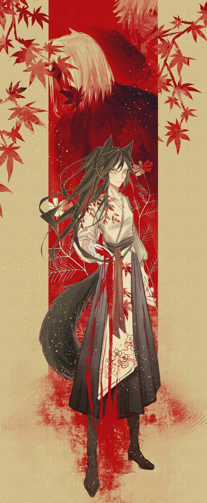

力拔山兮气盖世{.centering .textkai}

时不利兮骓不逝{.centering .textkai}

骓不逝兮可奈何{.centering .textkai}

虞兮虞兮奈若何{.centering .textkai}

<!-- more -->

武魂 - 龚琳娜{.centering}

一种很刚强的东西，消失在一个很妥协的年代。{.aright}

---

她看到曾在城镇小巷间逃跑的自己，于是负罪感上涌，在她的皮下颤动，欢快的游泳，转变成了一种朦胧的痛楚；她看到那个时候，那个将成为她二哥的人提着她的衣领对老人说：“师傅，抓到一个小偷！”；她看到她和大哥瞒着二哥，偷偷分了师傅的一壶酒。大哥喝不惯，她却喝的津津有味。师傅推门，两人被吊在门梁上；她看到因她喝酒误事，跌下了擂台摔断腿，大哥才代她上台……

她看到了被逐出师门那天，武馆门口那条大道。大道上没有人，只有秋后的落叶。她那时候一手抓着行囊，一手握着酒瓶，没有回头看背后的师傅和二哥。

她一直在走，一直在逃。酒精蒙蔽她的双眼，让她逃的更快，带她向她自己也不知道的方向。那个方向或是五彩斑斓，或是漆黑一片……但是都无所谓——她追逐那个方向，只是为了不回头罢了。

---

一阵颠簸让叶梓抬起头，她又喝醉了，趴在桌上就像一滩烂泥。

那个叫桑葚的医生走过来，怀里抱着一叠报纸：“呀，您醒啦。”

她晃了晃脑袋，试图让思维驱逐酒精重新占领高地。“……哪来的报纸？”

“这是和过往商队交换的报纸哦。根据……根据报纸的消息，粤通城很快就会停靠在这片荒原附近。城里应该是有罗德岛的驻扎小队和办事处的，这样......”

桑葚医生将报纸放在桌上轻声解释道，声音柔柔弱弱。

几天前，她还在一个荒野营地喝酒厮混。响午时候，这个自称桑葚的年轻医生来到营地，询问是否可以在这里休息几日。她打个酒嗝，告诉医生这一带多土匪巨盗，还是赶快离开的好。医生说她和救援队走散了，正在等待接应。

那时候叶梓的脑子好像是被酒精统治了。“你雇我，给我酒喝，这几天我保护你。”

她这么说。当时的她还不知道桑葚医生是个怎样的人——如今叶梓知道这是个温驯而不出格的孩子，恐怕就算她发起酒疯攻击桑葚医生，医生也不会还手吧。

“别聒噪了，你知道我没兴趣像你一样把事情安排的明明白白……”叶梓的脑袋又垂了下去，瘫在那叠报纸上。她看着报上硕大的新闻头条，嘀咕道：“粤通城……北武南下，六合街设擂台……”

“怎，怎么了吗？”

“我……唉，医生，把你送到那里是吧？我是真的不想再回到那儿。”

黎博利医生有些疑惑：“叶梓小姐，您很讨厌那座城市吗？”

“那倒不是……”叶梓嘀咕着，想要伸手去摸酒瓶。但她记得医生建议她少喝点酒，便像蔫了一样的倒在桌上：“这城里……有几个我没脸去见的人。”

---

粤通城，山坟间，石墓碑。石墓碑前是两个人。

老人看上去命不久矣，身体清瘦如脱了水的芦苇杆。他坐着轮椅，艰难的呼吸让干瘦胸膛一起一伏。年轻人身材中档，四肢干练，斯斯文文。他半跪在墓前，一摞一摞的拿出纸钱点燃。

“哥，我和师傅来看你了。”

风吹过墓碑，带起一小阵刮擦声。和风声拌在一起的是老人鼻腔气体进出的声音——他的呼吸蕴含着一种名为艰难的阻塞感，仿佛声息置于狭隘的峡间小道，交互不易，入不敷出。

年轻人捡起一根树根，挑动燃烧的纸钱堆。“粤通到底是开放了，不像二三十年前。现在政客出钱，宣传出渠道，武馆的繁荣是假的，不教真本事，只是凭着名头赚钱——师傅不想弄这一套。他说教是教，不教是不教，会武术的当是武人，武人当有武魂。他只教了我们仨。”

“我知道您打死人的事，是那十九家武馆的报复，师妹当初喝醉也是因为他们下药。师傅自从为你放了三升血，几年里身子快速的衰败下来，一天不如一天，恐怕大限将至。”

“哥，师傅不行了，你因愧自尽，师妹摔断了腿又被逐走，叶家拳保不住了。”

风声将歇，山道上传来脚步声。

年轻人回过头，看到四五个人走出环绕山坟的树林。于是他先恭敬的对着石墓抬手颔首，才转过身来。风嗖嗖的，吹得人脸生疼。

擂台自然是有擂台的规矩的。所谓活擂，就是摆擂双方各出人一对一，手下留情；与之相对的就是死擂，双方一个接一个的打，生死不论。曾经粤通城尚武，凡事都要武馆做个定夺。外人若是想做武馆不允之事，就要摆擂踢馆。年轻人叹了口气，当初师傅就是打擂打了十九场，把十九家败类武馆踢出了粤通，才打出了叶家拳在粤通城的天下。

来的几人，为首是个留络腮胡的汉子。他对年轻人双手一供，说：“叶文书师傅，久仰久仰。”

叶文书看着他，什么话都没说，片刻，才伸手做礼。

络腮胡大汉左右两人走出。他们一人解开系在腰间的子午刀，一人从衣袖中甩出乾坤袖胆。原本安安静静的山坟间突然吵闹了起来，越来越多的人从山林中显现，带着被布包裹的武器，站到络腮胡大汉金着的身后。算上金着背的阔刀，二十样奇兵异械在荫间阳光下熠熠而立。

叶文书将轮椅轻轻推到身侧，往前走了一步：“比武对拳，设台设擂。要打回去打。”

老人仰起头，干瘦身躯软在轮椅上，突然绷直，又瘫软下来，又绷直，不动了，像一捆干枯柴。

语刹那间，子午刀先一步突至叶文书面前。出刀者压低身姿，一条手臂如毒蛇蹿出，让刀尖直驱叶文书面门！叶文书的脖子却没有转动，脚下步伐微挪错开刀锋，反收手臂敲在刀客的后颈上。袭者还未收招便眼睛一翻，软了下去。

刀客倒下的时候乾坤袖胆才刚到，武器的重头急速平挥，袭向年轻人脖颈——但叶文书更快，在转身恢复重心的同时一只手探出抓住乾坤袖胆的链条。他一抖手，乾坤袖胆便歪了方向，狠狠砸在使用者的手上。来袭者哀嚎一声，乾坤袖胆脱手，只有链条被叶文书抓在手里。

叶文书松开手，乾坤袖胆落下，摔在地面山道凹凸不平的小石子上，发出清脆的咯嘣声。那人一愣，慌不迭拉起已经昏迷的刀客。

年轻人叹了口气，又面向络腮胡大汉说道：“金着，就算你是北边来的，不管踢馆的规矩，也要回去打。”

金着有些挂不住面子：“行，听叶师傅的。”

接着他转头对身边一众小弟：“大人比武，你去吧。”

叶文书不再正眼看他，转身走到老人身边。他弯下腰，细心而轻柔的掸去落在老人膝盖上的秋后枯叶。老人的眼睛已经昏黄浑浊了，恐怕什么也看不清。他绷直的身子还是一动不动，歪斜的脖子一抽，抬起头看向叶文书，眼神里满是空洞。

“师父，我们回去。”

突然一柄三尖两刃枪斜斜刺来！在叶文书打理老人时，金着身后一个瘦瘦小小的汉子居然踩着满是落叶的山道，没有发出一点声音，摸到了他的身后！枪尖如风，猛刺而出才迸发所有积蓄的恶意，洞穿空气的实感仿佛要把叶文书和他身前的老人一齐钉在地上！

但是叶文书好似背后有眼，在枪尖就要接触后脑勺时突然摆手抬臂——手腕和枪柄前段在空中相撞，那枪尖被临时变了个轨迹，和叶文书的耳朵擦边而过。反手为震，叶文书的手肘突然成环，用肩膀锁死了枪柄。

汉子见叶文书把枪锁在肩膀上，冷笑一声，想化刺击为横劈，用三尖两刃枪的刃切进对手的脑袋！然而一阵咔咔蹦蹦的断裂声却出乎了他的意料——横劈之后，叶文书的脑袋却没有掉下来，反倒汉子的手里只剩下根长棍，棍前半段的枪刃不翼而飞！在定睛看去，那枪刃却仍在叶文书的肩膀上，原来叶文书居然用肩头和卡枪手臂的肌肉，硬生生震断了棍体和枪尖连接的部分！

叶文书一松肩膀，枪刃连带小节木柄“咣当”一声落在地上。他叹口气，不由得又想到曾经他们三兄妹。大哥最为善技，师妹的天赋得天独厚，只有他对武学技巧始终只得皮毛，不得不依靠天生的气力弥补一二。

“回去打，会吓到师傅的。”他冷冷的说。

金着看那三尖两刃枪的使用者一脸垂丧的走了回来，而叶文书只是板着脸并未追击。他连忙挥手，示意身后的人让出一条道。金着身前密密麻麻的武者纷纷让开，各式各样的兵器间空出了一条直通下山山道的路。

叶文书回过身，对着石墓碑再次颔首拜了拜。接着他挺起腰板，推着师傅的轮椅向着下山山路走去。

“叶师傅，明天摆擂，我们会赢得名正言顺！”背后传来络腮胡子金着的叫嚣。叶文书没有理他，还是慢慢悠悠的推着老人走在一干武人之中。

就在他刚刚脱离人群之时，铳突然响了起来，就像惊雷闷在山林中。声响的一瞬，叶文书突然单脚转身，整个人像陀螺一样突兀的转了个半圈！他单脚站立，不屑的看了一眼背后的金着，慢慢的放下了刚刚甩到身前的手臂——五根手指松开，夹住的两颗铳弹掉了下来，没入落叶的海洋。

接着，他吐了一口血，倏忽跪了下来。

是三把铳同时响起，叶文书夹住了飞向脑门和脖颈的铳弹，却对剩下的一颗无能为力。胸口在痛，小腹紧缩，腺素在指尖狂吼。叶文书咳咳两声，想说话却没有说出，只感觉力气一下子抽离了身体。他脸上写满了鄙夷，尝试着抬起头，无力的脖颈却没能做到。

一个拿着铳枪的家伙走到他身边，一脚踹在他身上，对着他的头补了一枪。叶文书的生命力彻底离开了躯壳，就像是麻袋砸进落叶堆，惊起一阵山鸟。

“我是小人。”这人对着金着扬扬手里的铳，“再说了，拳头哪有这玩意儿好用啊！”

金着咧开嘴来：“不错，够机灵。”接着他拍拍手：“走吧，下山！明天打擂稳了！”

一干武人三三两两的挪起脚步。有人喊道：“头儿，那叶中泉他……”

金着这才把眼神从叶文书的尸体上挪开，看向轮椅上的老人。他的眼中带起一阵嫌恶，“得了，把他丢在这里吧。”

“可他是叶中泉……”

金着斥责道：“不过是一个快死的老头，把你们吓成什么样了，你们南方人是没有骨气吗？他这副模样，根本掀不起什么风浪！”

人群骚动一下，似乎还想说些什么，但金着明显烦躁了。一行人浩浩荡荡的下了山，坟头又回归寂静。

---

---

“人好少......”

两人走在街道上，一前一后。相处了几天，桑葚知道这个酒气熏天的瘸腿沃尔珀其实很好说话。桑葚听说粤通城是个挺热闹的大城，然而今天街道上却冷冷清清，看不到半个人影。

“人都在六合街吧，那里要打擂台。”

“叶梓小姐……对粤通城很熟悉吗？”

“嗯。医生是哪里人？”叶梓拎着酒瓶，弓着背走在街道上。她用另一只手手肘戳戳街角方向：“喏，从那个小巷拐进去。”

“啊，是姜齐城，姜齐城人。”桑葚忙不迭跟上脚步。

“姜齐城，是个好地方，白酒得劲儿。嘛，大炎很多城市都一样，离开个五六年回来，感觉没有什么变化；离开了十来年，就天翻地覆了。愿意的话，一个城市可以被人熟悉很多年。”

叶梓走出巷口，指着街对面：“就是那个，舍人大街29号，你们办事处。”

“啊，谢谢，谢谢叶小姐……”

“别忘了我的酒。”叶梓说罢，转身钻回巷子。

桑葚一愣，下意识的扒拉了一下脖子上的护目镜，“叶，叶小姐，要不要，要不要过来坐一坐？”

沃尔珀没有理会，也没有说话，很快便消失在了巷子的阴影中。

---

响午。粤通城，六合街。

六合街南北通透，可容下十余辆大车一齐通行。然而今天大街封了道，不让车进。

没了车，今天的六合街却更加拥挤，无数人头窜动，簇拥在大街中段。人头围绕的中心是擂台，敲锣打鼓的舞出一个声势浩大。金着一行人已经上台，擂台的另一边却空空如也。

“老大，响午了。”把铳藏在衣袖里的小弟对金着说道。金着点了点头，脸上藏不住卑劣的笑，“叶家人不来，自然是我们赢了。”

叶家人没来，人群便起哄，嘈杂，如同热浪一阵盖过一阵。这起了大碗茶水，摆了擂台，却有一方缺席的现状，恐怕是粤通城第一次。当今粤通武行是叶家拳说的算，十年前叶中泉就是在这里摆了擂台，把原本粤通的十九家武馆打出了粤通。

响午一刻，先前欢腾的人群已经沉寂下来，只有三三两两的窃窃私语声偶有响起。金着一笑，站上擂台，清了清嗓子：“看来，今天是各位有目共睹，这叶家畏惧了北方武术的名声，不敢赴约打擂……”

只要这一擂赢了，他自然就成了行当的新头。他已经谈好，到时候那愿意合作的武馆在这里广招学徒，粤通城人就是待宰的金鸡。武馆教点虚的，先榨粤通人三年，再让外面进来换一批武馆，再榨三年。商人是好谈的，地方官也谈妥了，只要赢了就是个名正言顺……他正这么想着，突然就听到人群又沸腾起来。

“怎么了？”他放眼望去，便看到到擂台下，一架轮椅慢悠悠的向着这边移来。金着不由得瞪大了眼睛——这叶文书不是死了吗？

再仔细一看，推轮椅的不是叶文书，倒不如说根本就没人推轮椅。老人自己弯着腰坐在轮椅上，一只手扶着轮椅的轮子，慢慢的持着轮向前转。人们目瞪口呆，看着干枯的老人一点点一点点的向前挪。这轮椅前面的人不由自主的让出道，后面的人又紧挨着贴了回去，于是人群中以那吱呀吱呀的轮椅为中心多了一个不断移动的空腔，一点点缓慢的向着擂台移。

“是叶老爷子！”“怎么是叶中泉？”“叶家老二不能打了吗？”“要不要上去帮他推一把？”“他不是自从放了血，身体就一天不如一天了吗？”人群喧嚷声音七七八八，包围环绕着老人，形成了一条无形的纽带。突然金着听到一阵脚步，一回头，居然原本那身后那十九家武馆的人齐齐后退一步，一下子气势缩了一大截。

老人的手还在抖，呼吸明显沉重了很多。人群嚷嚷着却没有人上前帮他，于是那轮椅就吱呀吱呀的自己向着擂台移去。随着离大擂台越来越近，吵闹的人群又逐渐安静下来，千双眼睛齐齐盯着轮椅，等待老人的下一个动作。

轮椅到了擂台边，轮子“吱呀”一声卡住，成了无限寂静中的唯一声音。突然老人站了起来，直直的迈了一步。这下可不得了，围观的脚夫车夫大行家地主们不由自主，人皆后退一步，脚步声齐出了一阵轰鸣。老人站了，晃了晃，却站的很稳。他伸出枯瘦的手，慢慢的把自己撑了起来，撑上了擂台。

“……打……”他的声音沙哑，尖细，仿佛呛了一大口沙子。随着话音刚落，老人扶手缓缓悠悠的站直，变成了一尊雕像。

这不在意料之内，原本这应该是一场空擂才对。金着瞪大眼睛，回过头，却发现那十九家人已经退出了足足三步之多，空出一大块地。他一咬牙，说道：“老头，你迟到了一刻！”

“……打。”老人慢慢的说。

突然，眼前的老人在金着面前变得虚幻，仿佛不存在般！秋风掠过，金着一惊，不由得也后退一步。刹那间金着脸颊一阵生疼，一阵恐怖的气势扑面而来——万千不存在的名为恐惧的落叶晃晃悠悠的自空中飘落，落叶中突兀飘出一拳！

拳没了，金着回过神，才发现自己已经架出交叉手的格挡架势。老人并没有动，还是像一尊雕像一样站在那里。冷汗落下，金着突兀的感到害怕。

老人矗立，看似破绽百出。他那双昏昏的眼睛没了眼珠，只有一阵的眼白，看的让人不由心生怖意。金着下意识的横移一步——明明感觉老人的头没有动，他却感到老人眼白下隐藏的眼神却死死地盯着自己！观众们更是屏住了呼吸，无数的人头争着想要向台上攒。

这就是叶中泉，那个让十九家武门溃退的男人。金着吞了一口口水，一向无法无天的他发现自己的内心居然也为恐惧打开了门窗。他猛喝一声，不知道是为了壮胆还是想要虚张声势，起手突然挥拳砸向老人的面部！在潜意识中，他对这一拳并不抱有希望，就像是他不可能承认，仅仅是在气势上，这个老人就将他打的体无完肤。

混白的眼珠目视前方。面对拳风，老人依旧负手而立，不躲不闪。金着壮了胆子，突然觉得这个老人也没有那么可怕，不过是垂垂老矣的一尊躯体罢了！想罢，他的拳头上便又多了一分力。

突然一只手横插到老人面前数尺，硬生生挡下了金着的重拳。北方汉子一愣，脂肪筋肉所附带的力量还没贯穿出，就被硬生生卸了力，引得手臂反震一阵生疼。接着那只手一甩，金着的拳头被甩开，连带着人后退了几步。

这只手的主人是一个女人，一个瘸了腿的沃尔珀。她慢慢的收了手，无视台上台下众人惊诧的目光——她是什么时候，怎么上来的？

她转过身，对着老人：“师傅，这一仗我来打。”

台下一片寂静，观众们因为未能反应过来，仍死死地盯着擂台。老人依旧负手而立，没有说话，枯瘦干瘪的身躯一晃不晃，算是默认了突然出现的女人的话。

女人转过身，对惊疑不定的金着摆了个手礼：“叶家拳，不入流，叶梓。”

台下逐渐响起一阵阵惊呼和窃语，伙夫脚夫们纷纷议论。这女人不是许多年前就被逐出师门了吗，怎么今天她又回来了？

金着一定神，看清面前女人消瘦且缺了一条腿。他怔了下，开口问：“你能代表叶家拳？”

叶梓看着他。散开手礼，上垒环手，成拱形又耸肩错开，两拳交替护于中线。老人站在叶梓身后，一动不动负着手，就像是老师傅审阅弟子练武成果般，于是叶梓缓慢挪了一步，为老人让出个视线。

“能。”

金着突然上前，弯膝盖下压身平拳，一手护住头部，一手直刺女人的大腿——他打定主意，瞄准的是女人的那只假腿！但叶梓随对方变换脚步，顷刻间两腿呈一前一后，堪堪错开金着的刺拳，仿佛那条假腿完全没有影响她的灵活步伐。

直刺不成，金着暗憋一口气，腿一蹬，就要用上身肩膀强行对对方的躯干进行撞击。叶梓交叉于身前的双手一伸一缩，居然并未躲闪，而是反手错开卡上了金着的脖子。此时的金着被一卡，失去了向上顶撞的劲儿，只是脖颈独独然生痛，只好后抽碎步想要脱身。沃尔珀也并未追击，纵手松去，放任对方后退了好几步。

不到几秒，一个照面，两人已经过了数招。金着后退站稳，心沉了下来。这女人是从哪里冒出来的，身手了得，打的还都是些基本招法。他心一横，喊道：“准备！”

随之金着猛然蹬脚，想要再用侧肘发力，贴近女人。叶梓见状反而前进了一小步，两手如抓铁器，打算按压侧肘以缓解金着的打击并借以反打。

就在两人即将再度交手的一刹那，原本跟着金着的那群人中突然闪过几道照相机的灯光，刺啦啦的在大晴空下突兀亮了一片。光圈聚焦闪过，叶梓眼睛一黑，微微眯起。

金着等的就是这个机会！他见对方中招，邪笑一下，突然收起原本将要接触女人的侧肘——原来那侧肘是虚招，真正的实招是藏在身后的另一只手！这只手平抡甩出，打点极高，气力极大，唯一的缺点是出招时间长，容易被反应招架。然而在那闪光的配合下，金着直逼女人的耳朵，想要一拳创在叶梓的太阳穴上！

伴随着拳风，闭起眼睛的叶梓骤然收手，完全让出了自己的身前。她腰躯一弯，后架铁板桥躲过这原本创向要害的一拳。随之女人双手微曲撑地，借由对方出拳的空档双脚悬空，刹那间踹在壮汉身前的腹腔上！

壮汉一退，哇的吐出一口呛水，又后退了几步。老人站在擂台边缘，一动不动看着两人，就像是青铜铸的巨像。叶梓回蹬落地站起，看向金着：“还打吗？”

金着捂住小腹，咳咳几声，犹豫片刻啧了一口，“行，女人，你厉害。今天北武输给南武了！”

“……北武没有输给南武，只是你输给我了。”叶梓不再看背后的金着，走到老人面前。

在人群逐渐响起的欢呼和庆贺中，她抿抿嘴唇，看向面前寿终正寝的老人躯壳，想说什么，怔怔嘴却没能说出，啊呜了几下，才慢慢的说到，

“师傅，叶家拳绝了。”

---

桑葚洗了洗脸，向驻扎干员要了个房间。

黎博利姑娘好好睡了一个下午和晚上，醒来后打算花点时间复习医学药学。大概傍晚时候，她正准备合上书，就听到门外有人喊：“桑葚小姐，有个不太对劲的人找你，说来拿酒。”

她打开门，瘸了腿的沃尔珀在驻扎干员戒备的目光中一瘸一拐的走了进来，坐到了桌对面。她挂了彩，身上沾满血迹，手臂上是几道新添的划痕，被用碎布草草包裹。

桑葚看到了她这幅惨样，一愣，“叶小姐，您，您怎么了？您去干什么了？”

“……杀人。”沃尔珀说。

---

粤通城非居住地块，山谷。

原本金着打算踢完馆打完擂，就留在粤通。然而这计划被那个女人吹了，先前谈的关系都没了。他咬牙切齿，整个人散布着一种阴霾的气息。浩浩荡荡的一行人谁也不敢和他说话，都闷着头向前走。

“头……”拿铳的小弟悄悄凑了过来，金着一个眼神瞪了回去。那小弟盯着箭一样的目光，硬着头皮说：“头，前面有个人影。”

“估计是樵夫，妈的，这种小事别烦我。”

突然前面的人停了，后面的人又被挡住，整个队伍一下子停滞下来。金着暗骂一声，拨开前面的人群，想要看看怎么了。

然后他看到了那个昨天打败他的女人。

 {.image-right-float style="max-width: 60%;"}

一小柄细剑插在地上，叶梓抱着胸，看着面前的一干人。“北方人十九家，齐了。”

金着一吞口水，“昨天的擂台已经打完了，你还想干什么？”

女人没有回答，山谷间弥漫起名为寂静的云雾。

片刻后，叶梓抬起头看向天：“师傅给了我名字，待我如亲儿女。有次，他和我们师兄妹三人说：“你们就是一个门派的传承，你们是武人，自当有武魂。””

“唉，武魂这东西，其实挺可笑的，就是自己给自己规矩。我知道当初那些阴招是你们十九家武馆的手笔。师傅放血三升是规矩，我喝了蒙汗酒害了大哥被逐也是规矩，大哥打死了人害了师傅，愧不过自尽了，也是自己给自己的规矩，武人活着离不开规矩。大哥死了，师傅不行了，我走了，但还有二哥，师父最满意二哥叶文书，他最守规矩。”

“他死了，传承没了。”

金着一时间没听明白，正想开口，那女人继续说道：“在擂台上，我是叶家拳的门面，自然也要守规矩。下了擂台，我就是已经被逐出门的散人。”

她把目光从天上收回，看着眼前的一干人，说道：“于是我来报私仇了，十九家，一家杀一人。”

金着还没开口，身后一人已经按耐不住大喊：“狂妄！你只有一个人，我们这里足足有二三十号……”

叶梓没有理他，自顾自的拔出细剑，向着他们走来。金着一咬牙，昨天的屈辱涌了上来：“弄死她！”

---

师傅说，武术是杀人技，要学会留手和不留。

细剑穿过乾坤袖胆的链条，戳穿喉咙；屈卢矛扎来被格挡开，她反手用刚刚死者手中的乾坤袖胆砸断了使矛者的脖颈。

一，二。

师傅说，一切武术，都需要护住自己的中线，哪怕抛弃肢体。

捡起屈卢矛，挑开甲兵板斧，板斧客被贯穿胸膛；板斧飞起被稳稳接住又被抛出，月牙短戟主人的脑壳被凿穿。

三，四。

师傅说，万般武术，八九成都需要稳定下盘，所谓上身飘忽下身沉。

继续往前走，月牙短戟横划切断使豹尾鞭之人的双脚；豹尾鞭飞出，青王铁锏的主人被豹尾鞭勒着脖子拖到面前，扭断了脊椎。

五，六。

师傅说，武术不是武侠，没有完美的功法，随时需要应变。

八尺棍戳来，她一个踏步不进反退，擦着棍身使锏砸在棍主的腰上，传出一阵器官爆裂的声音；用棍忽转避开四周围攻而来的人，突然一棍突出，棍头潜入子午刀客的喉咙。

七，八。

师傅说，武器万千，奇形怪状，善用亦要善应变。

子午刀一大一小两面开刃，大刀挡开鸳鸯钺的突击，小刀划开钺客的腹腔；鸳鸯钺一对两把四环八锋，能招架能进攻，捅入六面圆脊剑主人的胸口亦是轻松。

九，十。

师傅说，天下武功，唯快不破。

六面圆脊剑突然舞出残影，蕨形匕主人看千万个剑花中，自己的头和躯体分离；蕨形匕两对舞出风声，刹那间扒拉开花县叉叉客的前胸后背，肠子流出一地。

十一，十二。

师傅说，一力破万法，一技省千途。

花县叉抡起前前后后难寻破绽，叉出直取骨朵主人的面门；骨朵为镐，砸破使阙者的头骨发出清脆的回响。

十三，十四。

师傅说，敬畏对手，但不能害怕对手。害怕就会死。

两间镗的主人最先呆住，随之抛下武器想跑——可惜巨阙砸在他的脚上，随之重锋将他自肩膀切为两半；锦绳套索主人吞咽口水，露出刹那的破绽，镗如箭矢飞来，撞在胸口将他按倒在地。

十五，十六。

师傅说，终有一天他会老去，你们兄妹三人，就是一门武术的未来。

套索套住了黄七支爪，爪手挥手刹那就被拉扯着失去重心；螺旋锋刃盾的主人绝望的看着尸体手上的铁爪被捡起，佩戴，随之而来的便是漆黑的死亡。

十七，十八。

叶梓并非无伤，她的手臂肩膀腰侧已经挂了数道伤口。三尖两刃枪的主人因为武器损坏，没有上前。叶梓拿起最初那把细剑，走向已经腿软了的他，一视同仁的划破了他的脖子气管。

“十九。”她说。

金着和剩下的人惊恐万分，看向面前站在满地武器和尸体之中的杀神。她抬起头：“你们可以开铳打我试试。”

她没有开玩笑，在荒野上的生活已经让她学会了躲避子弹的秘诀：在子弹激发之前就躲避铳口。然而没有人开铳，她看到拿着铳的人畏畏缩缩，两股战战，握着刚掏出来铳的手只顾发抖。

她走到已经傻了的金着面前，抬手用剑指着他的喉咙：“师傅对我说了很多话，有一句我一直记得。我以为这句话是天下武人的通识，然而在你身上我却看不到这句话分毫。”

“武术，为武为术，力为武，技为术。抛去力与技，身外一切皆为不洁之物。”

“以你为耻。”

她一挥手，地上又多了一具尸体。剩下还活着的人要么瘫坐在地，要么没了命的跑了起来。在满地血污尸体中，沃尔珀抬起头看向天空，喃喃道：

“可惜啊师傅，武魂没了。”

---

晚饭时间，没有吃饭。桑葚拿着一干药液绷带，给叶梓处理伤口。

药液药膏直接接触伤口是很痛的，但是沃尔珀一言不发。她只是有些阴郁的看着窗外，酝酿着名为哀愁的阴云。屋外日暮西斜，最后一点阳光拖曳出长长的阴影，拉拽在街道上。原本该是武馆告示的地方已经换了霓虹广告牌，一群老人聚在广告牌下，议论着昨日的比武和传奇的落幕。

“酒。”叶梓说

桑葚本想告诉她，这几天好好休养，别喝酒。然而她看到了她的眼神，饱含着一种忧郁和落寞，于是医生最终还是没能说出口。

她收拾了一下药品绷带的废弃物，走出房间准备处理掉。没走几步，她就听到了房间里传出了酒瓶开瓶的声音，然后就是液体倾倒，咕噜咕噜。

桑葚叹口气，医用酒精是不能喝的，会灼伤食道和肠胃，更别提饮用者是这样的伤员了。她转身要劝酒，手放在门把手上的时候却又听到屋里传出歌声。歌者哽咽，原本豪迈的歌词便也落魄起来，就像是一只垂垂老矣即将消亡的雄狮。

---

力拔山兮气盖世{.centering}

时不利兮骓不逝{.centering}

骓不逝兮可奈何{.centering}

虞兮虞兮奈若何{.centering}

力拔山兮气盖世{.centering}

时不利兮骓不逝{.centering}

骓不逝兮可奈何{.centering}

虞兮虞兮奈若何{.centering}

---

少年侠气交结五都雄{.centering}

肝胆洞毛发耸{.centering}

立谈中死生同一诺千金重{.centering}

少年侠气交结五都雄{.centering}

肝胆洞毛发耸{.centering}

立谈中死生同一诺千金重{.centering}

少年侠气交结五都雄{.centering}

肝胆洞毛发耸{.centering}

立谈中死生同一诺千金重{.centering}

---

力拔山兮气盖世{.centering}

时不利兮骓不逝{.centering}

骓不逝兮可奈何{.centering}

虞兮虞兮奈若何{.centering}

---

力拔山兮气盖世{.centering}

时不利兮骓不逝{.centering}

骓不逝兮可奈何{.centering}

虞兮虞兮奈若何{.centering}

---

少年侠气交结五都雄{.centering}

肝胆洞毛发耸{.centering}

立谈中死生同一诺千金重{.centering}

立谈中死生同一诺千金重{.centering}

---

力拔山兮气盖世{.centering}

时不利兮骓不逝{.centering}

骓不逝兮可奈何{.centering}

虞兮虞兮奈若何<eod />{.centering} 

（责任编辑：广英和荣耀；网页排版：武乙凌薇；绘图：啊爻）

<FakeAds />