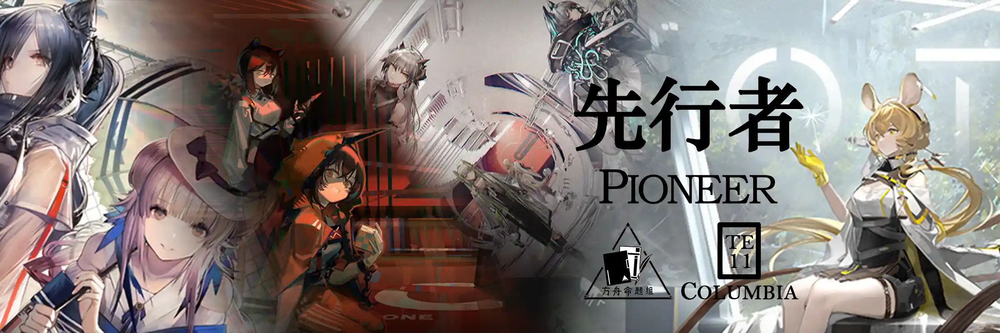
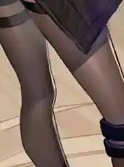
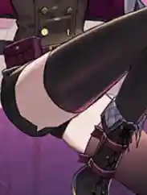
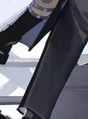

 {.centering}

如果可能的话……我更想成为一个起点。就像曾经……我注视着那团燃烧在天幕上的火光……{.centering}

——克丽斯腾{.aright}

<!-- more -->

**【1】在最近的新SS活动“不义之财”中，杰西卡获得了她的异格形态。但其实涤火杰西卡的立绘很久之前就出现了，请问该立绘最早出自以下哪一剧情中？**

A. 9-20 临近的暴风

B. 10-19 远方星火

C. 11-21 不可避免

D. 12-21 战场静悄悄

**【2】芙兰卡和雷蛇因为经常在剧情里拌嘴，也被称为“黑钢相声组”。关于她们的战斗特性，说法不正确的一项是**

A. 芙兰卡的天赋可以让她攻击时一定概率无视敌人的防御力，类似于真实伤害

B. 芙兰卡的技能“极致锋度”可以强化其天赋，但是会让她的防御力降至0

C. 雷蛇在精英一阶段前阻挡数只有2，精英一之后阻挡数变为3

D. 雷蛇是为数不多的自带2个天赋的5星干员之一

**【3】香草热衷于饲养源石虫等小动物，甚至还在出任务之前想拜托博士帮忙照看，但因为害怕宠物被博士吃掉而放弃了。香草最后拜托帮忙照看宠物的干员是**

|  |  |  |  |
| :---: | :---: | :---: | :---: |
| A | B | C | D |

**【4】目前所出现的和麦哲伦相关的剧情都和北方的冰原探险有关，可以说麦哲伦几乎是把自己全部的生活都奉献给了冰原。关于麦哲伦的剧情，以下说法不正确的是**

A. 在返程回到哥伦比亚的前一天，麦哲伦与寒檀首次相遇

B. 为了寻找失踪的玛丽老师，麦哲伦毅然孤身前往无尽冰原

C. 在其中一个部落里，麦哲伦因为擅自摸了族树并采样而被原住民指指点点

D. 在探险途中遇到河流时，麦哲伦通常用无人机牵引简易气垫船渡河

**【5】缪尔赛思和豆苗都是哥伦比亚出身的战术家，关于她们的战斗技能，以下说法中正确的一项是**

| | |
| :---: | :---: |
|  | A. 该技能在持续期间内持续恢复费用，且可以恢复近战流形的生命值 |
|  | B. 该技能只能增加流形的攻击力，但可以让近战流形晕眩敌人，远程流形束缚敌人 |
|  | C. 该技能会立刻获得部署费用，并立即刷新战术点中的援军，没有持续时间 |
|  | D. 该技能的费用回复点数不会随技能升级而增加，但持续时间会增加 |

**【6】白面鸮早年为了一次实验而把芯片植入自己体内，进而导致语言障碍，只有赫默愿意认真倾听她的声音。关于两人的干员密录剧情描述，以下说法中不正确的一项是**

A. 赫默和白面鸮都因为感染了矿石病的缘故，会有睡眠节律紊乱的问题

B. 白面鸮的学习能力非常强，能在短暂学习棋牌类游戏后完胜对手

C. 在赫默接手了对白面鸮的治疗后，莱茵生命内部就不再考虑为赫默安排别的任务

D. 虽然大多数人都不能识别白面鸮的表情，但伊芙利特却能轻松看出

**【7】哥伦比亚的势力范围其实很大，莱茵生命、汐斯塔、黑钢国际都属于其范畴。以下立绘截图中，不是哥伦比亚的干员的一项是**

|  |  |  |  |
| :---: | :---: | :---: | :---: |
| A | B | C | D |

**【8】游戏中第一个和哥伦比亚相关的Side Story最早可以追溯到“孤岛风云”。关于涉及到的干员档案，以下说法中不正确的一项是**

A. 山因为家族竞争对手的陷害而入狱六年，并且不幸在监狱里感染了矿石病

B. 卡夫卡通过赫默得知了罗德岛的存在，并为了治疗自身的矿石病而自愿加入

C. 松果是因为接受了卡夫卡的委托才被卷入了曼斯菲尔德监狱事件

D. 罗宾是为了父亲的治疗而加入的罗德岛，她最大的爱好是看电影

**【9】汐斯塔虽然法理上是哥伦比亚的一部分，但其夹杂在几个大国之间的复杂情况使其略显尴尬，并且在一部分问题上其市长也并不打算服从哥伦比亚政府。以下活动PV截图中，哪一个与汐斯塔无关**

|  |  |  |  |
| :---: | :---: | :---: | :---: |
| A | B | C | D |

**【10】关于其他哥伦比亚地区干员的战斗特性，以下说法不正确的一项是**

A. 石英作为重剑手，其防御力始终为0，但其初始攻击力和生命值仅次于铎铃，为游戏中第二高的

B. 杰克二技能的70%闪避和其天赋的30%闪避乘算，而且都是物理伤害闪避

C. 酸糖的天赋可以使其攻击时造成保底伤害，类似于红的天赋，都可以造成伪真实伤害

D. 蛇屠箱作为铁卫，其模组可以提升常态阻挡数，配合二技能再增加阻挡数，可以达到阻挡5的水平

{.image-left-float style="max-width: 20%;"}

*扫一扫二维码查看本期答案*

[点我也可以哟ヾ(≧▽≦*)o](https://www.wjx.cn/vm/wMLNNWE.aspx)<eod />

<FakeAds />