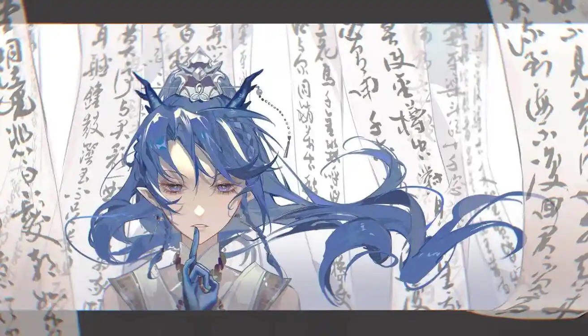

一杯酒，一首诗，一个梦，崖高梦远，繁花已逝，人间几度盼君归。{.textkai}

<!-- more -->

她于混沌之中醒来，身侧是梦的影子。梦里有人问她：“你是谁?”

---

这是她翻过的第一座山。

她下山去，闹市之中熙熙攘攘，有人家在办喜事，办了三条街的流水席，她走过来，便有人向她塞了一杯酒。

她饮尽，不同于她在之后的年月里品到的琼浆玉液，那只是一瓮埋在地下十余载的女儿红，寄托着父母最真挚的情感。如今女婴已长成娇美的新娘，羞着脸披上盖头掩进轿里，往来宾客觥筹交错喜气洋洋，你来我往，天上人间。

人间好啊，她咂摸一下，觉得很香，人间到处都是好滋味。

---

这是她趟过的第十条河。

诗人说，江南好，风景旧曾谙。她坐在他们之间，与他们一起饮酒，写诗，大笑作乐。可每次从挂满青丝罗帐的画舫中醒来，她总觉得不是滋味。

缺了点什么，她想。

她不再喝酒了，江南的酒绵柔，她醉不了，于是只能醒着，她睁眼看着屋顶，看着溪流，看着手中精雕细琢的杯盏，看着寻欢作乐的人们。

她不再作诗了。

她接到大哥的一封信，信里邀请她来看一看新的风景，大哥给迷惘的她指了一条路，她想，得离开了。

她趟过水，向北边去，向大漠黄沙深处去。

---

这是她杀掉的第一百批敌人。

温热的血溅到她的身上脸上，那是敌人的血，那是战友的血。

巨兽是不流血的，哪怕是碎片也一样。她与她的兄弟姐妹们不老不死不伤，直至某天那个怪物睁开它的眼睛——在此之前，她都是不流血的。

于是她冲在前面，于是那个夜晚，有人以为自己看见了仙人。一个小兵说他曾见过仙人白日提灯，灯亮之处亦是剑之所指，剑指之处三条大龙若隐若现。他说他看见那仙人一身白袍俯身落地，转头看他时，他问她打哪儿来。

自来处来，往去处去。她说，她们这群兄弟姐妹，都在找一条属于自己的道路。

戍北百年，说长也不长，说短也不短。她看见昔年的小兵长成大将，杀敌勇猛一往无前，她也看见，他致死都未曾明白她的那句话，直至最后脱力合眼，看见她站于眼前为他送行，才隐隐有所了悟。

人生一瞬，譬如朝露蜉蝣，而于长生种而言，究竟何为来处，何为去处？

仙人不语。

---

令妹，你怎么想的？

她看见远方的大哥也在含笑问她。

当有一天大梦初醒，我不再是我，我们不再是我们，令妹，你是怎么想的?

---

……我是怎么想的？

她饮下一口酒。

她想起自己喝过的第一杯酒，那时她挤在人群中，扭头去看来路，发现人来人往，山色稀疏。她想起自己作过的第一首诗，那时曲水流觞过晚亭，人群喧闹，碧空渡过一阵飞鸟。她想起自己杀的第一个敌，那时战友在她身侧，鲜血溅于五步之前。中秋十五，大漠黄沙月正圆。

---

她于混沌之中醒来，身侧是梦的影子。梦里有人问她：“你是谁?”

 {.centering}

而如今，她发现万里山川皆故人，故人于她的一颦一笑之间惊鸿乍起，俶尔消失不见，徒留一杯酒，一首诗，一个梦。

崖高梦远，繁花已逝，人间几度盼君归。

（责任编辑：瑶濯；网页排版：武乙凌薇；绘图：二伍得十）

<FakeAds />