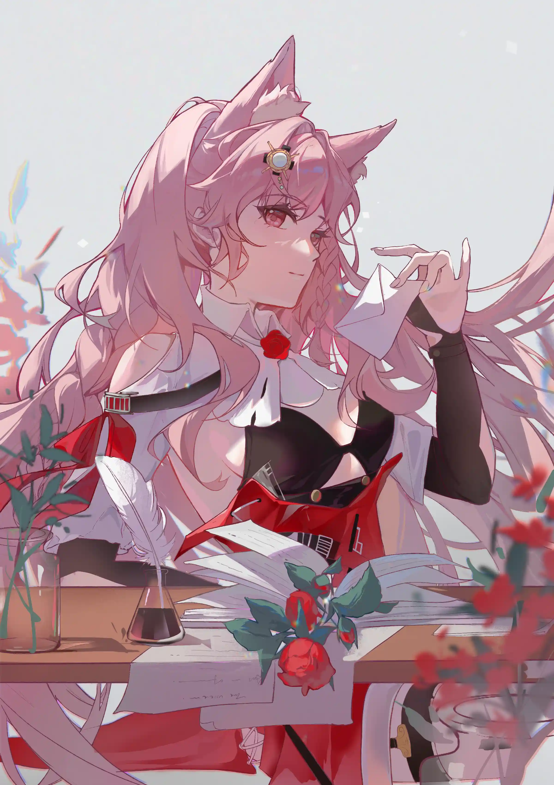

人成长的一个重要节点，便是不再被局限于自己的世界.{.textkai}

她意识到这点，是在一个大雪天的花园{.textkai}

<!-- more -->

雪之所以是雪

小鲁珀从遮阳伞里探出头来，小心翼翼地捧起后院中从天而来的雪花，看着它在手套传来的余温中一点点融化，这让她有些失落，叹出的气卷为一朵洁白的云。她喜欢向天空吞云吐雾的感觉，所以每逢冬天，都要把上课的地方定在冰寒的后院，自己则裹上厚厚的绒衣。

“阿芙朵嘉。”

老师用尺敲了敲面前的餐桌，她另一只手里正拿着摊开的课本。

“乌萨斯以外的地方也有雪吗，老师？”阿芙朵嘉瞪大眼睛，朝灰白的天空望去，“其他地方是不是也能看见群星、月亮和太阳？”

“是的，伊万诺娃家的好女孩，你猜的很对。”阿娜斯塔西娅轻轻叹了口气，然后摊开书，“那你想知道为什么吗？”

“想！”

刚说完，头顶便挨了书本一敲，她缩起身子，两耳垂下。

“那就仔细听我讲课，这样今晚吃饭时我还能有时间给你解释几句——所以现在给我立刻坐好，我可没敢用力敲乌萨斯的公主殿下。”

“可我会说乌萨斯语，阿纳斯塔西娅老师！”刚还缩成一团的鲁珀忽地炸了毛，愤愤不平地用两手拍了拍面前的桌子，面前已经放凉的红茶被震倒，洒了一桌，“明明我会说，为什么我还要上语文课，而不是去听父亲说起今天在乌萨斯又见到几个内卫几名将军，今天乌萨斯的领地又往前推进了多少，萨米的女巫又卷走了多少人命——”

“乌萨斯不止内卫和战争，阿芙朵嘉。”

阿纳斯塔西娅从衣兜取出手帕，轻轻擦去桌上快速结霜的茶渍，“外人也许都会误以为我们只靠战争起家，但我们有我们的语言，我们有我们的文化。”

她顿了顿，取出一只钢笔和一张纸，在上面写上自己的名字。

“你知道这是什么意思吗，阿芙朵嘉？”

鲁珀摇了摇头。

“是‘打开监狱的人’。”

“监狱？”

“是的，监狱。”乌萨斯终于长舒口气，她终于想明白怎样能勾起这个女孩的好奇心了，“我的父亲曾禁闭过一群在切尔诺伯格从事工作的感染者，后来为了庆祝我的降生，他们获得了特赦。”

“于是他说，你是打开监狱、放走罪犯的那个人？”

阿纳斯塔西娅不自觉地握了握袖口。

阿芙朵嘉的插问却没能立刻得到回应。她好奇地看向她的眼睛，却只看见倒映在瞳孔中的自己。

“……他们不是罪犯。”乌萨斯低声呢喃着，旋即展露笑颜，生硬地岔开话题，“——总之就是这样，乌萨斯的每个词语都有它的意思。”

说着，她在纸上写下另一个词。

“你知道‘阿芙朵嘉’又是什么吗？”

鲁珀诚实地摇了摇头：“我被生下来的时候，并没有发生多么轰轰烈烈的事情，所以父母也没特地跟我说过它的意思，只是要求我多读书。”

“是了，多读书。”阿纳斯塔西娅温柔地笑了笑，捻去女孩耳尖立着的一片雪，“乌萨斯虽说在外来者看来是个野蛮的国家，可我们拥有着这片大地最宏伟的移动藏书城，我们拥有最高的识字率和人均阅读量。我们明明靠战争发家，为什么我们需要说话，为什么需要读书，阿芙朵嘉？”

鲁珀毫不意外地愣了半晌。她平时更愿意眺望远方的雪山，更愿意去数天上正在乱窜的群星，但从没想过嘴里为什么总在吐出乌萨斯语。

乌萨斯的大手拂过她那簇淡粉色的发际，老师正在为学生梳理刘海，好让她愣神的样子更可爱些。

“你知道萨尔贡吗？”

“知道的老师，是群野蛮人的国家。”阿芙朵嘉终于听到了自己能回答的问题，当即开口。

{.image-right-float style="max-width: 40%;"}

“书上是这么写的吗？”阿纳斯塔西娅眨了眨眼睛，但没有在意，“咳咳。的确，萨尔贡曾经是群只会以动作作为交流手段的部族。他们用拳头说话，用长矛打猎，用舞蹈表示情感……但部族不止一个，祭祀的舞蹈所表达的意思没有统一，所以他们总在打架，雨林里他们乱成了一锅粥。”

“萨尔贡人也会跳舞吗？他们也会跳华尔兹吗？”爱美的女孩发现了关键词，迫不及待想知道答案。

“哼嗯……也许会，我没实际去过那片雨林所以不清楚。”阿纳斯塔西娅轻咳两声，继续自己的叙述，“打破这样现状的是在百年前，伊比利亚那时还是海上帝国，他们的战舰从萨尔贡东海岸登陆，尚是一盘散沙的萨尔贡人很快就被俘获、奴役，毫无战力可言。”

“那他们怎么——”

“直到第一位王酋的出现。”

“王酋？”

“是的，王酋，类似我们的王室。”老师斟酌了一会词句，“王酋将自己能找到的萨尔贡人聚集在一处，一同学习他刚编绘出的文字。这种文字在萨尔贡人间口口相传，萨尔贡人终于能说同一种话。于是他们终于能交流，他们终于能制订战术。在天然的地理环境优势下，他们组织了多次伏击、拦截，最终将本就水土不服的伊比利亚人赶回了他们的船上。”

“他们也会军事？”阿芙朵嘉讶异地眨了眨眼睛。

“正因他们会，所以才有了最初的萨尔贡王国。”老师倒了些红茶给自己和阿芙朵嘉，用源石能维持着温度的茶液散出轻飘飘的白雾，“这位王酋在这场战争里所用的文字后来逐步统一为如今的萨尔贡语。从这时候起，这片大地才有了真正的萨尔贡王国。”

“为什么这会才是？”

“语言，阿芙朵嘉。”老师轻轻说，“语言才是一个国家的根基，是我们能说同一种话的前提，是我们能互相理解的前提……是我们之所以是乌萨斯人的原因。”

鲁珀张了张嘴，却仍想不出该说什么。她有很多想问的事，可她没有能将所想化为语句的东西。

“我们再看看你的名字，阿芙朵嘉，你名字的意义。”‘打开监狱的人’轻轻点了点纸面上的文字，“它的意思是‘真理’，鲁珀，你的父母，渴望你能自己寻找这片大地的答案。”

雪渐渐大起来，遮阳伞已然不足以遮蔽花园下的两人。

“走吧，阿芙朵嘉，”老师站起来，将鲁珀的手捧起，好让她能握住赠予的钢笔，“我们一起去找答案，雪的答案，群星的答案，源石的答案……这片大地一切的一切的答案。然后，我们写下来。”

风愈发大起来，鲁珀看着老师袖下的手腕，笑开了花。

那里盛开着一朵源石勾勒出的花。<eod />

（责任编辑：瑶濯；网页排版：武乙凌薇；绘图：x穆可x）

<FakeAds />