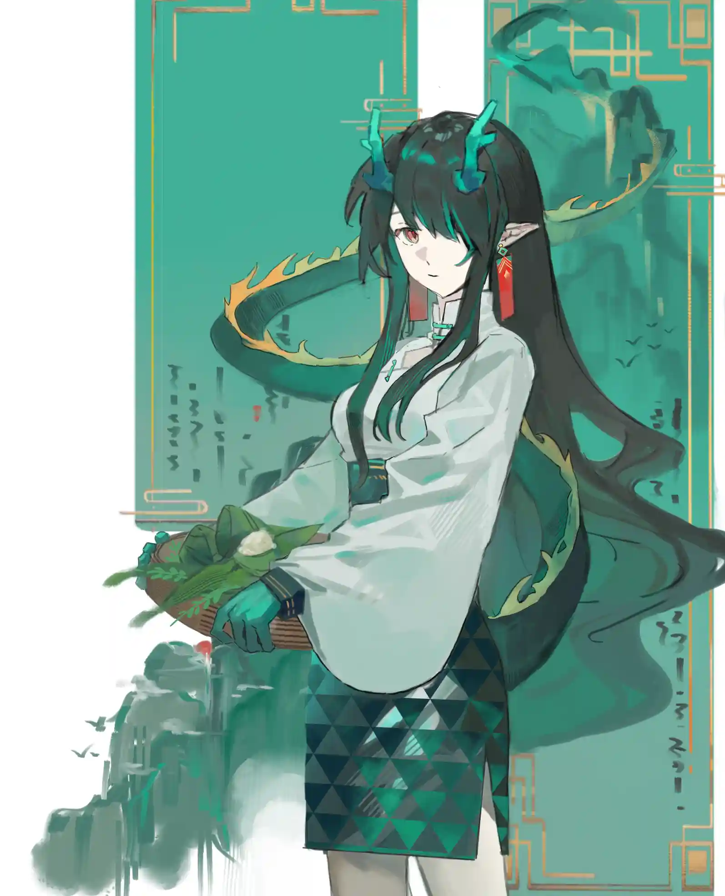

出生时裹于金之襁褓，青年所身披青蓝外衣{.textkai}

将老是一身荣华红火，所绘不过以笔墨丹青{.textkai}

<!-- more -->

## （一）

{.image-right-float style="max-width: 60%;"}

烟云浩渺，笔墨丹青。画中拙山尽，窗前唯余一人、一卷、一砚台而已。

泼墨长卷前，一位少女模样的画家席地而坐，正一丝不苟的涂画着这副奇长的画作。画卷异彩纷呈，星罗棋布。寥寥数笔便涂抹出了山水之意。

少女身侧，搁置着数不尽的拙墨、废稿，与各类色彩堆叠，摇摇欲坠，几乎要把她单薄的身影淹没。而她仿佛熟视无睹，只是兀自一人在巢穴中继续着自己的画作。

一人一卷一砚，一窗一屋一田，一日一夜一天，一期一月一年。

树影稀疏，一片黄叶从她窗前飘落。——此时，画中枫红桂金、硕果连田。

天寒地冻，一片落雪从她窗前飘落。——此时，画中银装素裹、白雪皑皑。

万物复苏，一片桃花从她窗前飘落。——此时，画中姹紫嫣红、欣欣向荣。

岁月不居，时节如流。而那位坐在窗边作画的人不变，直到三季转过。少女才搁下笔，从自己的一方天地里朦朦胧胧的抬起头。

酷暑难耐，三更鸣蝉。原来早已是入夏时节。

## （二）

我出生在一个山脚下的平凡小镇，镇里的房子和田地都杂乱无章的生长着。春暖花开时，家家户户屋檐边总会青翠一片。

我记得，家边上是一座当铺。当铺的账房先生，穿的都很漂亮，文质彬彬的。小时候我想过，也想当个账房先生。

每到逢五逢十，家边往东六里地就会有很多人来做买卖。当时，我经常随着父母到那边赶集。

当时的我坐在父亲的肩头，回回都只顾着看花花绿绿的新奇玩意。然后不知不觉就睡着了，醒来时坐在回家的驼兽上。

随着年岁渐长，家中的大小活计都拦在了我身上。父母见我能干，便放心也将各种事情交给了我。于是，十二岁那年，我就牵着自家驼兽赶那逢五逢十的集会。

集会上，摊位通常不固定。于是，为了买上必要的某样东西，我通常要逛遍整个集市。一个小姑娘，一只壮驼兽，走走停停，也就消磨了半天光阴。

有那么好几次，我赶集的路上，看见一个画家在地上画画。

那画家约莫十八九岁，长的特别漂亮，穿也的像账房先生样。她在人来人往的地方，不摆摊，不买卖。拿根毛笔，面朝西边，在青石路上画我家边上的那座灰齐山。

每每画完，墨水还没干透，她就泼一盆水把画洗净。然后第二天准时准点又来画，人还是那个人，画还是那座山。

女画家每次作画，都会吸引一大批人来观看。我虽然从没离近看过，但我听说她的画技超凡，有好几个江南名流千里迢迢来看她。——但不管任谁搭话她也不理，真是个怪人。

我还听说，画家虽然不搭理人，但她会向所有主动来看她的人提一个问题：

“你可看出，我画的是什么？”

答案显而易见啊，我前面也说了，她在画西边的那座灰齐山嘛。

于是很多人也是这样答的，女画家也不说是对是错，总之，她听到答案后就再次变成了哑巴，什么也不肯说了。

真是怪人。

所幸，因为这位画家，本来只是临乡的小集人流与日俱增，慢慢的十里八乡得人都会来参与。这样一来，我也难免对这位画家产生了兴趣。

好不容易，我挤进了人群，有幸得到了近距离看她作画的机会。——同样的，她也问了我那个问题。

一开始，我凭着之前在远处匆匆一瞥的印象，也觉得是“灰齐山”。但这次我牵着驼兽得近观赏，却瞅出来点不一样的东西来。

我感觉她在画……一只眼睛？

我是怎么从山水画里看出一只眼睛来的？我说不上来，画里面也没有任何能像是眼睛的东西。但我就是有这种感觉。

因为，我见过这样的眼睛。

数年前，我家收成不好。父亲便想牵来家里那瞎了一只眼的老驼兽卖去汤锅，换一笔救急的柴米钱。

结果不知怎地，收肉的贩子晚了几个星期，独眼老驼兽也就关在畜栏里等卖。它当时常常扒在栏边，独眼瞅着路过的人。它的眼睛也是这样的眼睛。

于是，我便按照心中所思回答。女画家也没什么表示，说了句“原来如此”。我们之间便没了交流。

只是自那之后，我好像就没见过画家来这画画了。

后来，又过了几年。

我住的镇子被天灾侵袭，房屋倒塌，田地被毁，我家和一众乡亲不得不举家搬迁，踏上流亡的道路。

自那之后，一切都变了。

我见到天灾的肆虐、流离失所的乡民、化作废墟的家园。我见到平日里和和睦睦的邻居为了一块发霉的干粮大打出手，我见到父母有那么一瞬间想抛下自己的眼神。

那年我十五，按道理是岁月如梭的年纪。但我感觉之后所有的人生都没十五那年长。

再后来，那一天到来了，我知道它早晚会到来。

我在流亡的路上生了病，被乡亲们抛弃了，那天是我的十六岁生日。

我躺在荒郊野岭，呆着眼望着天上有食腐的乌鸦盘旋。它们几次想要俯冲下来啄我的血肉，但又讪讪缩回。似乎在忌惮我的临死反扑。

它们多虑了。现在的我连一点反抗的力气都没了。

我想起了画家作的那幅画，想起了那只栏中等死的驼兽。

它们的眼睛，那只悲哀的，冰冷的眼睛。恐怕，我现在的眼睛也是如出一辙吧。

我怔怔的看着俯冲下来的乌鸦，脑海里却在不断浮现那位画家笔下的山水。

然后，我醒了。

我醒来时，躺在一片山石上。四周重岩叠嶂，古云飘渺，已不是勾吴地界。原来，不过是我做了一场关于过往的梦罢了。

我被人救了，救我的是当年的那位画家。

她姓氏名谁？来自何方？何种来历？我一概不知。那之后，无处可去的我就留在她身边，陪她看山水，陪她走旅途。

她走遍天下，每到一地，便会画下当地的景物。

我陪她行过尚蜀山城，见羊肠小道从三山十八峰横过，万千灯火自悬崖峭壁间亮起。

我陪她来过姜齐蓬莱，见仙山烟云，神话历史化作街头巷尾的故事，嚼着一只扒鸡就能消磨半天光阴。

我陪她去过京城，看天子大祀苍生；我陪她走过中原，亲历过战场折戟、先民遗风。

 我用我的少女岁月，陪着她走过大炎山水。

 一人研墨，一人作画，如此便是十个春秋。

十年过去，我已长大成人，她却还是那副十八九岁的模样。

她神通广大，不知用了何种法术。总之，只要是被她画下的事物都能自成一方天地。画出来的水是流动的，太阳是发光的，饭食是温热的。

进入画中世界的人，除了被她主动放出，就只能自己意识到画中世界的虚假。——实际上，画中世界有自己的运行法则，误入其中的人很容易就能觉察到这并非现实。

但，面对一方栩栩如生的小天地，你又该怎么说服自己这里仅仅是一幅画呢？

于是，这十年来，很多误入其中的人终其一生也没能出去，就这样成了她的画中人。

她的画里有一副难得的不是山水，而是画了一个不名状得生物。

她画了一只巨兽，须靛似林，骨峭如石。

云涛微茫，巨兽隐没在青白身形里，暮沉色见，山峦样的脑袋后有一夕晃过。

笔下生花，言为心声，字为心画。

她不善言辞，千言万语都藏在墨中。笔走波澜画，同行的这些年，我阅历过不少她的画卷。

我做过很多次她的画中人，见过许许多多不同的自己。她们或高洁或卑劣，或富有或贫穷，不知不觉就过完了一生。

但最后不管是怎样的我，长梦醒来，我终究也只是在山石上睡了一觉罢了。

这一次，我化身之前，却先成为了一双眼睛，以一种怪诞的方式看着自己的前世今生。

我见天地混沌，荒芜久远的大地上有了神明存在。

祂只记得上下失形，万象瞢暗，但沉睡醒来，大地上居然长出了文明。

人类于荒蛮中摸索秩序，最终“炎”为这片土地命名。

国业初肇，又因为真龙天子的早逝而陷入混乱。祂聊作吐息，作弄了战争的结局，让如今的天子获得了胜利。

而见微知著者，唯有真龙。

真龙觉察到了胜利的蹊跷，觉察到了头顶的庞大阴影。

而炎国的未来，从不在一个“神明相助，天命所归”的传说。

披荆棘，分节序，理荒晦，辟四野。渺小的生灵不屈不挠，往来奔走，试图撕开云翳。

又一个丰收之年，炎国各地如期举行祭典。祈祝收成，敬馈神明，一如过去的数百年。

祭祀者列阵游行，叩祷者藏锋于内，

——所谓祭典，竟是一场惊世骇俗的围猎。

佑序有炎，大狩维天。

人类操戈向神，而最为荒唐和传奇的事情是，真龙见到的第一位神明“岁”分化了自己的权能，居然也参与进了这场“猎神”中来。

……那确实是一场真正的战争。

伏尸百万，血流千里。这位后世极具争议的青年皇帝御驾亲征，引得无数奇人异士也参与进这场猎神运动。

而当真龙垂垂老矣，这片大地上残留的，最后一个神明，也就是当年帮助过真龙的那位“岁兽”出现在真龙面前。

愤怒的，不解的，残存的同族。在离开炎国之前，摧毁了岁的气焰，让这个叛徒的本性暴露在帝王之师面前。

总之，功过相抵，真龙饶祂不死，但是他必须向神龙臣服。为天地立心，为生民立命，为往圣继绝学，为万世开太平。

自那之后，神权君授，炎国的命运，尽在大炎子民之手。

名为“岁相”的神明分下自己的碎片，让他们代行人间。

而这些碎片，一共十二枚。其中一个也就是此世的我。

最初，我们十二人宛如初生的婴儿，一开始免不了会相互争斗，但打久了总是会累的。

直到某天、某时、某刻——

我们中的一人想明白了一些，回答出“我是谁”的问题，这第一人也就成了我们的大哥。

之后，我们兄弟姐妹十二人也找到了在此世的归属，习武、习锻、习诗、习医、习法。

有的人戎马边疆，有的人隐居避世，有的人悬壶天下。

而我，选择遨游天地，行过四方，当个不善言辞的画家。

我是岁家十一，十二人中的幺女。能泼墨成物，点睛成龙。

此世的我，辞别了一众哥哥姐姐，独自一人绘着自己的画卷。

我见过奇人斗法，御剑凌空；我见过飞瀑逆流，山岳移形。

我见过有人七步成诗，却拖棺面圣；我见过有人精明算计，却众叛亲离。

我见过北悬巨石，某位先帝登基时有巨石升空。起初被当做祥瑞，后来又因为“如有重负”的说法被人当做噩兆。

我见过高山仰止，天灾遗迹下有一棵参天巨松傲然而立，足矣劈开山石，探入云间。

这岁月里，与我同行的每一个人。在询问我的姓名时，我都只能听到自己嘴里模糊的声音。

确切的说，这一世的我刻意隐去了自己的名字。

最后，我见到炎国战火纷飞，礼崩乐坏。

我走到哪里，都是满目疮痍，民不聊生。

许许多多的人误入了我的画境，就不愿离开，做了一辈子我的画中人。

……我的姐姐，岁家三女，字字成谶的颉。也在此时消亡了。回归了本体。

我等众人皆是神明碎片，技艺各绝能引大道气象万千。刀枪不入，寿同日月。可三姐的死亡，战火的景象，却让我不得不正视起来这个问题。

“我们”终会消亡。当岁兽苏醒，我们十二人也会重回混沌。

你可能会问，既然本就是一体的碎片，那即使重回一体，自己不还是自己？

但是，你把一瓢水倒入江里，又怎么能舀起来同样一瓢水呢？

我恐惧万分。于是，我决定把自己封入画中，依此来对抗自己的死亡。

但不管怎么说，我始终是眷恋这这一方天地的。

于是，在入睡之前，我决定穷尽最后的岁月，完成一副举世无双的画作，将山河万千带入我的梦中。

……这第一笔，该画什么好呢？

我摊开宣纸，惯于勾线的手却不由自主的动起来。

我画了自己。

一只青白巨兽，天地是它的暖床，山河是它的被褥。

它就像是一个害怕被抢夺玩具的孩子，盘踞在巢穴里，硕大的眼睛紧紧盯着画外。

它的眼睛，高高在上的、冰冷的、孤独的眼睛。甚至比被父母遗弃，在天灾边缘等死的我还要悲哀，莫大的悲哀。

巨兽的脑后，有夕阳闪过。

也就是在这时候，我灵光一闪，回忆起了自己的名字。

长河落日，有兽如林，日暮西山。

是啊，我叫“夕”。

夕就是我的名字，画家的名字。

万千过往，也不过弹指一刹。

跌落百态人生，苍茫画卷里尽得百味。

看山是山，看水仍是水。我自来时便是我。

水月镜花，也不过祂的一场大梦。

一眨眼，我脱出了夕的画境，回到了现实。

我仍是那个被画家救下的凡人，在夕画境中经历的种种，也不过是过往云烟罢了。

黄粱一梦，刹那昙花。归来看去，山水仍是山水。

也就是在此时，我向夕辞别。

镜中花，水中月。我终是不能一辈子做她的画中人的。

## （三）

白云日照，薄雨西边。

与那位少女辞别后，夕独自离去。继续着这张举世无双的画作。

她以神明几乎无尽的悠久寿命，精雕细琢，从笔墨纸砚开始，一步步完善着自己的作品。

夕先是用二十年岁月，游历大半炎国，一边采风，一边收集着作画用的纸张。

她每到一地，就会选某个角度，采下当地被她认为是奇观的风光。就和当年在集市里做的一样。

她去过西北大漠，走过玉门关旁，画下边疆城楼炮火、征人行军。

她去过凛冬雪壤，自山岭沿脉一路极北，画下夜空灿烂，白夜极光。

她去过殷墟商都，看熙熙攘攘，利往利来，画下万商俱来，百家兴旺。

她在江南画雨，一只青蛙跳上了她的画笔，于是她随手一描，将那只绿色的青蛙也画进了卷中。

她在闽南画海，一个孩子捡着贝壳误入她的视野，于是她将错就错，把那个海家少年也染成了丹青笔画。

最后，她来到此行的目的地——徽州。

夕亲自上山，从选料开始，取走了百年檀木主干上最坚韧的枝条。

她又找到当地最优秀的匠人，粉碎、漏筛、压制……亲历每一个步骤，精雕细琢，终于得到了她想要的纸张。

然后，她又花五十年采集色彩。

取来产自闽南的蚌壳，捣碎研磨，高温过筛。三番制作后，就成了点缀月色的珠白。

采集山川精脉的孔雀石，熬煮水飞，沉淀风干。挂在房梁上冷却一周后，就成了天穹乾坤的靛青。

摘走农家门前的槐豆，采择剥离，蓝矾配比。与熟石灰混合深浅，就成了秋日丰收的明黄、夏日蚕桑的鲜绿。

最后，寻到田野新长的墨果，烟灰点灯，熏染压制。倒模切割后，就成了勾画万千的黑墨。

穷尽七十年岁月，取天穹为青，舀江河做绿，寻日出烈阳制赭，采西方明霞成紫。

以天地为纸，以灵魂为墨。

她收集了一张最柔韧的宣纸，数百种天然手作的色彩，千百副来自炎国各地的风光。

一切准备就绪，这副举世无双的画作，也终于是要动笔了。

可就在这时，夕停下了。

因为，当年那位看破她画中真意，与她同行数十年的少女，已经垂垂老矣，大限将至。

……夕来到了她的病榻前。

这七十年来，夕其实也在默默关注着她。

这位少女，在辞别夕之后。回到了勾吴，在灰齐山麓附近的一座城市里定居下来。

在相处的十年间，夕教过她画画，也曾赞美过她卓越的天赋。

可让夕感到疑惑的是，那样天资聪颖的少女，却在与她分别后一生都没执笔。

她养了几只驼兽，靠着赶集为生。年逾百岁，膝下无子，就那样平淡得度过了一生。

面对夕的疑惑，她只是含笑道：

“遇见你之后，谁又敢自称画家呢？”

她们初见时，她不过十五六岁。夕看着她从豆蔻少女到风华正茂，又见她从如日中天到垂垂老矣，再到行将就木。

而夕自己还是那副十八九岁的江南少女模样，一如初见。

她躺在病榻上，布满皱纹的手握着夕白皙的指尖，向夕提了一个问题：

“夕……你阅历万千。见过无数奇人异事，山河风光。”

“你说我这一辈子……幸福吗？”

夕，默默无言。

接着，夕问她有什么愿望。她想了想，回答道：

“夕，你画技超凡，是我平生见过最高超的画家。”

“你能帮我……画出我的故乡吗？”

“七十多年过去，我对故乡已经没有什么印象了。”

“只记得那是一座山脚下的小镇，镇里的房屋和田地都杂乱无章的生长着，家家户户门前都种了桑树。”

“我家边上就是一座当铺，里面的人衣着都很华丽。我小时候最大的愿望就是当一个账房先生……”

夕什么也没有说。

她记下了她的愿望，然后独自离开了。

因为，岁的苏醒迫在眉睫，而她的画作也需要完成。

夕就近在灰齐山麓住下，闭门不出，进行着她的画作。

她以长生种悠久的生命，时间沉淀的技艺，无数次精雕细琢得到的画境，

泼墨山水，完成着这一副前无古人的画作。

她画出了连绵群山，飘渺古云；画出了翻江倒海，一水千行；画出了万家灯火，天街人来；画出了金戈铁马，王旗变换。

她画出了西北的黄沙，江南的烟雨；画出了东北的白雪，闽南的海滩；画出了川渝的山岳，中原的麦田；画出了京城的红楼，沪州的商都……

前一半的画作花费了她三十年时间。

而后一半的画作，用了足足五十年。

面对最后完成期限的到来，她开始有意无意，用根本没必要的精雕细琢，拖延着作画的进度。

明明她早已走遍大炎各地，明明她早已看遍人间种种，明明她早已对长眠无比渴求。

可，我到底在恐惧些什么呢？

伴着这种没来头的恐惧，画家恍惚间，在纸上画了一只眼睛。

冰凉的、高高在上的、悲哀的眼睛。

她自诩神明代理，行走世间泼墨山河，偶然与人类产生联系，也只是将人间当做自己任意涂抹的画作。

故事太长，人的寿命又太短。往往一个念想就能贯穿了他们的一生。

无数入她画意者，往往都迷失在其中，将画作当做真实世界，懵懵懂懂过完了一生。

而这执笔者，又何尝不是某人的画中人呢？

白驹过隙。

七十年筹备，八十年作画，一百五十年过去。

夕的画作只剩下最后几笔了。

她隐居的小屋中，早已布满了一百五十年来的拙墨废稿。层层堆叠，杂乱无章的交织在一起。已经成了一座漫山画意的宏伟山脉，给人废土残垣般的窒息感。

而那个身材娇小的、少女模样的画家，就那样几乎不动的坐在山脉下，一丝不苟的继续着她的画作。

……荒凉而孤寂。

如同一百五十多年前，她在灰齐山下画的那只眼睛。

即将落笔时，夕却忽然一顿，

她想起了那位故人的愿望。

于是，她于一处瀑布中间停笔，在那里驴头不对马嘴的画上了那座本应该在山脚下的小镇。

她按照她的描述，画出了错落有致的房屋，画出了零零散散的田地，画出了她记忆里存在或者不存在的乡亲，甚至、画出了她家边上的那座当铺……

然后，该把故人自己也画上去了。

于是，夕按照自己的记忆，画出了故人的身形、画出了故人的衣摆、画出了故人的鬓发……

最后，该为这位画中人添上五官时，

夕，却停笔了。

因为，她忘记了这位故人的长相。

距离她们初次分别已经是一百五十年过去，夕脑中还唯一能剩下的，就是那个最后见面时，人老珠黄的她。

她画遍了山河万千，画遍了每一处细节，却独独连一副她的画像也没留。

于是，她只能按照故人老年的相貌，一点点还原出她的眉眼。

可这终究不是她最真实的模样，不再是她们同行的少年时光了。

如果，早几年画她，

或许，就能记得什么吧。

——刺啦一声。

夕把故人的故乡，那座小镇从瀑布下撕下。

然后，哐当一声。

她没有补好残缺的画卷，只是丢掉了手中画笔。漠然收好了两幅画，转身离去。

人兽殊途，仙凡有别，恨只恨不得长生。

## （四）

一位来自东国的僧人，离开家乡云游四海，想要游历世间。搭乘的船只却出了海难，阴差阳错的来到了大炎。

本着“既来之，则安之”的原则，他便开始了在炎国的游历。

那一年，炎国大旱。

举国上下，饿殍遍野，尸横遍地。

……哀鸿遍野。

年轻的僧人，一步一顿，口中念念有词。

他从那饿殍遍地的荒野里走出，花了三天三夜。

磨破了脚，饿昏了头，诚心祈祷了四千二百八十七次。

终于，晕倒在江边。

醒来，发现自己被一位十八九岁模样的少女画家所救下。僧人便跟在画家身边，与她同行数年。

就如同，当年的那位一样。

只是僧人无那人一样玲珑的心思，自始至终，僧人都只是把画家当做神明敬畏，从没敢问她的名字。

数年过去，他松垮的袈裟已经合身，挑不动的行囊也变得轻松。

画家把僧人送上了回国的船只。

僧人站在船上，默立良久。

终于想要鼓起勇气，询问恩人的名字时，

他醒来了。

他还是在那个江边，身上还是松垮的袈裟，肩上还是挑不动的行囊，只是手里多了一副名为“拙山尽”的画卷。

画卷烟云浩渺，画中景物异彩纷呈，栩栩如生。虽是在深秋时节，他仍然感受到那其中浓浓的夏意。

只是，这画卷画到一处瀑布，却忽然停笔不画了。

僧人百思不得其解。

几十年以后，回国的僧人当了寺庙的住持，他一生未婚，但收养了很多无家可归的孩子。

那《拙山尽》的画卷，僧人仍时不时来猜想琢磨，却不求甚解。

待到他行将就木之时。

回顾自己的一生，想起少年时代与那位仙人画家的相遇，

恍然如梦。

病榻前，他出现了是真是假的幻觉，似乎看见了那位画家的身影。

这么多年过去了，自己已然从青葱少年，到行将就木。而她仍是那副十八九岁的少女模样，一如往昔。

僧人仿佛参悟了什么。

他提笔，在那副《拙山尽》的画作下，添了一字。

《拙山尽起》。

烟云浩渺，笔墨丹青，画中拙山尽起，窗前唯余一案一笔、一砚台而已。

——只隔一夕。<eod />

（责任编辑：瑶濯；网页排版：武乙凌薇；绘图：麻辣甜甜圈）

<FakeAds />