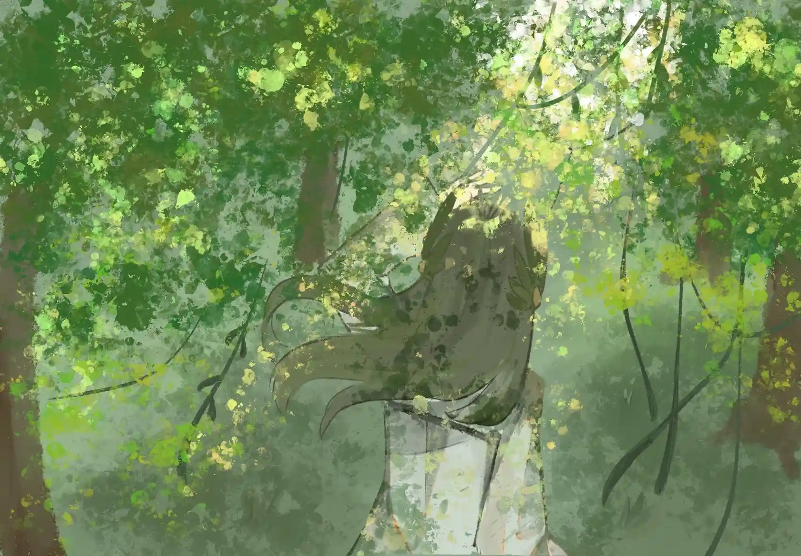

她搅动着潮汐，搅动海中被暗礁藏匿的一切{.textkai}

涌动的水分子推搡着把一艘破船推起，{.textkai}

水一点点从他庞大又年轻的龙骨间冲刷而过，{.textkai}

风把帆高高扬起。{.textkai}

<!-- more -->

## 第一卷

### [章]Bedtime story

　　博士，在我沉沉睡去前再和你讲个故事吧：

　　在一片日落的山谷下，有一群水精灵在森林里悠闲自在的生活着。突然有一天，一位国王经过这里，他站在甲板上着振臂高呼道：“我们即将由此踏上一条光辉的使命，就此进发，我们将从此迎接我们辉煌的过去。”

　　国王震耳欲聋的演讲激起了船员的激情，他们撒下了玫瑰的花瓣，直待阳光从黄金之船前的女神面颊旁前四散开来。

　　水精灵即便在多年后，在面对一片贫瘠的水潭前也会回想起这段引人向往的记忆，即便她甚至连什么是过去都不明白

　　她曾试图问过一些自认为聪明的人，但他们所说的答案总是模糊不清。她问森林里的参天古树什么是过去，他回答道：“我即是过去。”；她问天空落下的天降雨露，他说：“天空就是过去。”；她问山谷的娟娟细流，她说：“水滴就是过去。”

　　于是，水精灵把森林里的所有的生命都问了一遍，可依旧不明白什么是过去，过去就像日落时山谷的尽头，以模糊的状态存在记忆里。

　　直到有一天，水精灵闯出了山谷外。她顺着小溪走出了很远很远，曾经她赖以生存的家原来只是小小的一片，她被外面的美景所吸引，于是跳进了汪洋大海中。

### [章]Under the clouds

　　缪尔赛斯得知自己水精灵的特殊身份是个阴霾天，空气中十足的粉尘味昭示着暴风雨前即将来临的消息。

　　她很少体验这种感觉，身体孱弱的她被孤儿院的偏僻保护得很好，孤儿院的院长也因她的聪慧对她关爱有加，锅炉房的热水她第一个体验，用餐桌上的面包她第一个品尝，连床位也是一个靠近窗边的绝佳位置。

　　但她还不想回去，因为游戏还在继续，她不想就此认输。

　　孤儿院的孩子们可以玩的游戏并不多，可以一起玩的更是少之又少，其中最受欢迎的便是一人扮鬼的捉迷藏，场地是孤儿院不大不小的院子，参与者可以是每一个想玩的孩子。那天缪尔赛斯第一次体验当鬼，她感觉压力山大，不光是因为她极少参加这类活动，更是因为自己病殃殃的身体。她在同伴的几度推选后可犹豫再三，最后还是接受了这份使命，却不知道同伴只是想借此甩开一个小团体外的游戏者。

　　短暂的白色闪光后雷声姗姗来迟，好像是一队默契为零的冤家对头给自己的倒计时，不断提醒她拼尽全力，她在院子里左探探右找找，还是不见一个人的身影，只有院子西北的那不规整的树林看似可疑。

　　于是她在没颗树下耐心地转圈，假想着某个调皮的机灵鬼无时无刻的躲在自己视线的对面，她先是快速的跑，希望能追上，后来又突然掉头，来个出其不意。

　　等她累倒在草地，只有风刮起叶片的沙沙声嘲笑着她，一片叶子落在她的脸上，她笑了一下，想到了严厉的苏珊老师夜晚遗留的吻，她调皮地把叶片举过眼前，喃喃自语道：我还不想睡觉，老师。

　　她再次起身，可直到雨滴哗哗直落却仍不见一人。但她很倔强，也很有活力，她蹦跳在院子内的各类游乐设施间，品尝春雨落下的新鲜空气，本该因雨水而下垂的短发在雨幕间被悄悄撩起，雨水流进螺旋的耳蜗间讲述它在云朵间的自由旅行，而后水流又顺着她的白色裙子为其锈上一条条飘带，她便宛如公主般亲临初春的万花丛中。

　　她不禁哼起小曲，雨滴也随身附和，屋檐滴下沉重的低音，水洼激起悦耳的乐意，她借着自然的乐曲把歌唱向高潮。那刻花朵始露出黄色的花蕊，把花香扑进她的鼻腔；小草始冒出的嫩绿身躯，温柔抚摸她水灵的肌肤；万物始展现它们全新的模样，逐渐覆盖记忆中荒芜的冬天。

　　直到院长撑着阳伞闯进这场大自然的演唱会，她才不情不愿地拖着雨水的重量走入室内，她一边听着院长的絮絮叨叨一边看着水滴顺着院子的衣领随着目光缓慢上升，这很奇怪，但也因此勾起了她的兴趣。

　　入睡前，她打开床边的百叶窗，雨滴遗漏在那些叶片上，在月光下漏出晶莹的光亮，她抓起一把遗留在手上，沉沉睡入梦乡。

　　再醒来时，她已然忘记了梦的内容，只记得遗留在手上的水珠如同编织的艺术品一样保留着梦的模样。

　　至那起，她便喜欢上了体验一切未体验的感觉，这种习惯让她远离众人，也会一直陪伴她度过她漫长的儿童时光。

### [章]The Ship of Theseus

　　“在古老的米诺斯有一位英勇的国王，他有一艘永不沉默的黄金之船，其名为——

　　“忒休斯之船”

　　缪尔赛斯不喜欢古典哲学的课程，他们深奥难读且各有见解，万千的可能只为了确定哲人古往今来提出的唯一发问——我是谁？

　　“它描述的是一艘可以在海上航行几百年的船，归功于不间断的维修和替换部件。只要一块木板腐烂了，它就会被替换掉，以此类推，直至所有部件都不是最开始的那些了。问题是，最终产生的这艘船是否还是原来的那艘特休斯之船，还是一艘完全不同的船？”

　　我是谁？这问题她花了许久才明白，即便为自己寻得种族的标签，也并不能融入族群的孤独者很多。她逐渐明白她不需要那些冗杂的定义去决定自己，也不需要对一切问题刨根问底去理解自己的存在，对于缪尔赛斯而言，她的存在代表水精灵的延续多了一条演化过程的路程，仅此而已。

　　“如果是，但它已经没有最初的任何一根木头了；如果不是，那它是从什么时候不是的？对于哲学家，忒休斯之船被用来研究身份的本质。特别是讨论一个物体是否仅仅等于其组成部件之和。”

　　人存在的意义是活着，人靠无数次的代谢演化去支撑起那份延续的可能，若以演化的个体甚至是构成单位去定义整个进程的存在注定狭隘。而那艘破船更是如此，其存在本身为人造物，哲学家所思不过是把造物视作生命的过度解读。

　　“同学们，在了解上述现象后，有没有思考出什么呢？

　　“呃，缪尔赛斯，你来回答一下。”

　　缪尔赛斯在听到自己名字后，不得不收起心里的那些偏见，她立马站起，和平日的每一个成功学生一样从容作答。

　　“人体无时无刻地进行着新陈代谢和自我修复，如果把人体中部分代替我们思考的细胞视为我们本身，时间一分一秒流逝，旧的自己死去，新的自己代替，则我们生命中的每一秒都未曾真正作为自己。”

　　“不错，不亏是生态学的明日之星，对于生命的注重让你敏锐地察觉了这个问题深刻之处。但在探讨这些深刻前，我们还有许多值得探讨。

　　“忒休斯之船本身并无生命，对其的理解可以从人类的造物延伸至人类的一切领域，对于雕像，即便我们尽力避免自然的影响，却依旧难以确定百年后他们的面容

　　“对于企业，即便总辖离开，各科室重组，却仍然可以保持原来的名字。这个实验的核心思想在于强迫人们去反思身份仅仅局限在实际物体和现象中这一常识。”

　　“那么教授，我有一个问题，如果抛弃物体存在本身，我们是否能以存续之名理解一切岁末更替。”

　　“有趣的问题，实际上你所说的存续并不是一个界线清晰的概念，它通常用于种群或文明等大范围的存在，可这其中必有些许离经叛道之人，你该如何确定何为存续之人。”

　　“我把利于生存的视作存续。”

　　“喔，缪尔赛斯同学给大家提供的一个新的思考思路，如果忒休斯之船是一艘战舰，在每次失败后都会用更加利于战斗的新部件，作为科研人员，同学们会怎么想？”

　　教室内鸦雀无声，等待着有人能打破一切常规思考，建立一个未曾设想的新世界。

　　“没有意义，总有一天船的桅杆不会适合远航，木质的甲板也会在坚船利炮面前不堪一击，而船的大小也会把限制在它仅有容貌，缪尔赛斯同学，一切旧时代都终将被抛弃，最重要的是——别把哲学活成生活。”

　　“是，教授！”

　　缪尔赛斯俏皮致意，引起教室笑声汹涌，阳光照在她的肩头，闪耀着她美丽人生的注脚，只是……在褪下外表光鲜的短暂空隙里，她无法假装自己没有成为那艘破船的甲板，悬停在四面为敌的水面战场。

### [章]The promise of the stars

　　“你会感到孤独吗？或者是缺少前进的方向，克里斯滕。”

　　从创投会回来时你就一直在思考这个问题，而克里斯滕听到后只是晃了晃手里的酒杯，继续盯着手里被退回的项目介绍书说道：

　　“从不。”

　　你知道她很少沾染酒精，所以才在这时问出了这个困扰你多年的问题。

　　“是吗？如果我是你，看到没人愿意给项目投半分钱，恨不得连企划书一起丢进垃圾桶。”

　　“这世界上拥有财富的人不一定聪明，相反聪明的人也不一定拥有财富，我习惯了。”

　　“唉！”

　　你把整个身子瘫直，伸了个大懒腰，随后收拾了下准备马上离开，这时隔壁的房间没有一个人影，你才发现房内的同行人早已不在。

　　“塞雷娅呢？”

　　“她大概在你庆祝毕业设计终于结束的前半个小时就离开了。”

　　“那还真是可惜呀，今天要走回去了，要不？”

　　你盯着克里斯滕，可她摊了摊手表示自己无能为力。

　　“哎哟，看来她要错过一场庆功宴了，克里斯滕，走吗走吗？”

　　她晃了晃酒杯中所剩无几的红酒，向你投以怀疑的目光，迟迟没有回答。

　　“别这么冷漠嘛，放心啦，不会忘了塞雷娅的，今天就算是预演啦，预演......”

　　“走吧。”

　　你短暂地停顿了一下，好像是被人轻敲额头一样。

　　“诶，真的，这么快就答应了，还以为要拜托好久呢。”

　　“还是把你多余的体力用在安排行程上吧。”

　　“好咧，那今晚的行程就放心交给我吧！”

　　你就这样拉着未来的总辖匆匆出门，彼时的特里蒙还没落下漆黑的幕布，留着一模橙红与西边的荒漠交相呼应，而你们的身影则与之上的繁星一样印在那更上方。

　　特里蒙作为一座新兴的科技之城，在外观上却没有过多的美学，四四方方的建筑物将移动城市整个上层区块填满，令人感觉遗憾，但真正步入那些建筑物的内部，琳琅满目的商品又再次让你感叹起这座城市的美好。

　　白砂糖涂满了嘴边甜蜜，热咖啡蒸腾出浓稠香气，两人体验了商场内各式风情，甚至还看了一场蓝卡乌电影，里面关于科学的地方大多是胡邹乱造，但氛围感勉强还行。

　　当你归还3D眼镜回来时，克里斯滕正盯着电影院前的球型泡泡糖机，你趁她不注意投了枚币进去，开始一本正经的解释它的用法。

　　“我知道机器用法，缪尔赛斯。”

　　“那为什么一直盯着这机器，难不成你对它感兴趣了？明明你一晚上都几乎对任何事都提不起兴趣，还以为我对时尚的理解有什么偏差呢。”

　　“我在想别的事情。”

　　“什么什么？可以告诉我吗？”

　　她犹豫了一会，把手放在泡泡糖机的塑料外壳上。

　　“你听说过星荚吗？”

　　“让我想想，应该是诗人对阻隔层的浪漫表达，近年来的各国研究也确实证明了星荚的存在，你有什么灵感？”

　　“没错，假想一下，泰拉是包裹在虚伪外壳下的口香糖机，而机器中不同颜色的口香糖代表着不同的种群，你知道着意味着什么吗？”

　　“什么？”

　　克里斯滕没有直接回答，她投了一枚硬币，随后拉动拉杆，在经历了一阵摇摆后，一颗口香糖稳稳滑落，她把口香糖握在手心。

　　“把拉杆当成一种时间的筛选，机器会把不利于生存的种群踢出来，这便是口香糖机给你留下的真理。”

　　“所以呢，你应该并不是为了提醒我精灵的处境才做的比喻吧。”

　　“当然，可如果口香糖能在拉杆拉下前离开这圆形的玻璃罩，是否就能避免被淘汰。”

　　你没有回答，只是看着眼前的机器，好奇心把它改变得七零八落，你却从其中看出了某种可能。

　　“你觉得可能吗？高空飞行本就难上加难，还要用一种方法打开甚至破坏阻隔层，这真的可行吗？克里斯滕，我不需要一个确切的回答，一个渺茫的希望也行。”

　　“我们正在寻找，或者说‘莱茵’正在寻找这样的方法，那么你愿意加入吗？”

　　“我确实需要一份工作，但这之前请容我先想想，克里斯滕。”

　　你陪着克里斯滕走出商场，夜幕的繁星代替了两人间的话语，无声地指引让你们踏上回家的路，但与其他漆黑的夜晚不同。

　　那晚你们彻夜追逐繁星。

### [章]Song and dance before dawn

　　一滴水滴从漆黑的天穹滴下，滴落在那片厚实的雪瓶子草丛上，彼时的草地尚不得知，落下的那滴水会跟着遥远的过去一起写进关于那场名为清晨的回忆。

　　雪瓶子草热情地挽留着天外的来客，雪白的绒毛柔和了整个土地的温柔。风带来些许扰动，引得雪瓶子草的微微颤抖，水滴从光滑的边缘顺势留下，滴落在湿润的土壤上。远方，土壤在天边延续至那片无言的废墟。

　　它已经忘了这片废墟曾是她的家园，那段无忧无虑的时光对于整个种群的生命长度与黑云盖住的虚伪星空来说短得微不足道，可它依旧无法忘记并为此久久不能干涸。

　　它顺着泥土间的细小水潭困难地挣脱桎梏，摆脱大地禁锢，而大地的顽固似乎容纳了整个旱季的愤怒，它不断分出自己的身体去填补各类沙砾，可求知的路还很长。

　　它遇上了一颗方形的树干，身躯的湿润抚摸了下上面定格已久的年轮，优秀的植物学家可以光靠那些看似杂乱无章的闭合花纹推算出所用木材的产地。

　　可它看到的不止这些，它看到了一颗被孤立在荒漠上的孤木，他本是一株治沙木，以前的林场主人把他照料得很好，他仿佛一株可以直入云霄的擎天之树顶着骄阳不断生长。他本该等待着更多同胞一起改变这片待征服的土地，只是他还没等到同那天，一声警报声便在夜里把他的命脉带走。

　　那天后，林场再没有他人来过，为了生存他不断把根系探入地下，以倔强的勇气应对西北成片的沙浪，日复一日，活得很辛苦，直到一个不寻常的天。

　　先是地面传来的震动，规律的震动由远而近的逐渐变强，直到很近的位置才停下。那个四轮的机器上下来了几个人，他们的脚步沉稳又有魄力，树木静置在原地等待命运的审判。

　　水滴知晓了结局，轰隆的电锯把树木彻底锯倒，他最后含着悲愤被锯成如今模样，只有那天的星辰依旧高挂天边。

　　水滴一点一点爬上树干，起初留下的水痕正被狂风刮去，可水滴不打算回头，它流尽水分只为更接近星辰一点。现在的星星还好吗？夕娥住上如愿的天阙吗？我又是否会被接受呢？

　　我等不到回答，或者说我的种群等不到回答，我们不能再等了。可我又回想起了一个问题，我有多久没有聆听沉寂已久的心？

　　它终于登上孤木的鼎峰，可它也付出的沉重的代价，最初的身躯如今十不存一。它再无力支撑它期望的梦。

　　此刻，雷雨大作，水滴乘着大风飞入夜空，裹挟着粉尘将身体完全沉入黑夜，风把它吹向那片伊始之地。

　　不久，它便来到这里，粗糙的石料摩挲着时光的脚步，凹陷的痕迹落下不变的注解。水滴记得这个形状，两个斜斜的滑梯弯曲向下，一边顺流而下，一边逆流而上，那是一个“儿”。

　　它从那朝天的钩槽向上，不一会的又遇到了一个符号的迷宫，这次的迷宫被分成了两块，她不得不分离出两个自己分别摸索，左边是个简单的十字路口，路口的镜头微微翘起展示它所不同的特点，右边三条道路四散而开，从未交合，只有中间耸立出三角。水滴把两边拼凑在一起，那是一个源自生物征服一切之前必须经历的——“孤”。

　　顷刻，大雨倾斜而下，水滴逐渐幻化成手指抚摸墙上留下的文字，天降雨露也渐渐显露人影。她站在废墟前思绪万千，想起离开时天边的云朵连成一片又一片，马尾辫在摇曳中流向蓝天；如今她长发及腰，可又开始茫然失措。

　　她说：跳支舞吧，跳一支清醒的舞，给它取一个名字吧，叫它明天。

　　她灵动地踏出三个脚步，轻盈如点水，在步入正式的舞台中央后，她侧过身子，耳边雨点的声音开始小了起来，随之而来的是悠扬的长笛旋律，她优雅转身舞步灵动活跃，动作轻缓而透着沉重，雨水顺着衣襟在旋转中挥动生命的活力。

　　她说：旋转吧，舞动生命的尘埃，手随风儿挥动，摆脱固执的孤独。

　　水声是她的伴奏，孤独是她的舞伴。笨拙的舞伴绊了她几脚，可她却越跳越起劲，衣袖轻轻一挥便带走天边的云彩，脚步轻轻一点便激起水潭的热烈水花，她的头轻轻低下，迎接雨滴落下的冠冕。

　　她说：飞扬吧，即便道路千辛万苦，可因为永不妥协，才永远昂首阔步。

　　天空收起了她的哭脸，如同停下奏乐的剧场静心欣赏着舞者最后的舞步。缪尔赛斯站在原地，观众们等待她惊鸿的回眸，而太阳依旧寻着亘古不变的规律自东方缓慢爬上苍茫的大地。

　　待东边的光线第一次刺破阴霾苍穹，童年留下舞台献上了它最后的金碧辉煌，她带着最后的愿望为废墟献出最后的歌谣。

　　第一曲悠扬为了精灵的悠久过往，把万千微尘包容进如水的身体；第二曲婉转为了精灵的如歌未来，将最好的前途融进歌中的期盼；第三曲悲哀为了精灵的一切安好，献出惋惜的挽歌安抚下一切不甘。

　　最后，她在结束舞蹈后最后抚摸特伦多孤儿院的残垣断壁，挥手告别。她启辰去追逐东边那颗巨大的星，临走前还悻悻地呢喃道：“希望这次的能有些同伴啊。”

　　不久后，莱茵生命在特里蒙正式成立，缪尔赛斯有了一个新家。

### [章]Continuation of fairy tale

　　水精灵在汪洋大海中游了很久很久，这片海似乎永远没有尽头，她狂奔向海中的最深处，妄图回到她幻梦许久的过去。

　　但她没有，海的最深处连光都没有，你看不到黄金的船行驶向彼岸的荣光，也看不到任何岁月的沧桑痕迹。于是她开始疯狂地寻找过去，海精灵们无法让她停下脚步，因为海太大了，微乎其微的变化让海的漆黑亘古不变，这与夜晚的星空如出一辙。

　　没有人会怀疑星空的过去，太阳东升西落，日月遥相呼应，亘古不变的事物有很多，却唯独没有过去，水精灵不甘心这个结果，直到她在那漆黑的海沟中找到了那艘黄金之船仅剩的躯体。

　　那位女神的面颊还如当年阳光照在她身上时一样美丽，可紧闭的双眼已从毋庸置疑的坚定变成不忍直视的闹剧，洋流轻轻拂过她的眼角，仿佛带走了她眼角的泪水。

　　她爬在女神巨大的耳蜗上，询问道：“你们找到过去了吗？”

　　“没有，也永远都不会有。家已经再也回不去了。”

　　“过去就是家吗？可你现在待着的不是家吗？”

　　“不，年轻的水精灵啊，你什么都不明白，过去不是家，只是一个给一切懦弱者的不冻港，那不是家。”

　　“那过去是什么？是天空吗？是水滴吗？还是我自己呢？”

　　“过去是一切你回不去时光。你可以在梦境里缅怀它，你可以在泪水中看到它，但唯独无法在生活中重现它，不然你就是过去的奴隶，和这些客死他乡的人一样。”

　　水精灵本以为自己会恍然大悟，可她没有，只是一言不发的走了，走时骄阳依旧挂在天边，她回望着海的另一边，好像一切都没有变。

### [章]Emotional little girl

　　在特伦多镇的孤儿院，缪尔赛斯每天都能拿到两枚的药丸。绿色的那颗和别的孩子一样，是为了补充单一菜品所不能提供的一切维生素，而另一颗是为缪尔赛斯单独准备，她的身体很差，这一点孤儿院的大家都有目共睹。

　　起初得到这种小药片让她挺高兴的，让她心里产生的一种自己很特别的感觉，甚至产生了一种正被大家爱着的错觉。但随着她的年龄越来越大，身边的朋友一个个被领养后，她才确信大人们不会领养一个病殃殃的孩子，即便她相貌堂堂，即便她成绩优秀，即便她如任何一个孤儿一样孑然一身。

　　随后药能做到的就只剩下舒缓她肺腑深处的某种悸动，让她昏昏欲睡，在梦中有百般无奈的父母会在一个阳光正好的下午推开孤儿院的破旧大门，幸福又紧张的询问多年前被遗留在门口的那个女孩，询问她过往的十年岁月如何，询问她身体是否安康，询问她是否愿意原谅自己。

　　他们会不安地攥着手里精细写好的道歉信，一边在走廊间来回走动，一边把内容来回呢喃。他们也许穿着窘迫，西装外的缝线已在长年奔走间挣脱，但他们依旧借着窗户的玻璃小心打理，仿佛要接待一位异国他乡的公主，然后献上一份迟到的生日礼物，可能是一个过时的洋娃娃，或是一条老土的花裙，可这一切的不重要，重要的是女孩接受一切后他们眼睛流下的泪水，如果用味道来形容一定是甜的吧，能融化孤儿院经历的一切苦涩。

　　缪尔赛斯等到了，那天兰妮漏出的微笑也和想象中的如出一辙，她在父母的怀中跳起优美的华尔兹，而她的父母也理所应当的把她捧在手心。

　　他们穿过了寝室的床边，兰妮正和大家告别，缪尔赛斯本想去拥抱兰妮，也许单纯是为了告别，也许只是希望拥抱一下童话中的公主运气也会随之变好吧。但当兰妮真的到了面前，她第一次感觉到哑口无言，不甘心填塞了整个声带。

　　她逃掉了，赶在兰妮离开前找了一个漆黑的储物间躲起来，把整个脸埋在双膝之间，尽量不让抽泣的颤动惊扰任何一个人。

　　泪水附在她的脸庞久久不会干涸，这让她又想到了苏珊老师，她在得知自己的亲人死在了她攒满搬去移动城市的所有钱的事前一天，她的泪也久久不曾停下。

　　她旷掉了第二天的生物课，明明只是去院子外取些雪瓶子草，却再也没有回来。缪尔赛斯去找院长，她什么都没有说，只是送去一份厚沓沓的纸袋，里面装着老师几年来所有的收入。

　　想到这，缪尔赛斯更伤心了，她还没长大，却明白以后总会有人不声不响的离开自己的身边，她无法想象那份痛苦。也许她并不会和老师一样留下自己付出的所有启程未知的旅行，可这本就是一场奢望，人会在什么时候抛弃一切拥抱大地呢。

　　此刻的她并不知道，在不久的未来后她也会如这样一般试图挣脱精灵的枷锁，可这都是后话不是吗？

　　咚咚，咚咚。

　　敲门声结束了她对于漫长的人生的思考，她擦了擦眼泪，把侧发梳到耳根，最后深吸了几口气才调整好状态去打开门。当光亮停留在院长身后的前几秒，缪尔赛斯恍惚着过去，也许多年前院长也是这样将门外嘤嘤啼哭的她抱起。

　　这么多年的守望，好像让她完全忘记了有个人在目前的人生为止一直不曾离开，好像她从前就一直在那历经沧桑，等着你长大，等着你活到多愁善感的日子最后会以一个温暖的拥抱。

　　“又偷偷哭了呢，傻孩子。”

　　“院长，我不傻...”

　　“那还偷偷流眼泪，骗得了别人骗得了我吗？”

　　缪尔赛斯在臂弯里还是哭了，好像把一切的委屈抖落成娟娟水流，肆意从幼嫩的脸庞自上而下流淌。院长塞了颗糖进缪尔赛斯的嘴里，然后轻轻拍着她的背。

　　“吃了糖就不哭了，一切都会好起来的。”

　　“哪有，院长骗人，连药都治不好我。”

　　“吃了甜的心情会变好，心情变好就没有什么是解决不了的，继续笑着走下去啊，别在这偷偷哭了。”

　　不知道为什么，含着糖的小嘴静静的，连眼泪也渐渐干涸，缪尔赛斯最后在院长安慰了很久后睡着了。

　　事实证明，缪尔赛斯并不会一直一蹶不振，只是需要一个人哄着她。

### [章]The other side of the dream

　　你趟过清凉的河水，水流清澈见底，凌凌波光里唯有自己的身影。你开始行走，不是横渡狭小的河流，而是沿着它走向源头活水，回到水的过去。

　　你逆着河水步步向上，河水不算湍急，你漫步在清澈的水流间，享受着水分子流过脚指的清凉，摸起河床的鹅软石，用它打一个漂亮的水漂，鹅软石的方向势必会激起层层水花，也势必会吸引河边那个玩水的孩子。

　　当然，那不是我。

　　可那真不是我吗？

　　你的心里浮现着种种疑问，脑里又出现那条该死的破船，而孩子却率先用手划起一个大大的水花打断了所有。她说：来打水仗吧，来把一切烦恼泼洒在河水里吧，它会顺着河流一直流向无人知晓的地方。

　　你会迎着笑容和她嬉闹在一起，欢笑和水声附着水流流淌了很久，孩子沿着河边不断和你来开距离，激起一次比一次大的水花，河水湿润了你的刘海，那可是你打扮许久的装扮，于是你决定小小反击一下，把一个大大水球像是从雪地里刚刚挖出来的雪球般扔了出去，孩子俏皮躲过，一边继续跑远。

　　鹅卵石的光滑让你走得磕磕绊绊，你羡慕她能不遗余力地奔跑在大地上，十分十分羡慕，于是你假装被某颗鹅软石不小心崴了脚，扑通一声的落入水流中，变成水分子融化在这河流里。

　　那孩子停在远在不远处的河滩，意识到刚刚的水声是同伴的落水声后急忙来到河里，呼喊的声音被水中的沉闷压下成了一种滑稽的声音向你靠近，这更是激起了你的兴趣，于是你控制水分子捞到她的身后默默出现。

　　她先是会吓一跳，然后便开始好奇，你等着她慢慢接近，在成功勾起她的兴趣后再给她讲个和这能力完全无关的故事：

　　有一群水精灵在森林里悠闲自在的生活着，而精灵中有一个小小的糊涂蛋，她厌烦了眼前的小小林地，决定去找一片真正的森林，结局呢，留个悬念吧，不然怎么让她明天也来听我的故事。

　　当太阳燃烧整片西边的云朵，你再次踏上旅途，心里不免落寞起来，但想着太阳在此处落下残照之幕又在某处升起它灿然之影又不免感动，待太阳扑通落入河流炸开万道金光，你看见远处那人的身影。

　　那背影置身于尚还处在朦胧睡眼的星辰夜空前，长长的头发卷曲着她独有的魅力，你叫着她的名——克里斯滕

　　她没有回应，还是凝视着天边的黑幕，像是个等待电影开始的执着的孩子。

　　你知道这个名字的含义，叛国罪，自私者，亦或是征服者，先驱者，在这漫长的岁月后这份名字会连同她所裹挟着那份沉甸甸的未来一起写进历史并完成由生命转变为象征的冰冷转身，但在你眼里她仅仅是那位形单影只的伟大梦想家。

　　“你不觉得孤单吗？这明明冷得一塌糊涂，如果我不是个没有温度的水精灵一定受不了。”

　　“夜空中也一样，那川流的风和这水一样，以及，我不孤单，我知道会有人在乎我，而你们会留在大地上好好的。会吗？”

　　“我们当然会好好，就算哭上三天三夜我也会好起来，塞雷娅也是，莱茵生命也是！”

　　“那就足够了，其实比起塞雷娅，我更担心你，担心你一蹶不振，担心你无人可怜，担心你永远留在迷茫而错过我铺陈的未来。”

　　缪尔赛斯打起伞，她希望夜晚的星星别让她迷了方向，比起遥不可及的星光她更喜欢漆黑水面中她的小小倒影，也许这也是她不喜欢夜晚的原因，漆黑的夜里难觅自己的影子。

　　“我会原谅你的，克里斯滕，也许会是某个仰望渺渺星宇的晚上，在和塞雷娅的嘘寒问暖间，原谅你把我抛下，原谅你向我隐瞒的一切，原谅你的所有自私自利，但一定不是此时此刻。”

　　“那么，就此告别吧。”

　　“我可不想太早说再见。现在还不是时候。”你理了理衣服的折角，克里斯滕依旧没有转身，但背影逐渐模糊在水天相接的远方，化作一颗繁星冉冉升起。

　　“总有一天我也会踩着理想的阶梯，跟上你的身侧，等着吧克里斯滕，我不会认输的。”

　　于是你继续出发，远方克里斯滕的星星已经融为过往万千生命一同绘制的星图。星图在精细的点对点相接后拼凑出方舟。

　　你忽然明白，莱茵生命也是克里斯滕的破船，这艘船破破旧旧地挤满了各类人对于科学的凝聚与探寻，尽管木板们各怀想法，可唯有舵手的想法才会实际地将风帆刮向理想的彼方。

　　如今船长已归于星海，恐怕船也无了作用，只能静静的搁浅在不知名的海湾里，静静等待死亡如藤壶般爬上甲板。你想找到它，不止因为这是维持木板与船长最后的载体，更因为那艘破船里遗留着你精心培养的林地，那里留着你的期许。

### [章]Wake up from a dream

　　缪尔赛斯醒来时，生态园依旧保持着它勃勃生机的一面，好像一切照旧，淡杉的雾气依旧把她的命运掩盖在无边的迷茫。

　　现在时间是早上六点二十五，她发觉跨越时间的梦持续了一天有余，可她依旧疲惫地走下平台，才发现种植园里有一位无声的来访者，他的兜帽不同以往地搭在外套上，而身体平缓地一上一下呼吸着，一旁放着的速溶咖啡早已没了温度。

　　看着他漏出不同以往的倦态让她感叹起几天前在那套客房里见到他时的模样，呢喃着挣扎出过去的话，平静地给一切划上终止的符号。至那时起缪尔赛斯感觉心里一股莫名的情感被咽下后安生在心头，被孤独慢慢发酵后鼓起不同以往的勇敢。

　　她留下一个水滴凝成的小人后悄悄离开他的身旁，想着清晨的花香似乎更适合打破这份难得的宁静。她走上楼梯，去往上方的花园，想着与平常不同的心情重新见识特里蒙的阳光。

　　她像是粒重获新生的种子，在漫长的孤独等待中不断徘徊在温湿土壤和粗糙沙砾间不断伸出手寻找破土的时机，漫长的时光里没有人敲响的你屋门，只是不断听着外面人声此方唱罢，一方又起，直到一天一道光穿过了狭窄的门缝，照出了那位一直在门外等待的人的影子。

　　于是缪尔赛斯乎睁开眼了，迎接特里蒙的全新的一天，然后探出了嫩绿的芽把手伸向着蓝天。

 {.centering}

　　缪尔赛斯心情不错地推开花园的玻璃门，蹦蹦跳跳在花丛间，在早露的晶莹光照下挑选着花礼，来一株洋桔梗吧，花姿高雅秀丽表达我的真诚感情；来一株家天竺葵吧，艳丽的花色庆祝偶然的相遇；来一株素方花吧，纯白的花叶为了平淡的未来；最后献上一株粉色玫瑰，粉红的花瓣像我难隐的暧昧。

　　她把花逐一插好环抱在胸前，走下楼梯，没想到却迎面见到那位前来赴约的兜帽人，他睡眼朦胧地站在楼梯一旁，黑黑的黑眼圈让他看上去疲惫不堪，但他依旧站在那，等着缪尔赛斯走下来。

　　“脸色不太好呢，博士。”

　　“没办法，你需要有人陪呢。”

　　“谢谢了，外面怎么样了，伊芙芙可不喜欢一直闲着，塞雷娅也受伤不轻。”

　　“凯尔希出面解决了大部分的事，塞雷娅有伊芙利特陪着，赫默也正在撰写新的宣言，总之她们会没事的。比起她们，我更关心你。”

　　“哈哈，我有看上去那么脆弱吗？”

　　“只是觉得，你应该在梦醒后第一时间知道这个。”

　　博士递出了一直藏在腋下的平板，那上面密密麻麻地写着些数据，那是克里斯滕从万星园传来的数据，万星园里的植物无一幸免，可他们即便在生命的最后都缠绕在一起，没有马上死去。

　　“也许，这只是一次失败，你还能继续你的尝试，这才是克里斯滕让你留下的理由。”

　　“克里斯滕啊，她还是这么的...任性啊。”

　　她坐在了楼梯上，好似用光了身上的全部力气。而博士接过了花，坐到了缪尔赛斯的身边，温柔的触感轻轻抖掉了缪尔赛斯眼角的泪珠。

　　“你能操控眼泪吗？”

　　“什么嘛，这些泪都是货真价实的，我哪有那么冷血。”缪尔赛斯气鼓鼓地嘟着嘴，软绵绵地锤博士的胸口，博士伸出臂膀让她靠得更近了一点。

　　“抱歉，我不是这个意思，也许克里斯滕也没有这么冷血。”

　　缪尔赛斯看着博士，好像他明白了你所有的不甘心，并一直停在离你心脏很近的地方。

　　“也许她现在也这样哭着，让她的眼泪变成一个不大的水滴小人代替你说吧，去弥补你最后想和她说的话，”

　　缪尔赛斯犹豫了一会后伸出手，此时天空洁白无瑕，没人在乎远在星荚外的她已沉沉睡下，她在进入休眠厂前，最后凝望泰拉，并悄悄落下一滴泪。

　　休眠厂的封闭空间把那滴泪一直留在她的脸颊上，好像凝成了琥珀，紧闭着她所有未说的话。缪尔赛斯好不容易抓住了那滴泪，她顺着眼角的轮廓，把泪滴铺成星星，成了她对于朋友最后的祝福。

　　而地上，博士依旧牵着她的手，花粉沾染在他们的衣服上，不知会落向大地的哪一个角落，继续开出耀眼的花。

### [章]The last and continuation

　　你来到麦浪的中心，饱满的麦穗从手边轻轻擦身而过，远方博士在夕阳下挥手的模样烙印在心里，你向他奔跑着，麦田也随着你的身影掀起阵阵波涛。

　　你与博士在海边跳了第一支舞，他的手搭在你的肩上，舞姿看上去僵硬极了，你牵起他的手，一步一步地教着笨拙的舞蹈。你的舞伴还算争气，不一会就把躯体灵活地铺开，水面的波光闪烁着如同聚光灯一般，可舞台中心只有你们，孤独的你们。

　　在华丽的孤独圆舞曲的末尾，你在他的手掌牵引中旋转，最后被他拥入怀中。他提醒你还有一个童话还没有讲完，你思考片刻决定如实告诉他：

　　水精灵理解了过去的模样，记忆中的山谷已经记忆几度破坏得残缺不全，可她还是决定回去。于是她开始逆流而上，她已经不想等待了，她已经离家乡太久了，盐分不断侵蚀她的意志诱惑她留下，可她不管不顾依旧向着那日落的山谷。

　　越往上水流越湍急，狂风也开始作祟，她几乎拼劲全力才在与风浪的搏斗中赢得一线生机，等到真正回到家乡也只留下了一眼失魂落魄的模样，那早就不是你期盼的归属，浑浊的水潭已经替代了家乡本来的模样很久很久了。

　　她一直追寻去那些存在于过去某个时刻的那些梦，那些梦最后捆成锁链，最后把她塑造了这般模样，这般孤独。

　　她慢慢闭上眼，如浮萍一道摇曳在波纹里，世界在她眼里慢慢崩塌瓦解，想到这般躺下也无非是被沉寂在黄沙之下，你可以安心的接受失败，麻木和死亡。

　　在长时间的平静后，博士捧起你的手背，问到：“这就结束了？”

　　“好心急呢，博士，精灵的故事可不是谁都能听的哦，需要用很多很多故事交换的。”

　　你挥了挥手，法杖从手间凭空出现，搅动着潮汐，搅动了海中被暗礁藏匿的一切，涌动的水分子推搡着把一艘破船推起，水一点点从他庞大又年轻的龙骨间冲刷而过，风也把帆高高扬起。

　　你聆听着别离的歌声，船即将远航了，博士牵起你的手，做了个优雅的请的姿势。你微微一笑，走向船的甲板，你的同伴就跟在你的后面，软皮鞋跟的声音安心地让你回想起那一声声敲响门扉的敲门声。 

　　你心中幻想过故事的结尾，你不该这般结束，你永远不甘心如此，你不负责地想起某个人，一个你曾心生仰慕的英雄，他也许有一个你不曾了解的名字，但你确确实实地知道着他，祈求着他把你引导向一条光明的前途，幻想着那片夕阳下的背影永不孤独。

　　于是你伸出手，水面的另一边也有了轻微的扰动，你的心终于在经历长久失望后扑通一下，你渴望那场梦的延续，孤独的人会手牵手一起给看似无解的境界完美化解，水面再次波动，你清晰地看见一双手伸向了你的，在漫长的岁月后你们终于十指相扣，你感受着手心的温度，摸索着手心独属于你的印记，他把你拉出浮沫，在没有什么能都分开你们。

　　你迎着吹向甲板的风，招呼着你同伴一同来到你的身侧。

　　“我希望我也能始终如一，博士，要一起吗？我可不像克里斯滕，我希望有一艘巨大的船，能容下所有伙伴。”

　　“你知道的，这里是梦，无论有多少同行者也一定能装下的。”

　　“你说的对，既然是梦，就以这个作为最后的收场吧。”

　　缪尔赛斯吻了上去，双眼深情地闭上，再次睁开时，太阳刚好落入地平线下，星辰映照在她眼眸。<eod />

（责任编辑：瑶濯；网页排版：武乙凌薇；绘图：TPI）

<FakeAds />