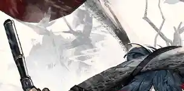
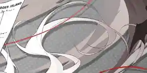

 {.centering}

这个栏目居然能坚持出到12期，在座的各位都有责任。可喜可贺，可喜可贺。{.centering}

——命题人的调侃{.aright}

<!-- more -->

**【1】模组系统已经实装很久了，一些干员也拥有不止一套模组。截止至2023年10月31日，以下哪位干员还没有模组？**

|  |  |  |  |
| :---: | :---: | :---: | :---: |
| A | B | C | D |

**【2】虽然4星干员的正面作战能力一般不如6星干员，但其功能性不容忽视。以下说法中，不正确的一项是**

A. 桃金娘的天赋可以使所有先锋干员回复生命，但必须桃金娘在场时才生效

B. 角峰的天赋可以增加他的法术抗性，但他原本的属性中法术抗性是0

C. 苏苏洛的技能“深度治疗”在同一次作战中具有使用次数限制

D. 波登可在场时，可以提升所有辅助干员的攻击力，开启模组后还能提升攻击速度

**【3】先锋干员的技能多种多样，但并不全都能回复费用。以下哪一个先锋干员的技能在释放时不会依靠技能本身的效果而恢复费用？**

|  |  |  |  |
| :---: | :---: | :---: | :---: |
| A | B | C | D |

**【4】在关系网中，具有重要关系的干员之间会以高亮直线连接。以下哪组干员之间没有这样的连接？**

A. 阿米娅—煌  B. 赫默—伊芙利特

C. 蓝毒—深靛  D. 重岳—仇白

**【5】如果你的练度已经高到可以无压力推图，又不知道该练什么干员，不妨考虑考虑基建技能。当所有干员都已精英化到最高等级时，以下组合中生产效率数值最高的一项是**

控制中枢进驻：焰尾、阿米娅、凯尔希、涤火杰西卡、玛恩纳

A. 生产作战记录：红豆、食铁兽、卡达

B. 生产作战记录：帕拉斯、刻俄柏、红云

C. 生产赤金：清流、砾、夜烟

D. 贸易站赤金订单：巫恋、柏喙、龙舌兰

**【6】阻挡数是明日方舟区别于传统塔防游戏的一大特点。部分干员可以通过技能来减少自己的阻挡数，以下干员所对应的技能不能做到这一点的是**

A. 卡夫卡—诡异剪刀

B. 罗比菈塔—全自动造型仪

C. 火神—武力模式

D. 宴—分神

**【7】部分干员时装立绘的背景中常常会存在一些和其种族相关的元素。以下立绘截取部分中，不属于黎博利种族的一项是**

|  |  |  |  |
| :---: | :---: | :---: | :---: |
| A | B | C | D |

**【8】伴随版本的更新，属于萨米势力的干员从最初的2名增加到了现在的6名。关于这些干员们的档案内容，以下说法不正确的一项是**

A. 雪绒所在的搜救队承受着巨大的风险，但同时也能获得高额的回报

B. 柏喙的父亲是雷神工业的设计师，在一次工人暴动中柏喙被误伤感染了矿石病

C. 寒檀曾十分仇视乌萨斯人，但在来到罗德岛后，她的偏见与怨恨得以改观

D. 提丰很小的时候就失去了父母，由凛视将其抚养长大，她的弓也是父母的遗物

**【9】随着第二次尖灭行动的测试，重装小车实装，现在我们已经有了4个可以使用的支援机械了。在它们当中，拥有最高速度的是**

A. Castle-3 B. Friston-3

C. Lancet-2 D. THRM-EX

**【10】会客室的情报栏中一共有7个空位，分别对应7个关系网中的子阵营。如果从以下4组干员中选择1组剔除，使留下的3组干员所对应阵营能覆盖7条线索，应该剔除的一项是**

| A | B | C | D |
| :---: | :---: | :---: | :---: |
|  |  |  |  |
|  |  |  |  |
|  |  |  |  |

{.image-left-float style="max-width: 20%;"}

*扫一扫二维码查看本期答案*

[点我也可以哟ヾ(≧▽≦*)o](https://www.wjx.cn/vm/mksCk2c.aspx)<eod />

<FakeAds />