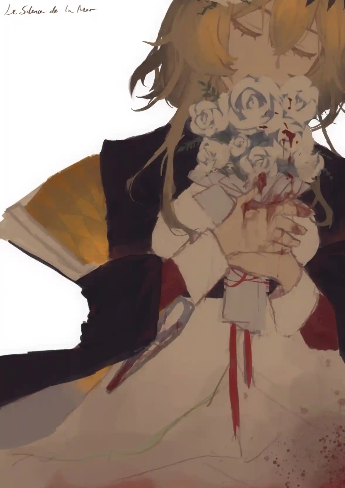

罗德岛的温室里，{.textkai}

有大片的玫瑰花正在安然绽放。{.textkai}

在她第二次看见窗外一闪而过的野玫瑰时，{.textkai}

她想起将他的手，放在剪刀上的那只手。{.textkai}

<!-- more -->

 {style="float:right;max-width:40%;margin-left:1em"}

不知道过了多久，她从梦中醒来，火车仍旧沉默地穿梭于山间，和她昏沉沉闭眼的时候相比，光线暗了一些。

她头也不动地瞥了一眼窗外的景色，山间似有玫瑰，她想起自己的花和种子。

“锹子……锹子……？”

玛格达尔对很多事的反应都不太机敏，她像山上的野玫瑰，美丽却遥远地注视着山下的一切。

连日以来她忙着和自救军的队伍一起建设医疗观测站，救治幸存下来的镇民。现在坐在离开维多利亚的火车上，她终于有时间回过头思考那个血色烟火的时刻，萨卡兹军官没有宣之于口的意思。

其实“锹子”是个还挺好的萨卡兹，起码对她是这样。布伦特伍德镇在“仪式”开始之前没有发生像……推进之王她们说的那些暴乱，也许真的多亏了他被其他萨卡兹诟病的“软弱”。

萨卡兹里好像有很多人喜欢花。

玫瑰的花瓣上带刺，会扎破手指，会流血，可是那个时候他丝毫没有在意自己的手指在流血。

所以她摘下玫瑰的时候会剪断花枝，这样不会伤手。无论花瓣上的刺再怎么尖锐，花枝都能轻易被掐断。

她在镇上忙碌的日子里，见到了很多的萨卡兹，不同身份，来自不同地方，分属不同阵营，但是只要听说她曾经是园丁，都会询问是否还有花朵幸存。而当他们知晓温室被改建成医疗站的时候，又会纷纷露出惋惜的神情。

她一直没想明白为什么萨卡兹会对脆弱的花朵情有独钟。她也没想明白为什么“锹子”让她担任在战时仿佛非常多余的“园丁”。

他最后死在自己手里。玛格达尔知道，如果他想阻拦，自己根本逃不出那间温室，可他还是放走了我。

他把命送到我手上，根本不想……做出任何实质性的反抗。

镇民们被他们支使着，没日没夜地修建工程，而我在这一过程中始终袖手旁观，因为我和芙蕾达一样，以为这只是一场普通的奴役，袖手旁观、逆来顺受意味着更长时间的存活——这是从小生活在这个安静的小镇的懦弱的我们所能做出的，最好的选择。

选择不再袖手旁观，不再逆来顺受，是她们的突如其来的本能。

“锹子”说，这场战争是他们的“殿下”决定的，他和她，在这场战争里，都只是一粒沙。

死在哪里都有可能的，一粒被风吹起的沙。

他终日死气沉沉的眼眸，在死前迸发出了火光。

玛格达尔彼时没有时间也不敢去想，他到底在渴求什么。

一开始，或许是因为他爱花，所以留下了拥有这间温室的我。

这些日子里，她被急性感染，她成为了罗德岛的医疗干员，她为其他人做心理疏导，她作为自救军东奔西走。她打过交道的人比她过去的生命中见过的人还多，许多事态和情感不由分说钻进了她的内心，使她慢慢理解了远在天边的灾难，和近在眼前的苦厄。

萨卡兹和其他任何种族都一样，有好人有坏人，只是这个民族所遭受的一切，令良知尚存的人难以保有这份善意对待所有，令懵懂无知的人天然染上了鲜血和罪恶。

玛格达尔不知道这是谁的错。

她其实已经明白“锹子”对自己怀有什么样的情感，复杂的，不能被言说的，没有结果的，令他在漫长战争中有了一点期盼的情感。

而这份微弱情感的对象是一个有些迟钝的安静的姑娘，省掉了许多心痛的麻烦。

只是他们的道别太过仓促，太过残忍。玛格达尔从他渐渐涣散的瞳孔中，看到了解脱和希望。

其实他本来想和自己一起死的吧。可他一定也想到了，从来没有理解过萨卡兹的玛格达尔，深爱着自己的家园和镇民们的玛格达尔，绝不可能在知晓真相以后默默接受。最安静的人往往最先开始反抗。

这片大地上已经满是焦土，如他一般逃不出战争劫数的人们……或许都欠下了一个正式的道别。

她带走了那只挂钟。

她知道哪怕他活下来，他们之间的矛盾也很难消弭。罗德岛的温室里，有大片的玫瑰花正在安然绽放。在她第二次看见窗外一闪而过的野玫瑰时，她想起将她的手放在剪刀上的那只手。<eod />

（责任编辑：广英和荣耀；网页排版：武乙凌薇；绘图：一般通过超自然理）

<FakeAds />