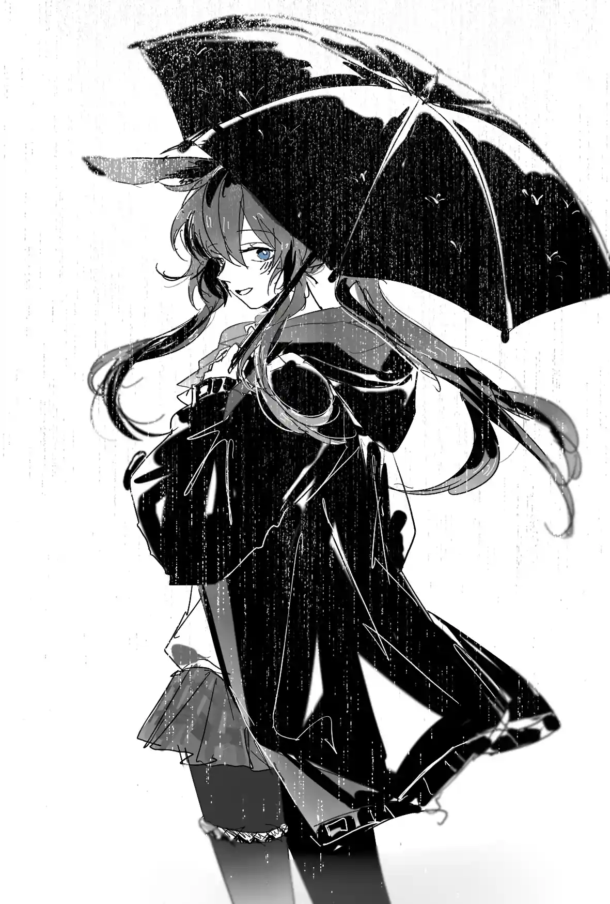

是的，雨点循规蹈矩的淋湿这片土地的一切{.textkai}

它什么都不在意{.textkai}

只是从高空落在地表之上的万物上而已{.textkai}

<!-- more -->

最后一位在急救室的干员也像之前被搬进来的干员一样，死了。他们总共在急救室躺了一个星期，医疗干员日复一日的看照着他们。当阿米娅路过急救室的走廊，看向急救室半透明窗帘后微弱的灯光时，她会想起那些将死的和已死的人，已死的盖上白布，化为白烟，将死的如风中残烛，逐渐消逝。

以前，在阿米娅熟悉医疗部工作流程时，一些年纪大的人或重病的都会拿自己即将消逝的生命开玩笑，那时阿米娅还会可爱的劝说他们不要开这种玩笑，可现在她说不出多少安慰的话了。

葬礼这个词听着令人难受和诡异，使人像身处一片陌生怪诞而又熟悉的环境中。这个词在阿米娅耳中听来像是处理一个不能杀死，但又不能让其出现在眼前的人，让她纠结又恐慌。

完成早间安排的工作，在食堂吃迟到的早饭，黑角刚和斑点完成外勤任务回到岛上。古米给阿米娅特地做了一碗多加肉的肉粥。坐下后，她听见黑角在说：

“俺以前还和他出完任务，下班后喝过酒呢，他来罗德岛是为了给自己爹挣医药费啊……”

看来牺牲的那些干员里有黑角认识的人，他戴着面具，不住摇头，不想多说什么，但又想说什么。斑点也没有表现出不耐烦的意思，虽然有时候他嘴上不饶人，但知道自己什么时候该说什么话。

“他是半路出家的，”黑角继续说，“但总是敢冲到前面去，所以，早晚的事吧……”

黑角吃完了早饭，但并没有要回宿舍休息的样子。斑点见状，于是说道：

“至少他的家人不会有事的，罗德岛会继续给他父亲治疗到最后的。”

“俺知道啊。”黑角说。

“吃完饭了，不回去见见夜刀？”

“她还忙。”

“那就回去睡一觉吧，咱俩快三天没闭眼了。亏你没吃着吃着饭就钻碗眼里。”

或许是注意到自己听的时间有点长了，阿米娅喝完最后一口汤，端着碗准备离开。

“明明俺教了那小子不少保命的技巧啊，还都是俺从其他干员和博士哪儿听来的。”

“毕竟是半路出道的，一着急忘了吧。”斑点说完就站起来走了。

黑角还在座位上坐了一会儿，他透过面具的视线落在空空的餐盘上，什么都看不出来。最后他叹了一口气，憋着股劲似的快步走了。

阿米娅看着黑角的背影消失在走廊拐角。于是她回去工作。走廊里有燃烧塑料的味道，阿米娅不喜欢的放缓了呼吸，快步走开。隔着墙能听到有人在没好气的说些什么，最后粗鲁的骂了一声。

“那家伙就是个神经病。”

“怎么能这么说？”

“总是显摆呗，仗着自己前两场仗运气好没缺胳膊少腿的到处瞎讲。最后死了吧？好死！当时他刚进来的时候，人事部的好说歹说劝他不要做作战干员……是有这事吧？”

“确实是有过。”阿米娅听出是月见夜的声音，“腿脚跑得快，当先锋干员和做侦查挺适合的，但毛毛躁躁的，容易惹出动静……其实梓兰小姐也是执拗不过他才给他的求职简历上填作战干员的。聊这个话题属实有伤和气，我还要去帮泡普卡写任务报告呢。”

“哦，记得把你们队体检报告一并给医疗部送过去。”那个声音说。

阿米娅把这个月的外勤内勤统计表拿出来，细细计算。

最近外勤任务比较多，医疗部和行政部三个月里只有十天正常下班。

墙那边的人又在交流起来了。

“为什么不换一批外勤任务的人呢？”

“现在我们做外勤作战任务的干员都是固定一批，他们经验足，任务完成的好。新换上的干员，基本都是没见过血的，能忍着，活过一年半，博士和行政部就把他们算资深干员了。”

阿米娅用工作填满自己的脑子，让自己忘我的沉浸于工作中，她现在不想听人能活多久这个话题。

她今天也是一如既往的忙到深夜，财务部统计月末财务总表，制作报表，整理大小单据和月度报告，阿米娅也出了不少力，自己也极尽所能的帮他们分担了一些。她收拾了一下自己的卧室，让室内环境看起来得体些。躺在床上，她在迷迷糊糊中看到了那些死去的人的面孔。她深呼吸转移注意力，但总有絮絮叨叨的东西如诅咒般缠着她不放。她不害怕，也不悲伤，只是迷茫。明天是9月31日，旧的日历即将被撕下，新的逝者姓名要被刻上去。

晚上，她去参加了葬礼。

用来守夜的屋子的灯光异常的亮，白漆白砖，几张椅子已经坐了几个人。这时，陈警官意外的坐到了阿米娅身边。陈简单的说这次因公牺牲的人里面有她认识的人，所以来悼念，但她马上要和其他外勤干员出任务了，还要回炎国一趟。

 {.image-right-float style="max-width: 40%;"}

身边有个人正襟危坐着，这让阿米娅也有点受到感染，不免紧张起来。即将深夜，屋子里极其安静。她不自觉的困了，她强令自己撑住，但浓重的困意如云雾一般笼罩在阿米娅四周，她还是昏昏沉沉的睡着了，等她醒来时，她正依靠在陈的身上，陈微笑着点点头，阿米娅立刻清醒了过来。

过了一会儿，也就是陈刚走没多久，博士和凯尔希也来了。博士坐在阿米娅前面，他给阿米娅带了一点甜面包来充饥。即使是守灵，博士仍戴着兜帽，因为他觉得灯光很晃眼。

凯尔希坐在离棺材很近的地方，像是仔细地在看棺材上刻着的名字。棺材上写着一年来因公殉职的罗德岛干员名单，兴许其中也有凯尔希医生有印象的人吧。

随后又来了一些人，他们静悄悄的把花朵放在棺木前，谁都没有说话，好像怕把人吵醒似的安静行走。鲜花的香味很快弥漫开来。

困。

现在轮到博士在犯困了。

他原来在数着一共有多少人来送花，送了多少只花，结果越数越头晕，差点一头栽倒下去。他的重心左右摇摆。在即将倾倒之时，他急忙装作低头系鞋带的样子。结果他穿的是皮鞋。

他只好呆呆的看着这双穿了有两年的皮鞋，有些地方色泽偏差有点大了，鞋头和鞋跟都是磨痕，从来没想过用鞋油补救一下。出门去谈生意和开会时另有一套商务装，是岛上的干员自己设计送给博士的，还经过了凯尔希的同意，那套商务装穿上去就跟麻一样，一穿上就浑身发麻麻，身体失去知觉，不对，是困意。

博士装作冷的搓了搓手腕，想驱赶惬意的麻木，然而越想驱赶，这东西反而就像恼人的蚊子一样忽远忽近，让你的脑袋越来越无力，眼皮越来越重，当然，博士怎么可能会在这种场合睡着？他屡屡摩擦手腕，深呼吸，想一些要紧的事，但困意每当博士放松一下，它就卷土重来。

早知道坐阿米娅旁边了，说不定看看那孩子也能转移注意力。

他看到送葬人走了进来，拿着一束白花。他总是冷静的双眼犹如黑暗中微弱的烛光，他看了看棺木，然后转头向博士和凯尔希医生致意后离开。他成功的让博士清醒了点——房间里鲜花的香气有点刺鼻了。

亚叶犹犹豫豫的走到凯尔希旁边，她两手拿着塑料杯，想把这些东西递给凯尔希。可凯尔希看了她一眼，轻声说了点什么，于是她又向博士和阿米娅走来，是两杯咖啡，亚叶说是凯尔希坚持要给博士一杯的，博士谢绝了，他觉得在这里因为喝咖啡而发出声音会很尴尬。这里还有其他来守灵的人。亚叶只好去找阿米娅，可也碰了壁，她只好拿着杯子再走回去。守灵的人继续凝视着棺木。

真伤脑筋。

曾几何时，三人聊过关于死去的人这个话题。

“萨尔贡人对人的死亡有两种说法，一个是每当有人死去，天上就掉下一颗星星，那颗星星就成为新的人诞生，而死去的人就上升成为原本的那颗星星，代替他的位置。”

这是阿米娅从萨尔贡出身的干员那里听来的。博士表示感兴趣的点点头，凯尔希没有反应。

“另一个说法呢？”博士说。

“另一个说法是，人死后会去到一个新的世界，那个世界的一切都是死者生前遭遇的相反。”阿米娅说。

“一切都相反？”

“生前活的幸福的人会生活在不幸的世界里，而不幸的人则活在幸福的世界里。”

博士思考片刻。“简直跟保持平衡一样。”他说。

“我也这么觉得。”

“凯尔希医生，你觉得那一点更好呢？”阿米娅问。

“我不知道。”

“这样啊。”

博士又快睡着了。

凯尔希回想起医务人员之间的聊天。

“还有这件，给那个人的。”一个来自炎国的干员对来自乌萨斯的干员说。几天来，这位炎国干员细心为他逝去的两位朋友缝制了寿衣，一个人独立做的。负责给尸体梳理遗容的乌萨斯干员觉得这太麻烦了，频频抱怨：“你们炎国的怎么干什么都那么多传统？我们那里死人以后，留下骨灰，每到一些日子就去看看他，真不知道忙什么。”

“等你认识的人走了以后，你才觉得你自己才真正认识他的。”炎国干员说。

“这我知道，但给一个都死了的人忙活这么多，我是不愿意受这累。人死了就死了呗，就算把他再叫起来问他，他也肯定不愿意都死了还给人添麻烦。还是乌萨斯的传统简单，一年到头给送盘蜜饭行了……”

凯尔希揉了揉太阳穴，皱起眉头。

“……保佑他的灵魂。”有人在身后说。

“他这辈子还没享受过。”

“干什么都太认真了，都没好好活过。”

“好像那件事以后她就很少和人说话了……”

“现在也和她说不了话了。”

有哭声，但不知道哭的人是谁。她不会回头去看，没有人去劝她，所有人一声不吭的坐着。几声沉重的呼吸声代表有人从小憩中被扰醒。

最后就连凯尔希都睡了一会儿。天蒙蒙亮，她慢慢起身。

阿米娅坐在博士身边，和博士互相依靠着睡着了。

凯尔希心平气和的看着阿米娅微微呼气的小嘴，听着两人的呼吸。现在他们只能在纪念死者的时候才能获得一丝安宁。她坐到阿米娅旁边，注视着睡着的她，恍惚中，阿米娅只是一个普通的小女孩，而非什么“领导人”。她久久的看着阿米娅的眼睑和嘴唇，回想着她们的初次见面，一种奇异的被吞噬感从她心中浮起。她意识到这张脸已经和初次见面时有了巨大差异。

总有一天，你会理解我的选择……原谅我

上面那句不是凯尔希心里说的。

如果幽灵真的存在，那罗德岛恐怕早已灵满为患了吧。或许不久后这种纪念死者的仪式会被取消，只在死者的亲友之间举行，到时候，他们三人将不会出席，搞得好像他们不再关心为罗德岛而献身的人似的，就在有可能的将来。

那些也来守夜的干员开始离开，清晨的寒冷让他们都收紧身体。那些人最终都会变成徘徊在罗德岛上的幽灵，于是他们默默注视着，那些代替了他们位置的人，为了所谓的理想勇敢与世界对抗，最终加入他们的行列。

今日全天有雨，气温骤降。病房甚至开始供暖。有人看着打在窗户上的雨点，斑驳的雨点沿着玻璃向下蔓延，却像表演坠落一样。现在是工作时间，人人都有必须要做的工作。代表冬日将至的雨点落在这泰拉大陆的每一处土地头上，落在维多利亚高耸的高楼上，卡西米尔璀璨的霓虹灯上，让哥伦比亚的开拓者裹紧薄薄的御寒衣物，让流浪荒野的感染者感叹大限将至。

有一滴雨滴，应该说像雨滴一样的东西，它落在了纪念逝者的墙上，其中一个名字的凹陷处。他在哭完后迅速整理好仪表离开，好像什么都没发生。

是的，雨点循规蹈矩的淋湿这片土地的一切，它什么都不在意，只是从高空落在地表之上的万物上而已。<eod />

（责任编辑：广英和荣耀；网页排版：武乙凌薇；绘图：寒岁天）

<FakeAds />