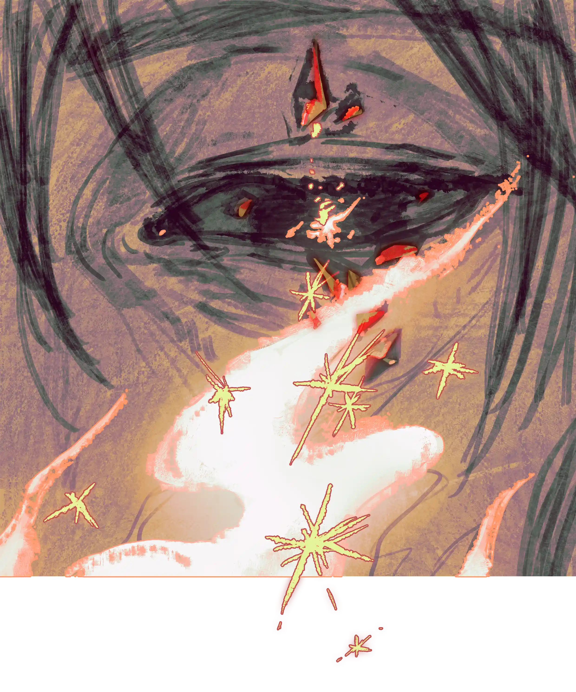

第一，要去找文学读，人不能不读文学{.textkai}

第二，要去找关于数字的知识读，这是一切精确的基础{.textkai}

第三，要去了解源石的知识，我们的社会离不开源石{.textkai}

第四，不要被表象所迷惑，要去探寻规律和本质{.textkai}

第五，承认自己的无知{.textkai}

第六，永远要学习，只有学习才能拯救玻利瓦尔。{.textkai}

<!-- more -->

在黑暗中，他被一阵胃痛和咳嗽弄得下定决心，该讲最后一课了。

恰好今天是停止炮击的日子，于是他拍拍手，孩子们清醒了过来。咳嗽了一下，他缓缓摩擦指尖。光芒开始浮现，先是朦胧，后又逐渐一点一点清晰起来。

“亮吗？”他问。

孩子们没有说话，他知道孩子们是在心疼他。山洞里这么暗，孩子们怎么看得清呢？于是他又摩挲了一下手指，手掌心底的光线又亮了几分。这是他的源石技艺，微微的，温柔的，没有任何攻击性的光芒挥洒在昏暗的洞窟里。

“亮吗？”他又问。

孩子们还是没有说话，八人十三双眼睛齐齐的看着咳嗽的年轻人。就在他打算再摩挲手指让光芒更亮一些的时候，一个孩子的声音说道：“老师，老师，够亮了。”

他的眼睛已经很差了，睁开眼，眼前的总是模模糊糊的一片。他是矿石病患者，他的体外源石结晶长在了眼睛上，这些结晶或许在将来有一天会完全夺取他的视线吧？他还知道源石结晶已经在他的肝上生了根，因为清瘦的他，却有着异于常人的大肚子。躯体疼痛，眼睛失明，但是他还记得孩子们的声音——比如这个说话的是帕斯。

辛嘉斯王朝的背后是莱塔尼亚，这在玻利瓦尔可谓人尽皆知。据说是为了“平定叛乱”，辛嘉斯王朝里入驻的莱塔尼亚顾问举行了残忍的活祭。活祭的仪式是在一颗垂柳和一颗白杨之下献祭大量的妇孺——他是在女人和孩子的尸骨下找到奄奄一息的帕斯的。那时候他还没得矿石病，身边已经有了五个孩子，都是捡来的。第六个孩子帕斯最机灵，学习也最好，是孩子中他最放心的一个。

他一只手托着光芒，一只手扶着墙，摇晃着站了起来。又是一阵炮声，紧接着山洞震颤，石灰碎屑哗啦啦的往下掉。不知道是哪个孩子捡起来一块刚掉下来的散灰石，塞到了他没托着光的那只手里。以前玻利瓦尔三方混战军还没有打的那么激烈的时候，他偶尔还是能弄到一些粉笔用的。不过也没差，如今对他来说粉笔和灰石摸起来一个样。

“略萨，像以前一样，帮我擦擦墙壁。”

他又咳嗽几声。略萨是八个孩子中最大，最早跟着他的那个，也是众多佩洛中唯一的丰蹄——据说他的母亲和一个外来的米诺斯人偷情，生下了这个带有丰蹄角的孩子。愚蠢的村民们大喊着这个孩子是邪恶的化身，要把他浸入河水淹死。那时候的他刚刚到玻利瓦尔，还带着满腔的热血。

略萨站了起来，用宽厚的手掌擦去洞壁上用石灰写的密密麻麻的文字。其他三个男孩，四个女孩齐刷刷的看着他们的大哥——他手中的光芒在略萨的身上勾出一圈光圈，淡淡却又像是梦幻。

略萨擦完，对弯着腰的年轻人说道：“老师，您，还是休息一下吧。上课......上课不急。”

“不能休息。”他又咳嗽了两声：“这是最后一节课。”

朦胧的视线仿佛黯淡了一些，他赶紧又捏了捏手，激发源石技艺让光更亮了。“孩子们，坐下。”

山洞外又是一阵震颤。似乎这次炮击没打准，山洞没有落下碎石砂屑。炸弹爆炸的声音在山洞外不知方向的远处响起，很轻，就像是有人在打呼噜。他又咳嗽了几下，哇的吐出来一口东西。

孩子们的方向似乎传来了哭泣声。

“孩子们，坐下。”

又是一声炮击，山洞剧烈的摇晃起来。哭泣声停止，孩子们很快坐在了碎石瓦砾中。自玻利瓦尔的联合政府和“真正的玻利瓦尔人”停止交战，共同将这一块区域列为炮击区已经二十多天了，困着的二十天里他断了药，身体是一天不如一天。随之，他明确的知道了一件事情，他快要死了。

他开口说道：“孩子们，我们准备，咳咳，准备上课了。上节课，上节课我们讲了文豪马尔克斯特，和他的作品《孤独》。他的作品是极好极好的，如果你们记不住也没有关系，以后有机会一定，咳咳，一定要找来读读。每个玻利瓦尔人都应该读一读他的书，就像是每个炎国人都应该读一读笔名树人的炎国文学大家的作品一样......”

他什么都教，但他知道自己并不是天才。他只是有幸去了哥伦比亚读了些书，如今依靠卖弄肚子里那点可怜的墨水来端着老师的面子。但是孩子们不能不读书，他们无依无靠，更不能在将来沉溺在玻利瓦尔那特有的浓重愚昧且魔幻的黑云里。视线好像清晰了一些，他突然发现自己看孩子们的面孔不再糊在一起了，而是能够分辨出眼睛和嘴巴。孩子们看着面前的石壁，看着他手里的光，被光照的金闪闪的脸蛋就像是全力破壳的虫虫。

“我们今天要讲，讲源石。其实这些东西不应该现在讲的，但是我很害怕在将来某一天，你们中有些人再也没有机会听到类似的内容了。接下来你们听着，请多多思考，多想想为什么，咳咳”他又咳嗽两声，紧接着山洞又颤抖起来。这次炮弹落得很近，一块小小的碎石砸在了一个女孩的头顶。见孩子没事，他又抬起手，用散灰石啪嗒啪嗒的在石壁上写了点东西。

“泰拉的文化还是科技，都离不开源石的支撑，咳咳，同时源石也给泰拉带来了难以抵御的灾难，并直接导致了目前泰拉独特的世界局势的产生。我知道你们听不懂，但是没有关系。我都写在黑板上了，你们赶紧背，记下来，总有，咳，呕，总有一天你们有机会理解的。”

他干呕一声，接着挥舞起手臂。如今他的双臂已经像面条一样，仿佛抽去了骨架支撑，软绵绵的。

“源石，源石蕴含巨大的能量，能够被我们所利用。孩子们，外面那些人们用来轰炸的大炮，就是被源石驱动的。还有那些运武器的卡车的发动机，也是源石。对了，还有哥伦比亚的八音盒，只要你拧上发条，就能激活里面的源石装置奏响乐曲......我们用的能源有许多都来自源石......”

他的头一阵疼痛，断药带来的折磨如潮水般再次袭来。话说到一半便戛然而止，他后退一步，用力地大口吸气。光芒突然暗了，他用力的再咳嗽了几下，问道：“都背下来了吗？都背一遍。”

山洞静悄悄的，如他先前所预料的一样，炮击停止了。

孩子们都很聪明，只要愿意学，总是能学会的。他这么想着，听着孩子们背诵道：“泰拉的文化还是科技，都离不开源石的支撑，同时源石也给泰拉带来了难以抵御的灾难，并直接导致了目前泰拉独特的世界局势的产生......”

“背到这里就可以了，咳。”又是小腹一阵疼痛，同时一柄重锤拍打在他的脑门上。他伸出面条般的手臂，凭借感觉擦掉了自己刚才写的那些东西。

“为什么说源石给泰拉大地带来了毁灭性的灾害，有两个原因。一个是天灾，一个是矿石病。天灾就是......”

“我们知道什么是天灾！天灾就是灾难！”一个女孩突然大声的说，是瞎了一只眼的米斯特拉尔。

他愣了愣，说道：“对，天灾就是大灾难。而矿石病......”

米斯特拉尔的声音戴上了哭腔：“我们也知道，矿石病就是老师您现在患的病！老师我们知道的已经够多了，求您，求您歇歇吧！”

他托着光的那只手有点发冷，他从未如此长久的释放自己的源石技艺——他知道自己没有法术天赋。

他还是大声的训斥了米斯特拉尔：“乱说！你怎么能说你们已经知道的够多了呢！”

女孩倔倔的看着他，一言不发——可惜他看不到女孩的神情。他又咳嗽了几声，说道：“米斯特拉尔，我问你，如果我死了，你会怎么做？”

叛逆者一滞：“老师，您不要乱说话......”

“我是一个矿石病患者，告诉我那时候你会怎么做。你必须回答！”

“我，我会好好地埋......”

“你不能埋葬我，你对矿石病根本就一无所知。”

意识到语气有些激动，他试图让语气温柔而平缓下来。然而他还没开口，又是一阵闷咳。这下吓的米斯特拉尔止住了争辩，十三双眼睛齐齐的看着他。

“孩子们，孩子们，你们知道火吧。”他还是让语气温柔了下来，“如果你试图触摸火，你就会被烧伤。一个矿石病人的尸体就像是一团刚刚被点燃的火——你们想想一下，我死后，我的尸体上就会长满和我眼睛上的源石一样的源石结晶，我身上就会掉落粉尘和碎屑。如果任何人碰到了这些粉尘碎屑，很大可能也会成为矿石病的感染者......”

他顿了顿，说道：“我很快就要死了，这就是我们的最后一课。”

一片寂静。

他的眼帘昏暗了下来，面前的一切似乎更黑了。这怎么能行呢，孩子们还没有看到最重要的东西。他用力地摩了摩已经僵硬的手指，就像是摆弄两根枯瘦的树枝——他朦胧的眼中光又亮了起来。

一个孩子的声音传来：“老师，太亮了，请暗一些吧......”

奇怪，怎么听不出这个声音是谁了呢？他想着，大声说道：“别体谅我，太暗了你们看不清的。接下来我说的，你们记好了。”

“孩子们，这个世界上，万事万物都有规律。你们要学习，要把握，才能......才能.......”大脑一下子卡了壳，他愣了愣，好像头又重了起来。“比如说，现在炮击停止了，外面应该是黑夜，在下一个黑夜之前是没有炮击的，今天是玻利瓦尔的新年。咳咳，这就是规律。”

规律，他终于讲到了规律。他其实还有很多东西想要说，然而恐怕是来不及了。他不甘心啊，他不甘心。

他抬起手，凭借着感觉在石壁上又开始写了起来。“孩子们，我写，你们念，背。”

随着他的手臂在墙面上弯曲写字，一个属于孩子的男声响了起来：“第一，要去找文学读，人不能不读文学。”

紧接着是一个女声的加入，“第二，要去找关于数字的知识读，这是一切精确的基础。”

加入的孩子们越来越多，他写的越来越快：“第三，要去了解源石的知识，我们的社会离不开源石。”

他感觉自己燃烧了起来，手脚也变得轻快了——他知道自己是在回光返照，但是没有关系，这已经是最后一课了：“第四，不要被表象所迷惑，要去探寻规律和本质。”

孩子们的声音带起了哭腔，即使模糊了起来他也听得清。没有关系，他还能写，这些孩子们必须记住：“第五，承认自己的无知。”

在写最后一行的时候，他感觉自己轻松极了。他仿佛年轻了十岁，回到了那个哥伦比亚的学府。他仿佛看到了自己的初恋，那一段朦胧的爱情。他还看到了孩子们，孩子们拥有美好的未来，生活在没有战乱的玻利瓦尔。

“第六，永远要学习，只有学习才能拯救玻利瓦尔。”

孩子们的跟读戛然而止。随着第六条文字的写完，他一下子瘫坐在地上。浑身失去了力气，又一口黑血被他吐在自己的大腿上。

但是还有最后一件事情他还没做完。他举起手，摩挲手指，一点点光亮闪耀起来。“咳咳，咳咳。孩子们，背下来。背下来以后，就不用管我，离开山洞吧。今天没有炮击。往南走是真正玻利瓦尔人的阵地，往北走是联合政府的阵地，鉴别东西南北的方法我已经教过你们了。”

寂静，之后是一个女声：“老师，跟我们走吧！”

“我不能跟你们走，我随时都可能死去，和你们再待在一起就是对你们生命的不负责任。孩子们听着，咳咳，如果你们有人到了任意一方的阵地，就告诉军队，一天后用密集的炮击轰炸这里。我死后会有源石尘的，那些可不能飘出去......现在背啊......背，别愣着啊，背熟了就走。”

有声音朦朦胧胧的传来：“第一，要去找文学读，第二，要去找关于数字的知识读......”

“背整句话，不要只背半段啊......”他说道。光似乎暗了一点，他赶紧又磨了磨手指。

孩子们的声音嘈杂起来：“第一，要去找文学读，人不能不读文学。第二，要去找关于数字的知识读，这是一切精确的基础......”

声音越来越大，他的眼皮越来越昏暗。孩子们总归是要一个个离开的，也许今天离开他也不坏。他想着，又用力摩挲手指，照亮石壁上的文字。也许这些孩子中大部分人这辈子都没有机会继续学习了，但是活下来总是好的。他可以用光照亮他们的前路，告诉他们怎么走是正确的。

他的此生已经交还给玻利瓦尔这片生他的土地，而孩子们会有更好的起点。离开这个昏暗的山洞，去收获贫瘠，但是确乎存在的希望。<eod />

 {.centering}

（责任编辑：广英和荣耀；网页排版：武乙凌薇；绘图：粥铺）

<FakeAds />