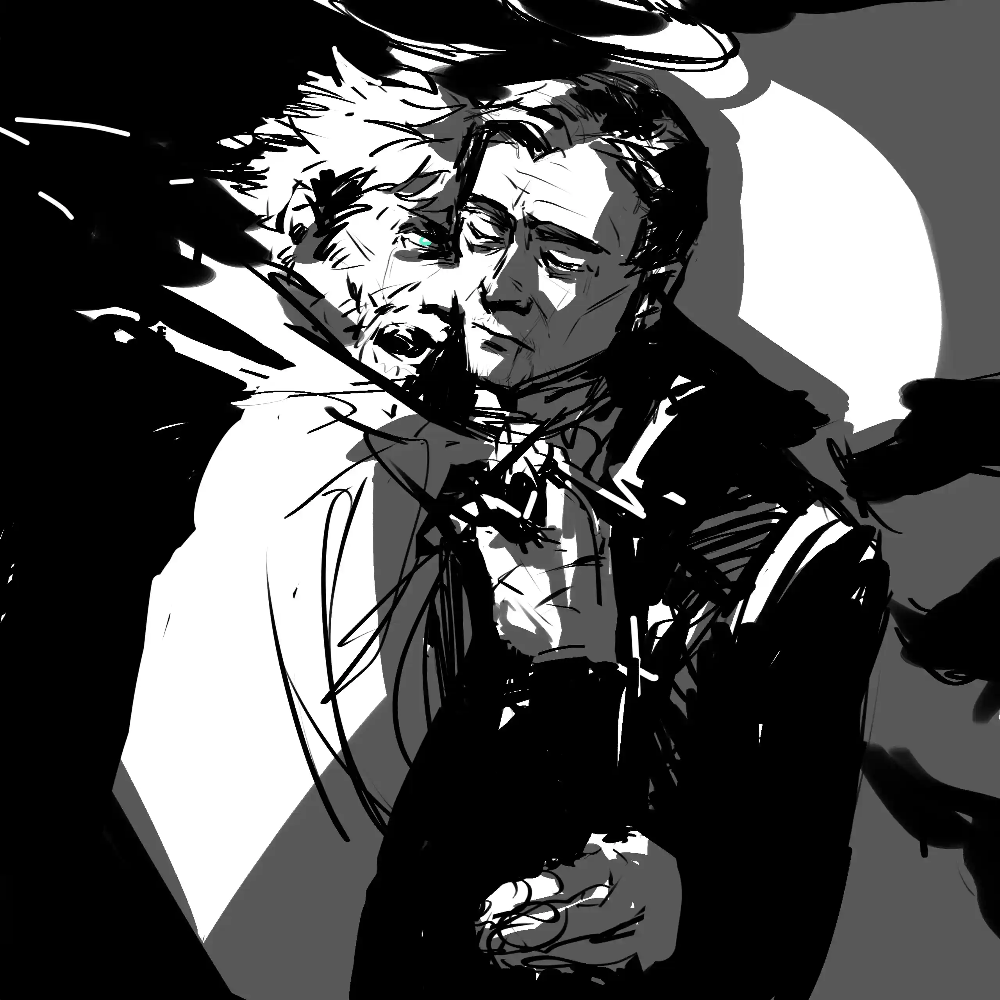

{.textkai}

<!-- more -->

头顶光环的老人走进了不大的餐馆。险些撞到门框上悬挂着的铃铛，他扶了扶帽子，为了缓解尴尬似的，视线自然而然地环顾起了四周。简陋但还算稳固的梁木就这么大剌剌地不加掩饰就暴露在外，屋顶与其说是屋顶倒不如说是单纯盖上木板再用防水布遮住的雨棚，甚至就连刚才他走进来时的门都——说真的，连个门板都没有只有门框的存在，真的可以叫门吗？

若不是外面那破烂的木板上用炭笔写了“酒馆”二字，外加上这弥漫在空气中的炙烤肉类的香气，他说不定会误以为自己踏进了哪个废弃地块上的烂尾楼。

但很遗憾，这里并不是那种尚还称得上是城市的地方。

自己从决定行程到下车前面对的部下的疑惑也不是毫无缘由。

毕竟怎么说，这里也是个真正的前不着村后不着店，没有地图就连固定班车的司机都不一定能找到的——拓荒地。

在哥伦比亚，这个名字总是能给人以惊喜，甚至是惊吓。从终年见不到几日晴天的雪原，到风暴肆虐天灾频发的旷野，再到笼罩在锈锤的阴影下的峡谷，行走在这片大地上已接近百年，被称呼为“桥夹”克里夫的老者听说过很多，见过的更多。但很显然，和那些几乎连大地苦难都不足以形容的地方相比，这片小树林简直安稳得像个坐在安乐椅上打毛衣的老太太。

最起码这里还能有个能容纳十几人的小餐馆，不是吗。

不自觉地，他为这些想法耸了耸肩，继续往屋内走去。

“啊呀。”什么人的声音响起将思绪拉回，尽管不曾听过，老人仍很清楚向他搭话的是谁，以及曾经是谁。

“这大白天的居然还能有新客人，可真是了不得呀。”

留着一头靓丽紫色及踝长发的埃拉菲亚女性嘴上这么说着，手上擦拭空盘的动作却没有半分停歇的意思。

“中午好，女士。”出于礼节与习惯，他拉了拉帽檐：“我是来……哦。”

其实他完全没必要说出这后半句话。他是来找人的，这显而易见，不然这荒郊野岭的也不会突然间出现他这么样一个穿着得体的萨科塔老头子，总不能是来这里推销牙刷的吧。

 {style="float:right;max-width:40%;margin-left:1em"}

而他所找寻的对象，即便靠穿着可能分辨不出来，同样悬在头顶的光环与垂在身后铳型光翼依旧会毫无保留地暴露位置。克里夫摘下自进门后手指便不曾离开过的帽子，坐在了那个人的旁边。

亦或者说，即便是对方忍着晕眩带来的呕吐感遮住光环，用破布与煤灰盖上光翼，那份萨科塔开口啼哭时就获得的天赋也仍能违背意愿地，将本不用言语或是表情表达就无从知晓的情绪暴露出来。宛若一个出现故障——也可以说是本应如此运作的信号塔，不停地在人群中发送孤独的无法被解读的信号，控制不住也无从控制，只待另一个使用着加密手段的终端来接收——

呃好吧，这种诗意的表达还是交给教堂里的司祭来比较好。不过起码他现在还是能够感知到几分不满与几分喜悦。前者自然是冲着自己来的，至于后者……大概是出于对方正在品尝的食物，确实，光是闻闻这弥漫在屋子里的气味就知道，肯定差不了。

“中午好，伍迪。”

同样是问候，语调却似乎被这里的气温影响到，相比方才的正式柔和了不少。

至于被克里夫以昵称称呼的伍德洛，则是连眼睛都不抬，专注地吃着自己面前的烤兽肉。

早就预料到会被这样对待，男人也没再多说，转头向埃拉菲亚的女性伸手示意：“一份和他一样的。”

似乎是又想到了什么，他摸了摸下巴，追加道：“再来两杯麦酒……如果有的话。”

从方才就以某种奇妙眼神打量着自己的女人一仰头，抬手指了指挂在墙上的木板，那上面同样以炭笔写了很多，其中的一行大字写着：

“海伦娜特制鸡尾酒！每日更新配料单！”

还不忘加两条下划线。

“那就来两杯这个。”

“——我不用了。”

伍德洛唐突地插入一句，随后也不多看有点惊讶的男人一眼，继续投身到与食物的交战当中。

“那就只来一杯。”

“好嘞。”

在一阵冰块与玻璃杯撞击的声音中，克里夫有终于将视线重新放回到自己许久未见的……大概还能称呼为老战友的人身上。看得出来，即便是在达维镇度过了几乎二十余载的冬日，依旧是敌不过拓荒地无情的暴晒。面前与他年龄相仿的人已经和半年前那场对峙时差出了不少，略带破旧的粗布衬衣与长裤遮盖不住晒黑了的皮肤和身上的伤痕，愈发凸显出那头没怎么打理过的银白色头发，整个人看起来苍老了不少，但还远未到垂垂老矣的程度。

“这才多久，我都快认不出你了，伍迪。这身衣服也挺适合你的。”

老人苦笑着，玩起摆放在吧台上的餐刀。温热的空气下，隔着手套，圆润的刀柄摸起来甚至有种比他的手更加温暖的错觉。

“我本以为不会接到那通电话的，伍迪。说真的，我的秘书甚至差点以为那是什么骚扰电话——或许我该考虑换个新的号码了也说不定。”

他瞥过视线，滑过方才被随手摆在吧台上的帽子，子弹留下的空洞正冲着自己，仿佛这是一个透镜，一个小孩子才会去玩的万花筒。这半年来每当克里夫摘下这带着伤痕的牛仔帽时，总是会怔怔地盯着，仿佛他还能回味的到那日的景象。待到他终于从那份怀念中脱身，再往弹痕的外面看去时，埃拉菲亚调酒的身姿映照在眼中，还有那正躺在炉灶上滋滋冒油的烤兽肉。

不在乎对方怎么回应，或者是否会有回应，就连共感在这一刻都仿佛被屏蔽了般起不到任何作用，老人仍然插在外衣口袋中的左手无意识地握紧，手中的触感让他有些犹豫，要不要现在把接下来的话说出来。他的喉结上下动了动，因气温和长途跋涉而有些干渴的喉咙一时竟有点发不出声音。

而他想要说给听的对象，始终一语不发。

“伍迪……”

不大的闷响打断了他的话。他看过去，一个装满了黄金色酒液的略带划痕的玻璃杯，以及一盘分量不大，但足以勾起食欲的烤肉。

“看样子接下来除了你们，一时间不会有别的客人来了，那我可就要去帐篷小憩一下了。”

说着，埃拉菲亚的女性如水中的鳞般灵巧地自吧台下的空当钻出，还不忘煞有介事地伸了个懒腰。走到门口处，像是忽然间想起来了什么，她双手扒住门框，扭过头看向进食速度不知何时慢下来的萨科塔：

“伍德洛，既然你一直在等的人已经到了，之后就不用每天都坐在这里等了吧，不然让杰西卡看到，她又会担心的。”

这话乍一听起来似乎只是一句作为友人的关怀，但从伍德洛的反应来看，这不比在酒馆里引爆一颗源石炸弹所带来的冲击力差上多少。

“海伦娜——”

伴随着头顶光环的一阵幅度不大但频率剧烈的颤动，不满的咕哝自那个终于停下手中动作的萨科塔喉中传出。

“啊呀，我该说句不好意思吗？”

海伦娜坏笑着，三两步退出了酒馆，走之前还不忘冲二人抛了个媚眼：

“吃完了金券放在桌子上就好，这里没人敢偷的。”

等到埃拉菲亚的身形彻底从门口处消失后，一直努力忍耐着的克里夫终于选择不再矜持，全身上下都在因那突如其来又多少有点意料之中的一句话戳中笑点而颤抖，就连身后的光翼也不例外。没过多久，兴许是意识到自己已经彻底地憋闷不住，他仰起头，这个在旁人印象中始终严肃着的男人爆发出爽朗且畅快的笑声，还不时敲击着那可怜又脆弱的用三合板搭建的吧台，震得玻璃酒杯中的液体都溅出来了不少。

“伍迪啊伍迪，这可真是没想到……”

他抬手抹去眼角的泪点，丝毫不在乎被取笑的对象现在是顶着什么样的表情，内心里又什么想法。种族内特有的天赋正告诉他，兴奋，愤怒，羞耻都不足以形容这份情感，若要是用色彩的斑斓来形容，那绝对就是张可以挂在教堂里——不，是可以直接被当做穹顶的壁画供无数人景仰的佳作。当然，他的这份突如其来的狂笑的冲动也一定会被对方感知到，但他一点都不在乎，或者说，他很乐意看到伍德洛对此的反应。

持续了几乎有三四分钟，这阵爆笑才终于逐渐平息下来。自短暂的缺氧中缓过劲来，克里夫再一次转过身看向尽管从始至终都拉着一副臭脸，但也仍没有把屁股从座位上挪开的伍德洛。

此刻他忽然间意识到，这是他在来到这羽不拉屎的鬼地方后第一次看到昔日老友的脸，即便那脸色看起来和两人半年前在达维镇见面时没什么两样。

这是张饱经沧桑的脸，当然，每天早上在镜子中凝视着映照出的镜像时，他也可以这么评价自己。不过那终究是早就看习惯了甚至都懒得挑刺的脸，而面前这个带着愠怒的男人的脸，或许也真的是出于许久未见的缘故，竟像自己几年前偶然找回一张金属唱片似的：明明里面的内容一清二楚，可当再度被插进源石唱片机里时，他还是会意外地发现几个过去忽视了的、不曾听过的音调。

但很遗憾，他尽管对乐理有过些许研究，可也终究做不到如莱塔尼亚人一般可以分析的头头是道，自然也无法单凭这张面前的脸，就辨别出这个男人究竟都在这片蛮荒之地经历了些什么。

意识到这一点，老人多少有点无奈地交叠双手放在翘起的左腿上，身体前倾，想要说点什么打开话题，比如这见鬼了的忽冷忽热的天气。

不过，在那之前对方倒是先开了口。

“……下一趟来这里的班车，我记得明明是半个月之后吧。”

伍德洛的声音不大，所陈述的也不过是最基本的事实，却在有心人耳中听出了几分言外之意。

说的也是，他可等不及那慢悠悠还经常不准点的班车。若不是这么做有悖自己一贯的作风，克里夫还真想在挂了伍德洛的电话后直接开着直升机从本舰出发，然后在这里进行一场高空索降。但是非常遗憾，打消了他这个念头的其实不是什么保护在手下面前的形象，而是本舰上目前所有可以调动的飞行载具都在被冠以了各种占用的理由，如果他真想实现这么浮夸的事，恐怕就只能从货运飞机上坐在集装箱里被空投下来了。

哦对了，还有那个喋喋不休的维多利亚来的大客户，一看就知道从没拿过比刀叉更重的东西的说起话来就摇头晃脑的菲林，为了一点点的可以滑进钱包的回扣而占用了自己宝贵的时间，若不是工作需要良好的合作关系，可还真想给对方来上一颗蚀刻子弹，看看他肚子上的脂肪究竟能抵挡得了什么。

不过这些话他可不会告诉面前的人。好吧，或许后面那部分可以……但不是现在。

“你给我打了电话，正巧我手下有员工家在这附近，便捎了我顺风车。路上太堵了，我还觉得我来的会很晚呢。”

回忆完几天来遭遇的种种烦心事，没经过思考，这根本站不住脚的仅仅是作为对调侃的回击的谎言就说出了口。当然他也知道这话没人会信。

是的，他不想让伍德洛知道自己其实有过多么疯狂的想法，也绝对不想直接把急不可耐、立刻动身这样类似的词汇说出来。而同他所预料的那样，对方也只是叹了口气，根本没有去管这扯谎的技术究竟有多么的蹩脚。

“如果真是这样，下次你还是直接把那个大家伙开过来吧，那样的话，估计能更快一点。”

瞧，他甚至接过了话茬说了下去。

而克里夫也自然而然地听出了更多的弦外之音。

“前提是你还愿意再打给我，伍迪。”

说完，他想要借托起下巴的姿势捂住嘴，不让对方看到自己翘起的嘴角，可视线却暴露本心地止不住想要瞥探伍德洛的反应。

可对方就仿佛故意对着干一般，向右扭过头去，斜眼看向墙壁上摆的整整齐齐的空酒瓶。

“——这可说不定了。”

“那还真是遗憾。”

沉默再次笼罩在二人头上，不过这一次，没有刀叉与餐盘碰撞亦或是咀嚼食物的声音，两个人就这样单纯地并排坐着，如同两座只有眼球还会晃动的雕塑。

“……怎么，难不成你想让我问你最近过得如何吗，就像那些教宗骑士退役后在甜品自助区狂欢时一样？”

奈不住寂寞似的，男人右手习惯性地用指尖在桌面上敲击着，开口打破了沉默。

伍德洛却是一点都不留情面，思索了片刻缓缓说道：“……你我都知道，甜食已经不会再对我们有多少吸引力了。而且那种问候，从你嘴里说出来反而让人觉得毛骨悚然。”

怎么可能。克里夫这么想着。拉特兰人嗜甜如命，就连一向被部下认为是冷面无情的他也不例外，看到甜品店橱窗里的巧克力依旧会老老实实掏出钱包买上至少一盒。他都尚且如此，在大学时对周围店铺情况悉数掌握的伍德洛又怎么可能会在这种别说甜食，就连糖都算得上奢望的拓荒地觉得它毫无吸引力呢？

不过倒是有一点说的没错，那种问候无论是从克里夫本人的口中说出，还是通过共感被察觉，都能让人起身鸡皮疙瘩。

“那可真是伤人啊，伍迪。”

仿佛是被戳中痛处般，他摆出一副有点受伤的模样，就连隐藏在风衣下的身形都不禁为之一缩。

可惜对方并不买账，话语如同路上难缠的荆棘般处处带着尖刺：“如果你跑了这么远只是为了过来看一眼，现在也已经看过了，那就快离开吧。太阳落山后，野兽可不管你是萨科塔还是大老总，只会想着你那副骨头架子上还挂着多少肉。”

话音刚落，仿佛附和一般，老人身上携带着的移动终端突然间响了起来。他习惯性地伸手去掏，不忘冲电话那头的不知道是谁但是一定很不解风情的人翻了个白眼。

侧眼看过去的伍德洛耸耸肩，发出一声嗤笑：“呵，你看，就连你的电话都在催你呢。”

看了眼荧屏上闪烁的不断刺激着视神经的号码，克里夫只觉得自己的眼角抖了两抖，紧接着伴随着莫名其妙的冲动和积攒许久的愤怒，他握住终端的手猛然用力，把这吵闹的小盒子狠狠地往门外扔去。即便是有一定程度的抗冲击能力，老人这一瞬的爆发力还是远超出了终端的承受能力，在这次与地面突发的接触中，很遗憾，除了发出无机物碰撞的钝响外加上蹦出几个分辨不出用途的小零件，它也就只能躺在日光暴晒后的泥土上，无助地闪烁几下再熄灭了。

“去他妈的。”

意犹未尽般，他煞有介事地掸了掸手，仿佛刚才自己扔出去的不是普通的通讯终端，而是什么马上就要爆炸的手榴弹。

“早就他妈的想这么做了。”

说完，还不忘装模作样地往门外啐一口，那股狠劲简直就跟直接啐在电话那头的人脸上一样。

看到他这么毫无掩饰的态度，一直垮起个脸的伍德洛也终于忍不住漏出了笑声。

“……我还以为你会和上次一样，问我要不要一起听。”

“你这是要我再被你拒绝一次吗，伍迪？”

对克里夫话中所指的事情心知肚明，也自知在这一点上说不过对方，伍德洛稍微坐直了身板，任由身下的吧台椅发出刺耳的吱呀声。

但这不代表他不会去反驳。也许是被共感影响到——起码他本人是这么认为的，伍德洛现在的情绪似乎要比他本想保持的高涨了不少，想说出口的话与其说是挖苦，倒不如说是单纯的开玩笑更为恰当。

“这下子，你要怎么联络底下的人，还是说他们都还等在外面，连车子的火都不敢熄？”

闻言，刚从方才的爽劲中回过味的克里夫也意识到了这一点，模仿起其他同龄人的动作，不断地捋着下巴，却只能摸到一手的胡茬。

“……我或许要借用一下你们的通讯基站了，伍迪。”

“呵……”听到多少有点撒泼打滚意味的回答，伍德洛闭上眼，单手扶住额头，想要再多说几句却又找不到合适的词汇，最后只能无奈地把那些话改成了三个字。

“——随你吧。”

不大的餐馆中，再次只剩下两个人有节律且彼此交替的呼吸声。

或许自己也确实是时候离开了。克里夫这么想着，却没有动身。

而身旁的人既不挽留，也不驱赶，双手撑着额头，让人看不清他的表情。

似乎过了很久，久到等男人意识到时桌上的烤兽肉已经彻底凉透，就连酱汁都快要凝固，他才猛地想起还有要说的话，下意识地将手探入风衣的口袋，让其中沉甸甸的触感告诉他还有什么重要的、自己找寻了很久的东西要交给面前的人。而当他转过头想要把那句话说出来时，却惊讶的发现对方也是同样的表情，眉毛皱起眼睛微瞪，满脸的欲言又止。萨科塔们的视线不自觉地往二人的中间汇聚，却又在接触后一刹那，不约而同地往其他方向弹开。

“伍迪，我……”

克里夫实际上还想说的远不止有一句话，可他又不知道该怎样起头。他可以清楚地感受到伍德洛心中的情感，不耐烦，愤怒，挽留与被隐藏的很深的几乎快要不能被察觉的一小撮火苗。男人也很清楚这每种情感都对应着什么——起码他会往那些方面去想。实际上这么多年来，他几乎都快忘记了和萨科塔坐在一起是什么感觉。而当同样顶着光环，背负光翼的族人站在他面前时，即便知道他们间共通的仅有情感，可他仍有种自己在被剖析，被彻底暴露的失重感。他经历了太多，几近百年，哪怕是当时经历那些事件时的情感不够强烈，经过时间的积存与发酵，现在也令他有了种不敢再去回忆，只要自己再去触碰就会被淹没的错觉。

而这些事情，在其他种族面前可以一笑了之，甚至连笑都不用，只要平时闭口不提，然后再在合适的时机说出来便是。

可现在，坐在一个萨科塔的对面，他突然害怕了，不久之前还让他觉得很理所应当的共感在一瞬间竟显得有些恐怖。这份甚至都不需要这么近的距离就可以将彼此情绪暴露的天赋，就仿佛装满了各种酒类的调酒壶，不需要任何花哨的调制动作，接触起的那一刻就开始相互交融，最后被混合后再一股脑地倒出来，装在精美的玻璃杯中，或只是和面前一样的用整块木头削刻出的顶多称得上是个杯子的容器。

确实，他只需要不去回忆就好，但这谁做得到，就和你告诉一个人不要去想象一只粉色的驮兽一样，越是说了不能去想，思维越会往那个方向脱缰奔去。更何况，他正坐在自己的老战友，亲历了让他变成现在这幅模样的事件之一的人边上。

他怎么可能不会去想？

哪怕想到最后发现自己能抱有的仍是仅有抱歉与悔恨，能收获到的也仅仅是对方的愤怒，他依旧无法停止。

是的，他可以直接挥手把口袋中不远千里带来的东西放在吧台上随后走人，但他又不希望因为自己心中的歉意而为袋中的内容物打上标签，随后因此被不屑地丢在哪个角落。

此刻他竟又有点希望光环可以连接的不仅仅是二人此刻的一时的思绪，还有他们的记忆，倒不求同蓝卡坞的电影般精彩刺激身临其境，只需要可以看到，可以理解就好。

但那是不可能的。若真可以做到，自己和伍德洛最初踏出拉特兰城的理由也便不复存在了。

“伍迪……”他舔了舔干裂的嘴唇，“……在我离开之前，可以再听你讲讲这半年都发生了什么吗？”

是的，他的故事不值一提，除却带来的礼物的来历，其他的没必要告诉对方。

不过是和以往一样罢了。伍德洛都知道，也对此表达过不屑与厌恶，甚至于差点就将一颗子弹送进了自己的眉心。

但他又很好奇面前的人都经历了什么。是的，他在蒂拉的报告中看过，都是些稀松平常的小事，驮兽生了小驮兽，杰西卡抓了只大猎物，甚至于今天的番茄苗长了几厘米都被记录了下来。不得不承认，这可比那些维多利亚人早上起来就着早餐阅读的报纸有趣多了。

可光从纸面上看，远不如从人的口中去听。更何况，他不仅仅能去听，还能再多依赖一次令他既想依靠又想摆脱的共感。

不过现在他脑中的这么多的想法，光凭共感还是无法传达出去的。

他竟又为此感到一丝庆幸。

“你这是怎么了？”

伍德洛本就皱起的眉头这下更是皱作一团，几乎快要能夹住一张纸，歪过头看向这个不知何时竟露出疲态的本应如钢铁般的男人。

“——你这不是还没喝酒吗，怎么就醉了开始说胡话了？”

“不，我只是……抱歉，伍迪。”

克里夫捏了捏同样早就紧皱的眉毛，抓起那杯自己早就该喝几口的酒。

“我有点累了，伍迪，我真的——我操。”

本来打算用作润喉的金黄色的酒液进入口腔，一瞬间酸涩、辛辣夹杂着不知哪里来的香草的气味开始肆意乱撞，直冲进鼻子中，仿佛自己喝下去的是一团用堆在仓库里几个月都没拿出来的柠檬榨出的火焰，呛得男人咳嗽连连。

“这他妈什么玩意？”

连吞咽的动作都只是勉强做完，那股灼热的痛觉顺着食道一路而下。但出乎意料的是，和想象中这团火球会在胃里膨胀开不同，反而它就那么消失了，融入进自己的血液中被冷却掉了，仿佛刚才的只是错觉，除了脸被呛得红了点以外，其余的什么变化都没有。

但喉咙中烧灼的痛感依旧，即便喝下再多的水也无法缓解。

“所以我才说我不需要。”

把自己装满清水的水壶递过去看着他咽下，伍德洛叹了口气，接过险些就要翻倒的酒杯。凝视片刻自己的倒影，他便把要不要自己也尝一口的好奇心压了下去。

“……你不会一直就等着我喝这口呢吧？”

“怎么会。”

这场出乎意料的插曲过后，方才还有些紧张的氛围一消而散，就连停滞的空气也都活跃了几分。

“——又有什么可说的呢，不过是想要生存下去罢了。”把杯中的液体不留痕迹地倒进吧台后方的水槽，伍德洛看向酒馆的门外。现在正午的烈日已经收敛了不少，无形的风带起些许的尘土，在薄云的阴影下溜过，往不大的屋内送来了几分凉意。这么比较，单论气候或许还要比达维镇那终日暴晒的夏日好上不少，只可惜少了孩子们的嬉笑打闹，以及曾经还热闹过的市井摊贩。

“人为了活下去什么都会做……在哪里都一样。”他转过头看向克里夫，却没能从共感中找到自己接下来想要找到的答案：

“还是说，作为子弹的你，即便还没有击中目标——或者我管你有没有射中，也终于打算落回到地面上了？”

“伍迪……”

“——如果是那样，你真的不如去到你说的那个可以种花看海的别墅去，起码你已经买下它了，不是吗？”

在激动情绪的影响下，他甚至站起了身，几乎要逼近过去，抓住对方的衣领。

克里夫做不出回答。光环在空中有规律地起伏，但给不出任何答案。

他想要否定，他现在还不能停下来，即便在别墅里种种花看看海不失为一种理想的养老方式，可他做不到。被称为“桥夹”的他已经不能退出去了，只有等到子弹用尽，他失去用途时，才能退开，或者说，被丢弃。

此刻，他不得不承认，自己居然有些羡慕面前的老友，起码对方能决定要去哪里，要做什么，即便也顶着拓荒求生的名号，也要远比他自由的多。

“伍迪，我不是这个意思。”

老人叹了口气，却闻到了浓重的酒气，仿佛那是从他体内的每个细胞中渗出来的一般。

“我明白。”

意识到自己有些言重，伍德洛重新坐回到椅子上：“我明白你的意思。哥伦比亚也好，玻利瓦尔也罢，甚至于我们已经回不去的拉特兰也……也都不是你真正的目标。如果你在这里就停下来……”

他闭上眼，似乎是在回忆，又似乎是想要遗忘。几次呼吸之后，他才缓缓睁开眼。

“……那样的话，迄今为止所走过的路，遇到过又离开了的人，就连远远观望的葬礼，都只会化作尘土被风雪掩盖。

“我说的有错吗……鲁伯特？”

可能是犹豫了片刻，伍德洛最终却还是说出了这个或许除了他以外无人再记得的名字。

而听到这熟悉的称呼，克里夫——鲁伯特的眼睛似乎亮了一下，但也可能仅仅是反射了酒馆的灯光。

“怎么会呢，伍迪。”他笑着摇摇头，“或许就和你说的一样……我差点都要以为你的共感终于进化到可以读心的程度了。”

“去你的吧。”

伍德洛模仿着，以同样轻快的口吻回击。意识到了什么，他伸手叩了叩吧台，指向那盘一直没有动过的烤兽肉：

“回去前，记得把饭吃了。别浪费。”

“这可真是贴心啊，伍迪。”

但在拿起餐叉之前，克里夫把一直揣在风衣口袋中的东西拿了出来——那是个不大的、一手便能掂起来的粗布制小口袋，甚至有一点脏，沾染了不少的泥土。

“你要是想付钱，金券就可以了。”

“我还以为你会帮我买单的，伍迪。”他边开着玩笑边把小口袋丢给伍德洛，“别当真，我差点以为你就要拔枪了。”

“……我倒还真想。”

不满地闷哼一声，伍德洛打开了这个神秘兮兮的玩意：一捧掺杂着泥土的，应该是种子的东西。

“两个多月前，我从某个移动地块上的佩洛老太太——不对，她似乎好像也还没有到我们这把年纪——管她呢，从她的手里买下的。”

克里夫说着，比划了一下那位和蔼女士的身高，不高，还佝偻着身躯，站在一片开满鲜花的庭院中。听闻这个年龄和她相差不多的萨科塔想要购买一点种子的时候，没有任何犹豫和迟疑，佩洛的女性便打开了同样低矮的栅栏门，邀请着进去喝杯茶。若不是知道那里是各路业界人士的家属养老的首选地区，安保措施都可以和黑钢的一部分小队掰掰手腕，他都要怀疑自己是不是误入了什么世外桃源，而不是熟悉的哥伦比亚。

回忆着花茶香气中女士的话，男人继续说了下去：“……别担心，只是普通的月季罢了。虽然成色不一定会有特里蒙的那群斜眼选种后的品种好，不过在这里，习惯了特里蒙无微不至照顾的花朵，恐怕不会好过吧。”

“呵，没想到你居然还会记得。”

伍德洛用手指碾起一小撮泥土，感受着不大的种子在指肚间挤压的触感，过去仍在拉特兰读书时习得的知识宛若发芽般，沿着手指慢慢复苏、爬行，夹杂着许久没有闻过的停留在记忆中的清香。

“……即便如此，在这种地方可没有什么花能活下来。”

“无所谓。”克里夫摘下手套，拿起刀叉：“只是个庆祝你‘迁入新居’的礼物罢了，怎么使用，只在于你。”

冷却了的肉虽然口感有些发柴，但酱汁却很好地将其中和，即便同样冷掉甚至有些胶冻状的凝固，仍不妨碍它为这道料理增色。这恐怕是只刚杀没多久的循兽，年龄也适中，再加上老板娘的调味，没有什么腥膻的气味，虽说自然是比不过他在那些晚宴上吃过的肉排，不过在现在这个饥饿的午后，这样一顿餐食也是不错的享受。

——当然下一次说什么也不会再去尝试那天杀的特调酒了。

而在另一边，将种子收回布袋，伍德洛低下头，似乎在思考着什么。直到克里夫吃完留下金券准备起身，他才再一次开口：

“鲁伯特，虽然我并不认为这些被哥伦比亚呵护着的花在这里会不会生存下去……

“但如果开花了，我会再打电话给你。”

话音刚落，萨科塔的共感就像是平静的水面被投入一块石头般，泛起一层层的波纹。

“……是吗。”

克里夫戴上帽子，捋平帽檐上的皱褶。

“那看来我还是先别换号码比较好。”<eod />

（责任编辑：广英和荣耀；网页排版：武乙凌薇；绘图：siri）

<FakeAds />