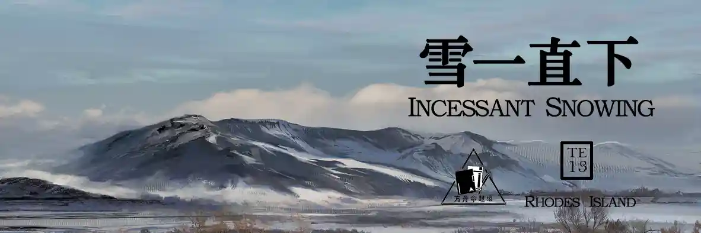
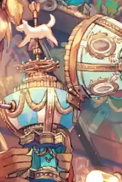
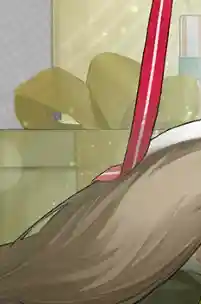
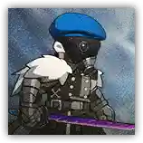
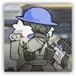
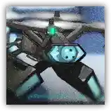
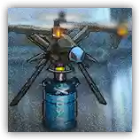

 {.centering}

天有洪炉，地生五金，晖冶寒淬照云清；{.centering}

星藏点雪，月隐晦明，拙山枯水大江行。{.centering}

——《天工开物》{.aright}

风起弹剑，雨过濯缨，权倾浊酒澄吾心； 

云晞万象，烟荡孤径，挹罢河汉共伶仃。

<!-- more -->

**【1】在新年支线故事“画中人”中，夕在早年间遇到了一个婆山镇的孤儿，应其要求，夕将她引入画境，让其在此生活。那个孤儿名单字为**

A. 雪

B. 黎

C. 露

D. 沁

**【2】乌有曾在勾吴城习武，但因遭仇家陷害被迫远走他乡，不着调的谈吐之下隐藏着一段惆怅的过往。以下关于他的说法，不正确的一项是**

A.乌有的二技能有三种效果，其中蓝色特效表示增加阻挡数和物理闪避的效果

B.乌有的模组可以使其天赋发动的冷却时间从4秒减少到3秒

C.乌有的英文名为Mr.Nothing，他的信物是一把纸扇，上面写着“子虚乌有”

D.“武”字最初的含义即“以武止戈”，乌有所学门派即传承了这种精神

**【3】在十三年前，凯尔希在文森特庄园直面“皇帝的利刃”，当时现场下起了黑色的雪。关于这段剧情，以下说法不正确的一项是**

A.内卫前来追杀凯尔希是因为之前她暗杀了斐迪南大公，被乌萨斯认定为叛国者

B.内卫是乌萨斯利用邪魔碎片而人造的产物，依靠装置和法术维持人的精神

C.凯尔希依靠Mon3tr与内卫势均力敌，但内卫最终判断无需杀死凯尔希而因此离开

D.内卫并没有真的将国度撒在庄园内，此事的痕迹被掩盖过去，最终不了了之

**【4】每年年底，大家都会迎来紧张刺激的跨年签到活动，通常会获得一套赠送干员时装。以下哪一项不属于跨年签到活动中的赠送时装**

|  |  |  |  |
| :---: | :---: | :---: | :---: |
| A | B | C | D |

**【5】虽然并不常用，但寒冷效果可以使敌人的攻击速度降低，冻结效果可以减少敌人的法术抗性。以下哪个技能无法使敌人进入冻结状态**

|  |  |  |  |
| :---: | :---: | :---: | :---: |
| A | B | C | D |

**【6】寒冷机制最早是只能敌方对我方施加的debuff，关于我方被施加的寒冷或冻结机制，下列说法中不正确的一项是**

A.处于“寒冷”状态的我方干员攻速下降

B.若我方干员已经处于“寒冷”或“冻结”状态，再次被施加的“寒冷”会变为“冻结”

C.“冻结”状态下，吟游者攻击范围内的生命恢复效果也将不再生效

D.目前只有止颂可以在“冻结”状态下主动开启技能，其他干员均不可以

**【7】在谢拉格，我们遭遇了各种奇形怪状的敌人。以下敌人中，不能对我方干员造成法术伤害的一项是**

|  |  |  |  |
| :---: | :---: | :---: | :---: |
| A | B | C | D |

**【8】到目前为止，每年的新年限定干员都会伴随一句剧情里的诗，也就是本期命题开头的四句。哪一位岁家干员的寻访卡池名不能够在其所属的一句诗内拼凑得到（逗号前后视为两句）**

A. 年

B. 夕

C. 令

D. 重岳

**【9】在这寒冷的冬天，在外面下着鹅毛大雪的时候，谁能拒绝一壶代表着生机与希望的热水呢？在极境的时装“雪夜回音”中，一共出现了几个热水壶？**

A.3个

B.5个

C.7个

D.9个

**【10】在银心湖列车活动中，完成相关任务后可以获得如下所示的宿舍装扮。关于该饰牌的描述，最恰当的一项是**

 {.centering}

A.千年风雪，众山颔首

B.过往落入水中，生出崭新的花朵

C.请收下这封由未知发件人经未知途径发来的未知礼物

D.只有想象能挣脱束缚，去往大地之上的地方

**【11】在关卡H6-4中，我们见证了全盛时期的霜星和雪怪小队的战斗力。请问下图中哪一种敌人没有在本关中出现过**

|  |  |  |  |
| :---: | :---: | :---: | :---: |
| A | B | C | D |

{style="float:left;max-width:20%;margin-right:1em"}

*扫一扫二维码查看本期答案*

[点我也可以哟ヾ(≧▽≦*)o](https://www.wjx.cn/vm/rbuJfki.aspx)<eod />

<FakeAds />