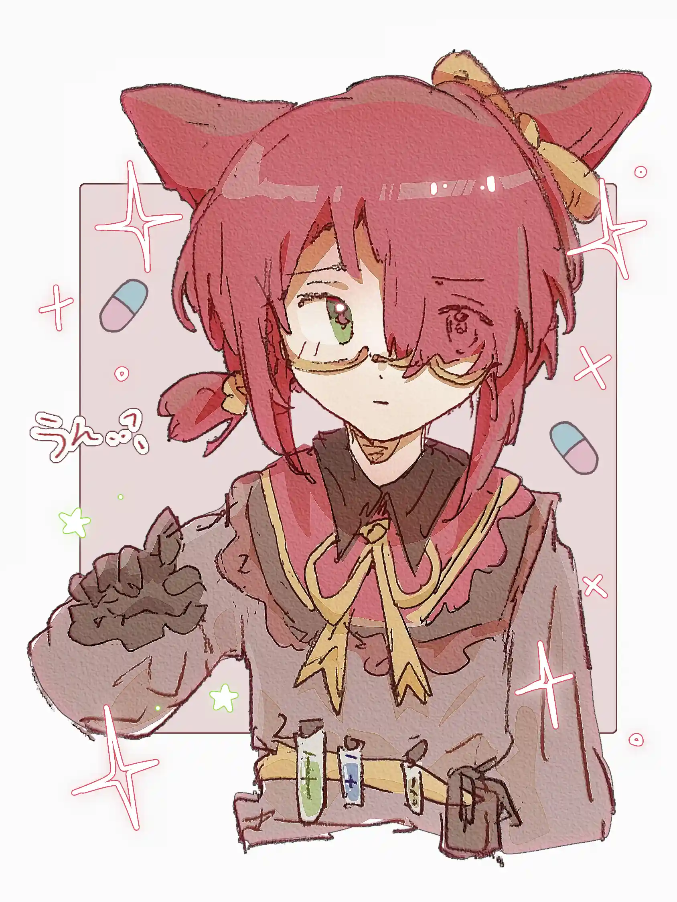

博士是熟读药学的，有一种专业和熬夜的美{.textkai}

<!-- more -->

## ∞.

今天也想去罗德岛交简历上班。然后用我的简历堆满整个人事部。

莱茵生命其实专业不对口，但是似乎也可以试试……

不带别的乱七八糟tag，就是我写一乐呵。

我流刀可她，名字（代号）是Ann。真•药学生出身，不出意外可能还是个学药分的。有点相声演员的潜质。专业知识那方面的记忆与其说是还有点印象不如说是刻在骨子里了。

（虽然现在本人不干分析了，改干安评了。不出意外的话罗德岛应当成为我的甲方……）

大概会一直跟某几位奶妈奶爸聚众扯淡。不知道会不会提cp向，要是有的话可能是黑钢相声组和流星*博士（我）。

北方话频繁出没，毕竟内含相声成分……

## 1.

其实Dr.Ann不是因为想搞科研才读博的。

“当时想的就是找一好点的饭辙。您说我一学药的，不读研读博深造难道要做药代吗。”

“深造是怎么回事？博士的专业要学些什么？”安赛尔纳闷地问

“药代是什么？”末药纳闷地问。

“有时候我还挺羡慕你们的……尤其是安赛尔你小子，一学医的还本科就参加工作了。”

要说不容易Dr.Ann也不容易。当年Dr.Ann还不叫Dr.Ann，成天不是在教室就是在自习室，眼镜片比瓶底还厚头发比眼镜片还薄。一到ddl就疲劳到过载，巧克力咖啡磕了不少最后还是不可避免地睡个昏天黑地。从有机分析物化生化色谱到生理药理人解都得雨露均沾，怠慢了谁都得要你狗命。您说59分差点过关？那是老师都救不了您了。到了读研读博就又是新的故事了……

这些破事没记住比记住了强。被干员们声称是个失忆者的Dr.Ann对此感到很不爽，为什么重要的事情都忘了这些完全不美好的记忆还一直留着。

“这个故事，可太真实了……”毛发暂时还算是浓密的卡特斯人心有余悸地说。

“药学院还有规律可循。中药院那就都是玄学了……”Dr.Ann看了眼末药的瓶瓶罐罐，突然想到了被中药识别支配的恐惧。光是记住那些药材的特征就够费劲了，再记住功效岂不是更要命，还好当年她记没用的东西极其快。

“噢！之前我听说过什么‘互为表里’之类的说法配药也会按这个规律尝试。但是凯尔希老师跟我说这里面有些现代医学解释不了的地方……”身量小巧的沃尔珀女孩发现了谈话中自己擅长的领域，立刻变得活跃起来。

“……对不起末药。”Dr.Ann听了这些专业不对口的知识一下子垂头丧气起来。

“我本科学的是药物分析，就算是天然药化和生药学讲过差不多的主要也是侧重如何提取有效成分那方面的。传统医学只选修过健康传播学，当时还觉得老师在唬人没认真听。”

“嗯……什么都是要学的嘛，我也不是一下子就学会药理学啊天然药化这些东西的呀……说起来在现代医学这方面博士也帮了我很多不是吗，那个什么'新剂型'也是博士和凯尔希老师一起教我设计的呀。”

“说起来博士居然也会改剂型啊……”一旁坐着的安赛尔若有所思地说。他印象中药物分析只是负责监测新药安全性一类的工作，大体上是个辅助性更强的专业，按理说应当跟药代室那些人在一处。而设计剂型则是由主修药物制剂的人负责的。

“给你们讲个笑话，我读本科的时候药分专业学工业药剂学，药剂专业学药物分析。哦，这个可以给末药——”Dr.Ann起身去书架上抽了本旧书，某几章泛黄的侧边可以看出来经常被人翻动阅读。书上天地笔记记得密密麻麻的，高亮部分彩笔划过的痕迹已经快要掉没了。

 {style="float:right;max-width:40%;margin-left:1em"}

“这是我当年读本科用的工业药剂学。末药可以看看里面把传统剂型优化成新剂型的部分，还是挺有意思的。至于你小子……咱们至少本科都毕业了学习资料就可着末药先来吧，我开了那么多信息检索网站的账号也都是整个罗德岛都能随便用了是吧 。”末药当然是如获至宝地接了，开心地摩挲着已经有些脏了的封面。

“好啦好啦，博士还有工作没完成，现在还不能休息哦——末药和安赛尔也先回寝室去吧，今天的专业交流会到此结束。”罗德岛的指挥官温柔又不容拒绝地将两位医疗干员请走，又拿来一沓子文件堆在Dr.Ann的办公桌上。

今天的医疗干员求知欲也是一样强呢。

## 2.

 “我可以夜间工作是种族天赋。我上晚班完全不累，所以我来这班岗的话大家就可以好好休息了。”安塞尔甩着一双大耳朵保持原样坐在电脑前说，嘴里还嚼着根清香四溢的芹菜梗。半小时之前Dr.Ann就看到精神涣散的萨卡兹小姑娘早就挂不住一脸坏笑，换了岗之后迷迷糊糊往寝室走，离开之前还忘了留下她特制的功能饮料——对此她一直怀疑安赛尔选这么个岗是故意的，并且芙蓉在另一个世界里绝对有个一米八四大个子还戴反光眼镜的网球运动员亲戚。

 “老娘夜间上班是专业天赋。”Dr.Ann一把薅下兜帽，呈大字状躺在滚轮椅子上。“还有吃的吗？”

  “博士晚上应该不吃夜宵少喝咖啡。”安赛尔下意识地说。

 “我不喝咖啡，可乐管够就行。”Dr.Ann开了冰箱门之后就差把整个人都埋进去了。“没有肉了吗？蛋也成？”

  “还真是秋高气爽那啥肥呀～”清爽的草木香气和温柔清亮的嗓音突然混入办公室闷热焦灼的气息。安赛尔也是刚刚才注意大腿下面坐着的裤子和办公椅的海绵坐垫已经汗湿一片了。

  “你可拉倒吧，这句话还是你跟我学的。”Dr.Ann毫不客气地回击。

  “晚上不吃点东西的话第二天拉不开弓的，也跑不动，会失去机动性的。”流星倒是理由充足地拉着Dr.Ann的转椅靠背把埋在冰箱里的人毫无关怀之意地拽出来，然后自己左手胡萝卜右手炒豆子嚼得满口溢香。

   “要一口吗？”流星把手里攥着的炒豆朝Dr.Ann扬了扬——她知道Dr.Ann不吃胡萝卜。

  “我想吃苹果。”Dr.Ann没好气地拈了几颗豆子说。库兰塔女人流畅优美的肌肉线条就在她眼前晃个没完，比起来她自己因久坐而堆积脂肪的腰腹和大腿真的弱爆了。

  “那以后有机会我们去定向越野。这个还是挺锻炼身体的。”流星好像看出了什么似的，没头没脑地说。

   “如果不需要在森林里挖蚯蚓吃的话。”

 流星发出轻轻的笑声，伸手摸了一把Dr.Ann脑后束着的低马尾——喜闻乐见地又掉下来几根，在办公室干净的地板上显得格格不入。

   “博士在工作时间要注意影响。”站起来边放松筋骨边围观这两个女人的安赛尔出言提醒道。

  “哎，你就敢说我。”

 “我怕流星姐拿我补充蛋白质。”

 “那你以为说完我你流星姐就不拿你补充蛋白质了吗。”

 “虽然不知道在说什么，但是博士也该补充点能量啦。”流星变戏法似的掏出杯冰冻酸奶贴到Dr.Ann脸上，塑料杯周围一圈水珠沾了两人一手一脸。

 “流星姐你看，博士眼睛都绿了。”安赛尔毫不留情地吐槽道。

而Dr.Ann含糊不清地说了声谢谢后便立刻撕开塑封膜大快朵颐起来。冻酸奶不像冰块一样质地致密，松散的空间很容易插进去勺子，流星好脾气地笑着看Dr.Ann从杯中挖出大块的酸奶冰块又一脸满足地塞到嘴里——每次都把腮帮子撑得像个札拉克族的小孩似的。

然后流星理所当然地得到了Dr.Ann的一整匣薄荷糖，三下五除二撕开塑料纸就含着糖离开了。草木香气中又多了一丝不易察觉的留兰香薄荷味道。<eod />

（责任编辑：广英和荣耀；网页排版：武乙凌薇；绘图：Danoka）

<FakeAds />