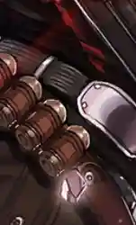
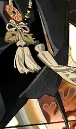

 {.centering}

真冷啊，之前明明还是那么熟悉的风和雪，阔别重逢竟然变得生疏起来了。有多久没有体会过这种温度了？是几个月，还是半年？一年？在那之后，原来已经过去了这么久了吗？{.centering}

——塔露拉{.aright}

<!-- more -->

**【1】在游戏中，除了龙本身作为种族名外，瓦伊凡和德拉克也属于广义上的泰拉龙族。以下哪一职业是这三个种族中的干员中还没有的？**

|  |  |  |  |
| :---: | :---: | :---: | :---: |
| A | B | C | D |

**【2】目前游戏中的泰拉龙族干员中，只有3名为男性干员。以下立绘截取部分中，哪一个不是男性干员的？**

|  |  |  |  |
| :---: | :---: | :---: | :---: |
| A | B | C | D |

**【3】瓦伊凡实际上不仅仅是种族名称，也是一个地名，干员雷蛇和香草就出身自这里。关于她们的剧情描述，以下说法中错误的一项是**

A. 香草的身高超过了一米七，比雷蛇和芙兰卡都高不少，但在两位前辈面前她还是唯唯诺诺

B. 香草特别喜欢饲养源石虫、源石蜗牛等小动物。在拜托博士照看的时候还叮嘱博士不能吃了它们

C. 雷蛇虽然平时做事一板一眼，但也很通情达理。在一次外勤任务中允许桃金娘等人摘些苹果回去开派对

D. 在“不义之财”别传中，压迫当地人民的银行作为雇主时，雷蛇无奈之下秉持了雇佣兵的职业道德，以雇主的要求为优先事项

**【4】陈和苇草都是具有异格形态的龙族干员。关于这两个人的技能描述，以下说法中错误的一项是**

A. 赤霄·拔刀可同时造成物理和法术伤害，且达到专精三后部署干员时技能就已就绪

B. 假日风暴在地面上留下的粘液区域可以对隐匿和无敌状态的敌人施加减速

C. 生灵火花开启后，苇草的伤害类型变为法术，且攻击力提高

D. 生命火种可以使受到灼痕效果的敌人受到持续伤害直到技能结束

**【5】风笛、塞雷娅、陈、伊芙利特目前在公开招募中可以使用高级资深干员词条招募到（小火龙虽然是萨卡兹，但是大概某种意义上也算龙）。其中哪一名干员无法通过选择合适的词条来必定招募到？**

A. 风笛

B. 塞雷娅

C. 陈

D. 伊芙利特

**【6】在干员琴柳实装后，其中文配音因为过于魔性洗脑而出圈，被称为“琴柳感”。将以下四句作战中的语音按照干员档案顺序排列，正确的一项是**

①你是否想过……朋友不再是朋友，家园不再是家园。

②你有没有听见孩子们的悲鸣？

③你不曾注意阴谋得逞者在狞笑。

④你有没有感受到城市在分崩离析？

A. ④②③①

B. ②④①③

C. ②④③①

D. ④②①③

**【7】目前游戏中种族为“龙”的干员只有老鲤和陈。老鲤作为风水大师，有自己独到的眼光和本事。阅读老鲤模组“无问吉凶”的故事，将缺失的部分按照正确顺序进行排列填空**

“鲤先生，您看这个......看出什么了？”

老鲤从手提箱里拿出一个罗盘，在房间里正反各转了三圈。一手捏诀，口中念念有词。

“你朋友说得对，你这公司开不下去，就是这房子的问题。”

“你看你这间屋子，东面无窗，<u>    1    </u>，北面悬空，<u>    2    </u>，南面正对另一栋写字楼，这是<u>    3    </u>，最要命的，这西面就是菜市......啧。”

“菜市怎么了？”

“<u>    4    </u>啊。”

“有理，有理！不愧是大师！”委托人凑到老鲤身边，看着空无一字的罗盘。盘面如镜，映着一张愁眉不展的脸。

① 难以聚财

② 冤家聚首

③ 是少阳气

④ 杀气过重

A. ①④②③

B. ③①②④

C. ③②④①

D. ①③②④

**【8】慑砂最早登场于“遗尘漫步”活动剧情中，在对源石武器的改装方面颇有心得。关于他的描述，以下说法中不正确的一项是**

A. 慑砂的二技能可以使被延迟引爆榴弹攻击到的敌人攻击力降低一段时间

B. 慑砂在场时，可以使所有被阻挡的敌方受到的物理伤害提高

C. 虽然慑砂平时说话中二气息十足，但那只是伪装成妄想症，必要的时候他还是会好好说话的

D. 慑砂曾在杜林的指导下修好了失控的机器，还被杜林族人的机械造诣所折服

**【9】在2023年的除夕夜中，五名干员给博士发来了祝福和礼物。请问以下哪一件礼物是老鲤送给博士的？**

|  |  |  |  |
| :---: | :---: | :---: | :---: |
| A | B | C | D |

**【10】德拉克作为维多利亚的两大皇族之一，自阿斯兰入主后便被认为已经绝嗣。但其实除了苇草之外，塔露拉的种族也被标记为德拉克。以下关于塔露拉的说法中，不正确的一项是**

A. 科西切在设法使魏彦吾杀死爱德华后，带走了当时还年幼的塔露拉，将其作为养女和继承人抚养

B. 塔露拉看清了科西切的邪恶面目后拒绝继续为其服务，刺杀了科西切，之后因为被科西切的源石技艺纠缠而主动成为感染者

C. 切尔诺伯格事件结束后，塔露拉被罗德岛暂时关押，但被九劫走，随后跟随新整合运动同行

D. 塔露拉和爱布拉娜在维多利亚的沼泽地相遇，战斗后塔露拉拒绝了爱布拉娜的合作邀请，二人不欢而散

{.image-left-float style="max-width: 20%;"}

*扫一扫二维码查看本期答案*

[点我也可以哟ヾ(≧▽≦*)o](https://www.wjx.cn/vm/hQbgckz.aspx)<eod />

<FakeAds />