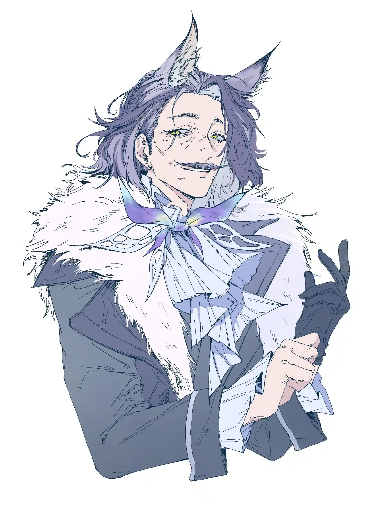

从那小小胸膛的绵长起伏里，哈洛德听见了麦浪声。{.textkai}

荒茫无垠的麦浪声，正蓬勃着向他呼啸而来。{.textkai}

<!-- more -->

完犊子了。

这是最后一头幼崽。哈洛德拽着腿把它从母兽体内拔出来，一眼就看见了那双发白的瞳孔和没有丝毫起伏的胸脯。

也是个死胎。

无名的血气直冲上脑门，撞得他两眼发黑、一条腿打颤。哈洛德试图调整自己的重心，好再次站稳。他嘶哑地用维多利亚语喊，里斯本！里斯本呢！赶紧给我过来——

尸体在他怀里颠了两下，牙关被磨开了。哈洛德听见它喉咙里传来几阵咕噜噜的声音，紧接着，棕黑色、夹杂了腥骚气和血丝的粘稠液体就从每一个洞里淌出来，温热着流过他的手臂。

……别，别想起来。

求你。

有人叫他，里斯本来了。老兵端着热水盆和毛巾一路小跑，脸上的表情在看清他怀里抱着的东西时凝固成冰。

“……死了？”

“死了。”他咽了口口水，“产了仨，都是死胎……母亲没什么大事，但是得把她单独隔离几天，别和别的驮兽关在一起……”

“都知道了。头儿，主人家叫咱们进去喝杯热茶。”

“你先去，我得给这姑娘做产后处理。”

里斯本把热水盆放下，深一脚浅一脚踩着雪离开了。哈洛德目送他消失在兽棚的拐角处，终于干呕着跌坐在地上。

这场面他见过——奶奶的他可见过太多次了！孩子；死掉的孩子；死在街角血水坑里的女人和距她一步开外的还连着脐带的孩子……他都见过，他有的是经验——

去他妈的吧，哈洛德想，这难道还是什么值得骄傲的事吗？他——还有他的亲兵们——他们凭什么对这种一辈子见过一次都嫌多的画面有经验？

刚刚经历了难产的母亲走到他身前。她看上去很虚弱，但还是遵从本能伸出舌头，舔舐幼崽的胞衣。哈洛德腾出一只手，抚摸她的角：“好姑娘，好姑娘……是我的错，是老哈洛德的不对，没能给你救下哪怕一个孩子……来吧，至少给你消个毒……”

他用手轻轻推拒驮兽，但后者却一反平时善解人意的作风，近乎执拗地用鼻子和前蹄轮番折腾那具发凉的尸体。

“没用了，姑娘！你的孩子们都没命了！”

母兽仍然抵着他，发出不赞同的低沉长鸣。哈洛德只好有些懊恼地把双手插在她和尸体之间，试图阻止驮兽无谓的行动——就在此时，他忽然清晰地感知到，他的怀里，那头本应被宣告死亡的驮兽幼崽，正发出细不可闻的咳嗽声。

他的心开始疯狂跳动。

里斯本被他的大喊叫了回来，带着一盆新打的热水和厚毯子。“它还活着么？”老兵用颤抖的双手捂住自己的口鼻，生怕话语间呼出的冷风吹到脆弱的新生命，“它还能活下来吗？”

哈洛德说：“我会让它活下来的。”

主人家收拾好了客厅，为他打出一张地铺。哈洛德把幼崽裹严实，放进壁炉旁的小窝，检查过炉内柴火确实充足，这才钻进被褥里；合眼不多会儿，又起身去温了瓶奶。

“来吧，好小伙子。只要撑过今晚，你就没事了。”

临近黎明，那只被他抱着暖了整夜的驮兽幼崽突然“哇——”地叫了出来。哈洛德被突如其来的巨响吓得一个激灵，直接从椅子摔到了地板上。

母兽循着这急切的呼唤拱开门，带进一丝料峭的春寒。他把幼崽放在地毯上，起身去关门。大难不死的孩子此刻仍保持了那份顽强，硬是用四条打颤的细腿挪到了母亲身下，大口嘬起了母乳。

哈洛德蹲在角落里，眼泪止不住地淌。他也说不清自己究竟在哭什么，但他就是想哭，而且要哭个痛快。幼崽吃好了，精神看上去更加饱满。它迈着凌乱的步伐爬向哈洛德，不由分说地在他肚子上卧下。

哈洛德用颤抖的双臂环住怀中的生命。它已经打起了盹儿，呼吸逐渐放得平缓。从那小小胸膛的绵长起伏里，哈洛德听见了麦浪声。

荒茫无垠的麦浪声，正蓬勃着向他呼啸而来。<eod />

2023/12/25{.aright}

（责任编辑：广英和荣耀；网页排版：武乙凌薇，绘图：创造死亡）

<FakeAds />