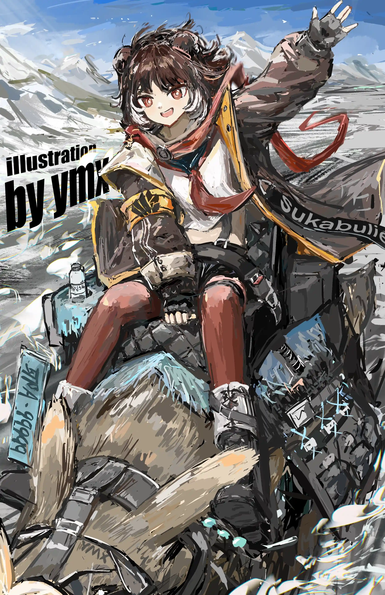

太阳慢慢落下，但谢拉格不会变；{.textkai}

太阳还会升起来，就像落下时一样{.textkai}

<!-- more -->

罗德岛越来越远了，连同周围单调的景色一齐，在博士的眼中逐渐变成淡薄的剪影。

太阳慢慢落下，橙红色代替了此刻所有存在的色彩，遍布他能看到的整片天。

博士裹紧了身上的毯子，熟悉的味道，柔软的座椅，令他有些昏昏欲睡。

车开的很稳，就算是在崎岖的荒原上也丝毫不会感到颠簸，身旁端坐着的卡斯特少女安静的翻阅着手中的终端，导航界面里，他们所在的位置正在实时发生改变。

他闭上了眼，这是他第一次不戴兜帽外出，作为备选方案，他戴着很久以前在龙门买的面具。

闭眼前，博士一行人还在荒原上疾驰，等到黑暗完全吞没那辆小越野车。

再次睁开眼，博士依然身处开往谢拉格的观光列车。

他打了个哈欠，向外看去，窗外是白茫茫的一片，到处都是雪，还有被雪覆盖的山，被雪覆盖的树。

博士几年前曾经来过一次谢拉格，当时这里还处于三家分权的状态，而他也只不过是受邀去参加一场棋局。

这里留给他的唯一印象就是又干又冷的雪，除去这些，其实谢拉格和乌萨斯的区别并不大，哦，还有山，谢拉格的圣山也是让他印象深刻的点。

他望着窗外出了神，坐在他身边的阿米娅仔细翻阅着车上附赠的旅游手册，有些地方被小兔子细心地圈了起来。

那是他们到站后要去参观的景点。

说起这次长途旅行，原定是罗德岛要派遣新人前往位于谢拉格的联络点进行工作，但出于某些意外，最终还是变成了博士和阿米娅的短暂假期旅行，当然，随行的还有作为博士护卫的精英干员sharp。

“博士，列车马上就到站了，咱们下车之后先去提前预定好的民宿稍微休整一下，再去找家特色菜馆……你有很想去的地方吗，咱们也可以下车之后先去。”

列车即将进站，机械播报女声把博士的思绪从窗外的世界拽了回来，他眨了眨眼，随手整理了下身上穿着的加厚制服，才转过头对上阿米娅的目光。

“啊，没事，我没什么特别想去的地方，依你的安排就好，辛苦你了阿米娅。”

博士自然地抬起手摸了摸小兔子的头，发顶柔软的感觉让他忍不住多停留了一会儿，索性阿米娅并不讨厌他的动作，二人在列车到站前的几分钟又随便聊了几句。

周遭基本都是来旅游观光的人，极少数是闲得无聊的本地人，他们密密麻麻的挤在候车大厅，依稀能闻见请冷空气中驼兽的味道。

博士一行人被挤在中间，他们随着人群的移动而移动，耳边充斥着各种语言还有音响里传来的列车运行时间安排。

最终还是sharp一手举着行李一手尽力推开面前的人才成功让他们离开乱糟糟的候车大厅，当户外干冷的风扑在博士的脸上时，他才对谢拉格有了更加真切的认识。

新鲜空气让戴着面具的博士好受很多，阿米娅拿起终端举到头顶的耳朵前，看样子在打电话。

Sharp安静的站在一旁，他点了根烟用以驱散路上的疲惫。

道路两侧是各种小铺子，谢拉格特产和特色菜吸引了大量的游客，人声鼎沸中偶尔也会听得到驼兽的吼叫。

难得的晴天，没有下雪，阳光洒在雪上，远处能看见高耸的白色山峰。

三人各做各的事，直到烈夏的到来。

 {style="float:right;max-width:40%;margin-left:1em"}

“博士！你们也来谢拉格了啊！你们是来玩的，还是带着什么任务啊。”

穿着水手服的乌萨斯少女高举着双手在人堆里又蹦又跳，她热情的大嗓门甚至能完全盖住博士耳机里的后朋克音乐。

博士举起手和她打起招呼，而烈夏也是快速跑过来搭住博士肩膀，她脸上洋溢着笑容，看得出二次回到谢拉格让她很开心。

“烈夏啊，能在这里遇到你还真不错，这几天在谢拉格待着感觉怎么样，和你那便宜爹的关系有没有更进一步。”

博士还是很喜欢听从干员身上传出来的八卦的，他在罗德岛的办公室里就有专门让梅尔做的用来存放各种小道八卦的录音机，甚至还有多达数十个的吃瓜群聊。

人生苦短，总是得学会给自己找乐子。

这是博士在吃瓜群被发现后对凯尔希的狡辩的第一句话。

“这没什么好看的，除了山比乌萨斯多点，蜂蜜饮料比乌萨斯卖的好喝点，剩下的和乌萨斯没什么两样，那个高高大大的神像也没有其他花样，纯粹就是个大石雕罢了，至于我那个爹，虽然很不想承认，但他对我妈的感情确实是实打实的，不过我也不会就这样原谅他就是了。”

烈夏乌拉拉说了一大堆话，博士能看得出来这小姑娘在这个地方确实憋坏了，他附和的笑了几声，又想起前几天在岛上听见的有关烈夏妈妈的传言。

有位不知名人士在努力的追求烈夏那风韵犹存的美人母亲，但是好像除了说说以外没有听到那位仁兄采取任何实质性行动，也许这个消息可以让烈夏那个便宜老爹有危机感，或许自己还能从中捞上一笔，博士眼珠子转了转，抬起手打算继续套套烈夏的话。

“博士，烈夏小姐，咱们可以一起去预定的民宿，到了那里再接着聊吧，可以吗。”

阿米娅眯着眼睛微笑着打断了他们之间的谈话，她顺势抓住博士的衣摆，他能清楚地感受到衣摆处传来的巨大力量。

“啊，差点忘了你们才刚到这里，你看我这记性，见到你们太开心了，抱歉抱歉，你们预定的民宿在哪里啊，离车站远不远，我认识几个出租驼兽的小贩，不算贵，你们可以先把行李送过去。”

博士没有回话，他打开终端，阿米娅的信息，上面写着让他不要随便用八卦去赚钱，不然她会生气的。

博士选择遵从自家小兔子的意见，他关上终端，让烈夏叫来驼兽拉走了他们的行李，sharp放心不下，决定先跟着驼兽去民宿，顺带自己转转。

三人开始向着民宿的方向前进，边走边聊。

一路上最多的就是卖东西的小铺子，什么谢拉格圣山山顶处的纯洁空气，谢拉格圣女亲自开光的雪山石，耶拉冈德的小比例雕像，圣女大人的抱枕，甚至还有博士几年前就看到的卖耀骑士临光周边的铺子，这次店家又上新了黑骑士的周边，看得出来销量很不错。

再往前走就是一家小酒馆，典型的乡村风，用木头堆叠起来做成墙壁和屋顶，最外面的木门上挂着写着谢拉格语的招牌，是家老馆子，用作招牌的木牌有很多的豁口。

烈夏滔滔不绝的向博士和阿米娅介绍着这些，她说这家酒馆的蜂蜜酒很好喝，就是度数高了点，她总是喝醉。

“嗯，这里的蜜饮比我在阿托克斯那里喝过的还要好，这里的更有原始的味道，听店家说他们使用正宗过滤雪水做的，博士和阿米娅，你们有时间了真得来尝尝，到时候我请你们喝，我还知道些其他不错的酒馆。”

烈夏介绍的时候，有很多人醉醺醺的推门而出，他们勾肩搭背的走在路上，在转角处一起摔倒，然后就那么躺在雪地里，他们唱着不知名的歌，等待着各自的老婆或者女朋友过来接。

这是正常现象，就算再怎么变，这些人的生活也不会因此而改变。

特色饭店也有很多，但大部分都是挂着特色招牌的小饭馆儿，店面不大，但却座无虚席，烈夏对吃没什么太大的讲究，反正这些菜都是一个味道，她说差别不大，有的还没乌萨斯的菜好吃。

继续走，这里是商业区，没有那么多的人住。

穿着水手服的乌萨斯少女兴奋地带着身后的面具男和卡斯特穿越大街小巷，三人逐渐融进来来往往的游客中，直到乌萨斯少女清脆的声音逐渐淡然。

阿米娅买了很多东西，大包小包的提着跟在博士身后，这些都是她给岛上的各位带的礼物，有些小饰品则被她直接装饰在外套上，这是她用自己攒下来的钱给自己买的旅行纪念，当然，还有博士的份。

她为博士准备了一个新的马克杯，还有混合了谢拉格特殊香料的速溶咖啡，新的杯子上特别打印了一个兔子标志，那个速溶咖啡据说可以让人快速消除疲惫。

博士也为自己的兄弟们买了不少东西，给黑角的有谢拉格特色花纹的太刀保护鞘，给斑点买的耶拉冈德书立，还有给凯尔希买的钢笔，据说是什么雪山限量款，金属的笔身上印着雪山图案。

送给阿米娅的是一个小香包，里面装着特殊的香料，还有一点点来自圣山山顶的雪山晶石，她很喜欢。

“哟，老板，这香包和其他地方有什么区别啊，卖那么贵。”

“您有所不知，我铺子里的这香包可是装了谢拉格特产的能够安神的香料，还有我从圣山山顶上挖出来的晶石。”

“这东西我去炎国的中药铺子和铁匠铺就能凑出来，还用得着来你这里买啊，给我点实质理由。”

“雪山晶石象征着守护，以及陪伴，传闻说，只要能一起爬上圣山，那么耶拉冈德就会降下祝福，被祝福的人无论发生什么都会陪伴在彼此身旁。”

“无需多言，我买了，刷卡可以吗。”

“成交，您真有眼光。”

到达民宿，天已经快黑了，黄昏在谢拉格很少见，也许是因为晴天的缘故吧。

橙红色的光芒染尽整片天空，白色的雪山散发着柔和光芒，随着太阳一起燃尽。

Sharp站在民宿门口，他点燃了一支烟，然后和博士他们一起抬起头看太阳落山。<eod />

（责任编辑：瑶濯；网页排版：武乙凌薇；绘图：我ymx没有开挂）

<FakeAds />