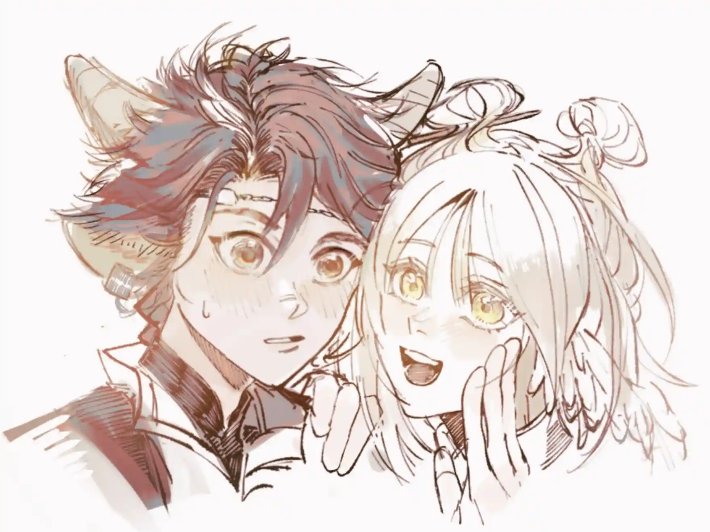

大荒非荒象，人岁亦繁忙{.textkai}

黄碟飞牧笛，竹马生田蔓{.textkai}

<!-- more -->

## 牧童短笛{.centering}

小满将苇叶哨放到嘴边，新编的曲子已经有了雏形，但怎么吹都不甚满意。她把哨子拆开，有折痕的地方已经能隐隐看见内里的嫩绿纤维。罢了，之后重新做一个吧。她撇了撇嘴，转身拿了饲料去喂牧兽。

“绵绵，你说……大水牛复习得怎么样了？”

下个月就是禾生去考校的日子，大荒城人人都知道天师府里的都是能才，不是能让庄稼产得更多，就是能把农田迁到会轰隆隆爬来爬去的地块上。小满知道禾生要考的是农业天师，除了要背那些厚厚的书，也要能自己种出东西来，还要会操作那些嗡嗡作响的天桩，许多人学破头了也进不了天师府的大门。

“我们去看看他，怎么样？”

绵绵载着她去到了田间，再往前牧兽容易踩坏庄稼，她从牧兽背上跃下，顺着田埂跑向试验田。

“喂——大水牛——”

只有抽了穗的稻谷朝她点头。真是奇怪，他去哪了？黎博利满腹疑惑地去到了禾生住的地方张望，屋子里连丰蹄的半只角都看不见。或许只是被职农们叫走了呢？晚上总能碰到他的。

奈何变化总比计划多，兽棚里母兽受惊早产，小满跟着老职农们忙前忙后，等到幼兽能自己站起来的时候，双月已经爬到了头顶。她和禾生住得近，她撑着下巴坐在窗前等着那边的灯亮起，看着看着，上下眼皮开始说悄悄话，望着望着，羽兽做的风筝载着她在梦里飞上天，飞到流星坠落的地方，飞到大荒城的外面。

阳光将她吵醒，小满揉揉眼发现自己竟然躺在床上，被子盖得好好的。

“拜托，帮我看看大水牛去哪了。”

羽兽啄完了她手中的苞米，咕咕几声扇了扇翅膀，她知道它答应了。等到下午的农活忙完，羽兽带回来一群同伴，叽叽喳喳向她汇报。

“哦……早上去田里看稻谷，下午去了高高的屋子里，然后去了……南边？”

小满闷闷不乐地抓出一把饲料犒劳了羽兽们。高高的建筑自然是学堂，南边的则是几个月才来一趟的商队。除了补给的物资，他们带来的还有新奇的物件和大荒城外的见闻，无论是孩童还是老人都最期待载具轰隆隆的声音。

好你个大水牛！黎博利鼓着气穿过整齐的街道，可真到了集市，她只能茫然地看着人群在她周围喧嚷不停，这么多摊铺，她上哪去找禾生？

裹着晶莹外壳的糖葫芦、拧上发条就能跑一里地的机械乌云兽、只有过年才能穿的布料，在灯光的照耀下流淌着细腻的光泽……小满踮起脚吃力地望着高台架上的那些货品，要是禾生在就好了，他最近开始长个，几天不见就蹿出去一大截，跳起来都能够到高粱穗了。

不行，不能想他，想他作甚？

原本逛一天都觉得不够的集市顿时索然无趣，小满决定去坝口，至少那个樵夫大叔会听自己吹笛子。但人流太拥挤，她努力向前却被冲得东倒西歪，即将撞上桌角时，一只手牢牢地抓住了她。

“小满！”禾生拉着她进到了一旁的商店里，“没撞到吧？”

“……没有。”她低下头理了理被挤得皱巴巴的裙子。

“我……”

“这几天都没见到你，原来是自己偷偷跑了出来！”

禾生急得直挠头，奈何小满说的也没错。

“我这不是想买点东西……”

“哦？什么呀？”

“不，不能现在说……但，但是送给你的！你再等三天好不好？”

“说好了哦，不然我让绵绵去拱你屁股！”

拉完钩，小满又觉得集市上的一切变得新鲜，她买下一截彩线，系在了禾生的稻穗辫上。

三天就在牧兽咀嚼草料的声音里一晃而过。小满又编好了新的苇草哨，这几天把新的旋律续上了不少。绵绵低低地哞叫，她转过头去，禾生一只手背在背后，明显是拿着什么东西。

“先说好，不准笑我。”

“不笑不笑，我保证。”

话是这么说，笑容还是在她的脸上绽开。禾生深吸一口气，拿出了手里攥着的东西——那是一根竹笛，尾部的笛穗用金色和青色的玉线编成，如同成熟的稻株。

“我曾听一位外地来的天师说，苦竹做的笛子最好，声音清亮，但大荒城不产苦竹，就提前几个月找商队定了一支竹胚。”

小满摩挲着这支竹笛，笛孔边缘光滑明显经过了精细的打磨，从笛头往笛尾看去，内径均匀没有虫蛀的痕迹。她贴好笛膜放到唇边，气息刚刚递出去就能听见准确的笛声。

“你的陶笛之前不是不小心磕碎了，我就想着重新为你做一把。”

“谢谢大水牛！”

她站到绵绵身上摸了摸禾生的头。黎博利忽然想起，此时正是下种正当急，三天遍地黄的节气。

小满大满江河满。

“天师禾生，你去考场那天要等我来送你哦！”

绵绵低头啃了几口草，载着二人迎着夕阳回家。

六月初，邻居都来为禾生送行。他一一谢过乡亲们，手里两只手里拿满了瓜果蔬菜。行至半路他抬起头，小满正坐在树上朝他挥手。

“你这次要是掉下去摔了腿，可就没人背你回去了。”

“放心，我坐得稳稳的！”她把那支刻着“小满”的竹笛横到嘴边，“我新编的曲子，只吹给你听。以前都是你写词，这次我来填。”

***山青青呀水悠悠，月光洒在河上慢慢流***{.centering}

***小船小船摇又晃，我种下种子等花放***{.centering}

***星星挂天上不说话，外面飘来的种子发芽啦***{.centering}

***你坐上小船去远方，稻花儿飘飘落手旁***{.centering}

***飘呀，飘呀，我送你去远方***{.centering}

## 忙趁东风放纸鸢{.centering}

春风起，天师府近些年研制的农用无人机已经开始辛勤工作，除了四四方方的机械，从南方回来的羽兽，搭载了配重的风筝也在蓝天下舒展身姿。小满眯着眼睛抬头瞧了一会，又把视线落回到操控者身上。

“大水牛，怎么样啦？”

禾生还在专注地控制着绞盘，小满唤了几声不见有反应，用竹笛戳了戳禾生的肩膀，这才让丰蹄转头。

“喂——笨水牛！风筝都搭着三个我的重量飞了好久了，该让我上了吧？”

“别急，先收回来看看各项数值。”

能载人飞行的装备现今已不少，但大炎人似乎对风筝情有独钟，千年来随着材料的不断改进新式的风筝层出不穷，无论是过年过节翱翔天空的龙凤吉祥，还是天师们比拼源石技艺用的改良运输型，老老少少喜闻乐见。若要问这和滑翔翼有什么区别，大家一定会异口同声地回答：

“有牵挂的才是风筝。”

坚韧的牵引线在绞盘上绕了一圈又一圈，风筝靠近山坡时被一阵风托住，稳稳当当地降落。禾生点开数据收集仪认真分析了一会，悬着的一颗心堪堪放下一半。

“我们去钦天监看了好多次风向球，我也问过羽兽们，今天最适合放风筝！”小满原地转了一圈展示自己的新造型，“我可听你的话啦，把头上多余的发簪拿了下来，特地穿了保暖防风的衣服。”

她将头发盘成了两个圆圆的发髻，换上了一身竹青色的长袖长裤，禾生上上下下仔仔细细瞧了一会，认真评价到：

“好看。但是天上风大，你还是穿上我的外套。”

小满瘪了瘪嘴，这套衣服可是今年新买的，不过看在他关心自己的份上，他只一句好看也无妨。

“大水牛不冷吗？”

“我们丰蹄身体健壮，不怕冷。”

其实天气不算冷的时候他本就不怎么穿外套，只是担心某人觉得自己能硬抗，今日特地带上了。

“我们黎博利体重轻，最适合飞上天啦！”

他们身高差了三寸多，再加上肩宽的差距，自己的外套罩在小满身上倒像是给她套了个大麻袋。禾生一边把风筝骨架上的系带仔细扣到她身上，一边讲解：

“左手这边控制方向，右手这边……”

“我知道我知道，向你示意升高或者降低。如果发生紧急情况就按这个发射信号弹你会把我拉回来。”

“紧张是正常的，害怕就闭上眼，稳住重心。”

小满连连点头，忽然好奇一个问题：

“大水牛，你头一次飞上天的时候害怕吗？”

“真的想知道？”

“不许骗我！”

“我知道自己的源石技艺能操控风的时候，第一个想法就是想飞起来看看。我特意买了一架超级大的纸鸢，背上背着风筝，一手拿一把伞，从坡顶冲刺，然后——”

“然后就飞起来啦？”

“倒确实在空中扑腾了几下，然后伞被气流吹翻了，摔了个狗啃泥。”

“噗……哈哈哈哈哈哈！大水牛你还有这样的时候！等等，是不是那次你莫名其妙鼻青脸肿地回家？你还说是路上脚滑跌了一跤……”

“要是跟你说实话，你肯定要缠着我陪你再来一次。”

好嘛，就像自从知道禾生的源石技艺进学课是练习用风筝把人吹上天后，小满就一直计划着让他也带着自己玩一次。不过说到这门课，她可就来气了：

“哼，那个王天师也太赖皮了，明明他自己摔折了好几次腿，医馆的大夫天天拿他做反面例子，他居然说你没把五个人吹上天是胆子小，还扣你的分！”

“年终成绩丙级三等确实是我考核时没发挥好……”

“等我考上了天师府，一定不选他的课！”

二人平日里虽时不时斗嘴，但关键时刻一定站在同一战线，禾生保持嘴角上翘检查完细节，拿起绞盘放出十来圈线，又把注意事项再叮嘱了一次。

“大水牛，你唠唠叨叨的样子好像黍姐姐哦。”

“我没有老师那么博学多才……”

“但是只有你愿意送我去看云呀。”

禾生只觉有炭火放在脸边烘烤，连忙唤来清风把温度降下去。

一切准备妥当，小满握紧把杆，禾生深吸一口气，东风应召而来，盘旋着将黎博利吹离地面。线圈唰啦啦地跟着她不断拔高，快绷直时风改变了方向，托着她在空中悬停。

“喔哦——”

脚下失去支撑的一瞬间小满本能地感受到了慌张，熟悉的景物在视野里不断远离，昭示着高度的不断增加。她想闭上眼，但奇妙的胜负欲涌上心头，她一边平复着呼吸一边看将视线放远，只见还未种上作物的水田如明镜反射着天空的蔚蓝，白云悠闲地爬上了一座又一座的梯田，偶尔日光被遮住时又变成远方山头分出了苍绿的树荫撒在田中。

空中的风果然更大更急，她只能在呼啸声隐约分辨出地面上禾生在喊她的名字，兴奋已经取代了最初的恐惧，她拉动右手边的拉杆示意可以升高，不一会后白云离她更近了。那边在移动地块上的像一头耕牛，拉着教科书上画过的犁耙在辛勤耕地，旁边像棉花一样那朵云被风吹出了长长的脖颈和翅膀形似鹭鸟。它们慢悠悠地靠近，最后融在一起不分你我。

禾生看见风筝稳稳当当飞起来时终于松了一口气，小满适应得很好，很快就学会了在空中盘旋，还多次示意他放线。他也没敢放太多，总不能真放任她飞出视野。为了稳定性和功能性，运输型的风筝抛弃了五花八门的外观，但流线型的轮廓从地上看去真如展翅翱翔的羽兽。再过几年小满也要应考天师府，她那神奇的能与动物沟通的能力只留在大荒城当农业天师或许有些屈才，去百灶进学是更好的选择……禾生没由来地心慌，生怕没捏好手中的牵引线，黎博利当真会变成羽兽飞走了。

黑白的身影互相追逐着掠过，候鸟南渡北归本就是物候流转，难道因为担心它们不会回来就强留它们忍受北方的寒冷？

禾生盯着那双燕子出神，直到它们飞向更远方的池塘，变成了黑色的小点再也看不清。头顶忽然传来尖锐的破空声，他连忙收回牵引线，稳稳地接住了小满。

“我还以为你要在天上待更久。”

“云都被吹散啦，而且太阳也有点晒。”

小满脱下宽大的外套递给禾生，慢慢分享起她在不一样的视角下的见闻。

“我顺着数了一遍，找到了你的试验田。还有从前抬头都看不见顶的城墙顶上原来真的有人在巡逻……”

把大荒城的东西南北说了个遍，她眼珠一转又有了新点子：

“大水牛，你教我怎么操控运输型风筝好不好？这样你也可以上天了。”

“我借着风筝飞起来过好多次。”

“那不一样嘛，是我牵着你。”

禾生只觉得舌头被春风缠住，无论是赞同的还是反驳的话都说不出口，而小满想起先前的话，穷追不舍：

“你还没好好回答我的问题呢。”

“啊……？”

“你摔了一嘴泥那次不算，真的飞起来的时候会害怕吗？我下来才发觉手心都握出把杆的印子了。”

“那当然是怕的，同学和老师的风一个赛一个强，还总是互相打架，你差点就要在医馆看见我了。”

“笨！我是说你向下看的时候会不会恐高啦！”

“看见畜牧区有一个黄白色的小人在蹦蹦跳跳，顿时就不怕了。”

“喔，我这次倒是看见长了角的黑色脑袋杵在原地一动不动。”

二人一同笑起来，新发的嫩草被这笑声感染，迎着春风一齐弯腰。

“好水牛，你就教教我好不好？春天多适合放风筝啊！实在不行我学到夏天、秋天，冬天再放也行……”

“你当真要把我放上去淋雪？”

“我们裹成粽子再出来嘛，我先上去替你看看瑞雪是怎么兆丰年的！”

禾生忍不住伸出手捏了捏小满的发髻，她连忙抱住头挪到一旁：

“鬏鬏被你捏扁啦！”

“是被风吹塌的。”

“风也是你指使的，坏水牛！”

趁着下午的风温和，丰蹄手把手地教黎博利如何不用源石技艺将新型风筝放飞到空中，他们手一齐拉住了它的牵引绳。<eod />

（责任编辑：广英和荣耀；网页排版：武乙凌薇；绘图：KZM）

<FakeAds />