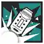

 {.centering}

Do you think I have time to use the bathroom?{.centering}

——Blitz{.aright}

<!-- more -->

**【1】彩虹六号的干员进入泰拉世界后也都有着各自的绝活。以下技能中，哪一项不是属于彩虹六号阵营的干员的技能？**

|  |  |  |  |
| :---: | :---: | :---: | :---: |
| A | B | C | D |

**【2】由于使用的作战装备都是枪械，部分彩虹小队的干员技能是弹药类型的。以下技能中，哪一个开启后装填的弹药数量最多？**

A. 灰烬-突击战术

B. 医生-以暴制暴

C. 导火索-火力侦查

D. 艾拉-“博萨克风暴”

**【3】在灰烬一行人被罗德岛干员询问身份时，闪击让战车赶快编一个阵营名字，战车当时编造的是**

A. 海豹物流

B. 北极熊物流

C. 海鸥物流

D. 虎鲸物流

【4】霜华和艾拉都是彩虹六号阵营里的陷阱师。关于这两位干员的作战特点描述，以下说法中不正确的一项是

A.霜华的迎宾踏垫可以对敌人造成自身攻击力一定比例的法术伤害

B.携带技能“击倒猎物”时，若敌人触发迎宾踏垫时在攻击范围内，霜华会立刻对其进行3次攻击

C.开启模组后，艾拉自身可以额外部署在近战位，其陷阱可以额外部署在远程位

D.开启技能“震荡坚守”后，艾拉的攻击范围缩小，但防御力增加，攻击会造成溅射伤害

【5】目前彩虹六号阵营的干员中，共有5名具有自己的时装。以下哪一张图片不是取自彩虹六号干员的时装中的？

|  |  |  |  |
| :---: | :---: | :---: | :---: |
| A | B | C | D |

【6】源石尘行动和水晶箭行动中，都具有其活动内独有的机制或道具。关于它们，以下说法中不正确的一项是

A.处于沙尘暴中的我方单位会降低50%的攻击力，并受到真实伤害

B.亚叶的天赋“药物阻断技巧”可以对沙尘暴带来的真实伤害生效

C.诡雷布设装置发出的侦测线遇到高台地形或者封阻物时即停止

D.封阻加固装置可以立刻将其前方的封阻物加固，并回复满生命值

【7】哥伦比亚联合政府军队的马特奥是水晶箭行动的首领敌人，同时和潘乔·萨拉斯在外貌上有相似之处。请问马特奥的军衔是
  
A.上尉

B.军士长

C.中校

D.上将

【8】在干员档案的角落中，经常有一些趣闻。以下关于档案剧情的说法中，不正确的一项是

A.战车的信物是一组源石虫外形的俄罗斯套娃，而导火索也给一个孩子做过一组可以弹射的俄罗斯套娃

B.双月作为情报人员，在来到泰拉世界之后一直致力于周游探索。她曾坦言相比于其他队员，她并不是很想回到地球

C.从灰烬的模组记录中，我们可以得知罗德岛的食堂里有蓝色的番茄和方形的土豆，这也让灰烬感到诧异

D.闪击曾独自一人深入焚风热土探索，但除了干旱和黄沙之外一无所获，并没有发现任何生命迹象

【9】（联动题）实际上，彩虹小队干员们的技能图标中，有一部分是基本沿用的他们在彩虹六号游戏中的人物代表图标。以下技能中，最不满足这一特征的一项是

|  |  |  |  |
| :---: | :---: | :---: | :---: |
| A | B | C | D |

【10】（联动题）医生是近卫中为数不多具有医疗能力的干员，在彩虹六号中他也可以从远处发射药物注射器来治疗自己或者队友。关于医生在彩虹六号中的描述，不正确的一项是

A.和明日方舟中一样，激素手枪的使用次数上限为3

B.激素手枪可以治疗包括敌人和人质在内的所有人

C.激素手枪必须装填了相应子弹才有效，否则无法进行治疗

D.激素手枪一次只能装填1发子弹，打出后需要重新装填

【11】（联动题）彩虹六号阵营的干员都有现实中的出生地。以下人物和其出生地国家的对应关系中出现错误的一组是

A	战车-苏联/俄罗斯	霜华-加拿大

B	导火索-美国	艾拉-波兰

C	灰烬-以色列	闪击-德国

D	双月-荷兰	医生-法国

{style="float:left;max-width:20%;margin-right:1em"}

*扫一扫二维码查看本期答案*

[点我也可以哟ヾ(≧▽≦*)o](https://www.wjx.cn/vm/YtORwHI.aspx)<eod />

<FakeAds />