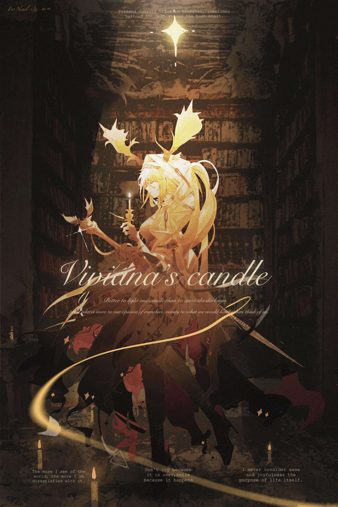

记忆是她不曾落定的流云，虚无缥缈的故乡成了没有边界的自由{.textkai}

而她的心脏们随节律而动，她想尝试另一种自由{.textkai}

<!-- more -->

谢谢你，薇薇安娜。

薇薇安娜从眼前那条尾端黑灰发硬地黏成一团的卫衣帽绳上移开眼睛，抬起头时，她观察到鹿角投下的影子发生了微妙的变化。阿尔图罗坐在椅子上微笑着，左手边还放着一个餐品已然冷却的盘子。她摇了摇头，回答说，这只是微不足道的事。随后她收起了打火机，重新坐回阿尔图罗对面的位置，然后又是新一轮漫长的沉默——不仅仅是语言上的，还是动作上的——仿佛她们面前的餐品是模型，下口只能吃到一嘴灰尘。

曾在大概十四岁时，薇薇安娜跟着莱塔尼亚皇家乐团来到卡西米尔，为一位圆号手捧她的乐器。大骑士长伊奥莱塔·罗素前来观赏演出，结束后那个下着雨的夜晚，她递给薇薇安娜一把伞，将她带进了卡西米尔的城市里。卡西米尔的雨夜在地板上积蓄出水洼，水洼反映出城市五光十色的倒影，倒影里又映出她和雨夜融在一起的身形。耸立的高楼仿佛洪水猛兽，獠牙上粘着霓虹灯带。她的手稍微动了一下，罗素便转过头来。她满布皱纹的面容并不像文学作品中的任何一类老人，薇薇安娜看着她，看着她的抹了口红的嘴唇、她的皱褶遍布的双颊、她的眼睛——那一双眼睛里倒映出她的轮廓和这个城市的轮廓。雨夜像柔软而无情的轻纱，将她笼罩在卡西米尔之外。

阿尔图罗坐在食堂的暖光里。她今日穿了一件白色的卫衣，刚才求助薇薇安娜，是因为她卫衣连帽的系绳末端莫名脱开。薇薇安娜凑上前去按动打火机的时候——“嗒”地——她想起那个被大骑士长带回住所的雨天。阿尔图罗坐在那里，没有任何多余的动作，眼睛只是看着她的指尖，奇怪的是她竟然因此而想起罗素牵着她十四岁的手的手掌。或许是因为阿尔图罗在罗德岛的食堂里显得太突兀了，在莱塔尼亚见到她的时候，薇薇安娜甚至很难想象她需要进食或者睡眠：就像是一种直觉，在她心里大声地作出告示，说，阿尔图罗只是一个幻影，她不属于这里…

您看起来有什么心事，薇薇安娜。餐桌对面的阿尔图罗微笑着看她，她回过神来，才注意到阿尔图罗的目光正注视着她的眼睛；很快，她又发觉注视对面坐着的人这件事是她先做的。

她垂下眼睛，回答：只是想起了一些不值一提的事。

来跟我说一说吧，我总是很有时间的。阿尔图罗将餐盘移开，却不拉近距离，仿佛刚刚那段一方正在走神的尴尬过去并未发生那般——尽管如此，那位萨科塔不紧不慢的话语声仍显露出她记忆的真诚：而且我也很好奇，究竟是什么不值一提的事，会让您看我看得出神呢？

她们提着各自打包好的餐食一前一后地在宿舍走廊上走，阿尔图罗落后她半步，仿佛那种乖巧的受引导者，这反而让薇薇安娜感到有些不自在。是了，不自在：阿尔图罗的存在让她无法感到自在。她听见阿尔图罗哼唱着一首莱塔尼亚的童谣，这首曲子从很久以前就已经被她知晓，但她上一次看到它还是在过去的乐谱本上，而非阿尔图罗哼唱着它的声音里。曲子紧接着又换了一首，阿尔图罗的声音特质是轻盈的，这令她哼唱的童谣听起来就像真的属于十二三岁的孩童——落后半步的阿尔图罗忽然问她：您听过这些曲子，对吧？

后面那一首没有听过，前面的我知道。她答。母亲会给我带的书里包括几本乐谱，她会在夜深人静的时候带着一根蜡烛潜进房间里，教我该怎么认识那些游离在五线谱上的音符…一整个午夜，她都在陪我轻声地唱，教我读懂那些没有注释的童书。所以我记得它们。

她忍不住回过头去看了一眼阿尔图罗的脸。那样一张似笑非笑的脸，就像她想象中的、真实见到的与现在面对的可能性一样似笑非笑——更准确地说，她不想怀疑阿尔图罗的笑容，却又难以克制地去怀疑一个她无法理解的人物——这张脸的主人平静地回应了薇薇安娜的停步和对望，走廊上冷清的白色灯光从她头顶洒落下来，又一次，她想到雨夜里柔软无情的轻纱。它像是胎衣或者牢笼，或者如同一座无形的高塔，将里面的住人和世界隔绝开来。

阿尔图罗走上前，敲了敲其中一间宿舍的门。这时她才发觉，她已经走到了写着她名字的门扉前面，于是她从贴身的衣物里翻出那串开门用的钥匙，不忘致以“我刚刚走神了”的歉意。

 {.image-right-float style="max-width: 40%;"}

没关系，我并不在意。阿尔图罗的表情仍没有变化。

她打开门，一如惯例地，装饰性的风铃串叮叮咚咚地响起。单人宿舍间里，半开放的壁橱堆出的毛绒玩偶的天地被一扇门毫无保留地掀开，薇薇安娜说着和她笑容与姿态一般得体的请，却难免从心中浮上一些好奇：她会对此情此景发表什么意见？但阿尔图罗既没发出惊叹，也没停止脚步，甚至没越过薇薇安娜哪怕半寸。玩偶们在房间边沿沉睡着，而她们两个就站在房间门口，薇薇安娜关上门，气流从阿尔图罗黑色的长发后面掠过……阿尔图罗的眼睛仍旧是平静的。薇薇安娜再看，也无法从笑意之外寻到更多的东西了。

您的琴呢？

我把它放在了会让我得到自由的地方。阿尔图罗平静地对答：这或许是交换吧，我想要得到一种自由的时刻，将失去另一种自由。只不过如果你的卧房里有乐器，又或者你想听到什么音乐，那它总是存在的。

薇薇安娜摇了摇头：不，我只是好奇。我记得我见到您时，您总是带着琴的——它就好像您的第二颗心脏一样，阿尔图罗小姐，原来它也会让您不自由吗？

阿尔图罗没有立刻回答，她向里走了两步。薇薇安娜看向地面时，看见阿尔图罗踏出的步子中有一个轻巧的错位：这个错位刚好能让她走到窗边而得以转向掠过那个半开放的橱柜，不踩脏陈设了那片天地的宁静的草坪。看来她还是看见了这个地方的，她只是并没有给出评价。而在两步之后又是两步，阿尔图罗走到宿舍窗边。她知晓自己房间的这扇窗外看不见甲板，取而代之的是舰船穿行中拂过视野的林叶。随后，她听阿尔图罗抛出了一个奇怪得不能再奇怪的问题：薇薇安娜，您觉得人的心脏会带给人自由吗？

这令薇薇安娜沉吟不语，阿尔图罗只是背向她望着窗外，从背影里，她理所当然地猜不透阿尔图罗的思绪。片刻后，她问：阿尔图罗小姐，人能够脱离心脏存在吗？

所以人生来不自由。阿尔图罗转过头来。

某一个时刻，她恍然意识到阿尔图罗那令她不自在的目光里蕴藏着什么：一种怜悯——居高临下的——混杂着某类说不清道不明却深刻而诚挚的真心。此刻，阿尔图罗的眼神里便隐约透露着这样的怜悯，但是这种怜悯的动机不单幼稚荒唐，而且颇为奇异。她不禁猜想阿尔图罗对不自由的悲观叹息是否来自于人无法脱离心脏存在，然而如果活着的人因为心脏而不自由，那死去的人就真的因为脱离了心脏而自由吗？一个无法触碰任何事物的游魂是自由的吗？这个问题听起来就像被嫁接在了阿尔图罗的脸、声音和印象之上，如果说阿尔图罗是一个神秘莫测的幻影，那这个提问就更像孩童的噩梦。人生来不自由吗？她注视着阿尔图罗的脸，很长一段时间，她都认真地消化着这个回答——最终，她得出她无法苟同的结论。

但她没有立刻表现出自己的不赞同。她问：阿尔图罗小姐，我听说您在这里有一个代号？

是呀，我从它开始介绍我自己。阿尔图罗想了想，讲了个有些糟糕的双关：从头开始介绍自己的日子太多，偶尔我也想换个方法来述说我的名号。所以，现在您可以称呼我为…

我可以称呼您为？

一位“大音乐家”。阿尔图罗说完，忍不住撑着桌子，笑出声来。

薇薇安娜有些困惑地打量她的笑，好似不能领悟她的双关或是她的神情。很快，阿尔图罗的表情又被归还到了那个薇薇安娜熟悉的笑容里，她的眼睛很快地扫过那片草坪，那个安然入睡的梦境的造景——她叹了口气，目光驻足于那处缠藤的铁丝造景长廊与金盏花圃，和踱着步子途径花圃的盲眼女性。阿尔图罗说，她可真像是珂拉。

原来您认识她…不，您认识她也是寻常的。如果您在父亲的记忆里见过我…

这与沃尔纳无关，薇薇安娜。她低垂着眼睛，但笑容被收起，对死者的敬意从阿尔图罗脸上表情的变化里浮现，这竟也令她无端地惊叹起“竟有如此可能”。她看着阿尔图罗张开嘴唇，用让人感到隐约的沉痛的语调陈述事实：我也曾在她的记忆里见过你。

她忽然呼吸一滞。不至于窒息，然而的确是停滞。

阿尔图罗似乎注意到了这点，她显露出显而易见的担忧神情，却又很快从脸上消退下去。薇薇安娜趁此机会调整好她莫名的疲态，她向阿尔图罗露出微笑，尽管这表情在此时此刻显得她更虚伪：因为她很清楚，这个笑容的虚假在阿尔图罗看来就像隔着一层窗纸。然而阿尔图罗并未揭穿她，而是向她露出了一个同样虚假的微笑，就像镜子对它反映的对象所做的那样。随即，她重又就那颗心脏的事情向阿尔图罗抛出疑问：您觉得人在死后会重获自由吗？

我可从没想过！阿尔图罗摇摇头，她做不得假的惊讶在开口前一闪而逝。我只是在想，如果人的一生总要依附自己的心脏存在，就像人的个性需要依附于自己的记忆而存在的话，哪有真正的自由可言呢？在真正的、绝对的自由外面，剩下的唯一的枷锁，难道不就是我们自己吗？

您听起来就像是因为这不存在的自由做过噩梦那样。难道这些自由也令您痛苦吗？薇薇安娜走到她身边，拿起窗沿笔筒里的一只钢笔。与此同时，阿尔图罗越过她的手，从桌面上的书架上取出一本乐谱集本——薇薇安娜记得它：在初到卡西米尔的时候，珂拉将它赠给十四岁的薇薇安娜，塞在她和她手捧的圆号之间。她为了让这本乐谱集不至于掉出臂弯，举着圆号的手更稳更高，恰好挡住她双角以下的所有面庞。

在您看来呢？阿尔图罗翻阅着这本有些泛黄的乐谱集。

我以为您的格言会是像……薇薇安娜拿着钢笔，在手上又转了一圈。笔身虚挂在她指上，如同小提琴的琴弓虚挂在演奏者手上，从那一根食指划出的空间后面，她看见阿尔图罗微微偏着脑袋似笑非笑的脸——安静地等待着，像个听众的脸。于是她说下去：不自由毋宁死那类的。

如果是那样的话，我大概从一出生就死了。阿尔图罗的笑收了回去——在薇薇安娜看来，那并非动怒的前兆，而是单纯地谈到了个不需要笑容的话题——如果我追求的是自由，那我大概一出生就死了。没有意外、没有可能、没有概率性地死掉，这就是萨科塔人和自由之间的关系。这样来看，或许我才是我自己的天敌。

…那么。薇薇安娜迟疑地问：在这场和天性的对抗之中，您是获胜了吗？

您会清楚我的胜败的，薇薇安娜。她微笑着看过来：伤痕累累地获得自由，哪怕是一点点——这难道不也是您所为的吗？

自这个回问起，她终于知晓阿尔图罗的违和感自何而来。就在这一刻，薇薇安娜发现阿尔图罗总是一个格格不入的人。在莱塔尼亚时，她觉得阿尔图罗吹拂着莱塔尼亚的风，却更像一个拉特兰人；后来她见过她的远亲，见到更多的萨科塔，才发现她也不是什么拉特兰人；如今她站在薇薇安娜自己的宿舍里，向右一步便是薇薇安娜为自己的夜晚所寻的栖身之地，尽管阿尔图罗是如此尊重她的神情和语言，尽管她已经为之加盖了防尘罩来保护，她仍觉得阿尔图罗向右一步便会毁掉她的宁静…这不是她的错，这甚至不能说是任何人的错。阿尔图罗，她就像是一个异界来客，她用薇薇安娜听得懂的所有词汇来表达，她极尽自己的真诚与任何人共享悲欢，却仍让人感到格格不入——这只是因为她就像个异界来客。她总是异乡人。

…就像她一样。卡西米尔的异乡人，莱塔尼亚的异乡人。她的生活里从未出现过故乡，记忆是随她游历的流云。于是故乡变得自由了，不，是因为从未存在而自由了：没有任何东西能界定她的故乡或她的家，她到哪里都是那个异乡的客人。

她将乐谱集本放回书架，不经意地问：如果您仍希望您的第二颗心脏获得自由，那么只要再重演一遍崔林特尔梅的事情不就可以了吗？

薇薇安娜眼角的余光瞥见，她将卫衣的兜帽向上抬了抬。

阿尔图罗回答：因为我的心脏不只有第二颗，而我想尝试另一种自由。<eod />

（责任编辑：广英和荣耀；网页排版：武乙凌薇；绘图：水水蹊）

<FakeAds />