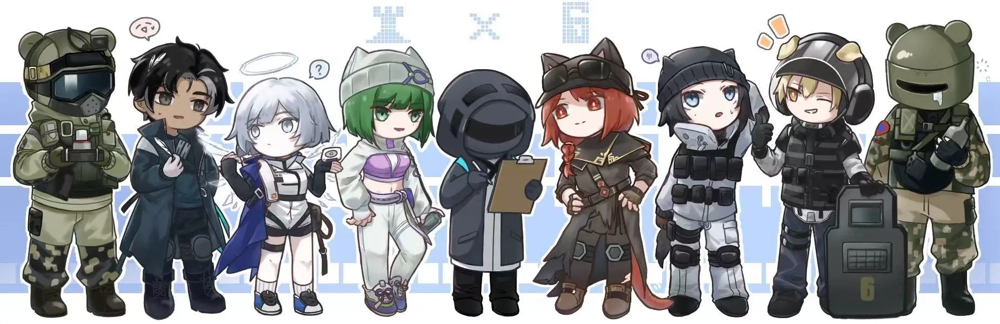

意识与灵魂依旧影响着现世，活着的人却背负了太多，{.textkai}

尽管如此，我们仍旧尽力努力生活，并享受生活。{.textkai}

<!-- more -->

他们都清楚，这片大地上的有识之士大多不敢回头看。那些碑林与逝者，不分敌我——斗士、勇士、谋士，反抗者、拯救者，上下求索者，最后身体被轻飘飘的尘土席卷，随着风而散了。

而他们的精神，意识与灵魂依旧影响着现世，活着的人却背负了太多。

最后的结局是所有人想看到的吗？选择是有意义且正确的吗？可是无论再怎么踌躇，车轮总会碾过所有的痕迹。天灾从未停下，一如矿石病依旧如潮水般蔓延，伴随着恐慌歧视与灾痛，人们总要走下去，向这片大地交出自己的活法。

所以，不如先去码头整点薯条吧。

doc第一次来罗德岛的时候还没见到过那位博士，彼时的doctor在哥伦比亚出了个“短差”，顺路拜访了一下莱茵生命的代理总辖。

doc还不知道先来到泰拉的队友们脸上的迷之微笑所谓何意，出于本能反应拒绝了闪击“穿防护服带面罩加工资”的奇怪要求，在经过一系列奇怪但又合理的身体检查之后，一位蓝发、长着耳羽的优雅女子让他们签署自己的代号。

“doc——？”蓝发女子挑了挑眉，唇角勾起一抹弧度，意味深长的看了他一眼。

后来当他发现自己手提箱内的医疗针变成蓝色热水壶之后才意识到了事情的严重性——幸好他有在出任务之前提前检查装备的习惯，要不然就要带着热水壶奔赴战场了。

他想象了一下队友受伤之后自己从手提箱里拿出热水壶的场景——似乎有些过于喜感了。

在任务结束之后，doc去工程部归还热水壶，正好遇到了一个把自己捂得十分严实、头戴面罩，身穿黑色防护服的人。

那人声音因为隔着层面罩显得发闷，厚重的防护服也掩饰不住他极为激动的肢体语言表达能力，此时他正在手舞足蹈的跟面前的黑发，梳着小辫的阿戈尔少年交流着。

“我昨天晚上，就想着偷偷吃一碗泡面——你猜怎么着？”

“泡面被凯尔希医生没收啦？”蛇尾女子回头接了句话。

“——不是，是我的热水壶！我的宝贝热水壶，他变成了一个激素手枪——啊，我的热水壶没有你我怎么办啊啊啊啊……”字里行间大有溘然长逝之感。

“那可是一点希望和一条生命上限啊！我打肉鸽就靠着他给我续命呢——”

“博士，您不要嚎叫了。实在不行再给您重做一个好了，那个热水壶也已经用了挺长时间，凯尔希医生不会说什么的。”黑发男子宽慰道。

“……请问，”doc叩响了门，“你们说的是这个热热水壶吗？”

doc明显的感受到名叫“博士”面罩下那灼热的目光——正盯着他手中装有热水壶的箱子。

“诶？怎么在你手上？”蛇尾女子有些惊讶，随即便又明白了些什么，“你就是那个doc，对吧？”

“哦，代号问题，”黑发男子冷静的总结，“下次写‘医生’的时候用其他语言就好了，避免维多利亚语和哥伦比亚语就行。”

---

“虽然那是一把激素手枪，但是看起来也太帅了吧，”博士接过doc手中的热水壶之后依然滔滔不绝道，“说真的，倘若只看手感，我会觉得它像一把左轮手枪——”

“我听说过您，彩虹小队的doc——医生，是吧？诶呀，代号重了拼写和读音的感觉真是不大好，邮错快递真是令人苦恼，恕我直言，您不会拿着热水壶上的战场吧。”博士面罩背后的脸一定是在笑着的，doc这样想着。

“我会通知可露希尔的，doc先生先随我回趟办公室取您的激素手枪吧。”博士左手抱着热水壶，右手做了个“请”的手势。

---

doc其实也算刚来到本舰就被闪击他们拉去做了任务，并没有仔细逛过。且因为闪击藏着掖着关于doctor与doc名字的缘故，对博士也是知之甚少——只是听说有一位相当优秀的指挥官坐镇罗德岛，常年带着面罩，穿厚重的防护服。是个人类。

总而言之，这是他们两个正儿八经的初见。

doc自诩见多识广，什么类型、脾气的指挥官见过不少，其中难免有难以相处之辈，而博士这样过于跳脱，甚至堪称奇特的指挥官确实少见。

博士的话很多，基本都是在自顾自的念叨，也不在意后面的人听没听到，总之宗旨就是不让气氛冷下来——要不然在空荡荡的走廊里多少有些冷清。

“我听说你才刚来本舰，住在这里还习惯吗？”

“这里的环境很好，很适合进行休整。”doc算是公事公办的回答。

“去过食堂没有？我跟你说哦，千万不要吃芙蓉的营养餐——就那个浅紫色头发的萨卡兹少女。”博士悄咪咪的说着，“以后你要是看她带食盒来我办公室记得提前知会我一声啊…”

“我尝试了一些中……炎国菜，很正宗，就是有些辣。”doc勉强回忆起记忆里那个萨卡兹少女，是一个嘴角带着温和微笑、动作麻利的小姐，很难想象她能与连博士都害怕的“营养餐”扯到一起。

“啊？后厨又让年进厨房了？”博士嘟囔着，“下次让角峰他们注意一点……还好之前要减肥没有打炎国菜。”

---

“哦，就是这里了。”走过一串长走廊，上了楼梯右拐之后，便是一个挂着“博士办公室”牌子的房间，博士叼住手套用掌纹开了门，“下次一定让他们安一个人脸识别……”他含糊不清的说着。

doc随着他走进了屋子，映入眼帘的就是杂乱的房间——高如小山的文件叠放在办公桌上，连会客沙发和茶几上都摆放着大大小小的文件，由于窗户敞开的原因，地面上也铺着些纸片。虽然上面铺了一层看起来十分柔软的地毯，doc一时间依旧是感到无从下脚。

博士轻功一样跳过地上的纸片，把热水壶小心安放在一旁的唯一干净整洁的私人吧台桌上，再把皮质手套重新戴上，回头望见依旧站在门口的doc，忙不迭的收拾屋子里的残局。

“——解释一下，这些都是我干完的活。我真没有偷懒。”博士有些慌乱的说，手忙脚乱的差点把堆在沙发旁的文件推倒，“额，我想想激素手枪……激素手枪……”

他突然像跳探戈一样飞到自己的办公桌旁，从第二个抽屉里拿出一个手提箱。

“这里！嘿，不打开看看？”

doc好像看到了他希冀的眼神。

“……”

“……”

气氛陷入了诡异的沉默。

“啊？所以我的额，泡面怎么在这里？那手枪被我吃了？”博士陷入了深深的自我怀疑。

doc望着里面一袋还未拆封的泡面，叹了口气:“博士，我帮您收拾房间吧。”

事实上那把作为他们第一次遇见的契机的激素手枪，一直放在博士的柜子角落。而他们在最后也没能找到那只远在天边的手提箱——或许是巧合，也或许是私心，它成为了博士连他自己恐怕都没发现的收藏品之一。

---

后来doc才从那位灰色兔子小姐口中得知，博士每次在用尽理智办公之后都会把房间弄得一团糟——虽然他在外表依旧保持清醒，但是经常会犯出“把激素手枪和泡面弄混”这种糗事。

“所以这才是我们设置博士助理意义嘛，”阿米娅无奈的笑着，“博士大多时候都相当的可靠，但是有些时候像小孩子一样迷糊呢。”

---

在去往世界各地行医之前，doc在罗德岛进行各种情报的收集——在人生地不熟的情况中这样的做法是必然的。而作为医者，他自然同罗德岛的医疗部走的很近。

“doc，好巧哦，”医疗部门口探出一个兜帽脑袋，此刻正是清晨，来人手里还拿着炎国传统早点——包子和豆浆的垃圾袋，“华法琳和嘉维尔干员不在的话，我就入内了。”

“您生了什么病吗？”doc从桌前站起身来。

“哦，那倒没有，”博士好像有些心虚的摸了摸后脑勺，“是老……凯尔希让我来定期做身体检查——额，毕竟他们对我的身体状况操碎了心。”

“倘若是阿米娅知道我现在的身体有一丁点不好，怕是就要伤心了，”博士叹着气，“所以今天是轮到你值班吗，doc先生？一会做检查的时候能不能在报告上……”

“很可惜，博士，”doc回答，“我只是为嘉维尔小姐做替班，她下楼去吃了早饭，估计十五分钟左右就会回来了。”

“如果害怕阿米娅小姐会伤心，您为什么不好好保养自己的身体呢？”doc看着有些失魂落魄的博士问。

“啊……这倒是说来话长——你懂的，作为指挥官，我不会一直坐在办公室里批改文件。当然，受到伤害当然是避免不了的，即使我穿成这个样子。”博士打开了面罩，露出里面那张看似年轻的脸。

他看起来约摸二十多岁，在大众审美中称得上英俊。却面色苍白，眼睛是雾一般的灰，眼下乌青。嘴唇也没带什么血色，一副马上就要入土为安的样子。

他吸了吸鼻子:“在医疗部待得久了，你或许听说过我的往事——而事实上我的记忆也只停留在几年前阿米娅把我拽出石棺之后，他们叫我doctor——无论这个名词代指的是医生、博士，拯救者亦或是什么别的，我都理所应当的接过他们所赋予的使命。”

“所以我觉得，倘若我真的太过爱惜自己，阿米娅恐怕才会真的伤心——我不是那种意思。我只是觉得我生来就是做这个的，挽回生命，拯救这片大地上的人们，让孩子重获笑容——doc，你或许也可以理解。”

---

“博士，与其说这个——”背后传来一个深沉熟悉的女声，博士不禁打了个冷颤，“有人通知我，你昨晚上还是熬夜了，准确来说是通宵。”

白发的菲林浑身上下透漏着不悦的气息，她缓慢打量着博士，最后叹了口气。她给他做了一个眼神，博士缓缓跟着她走进了办公室。

---

“还是睡不着？”

博士没有说话。

“我不想采取当年那个把你打晕了你才能睡一个好觉的极端措施。”

“或许你可以给我开些安眠药？”博士蔫蔫的开口，“虽然我觉得我已经有抗药性了，但是聊胜于无吧。”

“你多久没招助理了，博士？”凯尔希突然问道。

“呃？”博士梗了一下，“大家都有事要忙……”

“别把自己说成一个空巢老人，可以吗？”凯尔希挑了挑眉，“很多干员都在旁敲侧击的问我和阿米娅，你什么时候打算重招助理。我和阿米娅也都认为，招募一个助理对于你的理智状况和睡眠都有好处。”

“……”

“六个点不是万能句式，博士，”菲林叹了口气，“看你和那位doc交谈甚欢，要不然让这位医生做你的助理试试？”

“……行吧，”博士压低了帽檐，“凯尔希……我……”

“别给自己太多压力，”她似乎看出来博士的郁结，“我和阿米娅，罗德岛，都会和你站在一起。”

---

等到doc再次见到博士，是在接到助理通知的那天的舰桥甲板上。

彼时的罗德岛正在萨尔贡的夜晚荒漠中行进。黄沙漫天，遍地可见的源石晶簇肆无忌惮的覆盖在沙土之上，如山峰一般冲入云霄，利剑出鞘。

因为沙漠多大风的缘故，在行驶到这里时舰桥上便很少有人，如今正是午夜，只剩下博士一个人。夜晚风小了一点，但温度却有点低，抬头能望见在城区看不到的繁星。

博士比doc稍稍矮了一点，身形也偏瘦弱，像是被那件防护服撑起来一样，他没戴面罩，但半张脸依旧埋在兜帽的阴影之下。他似乎意识到背后有人的到来，侧目便看到了doc。

“现在是凌晨一点，博士，”doc先开了口，“明天是工作日。”

“睡不着嘛，”博士对他笑了笑，“这不是还有人陪我没睡——logos同我讲过，自从你来了本舰后就一直在图书馆熬通宵，今天怎么想着早回去睡觉了？”

“因为明天有很重要的工作。”doc如实说着。

博士先是一愣，随即说:“——那，明早见？”

“明早见。”doc点头。

---

博士本想继续在舰桥上再站一会——他本来已经让自己进入了一段睡眠，他敢肯定那是他睡过的最早的一次。但是梦中不停上演的噩梦却依旧紧追不舍，汗液如同沼泽般拖拽他的身体，无力与绝望感不由得让他惊醒过来，他不由得去舰桥上吹风捋清繁杂的思绪。

“所以您怎么还不回去休息？”博士看着那个站在不远处的医生，不由得问。

“我希望能提前履行我作为助理的职责，博士，”他听见doc这样说着，“而现在，我想送您回去休息。”

“好吧，我已经能想象得出我明天会获得一个强势的助理了。”博士开了个无伤大雅的玩笑。

---

走在回休息室的路上，doc突然说:“凯尔希医生同我讲过，您似乎长期处于失眠的状态。”

“……事实上，我很久没睡过一个好觉了，”博士这样回着，“可能是工作，也可能是心理原因——我觉得后者的可能性似乎更大一点。”

博士用掌纹开了门，他站在门口看着那个比自己略高一些的男人:“不过你不必担心，我明天早上会准时起来上班的。晚安，助理先生。”

他看着doc欲言又止的眼神，缓缓关了门。

他没来由的感到心安——或许有一个助理也并不是什么坏事，博士这样想着。他脱了衣服上床，小夜灯发出昏黄的灯——那是阿米娅在前些年做给他的生日礼物。博士破天荒头一次睡了个好觉。

---

“博士，你还有很多工作没有处理，还不可以休息哦。”

早上七点半，闹钟准时响起——鬼知道这位博士是以什么恶趣味的心理让自己女儿的声音做自己的闹铃的。顺带一提，在阿米娅的声音后面还伴随着m3的嘶鸣。

博士意识到自己好久没有被闹钟惊醒了，在手忙脚乱的关闭闹钟之余品了一下昨晚的睡眠质量——莫名其妙的有种重回石棺的安全感，这就是有了助理的好处吗？

博士上一次招助理已经是在几年前。在伦蒂尼姆事件解决之后，办公桌上的文件肉眼可见的减少——他本人可能也觉得两个人来处理这些东西显然有些多余了。罗德岛上的干员不是又只为他一个人服务的，于是便取消了。

他把自己收拾干净的时候正好是早上八点，他穿戴好衣服打算下楼吃个早饭——最近他倒是很迷炎国传统早餐，喝一口胡辣汤感觉即使是尸体都能暖起来。

罗德岛正常的上班时间是早上九点，所以博士有充足的时间享用早餐。而一个好睡眠果然会让人身心愉悦，今早照镜子的时候发现黑眼圈都变淡了一点——也许是心理作用。当博士拖沓的走到食堂的时候，里面的食客还不多。

所以博士理所应当的注意到坐在里面的doc。他点了份咖啡和可颂——请忽略博士不正宗的口音，毕竟他也不是一个土生土长的高卢人。从客观角度来讲，也很少有人会纠结二者的读音了。

doc作为一个法国人，骨子里便从内而外的散发出独属于他的优雅、浪漫与绅士——尽管他可能在下一秒听到警铃便会掏出手枪进入备战状态。

“我有点好奇它的高卢读音——我听说很多高卢人都对口音有一种奇特的执着。”博士端了碗胡辣汤在他对面坐下。

“——Croissants，事实上，博士，我对此保持了相当程度的宽容。”doc弯了弯眉角，“看您气色不错，昨晚睡得如何？”

“我很久没体验过被闹钟叫醒的感觉了，平时都是我叫闹钟起床，”博士耸了耸肩膀，“我还在担心闹钟睡懒觉呢。”

博士突然想到什么，笑了起来:“企鹅物流有一位干员，我猜她应该与你很有共同语言，你猜她叫什么名字？”

“……？”doc表示疑惑。

“她叫可颂。”

---

“凯尔希医生，您找我？”

看起来年轻的白发菲林翻看着眼前的档案，手边放了被咖啡，闻起来已经冷了个彻底。她听到声音，把文件放在了一旁，抬手示意让他坐下。

“我想您应该在终端上已经接到了博士的助理任务了，”凯尔希叹了口气，继续说，“博士已经许久没有招过助理了，这次还是我向他提议的。在之前，博士的助理任务是筛选文件、处理琐碎事务和保护他的安全。”

“——不过这次略有不同。”

“不难看出，他已经很少睡个好觉了。”doc垂下眼眸，说着。

“是的，”凯尔希点头，“从切城、龙门，整合运动再到伦蒂尼姆，博士从石棺醒来后便一直是这样连轴转，睡眠时间很少。虽然罗德岛目前并无战事，他的生物钟依旧没有调回来——或者说，他根本睡不着觉。”

“医疗部有采取过什么措施吗？”doc问。

“开过安眠药，在短时间内还算好用，但是长此以往就有了耐药性，我认为并不算是个长久之法，”凯尔希的眉毛都皱起来了，“在此之前，我们还利用过强制执行的方法，也就是把他打晕过去。”

“所以这便是我的任务了——让博士睡个好觉？”

“——你和他，有些相像。”

同样是人类，同样的理想主义者，同样，在醒来后面对一个未知、充满危机与苦难的世界。

---

等到doc和博士吃完早饭之后再走到办公室正好是上班的时间。

而在此之后，doc发现博士对于时间把握相当的精准——至少是对上班时间的把控。既不早踏入办公室一步，也不晚离开办公室一秒——如果今天工作变多，他也会适当提高自己的效率，如果工作很少，他就会用闲暇时间来摸摸鱼。

工作表是会制定的，执不执行那全看心情——毕竟计划没有变化快，这是博士的原话。

博士很少交给doc一些工作，大多是让他自由活动。在得知doc希望获得关于矿石病研究的权限之后利落的转给了他，并慷慨的表示如果有疑问可以随便询问凯尔希和他。

---

博士的理智状况对于doc而言也算是个不小的问题——虽然在这个时候为他注射一管应急理智合计就好了，这种情况多半发生在博士不得不加班处理工作的时候，比如在前两天吃饭时被凯尔希突然叫过去的外勤任务。

博士在失去理智的时候症状有很多，常见的是胡言乱语、过多的肢体语言、亢奋，甚至会认错人——他之前还把doc认成了阿米娅，迷迷糊糊的摸着他的头顶小声嘀咕着自己的女儿怎么长那么高了，但是他最喜欢的毛茸茸兔子耳朵居然消失了。

但是那次外勤任务却有些不同。由于事出突然，两个人都忘记带了应急理智合计。博士的指挥虽然依旧稳健，奈何百密一疏——在临结束之时有一个敌方士兵冲破了防线，而明晃晃的尖刀便冲向兜帽人的脑袋——

而他只听到了一声枪响。

博士不知道什么时候拔出了他腰间的配枪，往那人的脑袋上开了个洞，脑浆和血液流了一地。气氛陷入了一种诡异的沉默感。

而后博士的声音便在通讯器里响起:“都愣着干什么？巩固防线，高台人员注意两点钟无人机。”

耳麦中因屏蔽器而产生的沙哑声掩盖了他的喘息、心跳与脉搏，doc却还是察觉出了他的不对。等到作战结束之后，doc完成自己的收尾工作，敲响了临时指挥部的门。

地面上还能看到死者的血迹，而博士坐在另一侧的椅子上，他摘了面罩和兜帽，双目无神——这是他失去理智的症状。他强撑着看清了来人，问了一句:“你有带应急理智合剂吗？”

“抱歉，临行太突然，并没有。”

“好吧，”博士莫名其妙的轻笑了一声，“那我只好用这个了——doc，用你的激素手枪给我来一发，呼，毕竟在这里不能随便罢工。”

“博士，激素手枪是用来救治伤员的——”

“毕竟我现在是个精神病人，可以这么说吧，医生先生？”

---

事后博士对于激素的反应相当强烈——他本人显然也没预料到这个，他在处理完事务工作到回到本舰之间的记忆全部忘记，就如同宿醉了一场，并在第二天清醒完吐了个地老天荒——这都是些后话了。

不过doc却表示印象深刻。至于期间都发生了些什么，大抵是只有这位医生先生自己才知道的秘密。

---

“——博士，今天下午的计划表上是空白，您是有什么其他安排吗？”doc皱着眉问道——虽然这些事情都已经算是司空见惯了，但是他依旧会问出这一句。

“哦，今天有点特别，”博士的话语中好像有些欢快的情绪，“我们下午去看望罗德岛上的孩子们——你想必已经见过几位了。”

“您指的是那位尾巴很多的铃兰小姐？”

“看来她让你印象深刻——我现在要去准备小礼物了。我前两天刚邮到的拉特兰小饼干呢……”

“在您左手边第三个柜子内侧。”doc准确的说出位置。

“哦，还好有你——要不然我又该把装有激素手枪的箱子当成饼干盒了。”博士对他竖了个拇指。

“博士，还请您不要私藏我的激素手枪。”doc无奈的说。

“哦，还有一个事，”博士神神秘秘的说，“你不妨猜猜看？”

博士跟doc混熟了以后在自己办公室就不戴兜帽和面罩了，露出了那张极为年轻的脸。他留了头黑色长发，梳了个低马尾，刘海被分到两侧——看起来像个刚上大学的学生。

“我听ela他们提过了，是那个宴会吗？”doc对上那双银白色的眸子，他那双眼睛倒总是含着笑的，嘴角也总是向上扬。

“据说有送葬人带的拉特兰仙人掌挞，”博士挑了挑眉，“我听说它好久了——这次一定要抢到。”

博士今天心情真的很好，他哼了几首流行口水歌，步子都是轻盈的——也可能是提前下班的缘故，路过医疗部的时候破天荒的同里面的凯尔希医生打了招呼，还问她用不用帮她带饭。

而凯尔希用眼神说出了“滚蛋”二字。一旁的阿米娅温和的笑着，博士肌肉记忆一样揉了揉她的耳朵。

等阿米娅走了以后，凯尔希站起身来，先是看了看他的面色，脸色好了不少，随后开口:“晚上有阿米娅的小提琴表演——她希望你能上台跳舞。”

“我？啊？”博士下巴都要掉下来了。

凯尔希的表情在说“你不答应就死定了”。

“我会准备的——不过事先声明哦，我醒过来之后就再也没跳过什么舞了，我之前总跳吗？”

“你脸色好了不少，最近睡眠质量不错？”凯尔希面无表情的岔开话题，“看来还要感谢doc。”

“这是我应该做的，”一旁看戏的doc开了口，“事实上，我也并没有做什么，大多是博士自己努力的结果。”

“……我有在谨遵医嘱——你笑什么，有个医生在身边看着我怎么好意思作息不规律？”看着凯尔希露出的微笑，博士再厚的脸皮也多少感到不好意思，“算了，你跟阿米娅安心就好。”

“所以你承认之前是故意不好好睡觉的？”

“我那是根本睡不着——你知道的，我梦里那些东西，”博士小小的叹了口气，“都过去了，我还在纠结什么。”

---

他想到那个死在自己怀里的少女，明明是冰冷的身躯，却像碳火一样灼烧着双臂——就像那颗糖，辛辣中却透着些甜。想到黎博利那沙哑的天籁，想到残弩，想到被矿石摧残的顶天立地的身姿。

他们是对手、是敌人，也是求索者。是对这片大地和命运的反抗者，是在乌萨斯的冰原上燃起的火，那注定被熄灭的火星点燃起整片大地的野草。整合运动无疑是成功得彻底。

而罗德岛又该走向何方？

在这片大地面前，一条人命也不是过是一片被卷起的尘埃。而在人面前，却是如千斤般的巨石。

---

“doc，听说你过几天就要出发了？”ela和doc站在宴会厅的香槟塔旁边，端着杯酒闲聊着。

“是的，我在本舰上的任务已经快要结束了，”doc喝了口酒，说着，“关于矿石病，我也有了一些想法。”

“你又要重拾旧业了？”ela言语中带着些严肃意味的调笑，“无国界医生——即便这项工作比在地球上更加艰难？”

“还有更多的患者等着我，你知道的，他们需要医生。”

“过两天我也要出发去卡西米尔了——”ela转了个话题，“之前闪击说的那个涨工资计划，你还记得吗？”

“你指的是穿着博士的衣服然后装成博士去人事部？我们身形哪里相像？”doc失笑道。

“因为你们都是‘doc’——不是吗？”

doc和ela不约而同看着台上的那个人。他穿了身西装，看起来是定制的，价格不菲，他表情略有些呆滞——doc知道这是因为他有些紧张。兔子小姐把小提琴放在颈侧，演奏起一首遥远悠长的歌。

像旷野般的寂寥，调声填了几分孤寂之感，闻者好像看到了一片草地，来人漫步于星空之下。听起来有些悲伤。

博士却跳了个双人舞，没有舞伴，他跳的是一个极为标准的男步，优雅、得体，形单影只。

——好像看到了遥远的过去。冰封了的艺术品，活在机器里的灵魂。

---

“怎么样怎么样，我跳的怎么样？”下了场，博士在人群中看到了与fuze闲聊的doc，忍不住问道。

“非常完美，博士。”一旁的ela说着，“我都在怀疑这是不是您第一次跳舞了。”

“都是阿米娅拉的好——她可是全泰拉最优秀的小提琴手。”博士得意的笑着。

“博士，我有话要对你单独说。”doc开了口。

---

“我大概知道——毕竟那个文件是我签署的，你一周后要离开本舰了？”博士坐在舰桥上放着风，他们回到了玻利瓦尔，海风徐徐的吹着他的头发，遮住了半边的脸。

“是的，我认为我已经可以结束在本舰上的工作了。”

“你的任务完成的相当不错，医生先生，”博士笑着说，“与你相处的这段时间相当愉快——看来定期招助理也是个好事。”

“您最近真的不失眠了吗？”doc突然问。

“……说不失眠倒是假的，”博士低下头，思索了片刻说，“我常常会梦见那些死去，为这片大地牺牲的人——我不敢再看他们离别时的眼睛，他们所遭受的苦难与临别的决心，但是我的潜意识却一直在提醒我——”

“我正走在这条路上。doc，你也是。”

远处尚能听见候鸟的声音。

---

“回去吧，我还要跟伊芙利特抢仙人掌挞呢。”<eod />

（责任编辑：瑶濯；网页排版：武乙凌薇；绘图：安梓Annz）

<FakeAds />