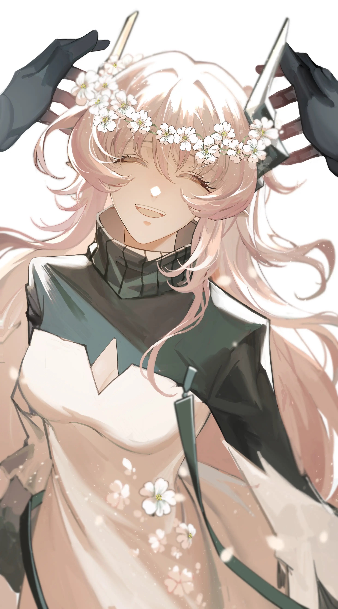

萨卡兹烧掉了曾经的日记本，{.textkai}

看着即将被撤下的照片想，{.textkai}

什么时候才死神会来带走他。{.textkai}

<!-- more -->

对他的第一印象是什么？

悲悯。

隐忍。

有人拒绝回答。

---

{.image-right-float style="max-width: 35%;"}

萨卡兹在加入巴别塔的时候还算年轻，没有太多的阅历，在这不大的塔里也算不上起眼，只是他特别的源石技艺引来了一些注意。那天他们的王带着一个年幼的卡斯特女孩出现在小伙子面前，这是他进入这座深灰色塔的第二天。

他们的王说，听闻你的源石技艺很特殊，能否给这个孩子变个魔术？

萨卡兹诚惶诚恐地看着她和孩子，半晌摇摇头，我不会哄孩子，我也不会变魔术，抱歉。

他们没说两句，一位白发的菲林找了过来领走了孩子，于是小小的休息室里只剩下了王和她的萨卡兹。他低着头老老实实地坐在长凳上，等待着王是否会向他提出其他的问题或者是要求，一头银白色的短发随着主人的意愿老老实实地贴着头皮。房间里安静得出奇，王见此情形觉得需要让他放松一些，就坐到了他旁边和他聊天。听说你之前经历了一些事故，但是这没关系，我向你发出的邀请你随时可以给我回应，来这里找我。所以，现在你想加入巴别塔，是吗？我想听你说说为什么。

为什么？为了一份工作？

为了帮助这片大地化解对萨卡兹的仇恨。他听见自己这么说，说话的声音越来越小越没有底气。他们的王站在灰蒙蒙的天空下，浅粉色的长发任由风吹，似乎她就是由双眼无法盛下的那些忧愁与怜悯组成，能被高塔窗口吹来的一阵风打散。那么跟我来吧，见见你未来的兄弟姐妹们。

于是他成为了巴别塔的一员，在一群每天咋咋呼呼总是充满了干劲的萨卡兹旁边看着他们，不管是胡闹还是一窝蜂地出任务——他们除了王，还有一个全身黑色制服兜帽面具的指挥官。据说只有指挥官身边的人见过他的面貌，四舍五入就是没人见过，传闻指挥官其实很俊秀。萨卡兹融入得不算太好：他不会起哄也不会大半夜起来吓唬人，偶尔在阳台上看看书或者写点日记，还要被看不懂字却一定要看的人抢过去，一群人凑在他的日记本前一副恍然大悟的样子，然后嬉笑着四散开来。他的日记本上其实并没有太多关于他自己的事，主要是读书后的一些摘抄和感想，其中又以对景色的描写为主，这些朴实而生动的文字能让他在失意的生活中得到一些喘气和幻想的机会。在难得清闲的时候，他会自己写下两句当时的天气或者抬眼所见，而从塔上望出去，能看见天空中层云堆叠，偶尔有阳光从缝隙中漏下，更多时候是如无声泪落的绵绵细雨。他写下简短的语句然后回想过往，当时的他所不明白的事物在冥冥之中让他悲伤，却又不知道自己是怎么陷入茫然的。反复默念着被写下词汇，“阴霾”和“灰暗”，的确很像外面的天空，原来是因为天气吗，可为什么只有他这么觉得呢。那时候隔壁大队有个以“斥候”一词为代号的萨卡兹，听说枪法非常准，又懂些大道理，还有不少战绩，这个人或许……正站在他的面前。

你在干什么？

戴着墨镜隔着面巾，他总觉得这位“斥候”如此居高临下是在威胁他。他合上日记本，顺手搭在小刀刀柄上，随后手腕传来了冰冷的金属触感。

不会想跟我打架吧？你会连怎么——怎么晕过去的都不知道。

是威胁。斥候想说的是你会连怎么死的都不知道，这样的话他听得足够多了，只是这里禁止斗殴而已。他没有回答，斥候脚下的地板忽然软了下去，像沼泽一样缠住了双脚。他觉得有些成就的人不应该是个莽夫，再一抬头，原本气势汹汹的入侵者已经不见了。斥候其实是听说了有个读书识字的家伙加入进来，想要看看他有多少文化程度，权当是为以后挑人带队做点准备，没想会变成这样。

虽然说不太受人关注，但是加入巴别塔后萨卡兹很少能有清闲的时候，有时候是训练，有时是单独出任务，也有时候要帮忙做一些杂活。每天跟在一群年轻气盛的大小伙子旁边不仅仅是消耗体力，有的时候怎么帮他们打圆场也是一件很费脑子的事，毕竟要和胡闹的人讲道理，多少还是考验调停者的技术的。不过他一定能胜任的，他认为自己能轻松做到这种小事——又不是什么城邦与军团的事，又没有几百人的命悬一线，对吧？总的来说是好的，对的，不管怎样是好的……他总在这种事上出面帮忙，的确有人觉得他像个怕惹出争端的和事佬，没有锐气，只有他自己认为他必须这么做。

他曾经做过很多事，为了让自己能够保持清醒，不被惯性思维冲击，做出最客观的结论。在战场上他会关注自己的队员，甚至在杀人时给予死者更短的痛苦，可殊不知对自己，他是何其残忍。

通常用于施术的小刀是最顺手的工具，也是最不需要掩盖的工具，萨卡兹的刀尖永远有血。身体上的每一寸皮肤都是可取的，最方便的就是另一边的手臂，卷起袖子，苍白的皮肤下能看见血管的痕迹，但是他要的只是让自己清醒一下。将刀刃垂直着摁在手臂上，然后缓缓、缓缓地一点点推动它前行，瞬间痛感就会席卷大脑，吞噬了所有其他的思绪，如海浪席卷了沙滩又悄悄退去不留一点痕迹。最初他的手还会因疼痛止不住颤抖，刀刃上沾了些许血迹，仿佛刚才的感受只是神经受到刺激产生的幻觉。不，是真实的，他感觉到了伤口处微凉的气息，鲜血点点从伤口溢出，在他的手臂上留下一道深红色的痕迹，然后干涸。痛觉带来的释然引诱着他再次动手，一开始他还会小心翼翼地绕开已经被划破的地方，长长短短的裂口互不干扰平铺在他的皮肤上。疼痛带来的警觉与清醒并非出于疼痛本身，而是对于危险的恐惧，是生存的本能。

在胡思乱想中他一刀划过了之前的伤口。

被痛觉占领麻痹的头脑中激起一阵巨浪仿佛要冲破这一承载体的边界，他手中的刀摔在地上，手臂上长短不一的暗红痕迹各歪各的，它们都受重力的束缚，最终凝固在了手臂最低处。

没关系的，只是一点皮肉伤，他本就不想闹出什么事，比起在战场上摸爬滚打这点伤简直轻得不能再轻了。就这样他放下袖管，重新回到生活中去。

巴别塔里有医生，不同于他之前佣兵的生活，虽然看得出来医生们在例行检查这方面完全无法落实到位，他还是会主动去的，尽管只能说是偶尔去一下好应付上面的询问和他的良心。手臂外侧是成片的源石结晶，手臂内侧是长长短短的伤疤，有的刚刚结痂并没有好全，还因为长伤口的时候有些痒而抓破了。医生没有在意，一则他们实在忙碌，二则萨卡兹身上伤口多一些也是很正常的。于是就这样他总能用沉默和索性装作没听见一次又一次糊弄过去，直到有一次遇见了一位新来的医生。新医生不是萨卡兹也不是感染者，有时候会受到其他人的冷落，不过他不在意，哪里能快点检查完就去哪里。一开始在给他检查的时候医生同样忽略了他手臂上的伤口，一切如常，很快检查完登记好就放他走了。医生事后细想觉得不太对，刚刚那个萨卡兹是不是脖子里也有这种细小的伤痕……歪歪斜斜的，不像是战场上那种快刀斩乱麻的手法。但是在没有确认前不能乱下定论，医生试图说服自己，直到萨卡兹发现把护目镜忘在这里折回来拿。他弯腰拿起护目镜时医生看向了他的脖子，萨卡兹很敏锐地捕捉到了医生的视线，动作明显僵硬很多，两个人对视的一瞬间医生看见他的眼神相当复杂，以至于直接被震慑住了。

下午医生接待了一位被推进来的萨科塔女士，凯尔希医生亲自嘱咐要未感染的医生给她检查。女士很健谈，一边被检查一边和小医生聊天。小医生被她的快速分析所折服，想起上午遇到的那个安静的萨卡兹，就抱着试试看的心态问她。

上午有个病人，病情不算特别乐观，但是他一直控制得还行，性格也挺不错的，听说上面有点赏识他……你说这种人，可能会有心理疾病吗？

萨科塔女士思考了一下然后说，没什么可能不可能的，我们接触的每个人更多都是表象，除非你确认你真的熟悉那个人，否则一切皆有可能。心理疾病我算不上很了解，不过接受过一些相关的培训，你有什么想问的可以找我。

但是和他对视的时候，他的眼神实在吓到我了，感觉他很害怕，又像是在威胁我不能说出去，而且……他的眼睛里没有光。

不可以随意揣测。萨科塔很严肃地说，这种事必须认真对待，虽然这里不一定有专业人员，但既然察觉到问题了，就要注意起来。

小医生想想不太放心，检查报告统一出来的时候在萨卡兹的体检单当中附上了一张纸条，然后让人发了下去。萨卡兹打开时看见了里面的纸有些惊讶，看看纸条上的短号码明白了一些，但是他并没有去打这个号码——也没有再让这位医生接手过他的体检。最初他越发担心接下来会不会有人来找他，试图找各种理由申请外勤。他不敢一个人靠近医疗部，他开始逃避收队回到塔里，他流连于战场用真正的伤痛警醒自己一个战士该做些什么，不要去胡思乱想那些没有用的东西。但他不可能整日整夜地流浪在战场上，他总是要回去的，要是因为矿石病发作而被捡回去可就大事不妙了。抬头看向连成一片吞噬塔尖的天空，战场上只有风，一切战斗后的痕迹不会被雨点洗净，而是在漫长的时间角落里由大地腐蚀。总的来说情况在细微的变化中朝着好转的方向发展，每次回到巴别塔的时候那群曾经受他照顾的同伴们都会把他从宿舍里拽出来一起吃一顿饭，早晨不需要他一个个去掀被子提醒该起床了，也不会有人趁他在看书摘抄的时候去捉弄他……那些家伙仿佛不经意间成熟了，而他不再那么恐惧这座塔，仿佛之前的事只是命运与他开的小小玩笑，何况近来的每次出战都会由那位恶灵亲自指点，节奏紧凑，一击到位，这样的干净利落足以体现出指挥官的高明。

这样充实的生活究竟是真实，还是……

在恶灵开始直接指挥他的小队一段时间后，他才意识到最高指挥官的出现是由于战势不断紧张，真正的棋手方才显出身影调动起精锐部队。可是眼下就算是恶灵的指挥也让他无法带回每一个队员，短短半年下来他手底下的人已经完全换了一批，他的进攻节奏并没有因为恶灵的插手而打乱，可是战争驱赶着他顾不上其他人拼命向前奔跑，他始终追不上死神带走同伴生命的步伐。那些陌生而没有灵魂的面孔看向他，恐惧从阴影与角落中重新出现，攀附着他的四肢不让他动弹，并试图一口吞噬被恐惧束缚的灵魂。他能在战前会议上见到那位恶灵，永远沉默着对着桌上的地图，曾经威胁他的萨卡兹现已是真正的斥候，时隐时现地出现在恶灵身边。连绵的战火烧得正旺，巴别塔突然的覆灭与王的陨落让所有人措手不及。他在恶灵的办公室门口看见了捂着脸沉默着坐在长椅上的斥候，旁边有个高大的人影应该是在安慰他，白色的菲林医生靠在走廊另一边的墙边没有说话，萨科塔女士叼着根香烟，头顶的光环勉强代替了头顶的顶灯。斥候忽然间朝他投来尖锐的目光，他吓了一跳，随后众人的目光都移向走廊尽头的他，以及他背后来自女妖之主的凝视。

他在收拾行李的时候找到了曾经写过的日记本。

他想起自己在刚刚加入巴别塔时的愿望是不让萨卡兹再受歧视。

凯尔希找到他，你愿意和我们走吗？加入罗德岛，一家医疗公司，我们的目标是治疗矿石病。

萨卡兹一半的考虑是罗德岛的人手会和巴别塔差不多，另一半的考虑是他的确没处可去，之前手下的队员也都死的死走的走，便同意了这份邀请。罗德岛和巴别塔不同，塔只能留在卡兹戴尔，可罗德岛是一艘陆行舰，在这片大地四处奔走。窗外不仅仅有阴云密布，也会有荒漠上刺眼的阳光和叫嚣的沙尘，停靠在移动城市外观赏不同城市的风格，可以抽出时间在宿舍里看向外面变换的风景。他和在巴别塔时就早早加入的成员们组成了精英干员团队，包括了那天走廊里的四人，一名黎博利术师，还有另外两三人，总共八九人。这群家伙没有任务时可谓一个比一个吊儿郎当：今天把手伸进酒瓶子里，明天脑袋卡栏杆中间，通常这个时候他就会出现给受困者施救。很快有人发现这个萨卡兹平时不是训练就是一个人闷在宿舍里，就和其他人商量着得把这家伙抓出来一起胡闹。这个目标还是有点难度的，他们根本抓不到他，不知道他是不是听见了他们的计划。第一次成功是斥候在午休时躲在窗帘后一把钳住他的手腕，两个人差点大打出手时斐迪亚看情况不对赶紧劝架。唉，别打，别打，我们本来是想找你出来一起玩的，没想……和斥候打成一团滚在地上的两个小伙子看了眼对方，然后决定放手。拽着他领子的斥候多看了眼被他抓出痕迹的地方说了声对不起，然后一把将他从地上拉起来。他总觉得心里有种莫名的紧张，确认了没有人注意到他脖子里众多伤疤之后才放下心来的。他们中间是有人知道那些事的，当事人正悠闲地坐在他身前的沙发里往嘴里扔爆米花，然后嘲笑被学生一个电话追过来才发现自己忘记要上课的斥候。午后明媚的阳光晒得室内暖洋洋的，有人直接抱着毯子躺在地毯上睡午觉，也有人选择在这个时候慢慢品味一些茶点，听着古典乐唱片从留声机里音乐摇曳。

他脖子里根本没什么痕迹，那种小伤留不下什么。真正的伤疤在他的心里。

那天晚上他做了个噩梦，黑暗中有个影子在追赶他，他只能依靠声音辨别，显然这并不有效。黑影最终追了上来，一把掐住了他的脖子让他喘不过气，不得不听着黑影诉说那些他记得和不记得的逝去的战友。挣扎了许久眼看着就要窒息晕倒，他一翻身从床上滚了下去，一头摔在冰凉坚硬的复合材料上。梦醒了，他睁眼看见柜子底下有东西，拿出来发现是他的旧日记本。

他不知道为什么再次将刀架在自己颈间，只是面对着日记本时他完全无法冷静下来，莫名的情绪如同泥沼让挣扎的人越陷越深，这是他第一次体会到被这种黏糊糊的一摊不明物体困住是什么感觉。情绪不受控制让他本能地警惕，感到害怕，可是除此之外还有很多的东西在影响着他的状态和行为，他有些察觉，在黑暗中摸索到了边缘却无法将其揭开。凌晨四点是罗德岛系统每日刷新的时间，黑暗的房间里终端的屏幕亮了起来，白色刺眼的光芒捅破了过往的噩梦笼罩。仿佛是得救一般他伸手去抓住这唯一的亮光，不切实际地盼望着它是否能给出什么指引。是或不是，新消息至少让他放下了手中的刀开始冷静思考自己新的安排，期待着能快点见到窗外的朝阳。

当时的萨科塔女士就已经快到退休的年龄了，因此凯尔希并不会给她太多工作，而萨卡兹则是因为资历问题凯尔希没让他开课带学生，于是他们偶尔会在没人的工作间见面。最初他并没有在意老女士，只是一个人坐在窗台边看书，但是她总能找到话题——无论窗外是什么天气，她总像盛夏的太阳一样热情又亮得刺眼，总能讲出一些这片大地上稀奇古怪的见闻，一点点地让他也开始讲述过去。到了晚上，满脑子损招的斥候打不了女妖的主意，斐迪亚被捉弄后也并不是很有趣，于是他就成了被捉弄的主要对象。通常是斥候先隐去身形等在桌子边，见他要坐下了再一脚踹开圆凳，看人一屁股跌坐地上慢慢反应过来刚才发生了什么。奇怪的是他不会气得火冒三丈地找肇事者算账，通常是被其他人安慰了一阵之说，算了，如果大家看得开心，那也挺好。众人听着心里觉得有些怪怪的，渐渐地他们便不拿他开玩笑了，肇事者表示总觉得对不起他。对他而言是无所谓的，可能正是他有点太无所谓了，反而会吓到同事们，直到他憋得满脸通红说我真的没事大家才会放下心来。一年以来他们迎来了很多新的同伴，欺负人的目标也逐渐转向，他更多要做的就是在旁边看戏——或者被拉着看戏。
他从没想过，他最好的朋友会是一名萨科塔。

老女士似乎很了解他在想什么，通常两个人往工作间的长沙发两边一坐，她就会开始问他最近去哪里出外勤了，而她总能一遍猜中。他不知道的是每个人的出勤记录都是公开的，至于当面询问不过是老女士希望把他引入话题而已。你笑起来很好看，优雅的老女士如此评论，然后靠近了些拿起一块饼干塞到对方嘴里。她知道自己刚才做了什么动作吗？她没有任何停下的意思，又拿起一块饼干塞进自己嘴里，吃下去了之后舔舔指尖，然后抬头看着他涨红的脸，等他讲一路上都看见了些什么。

他们的对话总是轻松愉快的，直到有一天他谈及为什么会加入巴别塔。

“在那之前……我的任务失败了。”

“几乎没几个人活下来……我……可是我什么都做不到。”他小声说着，就像是回到了收到消息的那一天。他无法安慰身边的人，也无法安慰自己，他只能看着通讯终端，然后关掉这个页面。老女士拍了拍他的肩膀，你觉得你做了什么呢？他看着她说，我可能让冲突提前爆发了。可是冲突已经发生了，根源早在过往中埋下，你只是过去调停，而且那些跟着你离开的人活下来了，对吗？对，他们……活下来了。老女士似乎在等着他继续说点什么，又往自己嘴里塞了块饼干，明显一副继续等着听故事的样子。他想了想，如果我没去劝阻，那么那几个人也不会活着，如果我去劝另一方……估计也不怎么样。所以你看，你已经做得很好，对吧？她又习惯性舔了舔指尖，然后鼓起掌来，又凑近了些靠着他赖在沙发里。你做到了最好的一种可能。

从那之后，每次他想到了什么令他困惑或者是难过的事而坐在沙发里闷闷不乐时，老女士就会像那天一样坐在他身边，伸出胳膊搭在他的肩上，往两个人嘴里时不时塞点饼干，等着听他说过去的事情。过往症结在她的一步步引导下逐渐解开，他总能在一顿过甜的下午茶之后收获安心。

生活就像在泥沼中行舟，幸运的是他的小船上有一群强而有力的同伴。

罗德岛毕竟只是一家民间医疗公司，在最初的两年并没有被人盯上，但是渐渐地情况就不是这样了。他们一如往常在办公室里逗新来的小伙子说，你师傅其实不是斥候是锋刃，新来的斐迪亚接过话头说你想想每次谁陪你在训练室打得昏天黑地。没有心眼的小伙子被每个人都一本正经的胡说骗到而无法反驳时，他们见到他躲在老女士身后笑，却不知道这会是他们最后一次见到他笑得毫无负担。他最早意识到局势问题的时候是第一次有同事倒下，整个工作间忙里忙外，他并没有特别在意。后来，他发现每次出完外勤回来队里总有人重伤，直到有一次他的一名队员牺牲了，从未离去的阴影再度显出身形。同事们带领的队伍情况也都不好，每次回来都有死伤，他的队员们发现队长不会再在路上开玩笑了，他再也不笑了。大家都知道队长看着不动声色实际上心细的很，有人试图接手调节气氛的任务，可是队长总是在他们前面越走越快，远远地冲在最前面。队伍中的伤亡情况略微控制下来了一些，但是每次，每次他们的队长回来时，都需要有人扶着，不是源石技艺使用过度身体透支，就是摔破了手臂划伤了腿。随队的医疗干员因为用源石技艺帮他修复摔断的腿便于三天后的行动而被凯尔希教训了一顿，然后小队员哭着说，我们出任务有时候见都见不到队长，他跑得太快一下子就找不到了，就算是受伤了也不肯让我们接近他。

卡普里尼医生找凯尔希，他最近三个月的体检报告指标飞速上升。

老女士找凯尔希，那小伙子最近是消失了吗。

女妖找凯尔希，隔壁寝室仿佛是空关的，房间门口是充满了血腥气的。

凯尔希忍无可忍，但是她根本找不到人，她也没空。

时间回溯到他上一次外勤回来。萨卡兹深夜回到工作间准备休息，想到同伴们应该都睡觉了他决定穿墙进去，没想到迎面看到的是受伤的三个同伴挤在沙发里睡觉，身上的伤口只是草草包扎了事，雪白的绷带看得清清楚楚，武器装备都扔在地上。他站在黑暗中借着月光看到这一幕时心理防线骤然崩塌。他想起他手下的队员们现在一半人因为伤病不能行动，另一半中牺牲的人占多数，最终剩下的不够他带队行动的四分之一。而这次行动回来，他的队伍里更是没有一个人能参与三天后的下一场行动了，他需要带一支新的队伍，或者申请独自行动。倒塌的塔将过往的阴影笼罩在他身上，他穿过空荡荡的工作间时仿佛看见当年那些死气沉沉的空洞的眼神，死去的魂灵再度从黑暗中探出头来朝他叫嚣着，这支队伍的结局和他们一样，你为何还要带上这群充满希望的年轻人去送死？你逃不掉的，你是个萨卡兹，你不是萨科塔也没有那座“允诺之城”，你永远逃不掉你永远都在战火中不得安宁！他并没有注意到门缝后亮起昏暗的灯光，捂着脑袋逃回了寝室里，从阳台上看见不远处的办公室里女妖的桌前亮着灯，旁边的埃拉菲亚睡在切割台上，黑夜沉闷得让人喘不上气。

他想起曾经做过的一些事，看着习惯性握在手中的小刀，丝毫没有犹豫地压在自己的后脖颈上。

你要冷静，战争又回来了，仅此而已。

牺牲是不可避免的，你不能倒下。

他感觉到血液缓缓流出，清凉感从颈后传来，可是伸手一摸却什么都没摸到。刀刃上没有血，震惊之余他的手抖得厉害，甚至有点握不住刀柄，直到金属物件掉落在地上发出的声响，他才将目光从双手往下转移，在黑暗中寻找声音的源头。他先看见了自己胸前连接背包的系带，没有多想就将包放下靠系带绕在颈间，然后松手。由于重力，细长的带子立刻在颈间束紧，突如其来的缺氧激发了生存的本能，他胡乱扒着带子努力仰起头，无法完全思考的大脑乱作一片，直到他听见门被突然打开，发出了响亮的声音。

他来不及转头看发生了什么就因为重心不稳摔倒在地上，女妖用咒言停下了他的挣扎，然后二话不说剪断了他脖子里所有带子。他感觉到自己被人扶着躺在床上，然后看见女妖愤怒的猩红双眼。门外传来了些动静，大概是有人被吵醒了。两位总睡不沉的狙击手都顶着黑眼圈，出来查看一墙之隔发生了什么，他们先看见了黑暗中女妖气得发光的双眼，然后是被他摁在床上的白发同族。两人的脑海中闪过一丝疑惑，但是看见气愤的女妖就站在门口不敢进去了。他俩这是吵架还是……也不对，根据刚刚的动静女妖是匆忙赶回来的。

看什么看，回去睡觉！

不是，这，这怎么了这是。

他拿走了我的茶叶罐！

好扯淡的理由，不过女妖的东西确实不能随便动，出于状况外的师徒两人都没清醒，于是回各自的房间继续睡去了，等女妖关了门拎走地上沉重的包和匕首想查看同族具体的伤情时，那人却消失不见了。你给我出来，Misery，我赶走他们俩不代表我消气了，现在、立刻、马上给我出来，否则明天我把这件事告诉所有人！女妖听到了轻微的脚步声朝阳台门移动。我数三秒，你不出来我就去叫Outcast来找你！女妖歇斯底里的尖叫声让隔壁被吵醒的两人实在难以再次入眠，而且听上去事情越闹越大了……

咚咚。我说你们俩，大半夜的还让不让人休息，还是有事想和我们分享一下？

女妖开门。女妖盯着窗帘边的影子。三个人都盯着他。突然萨卡兹伸出手抓住横空飞来的小刀，后退着融进墙壁中从房间里消失了。虽然几乎没发出什么声音，但是此时画面的震撼性早已超出了声音所能表达的范围，斥候上前赶紧检查移门，女妖抬手阻止了弓箭手的叫喊声。发生什么事了，大半夜了还吵吵嚷嚷的。两只斐迪亚出现在房门口，而接下来工作间的大门被人打开了，没人注意到他们的卡普里尼医生刚刚下班回来。医生走了过去用法杖敲了敲地面，众人回头。看什么？又打架了？打架的最后不都得到我这边来报道？然后她目睹了斥候一拳打向玻璃移门，不过什么事都没发生，女妖一声令下斥候的动作停住了。他既然这么想逃，不如等他累了自己回来再找他算账，说罢理了理衣服率先离开准备回办公室。斥候关上了门说散了散了都去睡觉，医生想问但是问不到，斐迪亚们只是刚被闹醒。

第二天他们完全没见到逃走的人，训练室没有，宿舍没有，食堂没有，甲板上也没有。太奇怪了，难道他什么时候也跟着斥候学了潜行吗？医生天然的警觉和昨晚的经历让她在医疗部里坐立不安，一下班回到工作间就找来了刚睡醒的女妖询问情况，老女士自然也加入了他们的谈话，方才知晓今早男士们都明显没睡好也心情不好的前因后果。他的确不能这么逃下去，老女士的话中明显多了几分严肃，但是这种事需要他本人愿意去面对，否则我们都只能是干着急。当天晚上下了班的各位三三两两安静地坐在工作间里做自己的事，很默契地都在等失踪人口回来，只是到了晚上十点多仍旧没有见到半点人影。不就是能穿墙吗？他又不会隐身，怎么就没人看见他去哪里了。斥候很烦躁地在工作间里走来走去，大猫抱走小猫先去睡觉了，成年人们商量着他今晚再不回来是不是该上报凯尔希了。

“他的情况……有多严重？会不会在我们不在的地方……”

“放心，这种事他不会的，不过他的病情我不能现在就下结论。我毕竟不是心理咨询师，能做的只是提点他一下，而且他已经有些日子没来找过我了。”

“我白天看了下体检记录，他最近半年的指标都很不好……”

男士们沉默着没有出声，萨科塔一手搂着一位女士安抚她们不会有大问题的，看了看时钟决定带两人回去休息。没有人离开，他们都试图用自己的方式掩饰担忧，聚在一起等待迷失方向的人归来。过了半个多小时门口传来了咚咚咚的敲门声，有人已经跳起来准备去开门，却被拉住了。

他该进去吗？他问自己。

他知道一屋子的人都没心情做别的事，就是因为他。

“对不起，让你们担心了。”

他们看见萨卡兹开门走了进来，然后就站在门口。工作间沉默了许久。有的人在等待中已经睡着了，肉眼可见的是在座醒着的各位明显松了口气。弓箭手盯着师傅握紧了拳头又松开，然后一边往回走一边给还在加班的两人发消息，老女士拍了拍臂弯中的两人示意她们可以放心回去休息了，然后走到了萨卡兹的面前。

“终于想回来了？”

她面前的人在害怕。

他知道最不该惹的人其实生气了。最终工作间里只剩下了他们两人，老女士在他身边来回转了几圈，坐在沙发里就看着他站在墙边不敢动弹，也没有说什么。

“我是很生气。”

半晌她从口袋里掏出了烟盒，拿出一支女士香烟点燃，然后送到嘴边。

“你解决问题了吗？”

这根烟一半是报复，一半是惩罚。

“下次……下次，我……”

他知道在她面前不能说谎。

“我会去医疗部寻求帮助的。”

他们的老女士抬头看他，仿佛在确认刚刚的那句话是否可信。萨卡兹一直束手束脚地站着，窘迫的姿态和涨红的脸多少有些滑稽。她最终还是笑了。好，我记着。她摁灭了没有燃烧多少的烟。回去休息吧。目送她走向寝室后萨卡兹落荒而逃一般回到了自己房间，看到凳子上放着已经修补好的包。整条包带都被换掉了，带子上没有缝补的痕迹，毕竟之前女妖在情急之下首先得保证他不会被勒死，肯定也注意不到这些了。

第三天一切如常，仿佛之前两天的闹剧从未发生，他推开医疗部的门时被人撞到了。

是白发的菲林医生。

双方沉默了几秒，医生打量着下他，然后说了句“回来了啊”就离开了。所以这件事连凯尔希都知道了吗？一阵恶寒袭来，这么说可能连阿米娅也知道了，他这次可是真的把不该惹的人全部惹了个遍。卡普里尼医生在办公室里等着他，看见他进来后放下了手中的咖啡杯。

“受人之托，今天先不急着给你检查。”

医生从抽屉里拿出一块饼干给他，然后起身给他倒了杯温茶。

“是隔壁的炎国医生送来的，喝喝看。”

她放下了茶杯后就站在萨卡兹身边，似乎在等什么。被盯得有些受不住，萨卡兹很尴尬地咳了两声用请求的语气对医生说：

“有事您直接问吧，我不想占用太长的时间。之前是我的错……”

医生抬手先搭在他的肩上，看他没有什么抗拒和受到刺激的表现，才伸手拉下衣领去检查他脖子里的伤情。隐约能看到有旧伤疤的痕迹，有些是新长出来的皮肤明显还很嫩，但是大多不显眼。除了伤口愈合的各种痕迹外还有一些细小的勒痕，应该是前天晚上的事造成的。

“我的记录里并没有这些伤痕，你的队员也没有提供过，但是看起来你一直在试着通过自残来舒缓压力，是这样吗？”

萨卡兹点点头。医生开始检查他的手臂，然后是躯干。

“嗯，可以了。Outcast和我说，你以前在巴别塔的时候就有这个情况。后来在罗德岛有所好转，但是她也发现过，对吗？”

他迟疑了下，继续点头。

“那……你想改变一下吗？”

他沉默了。

“我在询问你的意愿，Misery，是你的想法。我没有那么专业，但是罗德岛的医疗部，一定有专业的医生。”

眼前的人摘下护目镜开始擦眼泪时她有些意外，根据昨天和老女士的分析目前第一个问题应该是他太擅长隐藏情绪，长时间以来就变得难以通过语言和动作表达。最开始他只是在努力把眼泪憋回去，后来明显止不住了，他索性任由眼泪从脸上滑落，隐没在布料中。无声地落泪比起她见到有些人号啕大哭的样子更让她有些不忍，可能因为是同事，知道他经历过什么会更加感同身受。毕竟她曾为从战火中逃出来的队友安抚了整晚，也曾有人握着她的手强撑着在病床边守了两天一晚，在她醒来之后泪水溃然决堤。

“嗯，如果，我是说可以，我会去接受治疗……对，对不起……我不想，不想……”

“对不起，对不起……我应该去……”

他努力压抑着哭腔说着，那么努力地让自己看上去不要太狼狈，却不知道自己的双手早就把裤子抓得皱成一团了。医生拿出纸巾耐心地帮他擦掉眼泪，听着面前的人近乎是哀求地面对内心的挣扎。他总是要求自己不能给同事添麻烦，可是每一次小心翼翼地违背意愿到头来只是更加造成了一团糟。一次又一次地质问自己是不是太过脆弱才无法和同事们一样承受住战争的威胁，憎恨着自己面对困难时的懦弱，却只能做出制止自己在迷茫痛苦的时候向身边的人求助的选择。他到底都在做什么？始终在给人添麻烦，始终只能接受死亡……

“这是你的决定，Misery，罗德岛的医生随时都在。只是，如果有需要，就来找医疗部，好吗？我相信你不会做出出格的举动，大家都相信，也希望你可以多相信我们一些。”

小个子医生说话的声音从来都不算响，但总是踏实的，充满力量的。体检的情况在意料之中，尽管有配充足的药，矿石病还是有明显的发展，她只能调整了一些药量并且叮嘱萨卡兹必须按时吃药。萨卡兹离开之后医生对着报告叹了口气，接下来还是有的好忙了，至少……

至少刚刚他的拒绝，是发自内心的吧。

战争从不给人喘息的时间，没到两个月凯尔希直接开了场紧急会议，只要不是在交火中的精英干员都被召回了：现在罗德岛的前线作战人员大量损耗，情况必须有所改变。会议桌前来自巴别塔的几人互相看了下，最终斐迪亚清了清嗓子站起来。

“凯尔希医生，我们在考虑是否能让博士回来。”

这个提议让有的人惊讶，而听懂这个提议背后意义的人皱紧了眉头。太冒险了，现在乌萨斯的危险程度可想而知。

“有多少人同意？”

来自巴别塔的成员都举起了手，有些人没见过博士但也听闻他的传说，跟着举起了手。

“行，我会考虑的。”

在经过了煎熬的等待与推算之后正式行动的日期定下来了，所有非必要的行动一律中断，一切都为了集中人手准备营救行动。会议后另一位斐迪亚同伴问他们，营救博士的成功率真的值得这次行动吗？几个人在工作间围着茶几或坐或站，最终斥候先开口说，只要有一点希望就值得，哪怕我会死在那里也值得，随后获得了女妖的一顿冷嘲热讽，但后者认可了斥候的观点。盾卫没有出声，正在仔细地擦拭自己的护目镜，把话题交给了老女士，她又看向了黎博利。黎博利只说，哪怕是要我们任何人献出生命也不会有人拒绝的，于是没表态的只剩下沉默的萨卡兹了。我不知道，但博士的命令一定是可以放心执行的。他的手有些颤抖，我不知道……如果那时候没有博士指导我，可能……

他抬起头用求助的眼神看着身旁的萨科塔和盾卫。

可能我早在巴别塔就牺牲了。

没有人再多说什么，老女士拍拍他的肩，让他能靠着自己。

那次作战他负责带队断后，可是追兵的数量太过众多，即使他发动了源石技艺能困住一批，源源不断的敌人还是如潮水般涌过来。他让手下的人赶紧先撤跟上大部队的节奏，但总有逞强的队员需要多催几句，而等到他将所有人都困住确认一段时间内造不成威胁了，他发现自己联系不上主力部队，他们已经离得太远了。一个人面对被激怒的追兵，他意识到自己是有些考虑不周了，正想着该怎么破局时背后传来了脚步声。

快过来。

斐迪亚盾卫站在废墟下朝着他喊，示意他赶紧跟着走，萨卡兹伏在废墟上最后看了眼战场，然后一跃而下轻巧地落在他面前。可以走了，但是我需要你带着我走，我还能用源石技艺再拖一下他们，必须集中注意力。他本以为对方会拽着他的手，事实却是斐迪亚扛起他拎着盾牌就往前跑，似乎肩上扛着的人根本没有多少重量，和他手中厚实的盾牌相去甚远。斐迪亚能感觉到他在使用源石技艺，虽然自身没有因为矿石病而获得什么能力，至少源石技艺的痕迹是能够捕捉到的。那些力量仍旧狠狠抓着远处的土地，将地面融成黏稠的泥浆，直到萨卡兹倍感疲劳地无法用意识感受到它。扛着他的赶路人忽然感到肩头一沉，拍了拍萨卡兹的腿随后得到了有气无力的回复，没事，让我休息会儿。萨卡兹本以为事情就这样结束了，刚踏进军营就被在此等待的指挥官劈头盖脸骂了一顿，就是为了他在撤退的时候光顾着催队员，结果把自己困在前线了。指挥官骂了几句消了气就转身离去，萨卡兹注意到跟在指挥官身边的“斥候”和一路带他回来的盾卫两人说了几句然后一直在笑。盾卫感受到了他的目光，只是维持着笑容拍拍他。后来他才知道，指挥官的这两位心腹经常因为类似的原因被批评，而在他们眼里，这位尚不熟悉指挥官脾气的萨卡兹或许会是未来“共患难”的好战友。

训练永远不能与真实的战场相提并论，整合运动的突然行动让切城打破最后的和平景象，同时也为营救行动争取到了一些好处。行动的前夜在舰的几人晚饭后聚在一起，桌上平摊开的作战地图上早已标记好所有的要点，今晚它在这里倒更像是一种象征。这是一场在知道此去极有可能永不再见后的正式告别。没有人说话，小个子医生端来了安神的茶水，有人在检查武器上每一个零件是否到位，有人点起烟站在窗边看着桌边，还有人坐在同伴们之中看书。时钟的秒针滴答滴答响着，就连平时几乎住在隔音间的机械师也放下手中的工作回来休息。他们都用自己的方式陪伴所有人，直到他们的医生提醒各位该去休息了。

有的人一去不复返，就像过了时节飞走的羽兽。

最终飞行器带着失忆的博士回到了罗德岛，降落的时候其余的精英干员们都在忙自己的工作，没有人收到来自小小领导人或者凯尔希医生的提醒。他们早已经预料到了结果，能把博士救回来就已经很不错了，总好过成数以万计无解的推演，牺牲的同伴们都是做好了充足的心理准备，没事的……没事的，大家都……做好准备的，博士回来了就意味着……

一切会好起来的……会好的……

我们会团聚的。

萨卡兹烧掉了曾经的日记本，看着即将被撤下的照片想，什么时候才死神会来带走他。<eod />

（责任编辑：广英和荣耀；网页排版：武乙凌薇；绘图：殁红布偶）

<FakeAds />