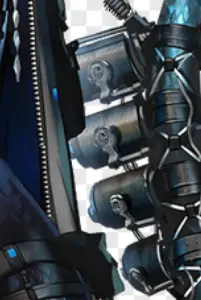
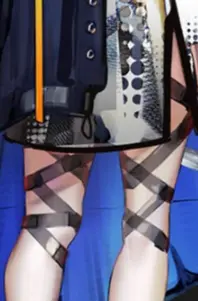
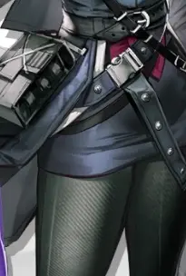
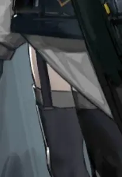
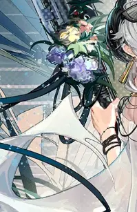
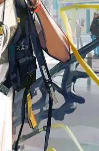
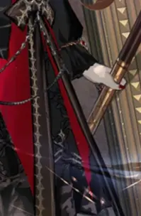
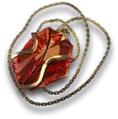
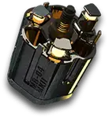
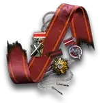

 {.centering}

命运是用来打破的，即便你对这个结局心甘情愿，我也想尝试去改变……哪怕你们一个个地离我而去，我也不想、更不能就此接受。{.centering}

——凯尔希{.aright}

<!-- more -->

**【1】除了在集成战略模式中我们熟知的“天启四骑士”之外，罗德岛的精英干员还有很多。以下立绘截取部分中，不来自于罗德岛精英干员立绘的一项是**

|  |  |  |  |
| :---: | :---: | :---: | :---: |
| A | B | C | D |

**【2】在主线和别传剧情中，罗德岛精英干员其实都有出场。在博士的谢拉格之旅中，与黑骑士交锋过的干员是**

A. Mechanist

B. Misery

C. Raidian

D. Sharp

**【3】Ace和Scout曾经打过一个赌，他们出外勤时在流民聚落中发现了一个红色机器，只要有人靠近就会发出奇怪的声音。他们赌那个东西是不是破铜烂铁。那么这个东西实际上是**

A. 自动售货

B. 无线电发射台

C. 大型源石炸弹

D. 破铜烂铁

**【4】蚀刻章套组中，有一个系列叫做“可露希尔小奖章”（如下图所示），是可露希尔颁发给你的。这套奖章可以在什么活动模式中获得？**
 	
|  |  |
| :---: | :---: |
| 可露希尔小奖章 | 可露希尔小奖章·δ |

A. 引航者试炼

B. 集成战略

C. 生息演算

D. 保全派驻

**【5】 Logos久居罗德岛圆凳滑行竞速赛的冠军，那么这项比赛的亚军是**

A. Stormeye

B. Scout

C. 煌

D. 博士

**【6】精英干员Mantra早在主线第7章中就有剧情提及，但其立绘直到巴别塔的SideStory中才放出。她所带领的第三小队中包含以下哪名干员？**
 	 	 	 
|  |  |  |  |
| :---: | :---: | :---: | :---: |
| A | B | C | D |

**【7】实际上在集成战略模式中出现的藏品里，也有一些精英干员的物品。请问以下哪一项藏品和罗德岛精英干员无关**
 	 	 	 
|  |  |  |  |
| :---: | :---: | :---: | :---: |
| A | B | C | D |

**【8】集成战略模式中的“天启四骑士”Sharp, Pith, Touch, Stormeye其实都有中文译名。以下对应译名中错误的一项是**

A. Sharp——锋刃

B. Pith——术髓

C. Touch——触痕

D. Stormeye——暴风眼

**【9】郁金香是从水月与深蓝之树开始，集成战略模式中新加入的精英干员。关于郁金香的说法，以下不正确的一项是**

A. 郁金香的天赋可以增加她的技力回复速度，但是第二次开启技能之后失效

B. 郁金香的技能可以对空，但是技能期间仍然会受到眩晕、冻结等负面效果

C. 郁金香曾经还进行过反抗伊比利亚审判庭的活动，但被审判官抓获

D. 藏品“郁金香的秘方”为外用药膏，能够有效抑制人体内海嗣细胞产生的副作用

**【10】在采购中心的“可露希尔推荐”界面中，右侧的可露希尔会根据你当前查看的商品来说一些针对性的推销的话。请问以下哪一句推销用语不属于干员时装相关商品推荐？**

A.特种作战可不是件轻松事，要花大钱的，花大钱。

B.离星星那么近的地方居然会很冷吗？要去那里的话，我是不是该多带几件衣服？

C.“莱茵生命生态科主任”，光有这个名头就能卖个好价钱呀，你不这样觉得吗，博士？

D.阖家欢庆的时候，怎么会嫌好东西多呢，多买多开心嘛。

{style="float:left;max-width:20%;margin-right:1em"}

*扫一扫二维码查看本期答案*

[点我也可以哟ヾ(≧▽≦*)o](https://www.wjx.cn/vm/tUlqOU8.aspx)<eod />

<FakeAds />