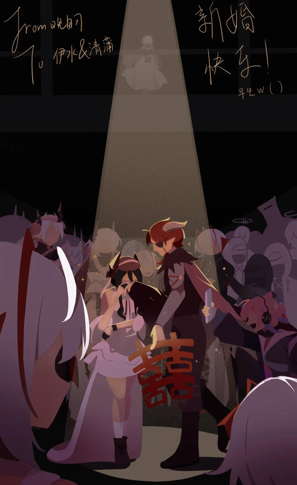

他为她戴上戒指，{.textkai}

用沾染硝烟的披风擦去她眼角的泪水，{.textkai}

许诺一个名为“生活”的未来。{.textkai}

【谨以此文祝福伊水老师和清蒲老师百年好合】{.textkai}

<!-- more -->

走在前面的赫德雷突然站住了，伊内丝撞到他的身上，看到和他们擦肩而过的粉头发少女。那姑娘叫尤里卡，是个主播，听说走到哪天灾追到哪，如今天灾从这片大地上销声匿迹了，她就用这段经历做自己的直播素材。

“嗨，家人们！今天主播U也在带领大家探索罗德岛不为人知的角落！看，迎面走来的是两位来自卡兹戴尔的传奇雇佣兵！主播我可是听过他们不少的战场秘闻……”

“赫德雷，她是不是拍到我们了？”伊内丝看着尤里卡手里的自拍杆，一低头发现赫德雷蹲下了。鬼知道他是不是又要掏手机看主播U的直播，伊内丝懒得管他这点小爱好，她叹了口气，看着赫德雷翻箱倒柜，从衣兜里掏出一个小盒子。

随后，他单膝下跪，打开盒子，亮出里面嵌着的钻戒。

在伊内丝反应过来之前，尤里卡抢先炸了。“家人们！我看到了什么，求婚！赫德雷向伊内丝求婚了！喂喂，有没有在二层17F走廊附近的，快来见证他们的绝美爱情！”

其实不用尤里卡号召，附近闲逛的干员们已经纷纷驻足在他们周围，对这场求婚，以及求婚的两位主角讨论了起来。

伊内丝看着赫德雷那张又紧张又严肃，像是要憋出血来的木头脸。两个人沉默地站了十几秒，伊内丝突然笑了一下，笑过之后她叹了口气，把刚买回来的一大袋蔬菜撇在地上，抱着双臂看着赫德雷：“你不打算说点什么？”

赫德雷的视线在满地乱滚的番茄胡萝卜和伊内丝之间游移了几次，他挠了挠头，说道：“我以为你从我的影子里读出来了，看来这个惊喜还算成功。伊内丝，我还没攒够给你开店的钱，但我已经把基础会计技能学完了，而且前几天我从一位萨尔贡老工匠的手里买到了这枚戒指……”

实际上，从看到那枚戒指开始，赫德雷的话伊内丝全都没仔细听。她抬起左手，赫德雷把戒指戴在她的食指上——“你是不是应该把它戴在我的中指上……” 可能是走廊里的新风可能开得太大了，吹得她眼睛发红、鼻子发酸，伊内丝的话音里带上了些鼻音。

“对不起，我第一次求婚，没什么经验。”赫德雷有些笨拙地把戒指摘下，重新戴在她的中指上，又旋转了半圈让钻石朝向正面。围观的干员已经站了里外三层，尤里卡静静地捧着自拍杆站在离他们最近的黄金机位记录这场求婚，每个人都自觉地压低声音，脸上带着祝福和羡慕的笑容。伊内丝的眼泪不知什么时候落到了手背上，她想讥讽赫德雷几句缓解尴尬，但是除了吸鼻子的声音之外什么也发不出来。

赫德雷向大家鞠躬致谢——虽然大家并没有为这场求婚献上除了见证和微笑之外的任何东西——人群爆发出热烈的掌声和欢呼声，这使伊内丝的眼泪更加不受控制地流淌下来，赫德雷想帮她擦眼泪，但是他的手套并不吸水，于是他摘下手套，直接用手去抹伊内丝脸上的眼泪，而这又抹花了伊内丝精心画的眼妆，所以赫德雷掀起自己千疮百孔的披风去帮伊内丝蘸干眼泪。

“你别用披风擦，好脏……”伊内丝有些嫌弃地小声嘟囔，但依然任由赫德雷帮她擦干了眼泪。

“那个，两位家人，”尤里卡凑到伊内丝和赫德雷中间，“按理来说，在这么重要的场合，我是应该随些礼金的，但是我今天出来做户外，没带钱包……这样吧，我兜里还有两张主播U的透卡，就算给你们打个欠条，等婚礼当天，一定给家人补上份子！”

说罢，她把两张精致的透卡递到伊内丝手里，透卡上印着主播U的Q版小人，还有一些五颜六色的文字和特效。“拿着吧，你不是最喜欢这玩意儿么。”伊内丝不是很懂，索性把透卡交给赫德雷。

“伊内丝小姐，赫德雷先生，我今天刚交了工程部的项目金，手头不是很宽裕，这是我的一点心意，”一个年轻的萨卡兹工人从兜里掏出几张皱巴巴的龙门币，不由分说地塞进赫德雷衣兜里，“希望你们百年好合，永远幸福，希望到时候能参加你们的婚礼！”

在赫德雷来得及把钱还给他之前，萨卡兹已经消失在围观的人群里了。

“赫德雷老兄，这是我刚从雷姆必拓带回来的上等萝卜酒，你们小两口平时不容易，现在日子太平了，你们也熬出头了，祝你们今后的生活像这瓶酒一样，过得有滋有味！”

一瓶酒被赫德雷揣进怀里。

“两位，今天后勤部刚刚发了一批物资，我们几个分不完，这都是新的，你们别嫌弃，以后过日子都用得上……”

几包围裙、洗碗布、一次性纸杯和面巾纸堆在伊内丝脚下。物资顶上放了一小沓龙门币。

来自大炎的几位医疗干员赠送了百草香氛，淡淡的味道很合伊内丝的心意。

工程部特地送来了最新款的扫地机器人，赫德雷表示以后家里的清洁工作由他和机器人负责，不需要伊内丝辛苦。伊内丝在人群起哄的声音里拧了一把赫德雷的腰。

刚刚结束与开斯特公爵会谈的银灰和灵知送上了一盒精致的维多利亚红茶，以及一块谢拉格高山油茶砖。

煌拉着十几个她亲手带出来的徒弟预订了一桌位子，一伙人当场拍下了厚厚一沓龙门币，以及半箱没喝完的啤酒。“到时候我们就喝这箱！赫~德雷，你可得好好对待伊内丝，可——不能，辜负她！”大猫猫划拉着胳膊，被徒弟们架出了现场。

  {style="float:right;max-width:40%;margin-left:1em"}

“伊内丝小姐，祝，祝福你们新婚快乐，那个，我……我不知道该说些什么，这张卡里是我的一点心意，请你们收下……”杰西卡颤颤巍巍地把一张黑卡递到伊内丝手中，“随礼金附上的还有黑钢国际的特别人事函，如果你们有意愿的话，黑钢国际随时欢迎你们。”

“这是家族的徽记，同时也是叙拉古任意一家法律机构的聘书，如果你们以后遇到任何麻烦，家族都会站在你们身后。” 

拉特兰的蛋糕秘方，大炎的麻辣羽兽爪，东国寺庙里的符签，汐斯塔的海滨明信片，来自另一个世界的雕花子弹，从喷火怪龙身上剥下的红色鳞片，还有耀骑士夺冠十几周年纪念的限定版手办……来自泰拉各个角落的礼物堆在两个佣兵脚下，在这片大地上根本找不到任何一家店能售卖如此多样的商品，而光是作为礼金的龙门币就已经摞到伊内丝的脚腕高。

“小刻不懂什么是结婚，但是大家都很开心！伊内丝和赫德雷也很开心！所以小刻也很开心！”小刻从怀里取出两块热乎乎的蜜饼，放在礼物堆的最顶端，“开心的时候就要吃好吃的，小刻希望伊内丝和赫德雷以后每天都有好吃的可以吃！”

在萨科塔干员们的公证下，伊内丝和赫德雷对随礼的每一位干员都表示了真挚的感谢——包括那几位送他们恐鳞鱼干的阿戈尔人。在赫德雷忙着鞠躬和收拾礼物时，一个人拍了拍他的肩。赫德雷回过头，看到一个戴着铁桶的人。

“别忙，我的朋友，”享誉泰拉的著名投资人坎诺特老师从大衣里摸出一个亮闪闪的银色金属箱，“我这里还有一份礼金，同时，我也希望你们能善用这些钱，让他们流通、升值，而不是烂在自己的小账户里——”坎诺特打开金属箱，里面像变魔术一样“嘭”的一声飞出不计其数的龙门币，空中仿佛下起了一场蓝色的雨。坎老师在钞票雨里张开双臂，搂住赫德雷的肩膀，“‘好得不能再好了’泰拉投资大师课，为你的未来攒下每一分钱！这是我送给你们的体验金，不过是以……殿下的名义。”

赫德雷和伊内丝顺着坎诺特手指的方向看去，两个粉色的身影分开人群，走到他们面前。

伊内丝愣愣地看着特蕾西娅拉起她的手，抚摸她指腹上的茧子。

“伊内丝，你长胖了，”特蕾西娅微笑着捏了捏伊内丝的手，“看来赫德雷这几年没亏待你。”

“殿下，您怎么……”伊内丝没说完的话全都变成了眼泪，于是赫德雷又一次掀起披风帮她擦干。

“议会没什么事务，我们就偷偷溜出来了，”特蕾西娅朝她眨眨眼，“还好，没错过现场。赫德雷，我们可是特地来考察你的态度的，萨卡兹的众魂会见证并庇佑你们的爱情，但要是你对伊内丝不好的话……”

“那我就把他做成烟花送上天，怎么样？”一个白头发的萨卡兹突然出现在特蕾西娅身旁，亲昵地抱住了殿下。

伊内丝有些无奈地捏紧眉梢。

“喂，伊内丝，你那是什么表情？赫德雷在跟你求婚诶，你怎么一点都不高兴的样子？”维什戴尔嘀嘀咕咕地拱开坎诺特，挤到一对新人中间，“你看，我给你们带了好东西，这个在炎国可是专门送给新人的！”说完，维什戴尔掏出一叠红纸，把它们抖散、展开成一对大大的喜字，“喂赫德雷，我告诉你啊，虽然伊内丝答应了你的求婚，但是我还没完全同意呢！你得先给伊内丝买一身漂亮裙子，还得写保证书，保证以后绝对不惹她生气，还有……”

那天之后，罗德岛舰内论坛上长期置顶着一段自拍录像，主人公是赫德雷、伊内丝和维什戴尔，背后是卡兹戴尔的两位君主和数不清的罗德岛干员。伊内丝的手上戴着漂亮的钻戒，她和赫德雷一起举着一张红喜字，赫德雷在用披风帮她擦眼泪。<eod />

（责任编辑：广英和荣耀；网页排版：武乙凌薇；绘图：晚自习）

<FakeAds />