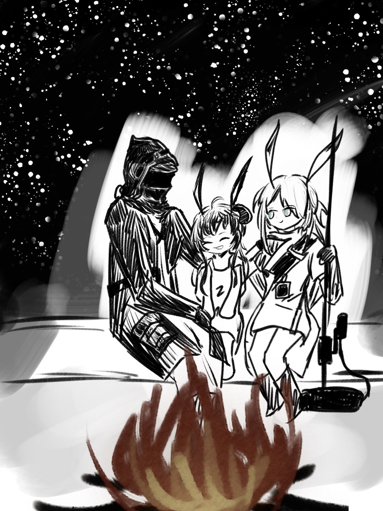

伟大和渺小浓缩于琥珀顽石，{.textkai}

智慧和文明燃烧如白日焰火。{.textkai}

在这样残忍又美好的世界的荒原之上，{.textkai}

我摸着你脸侧的柔软的碎发。{.textkai}

晚安，睡吧，阿米娅{.textkai}

<!-- more -->

## 一、宇宙最紧急事项

孩子，孩子。抱着孩子真是件温暖又可怕的事。生命的神秘在你抱着一个孩子的时候，突然就和原子裂变一样宏大、复杂，一样热量澎湃，一样令人噤声。她的耳朵上的绒毛，她的红彤彤的脸，她的手和脚(怎么会如此纤细娇嫩！)一切都如此真实又虚幻地依赖着他。博士清晰地想起他正发力的每一块肌肉的名字，却没法控制它们中的任何一块。他想要逃跑，可实际上他什么也做不了。如果现在沙地兽疯狂地在深草里刨洞，天灾云聚集起来遮蔽阳光，紫色的天际拧出狂蛇般的巨雷，在这广阔的旷野上直接指向他爆炸——那他也不能挪动，他会站在那里被劈成焦炭。因为阿米娅。阿米娅在他的怀里睡着了。

博士心想，让它劈下来吧！

他的心中充满了一种莽勇。在过去危机四伏、肩负重任的人生里，博士从来未曾拥有过的。在这个瞬间，他发誓会用他的全部力量来守护怀里的孩子。但惶恐也一同升起。他习惯了计算和掌控。通过构造、拟合、模型，他理解和勾勒文明的未来。但过往的一切经验，比起这个十分小的身体，又能算得了什么呢？他的老师向他讲授如何理解载波相位时间频率的时候，从未回答他怎样才能让一个孩子睡得舒服一些。更何况理论和实践之间简直隔着一个星系群！

阿米娅在他怀里呼吸着，因为难受而微微张着嘴。她病了两天了，发着低烧，在疼痛里刚刚睡着不久。孩子是种柔软的、高热的流体，你感到她随时可能从你的怀里坠落、流淌出去。但你简直不敢想象这种情况的后果。博士转过头，一个穿着工装的，灰色的小姐正钻在载具的底盘下面。他们的车正力竭般突出一阵阵的黑烟。

他的唯一可能的救星正在专注于宇宙的第二紧急事项，他不能去打扰她的工作——是的，此时此刻他只能依靠自己，依靠自己来解决宇宙最紧急的事项。

## 二、Miracle

阿米娅醒来之前，博士已经成功掌握了抱孩子的技巧，代价是他在脑海中回顾了两遍《解剖学基础》。悟出正确的发力姿势的时候，博士感到一种久违的攻克难题的快感。没错，源石如何改造生物？后备计划为何没有启动？他的故乡是否还有机会复还？这些问题都还要有待解决。但他已经解决了非常重要的一个，这令他高兴。

他从未如此为自己是个天才而感到自豪。

阿米娅在慢慢退烧。她在梦里打了个细细的喷嚏。博士怜爱地勾拢她鬓角上的额发，忍不住心想——她这么小，竟然也会打喷嚏吗？这种愚蠢的想法竟然萦绕了他近两分钟之久。博士用种种严谨而荒谬的论证慢慢地确认：虽然她会拥有一颗小得多的心脏，虽然她会拥有小得多的肺和细得多的胸腔，虽然她长着耳朵和尾巴，但是她确然是一个和他一样的、会打喷嚏的人类。

他像个失忆症患者，正在对本来平常的一切感到惊奇。走出巴别塔，他一次次地想到旧电子游戏，主角是个喝到神经失常的混乱条子，醒来后向遇见的所有人提问我们在什么地方，人是什么历史是什么社会是什么一切怎会如此之糟烂为什么我们失败失败巨大地失败。博士记得他头一次看见这片荒野时，他心想——哦，这就是我要面对的世界，如此混乱、残破。他很想读档，重新从那个酒吧里醒过来，用他的领带试图在吊扇上上吊。但万年的等待不是屏幕熄灭后的短暂寂灭，他必须理解这一切。更残忍地是他仍然爱这一切。

但这个孩子。她忽然地，毫无征兆地降临到他的身边。没有任何一种宗教给予过这样的神启，然而阿米娅就是这样宛若奇迹地发生了。他搬开仍在发烫的载具残骸(那上面甚至仍有一半巴别塔的标志)，她的脸就那么出现在那里，她看着他，蓝色的眼睛在阳光下面偏光，她用全部的迷茫和全部的依赖注视他，她的很小的手向他伸出。而博士被使命驱使着，他握住了她的手。

于是旁白微笑起来，寂灭下去。旁白说，博士，欢迎回到真实的世界。

## 三、干草垛

夏洛特钻过来，她带着一把崩了个角的长柄锤，活动却出奇地灵活，在草地上走路却毫无声音。

可能这就是卡特斯。但她的性格一点也不像博士对啮齿类动物的印象那么胆小易惊。一种几乎堪称英雄主义的，好像是矿屋前成捆干草一样被阳光晒得松脆的善良和爽朗，让她在确认博士是个带着个可怜孩子的孤身旅人之后，立刻下意识地把自己代入了保护者的责任当中。

阿米娅还在睡，出了点汗，意味着她的病情正在转入平稳。夏洛特贴着博士，探手去他怀里，用指腹轻轻地抚摸阿米娅的头顶，顺着孩子长长的兔耳耳筋向下。博士听见她柔软地叹息着。在那个瞬间，他们两人心中升起的是同一种甜蜜的忧虑。纵使人人都知道世事无常，但当失去父母和感染绝症的不幸出现在如此具体的阿米娅的身上，难免会令人产生疑虑——她凭什么要遇到这种事，她未来又该怎么办呢？这种无来由的惆怅和痛惜，不需要语言地把他们两个链接在一起。雷姆必拓的荒野上，有两个素未谋面的时代为一个幼童的命运一起无能为力。

夏洛特在他身边待了一会儿，接着闲不住地跑开忙活起来。她一定是个勤快的姑娘，或许还是一个大家庭里的姐姐。刚刚见面时，她拽着博士擦伤的手臂，一边埋怨一边飞快地包扎。她不轻不重地隔着纱布按压伤口，在他忍不住痛嘶的时候狠狠地瞪他。

为什么要站在出口！不知道很危险吗？喂，你、你叫什么名字，在听我说话吗？

因为你来救我们了，我很高兴。博士说，谢谢你，夏洛特。

她不说话了，伸手把耳侧的灰色头发轻轻地撩到耳后去。

## 四、女巫坩埚

这种药草的茎是有效成分，叶子应当去掉，那种则大概只是为了改善口感……他正专心翻检着，忽然被药草上的刺扎了一下。鲜血立刻涌了出来，博士下意识地把手指探向嘴边，却被夏洛特一把按住。

“等等等等！灯球草上可是容易沾源石粉的！怎么能往嘴里放！”

源石、源石。博士心想，他果然还是难以对此提供足够的警惕。和在矿区常年与污染、粉尘、绝症打交道的夏洛特不一样，他眼中的源石既不是灾难之源，也似乎并非图纸和测算中可控、有序的摸样。它很陌生，像是像素世界里的一张贴图，突兀又特异。适应这个世界，他必须从接受源石开始。

博士任夏洛特抓着他的指尖，用指甲将伤口里的血挤出来，然后敷上某种冰冰凉凉的植物浆液。刚刚醒来还迷迷糊糊的阿米娅跌跌撞撞地走过来，趴在他盘着的腿上小声地哼着。

博士收回手，端详着指尖的绿色草药。它小而湿润，如同浮在他指尖上的一座绿洲。夏洛特坐在他身边，正带着一点点隐秘的期盼沉默着。

“我又要说谢谢了，夏洛特。雷姆必拓语的‘谢谢’我只会这一种，你不会厌烦吧？嗯，我和阿米娅很幸运能遇见你。”博士真心实意地说，而夏洛特的脸红起来。她跳起来，把博士手里的药钵半拖半抢地拿走，又快又急地把它们捣烂。其实她不需要这样做也会显得很能干。博士情不自禁地微笑起来，伸手盖住阿米娅的眼睛。小兔子睫毛颤动，下意识地把额头贴向他的手心。

“去掉那两味药真的可以吗？”夏洛特虽然询问，但手上的动作不停。她还是选择信任博士对矿区口口相传的偏方的改造。眼前的这个神秘人太过笃定，他对成分的分析听起来有种宗教般的自洽。夏洛特想起曾经到过附近的神父，他谈起神的时候似乎也是类似的语气。博士伸出手，这次他不敢亲手去抓了——“如果你们能找到德莱赛的叶片，煮水后加入，镇痛效果会更好。”

“我会记住的。矿区的大家老是不舍得买药，尤其是得了矿石病的。如果煮叶子就能止痛，那可就太好了。”夏洛特舒了一口气，把捣碎的药汁注进锅里，然后仔仔细细地向火堆里埋进两个包裹好的番薯。

她兴高采烈地说：“煮好阿米娅的药再焖一会儿大概就能吃啦。博士你吃大的，阿米娅吃小的，我？我还有一个胡萝卜派。”

很快，在仿佛女巫坩埚般煮着深绿色药汁的铁锅下面，渐渐渗出了一点热腾腾的甜香。

## 五、红浆果

“它完蛋了。”夏洛特站在她彻底不再冒烟的载具前，沉重地宣判道。

博士说阿米娅，低头。他现场为居功甚伟的“南瓜派”号念了一段悼词。阿米娅拉着他的手，配合地低下头，刘海一下子荡了下去，遮住了视线。

她小小地“呀”了一声，试图通过摇头把它摆上去，然而远远看起来，就只是在摇头晃脑而已。

夏洛特啼笑皆非地等他们结束这个仪式，蹲下来把阿米娅的碎发往耳边别去。博士把阿米娅救出来的时候，割断了一缕被车体残骸压住的长发。现在它正突兀地垂在脸侧。夏洛特把手指插进少女柔软的发丝里，慢慢地理顺它。

博士开始在他宽大的兜帽衣里翻找。但不幸的是，就连博学远见如他，也没有料到自己的荒野之旅会需要一根头绳。夏洛特笑了一声，露出有些自得的神色。

“看！哼哼，这就是女生的仓库哦。”

她腰上的工具包里，足足有黄色、红色、紫色三条皮筋。这像是个伟大的魔术。她拉着阿米娅在石头上坐下来，替她把那绺梳不起来的短发打成辫子。就在她即将用皮筋绑上辫子末端的时候，她突然想起什么一般地叫起来：“博士，你来试试？我来教你，你得学会给阿米娅梳头发。”

这确实是个问题。夏洛特不会一直和他们同行下去，她总会回归她的生活，自己得学着照顾阿米娅。他神色郑重地走过去，小心翼翼地捏住辫稍。夏洛特让开位置，热热地说：“……不要有压力呀，还有我呢。”

黄色是蜂蜜，红色是浆果，紫色是紫罗兰。博士说，阿米娅你喜欢哪一个？她脸色红扑扑的：“想要红色！”

嗯……八十分。夏洛特点评道，歪了而且有点紧，但是值得鼓励。阿米娅探手抓住耳侧的小辫子，笃定地说：九十五分！博士把手套摘下来，露出苍白的一双手。他搓搓手：“阿米娅，我可以再来一次吗？”

## 六、小马过河

没了载具，他们只好步行。夏洛特也说不上来她怎么会神奇地出现在这里，神奇地从崩塌的矿洞里拯救了博士和阿米娅，但她对这里很熟悉。博士陪着她校对了一遍指北针，夏洛特站在荒野上，叉着腰，指向东南方——我们去那里找两只驮兽！

驮兽？博士兴致勃勃，我骑过马！他小声了一点，虽然只有两次。夏洛特瞪大眼睛：马？我们上哪儿找库兰塔人？

紧急恶补过的博士知道库兰塔是什么。他更惊讶的是——难道还真能骑库兰塔人吗？

夏洛特挠挠头发。她不太确定，但总觉得或许也不是不行。矿区的鬼故事里有库兰塔人在幽夜里拐走孩子的传闻，受害者的母亲说她明明看到孩子就在那人的肩上，却追啊追啊怎么也追不上。对卡特斯来说，可能她真的十分努力了。

库兰塔确实能跑很快！当然我也不差。夏洛特拍拍她的锤子，我能扛着它跑两个小时！

博士咋舌。他看向阿米娅，思考自己能不能背着阿米娅跑上两个小时——

不能。他沮丧地得出结论。刚离开巴别塔的时候，一个和夏洛特差不多高的瓦伊凡女士帮他把和重型摩托车差不多重的单人载具从平台搬到了地上，一点也没气喘。那时他就该意识到的。

阿米娅抓着他的手，说博士也很厉害。博士知道很多事！会治病，还很会讲故事！夏洛特也反应过来，安慰他：放心吧有我呢，我不会抛下你们的，我保证！

真好。博士把阿米娅抱起来：“好！我们出发！等找到驮兽了，我给阿米娅讲小马过河的故事怎么样？”

夏洛特笑起来，她提起行李：“我也要听！

## 七、摸摸肚子

“我要给它做个检查。”

博士按着“黄瓜派”的肚子，整个人趴上去，附耳细心听着它肚子里的声响。驮兽的肚子鼓鼓的，很圆润。刚刚牵着它躺倒的夏洛特惊奇地看着这一幕，感觉博士仿佛被淹没在了一个大号毛绒玩具里。

两刻钟前，他们在驮兽群找到并命名了“黄瓜派”和“玉米烙”——某种意义上为了纪念“南瓜派”号。前者是个两岁的好姑娘，性格温顺，个子粗壮，蹄子的形状干净漂亮，一看就能走长路。夏洛特把手上抓着的一把紫花苜蓿递到它嘴边。它嚼了。夏洛特慢慢地把抓着牧草的手放低、放低，黄瓜派被引导着慢慢屈起前腿跪了下来。

“嘿嘿，交易成功，她答应了！”夏洛特说，“博士，我来扶你上去。”

博士坚持要自己试试。趴下的驮兽只有一米多高，他嘴里念念有词，说着什么入职体检一类的怪话，慢腾腾地往上爬。正当夏洛特觉得有点好笑的时候，博士忽然严肃起来。他轻轻拍了拍黄瓜派的肚子，然后微微用力按了下去。

阿米娅充满崇敬地看着他。两天以来，博士已经随口说出太多事后被验证是正确的判断了。他有时候教阿米娅如何通过叶脉的不同走向判断它们的亲缘，偶尔教她如何通过云的形状判断天气，现在轮到黄瓜派了。她看了看在一边自顾自吃草的“玉米烙”，羡慕地想——我也想摸摸它的肚子。

“阿米娅！”博士叫她，抓住她小小的手，“往这里，对，轻轻摁下去。没关系，只是这样她不会痛的。你感觉到了吗？这里的硬块？这里是被称为‘瘤胃’的器官。我们的好姑娘有点胀气了。”

“胃胀气？平时我们会找老奈森拿药。”夏洛特凑过来，挨着他蹲下，“这可麻烦了……还是说博士，你又能像魔术师从帽子里摸出羽兽一样，轻轻松松地变出一个办法来吗？”

博士揽着惊奇而快乐的阿米娅大笑起来，他伸出一只拳头，而后忽地张开。掌心里出现了两只用紫花苜蓿编织的指环。天啊，他真有魔术等着所有人。夏洛特把有花的那个留给阿米娅，飞快地把另一个抓紧手心里。此后博士讲解了怎样治疗黄瓜派，可是她心烦意乱，一点也没有听进去。

## 八、出发地

黄瓜派变得很亲近博士。她喜欢摇着尾巴，用她大而圆的脑袋轻轻地顶撞博士，把博士撞得不停往后后退。

驮兽个头很大，但是性格就和风里倒伏的草一样温顺，胆子和风里颤抖的草一样小，思想和风往哪儿吹就往哪儿倒的草一样单纯。驮兽和草在这个原野上最常见、最敦实。黄瓜派不懂博士究竟给她吃了什么，又用什么手法给她按了肚子，她只是变得很喜欢博士而已。

“好啦好啦！”夏洛特抱住黄瓜派的脖子，抚摸着她有些粗糙的鬃毛，“别顶博士啦，我们该睡觉了。”

她很有经验地分派——让驮兽睡外面，我们睡里面。行李放最里面，虽然也没有多少东西啦……博士，你就带着这点东西横穿这片地方吗？很多有经验的车队都不敢。

博士笑眯眯地抚摸阿米娅的脑袋：“就是因为没经验，不是吗？”

夏洛特觉得很难反驳。这确实像是最无知、最鲁莽的人才能做出来的事。天灾、源石、劫匪……这片荒原上有多少危险啊。即便是她，除了蹭矿区的车去过另外几个矿区，都还没有真正地走出雷姆必拓过呢。但博士，他偏偏最不像鲁莽的样子。

“博士是从哪里出发的呢？”她和阿米娅靠在一起，阿米娅和博士靠在一起，他们一起枕在黄瓜派和玉米烙遮住风的方向。夏洛特看着天空，情不自禁地问。

博士沉默了一下，夏洛特几乎觉得他不会回答了。最后他说：“我从巴别塔来。”

## 九、通天塔

夏洛特愣了一下，随即摇起头来：“我知道啊，一见面就知道啦——”

她把他们从矿洞里拉出来，问他们知不知道不远处那辆巴别塔的货车是怎么出了事故。博士抱着烧得昏沉的阿米娅，灰头土脸地爬出深坑，说：“我不清楚，女士，但我要为此负责。”

夏洛特其实现在也不确定博士所说的“负责”是为什么负责。其实哪里有这种道理？博士只是个巴别塔的——大概是研究员什么的——员工而已。我们都知道，对企业来说，员工只是探机上的钻头。偶尔可能会比较昂贵，但是永远可以替换。千里之外一辆被雇佣的雷姆必拓运输载具出了事故，博士能有什么责任呢。难道矿区挖出的源石矿在千里之外炸伤了人，这儿的每个矿工都得为此负责？但博士的神情显示责任是存在的。她对此不置可否，但是再说下去，势必提起那辆翻倒的车里阿米娅的爸爸妈妈。于是她说到这里就不再说下去，而是解释：“嗯，我是说，去巴别塔之前，博士你总该也待过什么地方吧？离开巴别塔之后，你也总该到过什么地方吧？给我们讲讲吧。”

阿米娅闭着眼睛，耳朵轻轻地动了一下。

是啊，是啊，人总要有来的地方。但博士的心里感到茫然。他心想，我待过的地方太多了，于是我反而不属于任何地方。小兔子们，抬头看，看这虚假的天空。我从星星中来。

但他不能这样说。即使他很想描述人造天体如何亘古运行，恒星怎样亿万度地燃烧，时间和光怎样被一起压缩成黑洞。但他不能这样说。博士晃了晃脑袋：“我就是从巴别塔来的。你们知道巴别塔的故事吗？”

他忽然地笑了笑：“阿米娅，你可以听完这个故事再睡觉。”

阿米娅不好意思地咬着嘴唇，顶在黄瓜派肚子上弯着的耳朵尖随着翻身的动作柔软地弹动。少女睁开她蓝色的眼睛。这是她第一次听到众哲人修造通天塔的故事。

## 十、最接近天国的石头

阿米娅，阿米娅。

博士心想，这是我见过的第一个为巴别塔的故事流下眼泪的孩子。

她聪明、勇敢，又富有同情的力量。这种力量让她能够为分裂、隔阂、不可逆转的悲剧落泪。像她这么大的孩子，往往只会觉得这个取得了伟大的失败的故事那样无聊而令人沮丧。因为再伟大的失败终究是失败。孩子的故事里，得到一把剑可以拯救一个王国，杀死一个叛徒可以消灭一种异端，放逐一位暴君可以换来自由与繁荣繁荣，一切失败只是等待着在结算点换取宝物的游戏币而已，它在叙事上必然会得到回响。但是通天塔的故事不一样，它的失败是它最终的寓意，它的失败是它失败的论据，它为了坍塌而被建造，因为建造而通向坍塌。它充满了那样多绝望的成分，越是参与到修建巴别塔的人，越是能感悟到这种绝望。比如说——

一个想法忽然击中他。博士发起抖来，他握住阿米娅小小的手。

天啊。他不知道，他不知道。……阿米娅究竟是为他所讲述的故事而流泪，还是为讲述者不自觉的绝望而流泪呢？

他感到震惊、难堪、感动、警醒和后悔。并不是因为他被一个幼小的孩子所同情，而是因为他意识到他忘记了这个故事的起点。特蕾西娅为什么要给自己的理想国起这样一个不祥的名字？她仍然怀有通天塔修建之初，那最美好的祈愿——人类理当幸福，理当共同理解。

他在阿米娅的啜泣声里放缓声音。当年，他曾在论辩中无数次引用这样的故事。但这是他第一次加入希望的元素：千万尺的高塔倒塌了，天国不可接近。人们从此分裂为不同的语言、文化和种族。但是智慧女神祝福了最接近天国的那块石头，它落进人们的心里。只要胸中有着这块石头，即使语言、文化、种族不同，人们也仍然能互相理解。

阿米娅，你知道它是什么吗？

少女用湿漉漉的眼神看着他，带着鼻音：“博士，是什么呀？”

是爱，孩子，是爱。他抚摸着她脸侧的柔软的碎发，睡吧，晚安，阿米娅。<eod />

（责任编辑：黒子；网页排版：武乙凌薇；绘图：LOFTER@九黄）

<FakeAds />