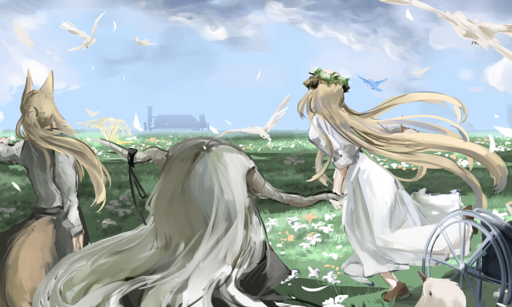

因为她们，不知何时，我和她都改变了。故事的结尾，我们终于相互扶持，不再执着对错。{.textkai}

大树庇护鸟儿，鸟儿乐鸣大树。只因为她们所带来，最宝贵的礼物。{.textkai}

<!-- more -->

## 一 {.centering}

三张胶制照片被推到了壮汉面前。

“卡西米尔的耀骑士玛嘉烈·临光；疑似卡兹戴尔赦罪师的黑色萨卡兹；一位疑似行动不便的白色萨卡兹——军团长……舒克申先生，前些日子，您有见过这三位吗？”

即便酒馆嘈杂，穿着军服的年轻人仍然压低了声音——他坐在舒克申身边，似乎有些惴惴不安。而舒克申转回头来，瞥了一眼面前的照片，并未回答，便又转回头去看向酒馆门外。

外面正在下雨，乒乒乓乓的雨点拍打着女孩的衣角。她蹲在门前低下头，嘴里叼着一片姜饼，怔怔的看着水坑出神。埃拉菲亚的小耳朵微微颤动，配合着雨滴上演起起伏伏的谢幕曲。

舒克申的嘴角勾起一丝笑意。

“小子，你还在我手下的时候，我救过你两次……你还记得吗？”他慢慢悠悠的说。

“嗯。一次是在东国人的刀下，还有一次……”

“我剖开巨型钳兽的肚子，把你从大家伙的胃里拉了出来。”舒克申打断了年轻人的话，“所以，你欠我两个人情。”

年轻人叹了口气：“长官，我一直铭记着您的生死相助。只是这一次真的不能用人情搪塞过去——乌萨斯军一定要从您这里得到一个结果。”

“……我知道。所以第一个人情，就请我喝一杯“黑乌萨斯”吧。”

很快，一杯插着青柠檬，漆黑而偏甜的鸡尾酒被摆在壮汉面前。年轻的军官看着舒克申拿起玻璃杯，吸吮这酒杯的边壁，慢悠悠的品味着柔而后劲的黑乌萨斯。无形的名为沉默的介质弥漫填充，逐渐沉浸两人。

“军团长，您怎么喝起……这么柔和的酒了？”

舒克申放下酒杯：“头痛，失忆，偶尔听到白噪音……现在的我已经远离了战争和鲜血。在我看来，这种鸡尾酒更适合一个疲惫的老农民……虽然有一位医生一直劝我不要喝酒。”

他和年轻人同时叹了一口气，似乎在感叹岁月不饶人。酒杯被放下，舒克申满足的靠在了椅背上：“话说回来，这三个人的行踪对乌萨斯军很重要？”

“嗯。”

“好吧，我明白了——我确实见过他们。”

雨声凿穿墙壁，和酒馆内酒客们的嘈杂汇成了别样的喧闹；女孩仍然蹲在酒馆门口，怔怔的看着水坑出神。而舒克申将双手瘫在桌上，长舒一口气，微蜷身子，慢慢的讲起了库兰塔和黑白萨卡兹的故事。

## 二 {.centering}

早晨。

左腰微微刺痛，于是舒克申睁开眼——半个身子从床上绷直立起，令大腿和身躯折成一个九十度的折角。床板被壮汉身躯骤然折腾，发出不堪重负的咯吱声，白床单荡起一丝褶皱。

起身，转身，弯腰，折叠，床单好似方正松软的蛋糕。推门，走廊，洗漱间，刷牙，镜子如同脱离形态的梦。

放下刷牙的杯子，回到走廊，女孩和他擦肩而过。埃拉菲亚和乌萨斯的嘴巴都糊上了冰块，冷淡一如两位陌生人。头有点晕，耳边噪音依旧，腰越来越痛了，看来昨晚睡眠不是很好，舒克申想。

餐桌在楼下，桌上有一锅羽兽肉汤。舒克申面色冷淡的扶住扶手下楼，背后传来洗漱间门关上的声音。

就在这时候，门铃响了。

舒克申穿过客厅，经过餐桌，伸手拉开大门。伴随门一起打开的还有壮汉的嘴，紧接着这张嘴打出了一连串的连珠炮：

“我不定报纸，不吃健康餐，不对任何宗教有兴趣，不关注泰拉地域中立性，不在乎任何政治正确。这里没有移民，没有哥伦比亚走私商人，没有非法偷税漏税，不贩卖源石兴奋剂和成瘾性药物。我很健康，不需要吃任何保健品，没有慢性症状，更不用提矿石病。请回吧。”

说完他才用正眼打量起门外的三人。

敲门的是库兰塔，一位还算年轻的女士。她有一头金黄的头发，穿戴着银白甲胄。库兰塔身后是萨卡兹，两位萨卡兹——白萨卡兹坐在轮椅上，似乎有些虚弱；而黑萨卡兹推着轮椅，闭着眼睛，怀抱着一根模样怪异的法杖。

舒克申似乎对陌生的库兰塔有些印象，却怎么也想不起来这份印象来自何处。他的视线随之掠过敲门者，落在两位萨卡兹身上。白色的萨卡兹抬起头和他对视，露出了一个甜甜的笑。

舒克申原本已经到了嘴边的那句“魔族佬”被噎了回去。

库兰塔开口了：“请问您是舒克申军团长吗？”

原生于乌萨斯土地的健壮乌萨斯慢慢的点头。

“我想要向您学习。”库兰塔接着说。两位萨卡兹立在身后，没有说话。

“我说过我不关心，不卖东西，自然也不教授……”

“是赫拉格先生介绍我们来的。”

“……”

粗健壮硕者的暂停键被按下，组织好的语言卡在了喉咙里。他原本想要拒绝的，但是口舌捋顺后突出的却是另一句话：

“……赫拉格将军？将军现在还好吗？”

“赫拉格先生现在带领着“阿撒兹勒诊所”，和一家医疗企业“罗德岛”建立了合作关系。”库兰塔顿了顿，又补充道：“赫拉格……将军现在很好。”

壮汉点点头，突然又问道：“将军的女儿叫什么？”

“赫拉格先生没有女儿，但是有一位养女，名叫奈音，现在正……”

舒克申伸出手，示意库兰塔不必再说下去了。“你们想学什么？”

“使用武器。”

“嗯？”

“从弩箭，到刀具枪剑，再到弓和铳，从乌萨斯军队的制式型号，到民间的改装类型……在我们停留的这段时间，我想要尽可能的学习熟练使用这些武器。对了，我们还想借个宿。”

舒克申再次上上下下的打量起三人。片刻后，他再次开口：“你和她，那个黑魔族，不像是没用过武器的样子。”

“只有我跟您学。我不能保证战场上，手中的武器总是是趁手兵器。”库兰塔顿了顿，看向白色的萨卡兹，“毕竟我们还要保护她。”

舒克申抓抓脑袋：“名字？”

“我叫玛莉娅·临光，这位是丽兹，还有她……叫她闪灵就好。”

壮汉侧身拉开门，让出身位：“行，进来吧。”

## 三 {.centering}

五个人在沉默中吃完了一整只炖羽兽。紧接着，餐桌陷入沉寂。

闪灵坐在位子上，抱着法杖闭起眼睛如同老僧入定；而餐桌对面，那个年幼的女孩正目不转睛的盯着丽兹，无表情无意识的眼神下埋藏着淡淡的好奇。

“你跟我来。”舒克申擦擦嘴，站起身。

临光跟着起身，将椅子推到桌下。在她经过丽兹时，白色的萨卡兹突然开口：“她像一只没能飞翔的小鸟。”

舒克申一愣。倒是临光给了闪灵一个眼神，伸出手搭在丽兹肩上：“要好好和人家相处哦。”

两人一前一后走出房子。舒克申的家在荒郊野外，比邻一个小小的村镇，没有移动城邦也没有乌萨斯的军队，安静祥和，是那种最适合在故事里被天灾摧毁以彰显悲剧色彩的地方。

“……我知道切尔诺伯格——龙门出了乱子，但并不了解具体情况。说说吧。”微风吹来，舒克申边问边抓抓手臂。

“整合运动领导人被俘，博卓卡斯替死了。”

抓手臂的手滞住了，“这样啊……”

临光一开始没有听清，片刻后才反应过来，舒克申嘀咕的是“大尉死了啊。”这身嘀咕并不悲伤，也不惋惜，只是带着无限的落寞，好似倒垂的夕阳突兀于天际，又一点点沉沦不见。

“他值得尊敬。”临光说。

舒克申叹气道：“是战士就总会死的。”

短暂的静默后，乌萨斯突然转变话题：“你最擅长什么？”

临光知道他问的是武器，“长枪，矛，锤，戟，大部分盾牌。”

舒克申回过头，又一次详细的端详起库兰塔女人，“我想起你了，您。耀骑士阁下。”

临光没有回答。

“看在将军的面子，我会教您的。我会带您熟悉各个军队势力的武器，无论是……”

“有维多利亚的吗？”

“……有维多利亚的，但不包括他们最尖端的甲胄。”舒克申品出了弦外之音，“你们要去维多利亚？伦蒂尼姆？”

临光点点头，话题戛然而止。经过田垄小道，穿过一片人工栽种的炎国竹，一小片草场和矗立在草场上的小木屋映入眼帘。舒克申转过身，草场和天际的分割线上被突兀的镶嵌上了结实老人身躯的剪影，“骑士，这里就是以后你的训练场所了。跟我来。”

两人穿过草场，站在小木屋前。舒克申从口袋里摸出一把钥匙，打开木屋门。木板和松油的清香扑面而来，气味散去之后留下的是视觉感受上的锐利恐怖和肃穆。屋内的三面墙上，挂满了密密麻麻的武器。各式各样的刀剑枪，矛铳锤，弩弓镰，槌盾杖，万千双封尘而恐怖的眼神凝视着名为临光的来访者。

“这些算是我曾经征南战北的私藏。感谢皇帝，我曾经的旧部允许我带着这些离开军队。”乌萨斯感慨，弯腰从墙角捡起一段落灰的绳子，“你需要练习这个。”

“这是……”

“这是跳绳，锻炼你的平衡性。古往今来，一切武器的应用，都需要人体的平衡。”曾经的军团长甩甩手中的绳子，接着说道，“我没有资格教您大部分的格斗武器，但我能让您在战场上，无论手边有的是什么，你都能活下来——残弩，或者一把断剑。战场不是骑士竞技，但当人做好准备的时候，死神是不会来的。”

在军团长的目光下，临光伸出手，接过跳绳。

## 四 {.centering}

临光和舒克申走后，女孩收拾起了餐桌。她毫不掩饰自己窥视丽兹的目光，于是两双眼神凝聚于空中一触即散，疑惑和好奇挥发空中。

闪灵一动不动一言不发。

“你们是朋友吗？她要你我好好相处。”女孩突然问。

丽兹眨眨眼睛，双手放在腿上，“朋友……我不知道。”

女孩有些疑惑。

“对我来说，记忆只是一些零散的碎片……我不知道临光小姐是不是朋友，只是，我觉得临光小姐可以依靠……”

女孩收拾碗筷的手慢了一拍，“哦……依靠，这是什么？”

“小姐，其实我也不知道依靠是什么，只是……”丽兹闭起眼睛，似乎在思考，又好似在想象什么。

“是这样的……有时候，我会沉浸在一片迷雾里，下坠，下坠……我就像一只小小的玻璃鸟一样。我能看到周遭的白和暗，却不是噩梦和美梦，也许，只是虚无本身……在下坠中，也许会有一双手，是我能停靠的，我能在那里收拢翅膀，也能放心飞翔，如果我能飞翔。”

“但是，也许我看不到那双手的臂膀，那双臂膀也在迷雾之中……我不知道它的主人是谁，是美丽，还是丑陋，或是善良，或是果敢，只是，我会觉得，这是临光小姐的双手……”

“也许，这就是依靠吧。”

“这位像玻璃小鸟一样的小姐……我可以知道您的名字吗？”

女孩眨巴眨巴眼睛，半晌才反应过来，“……托芙。”

“托芙小姐，您说的朋友，就是可以依靠的存在吗？”

“……应该是吧。我没有朋友，我不知道。”

“那位乌萨斯的大叔不是您的朋友吗？”

女孩的嘴一扯，没有出声，再动，却是呜咽几下。闪灵终于睁开眼睛，静静的看着她。

“我不知道……”女孩终于说出来了，语出惊人，“……我本能杀了他的，但，但，我不知道……”

“我要和您确认一遍——所以他们确实来到了长官您家借宿，没有提到任何乌萨斯的军队人员，也没有透露任何军方管制的消息……他们只是给了您一笔钱，在借宿的同时向您学习武器使用。”

酒馆周遭的嘈杂声逐渐安静下来，不知何时酒保已经消失在吧台后。身后似乎有人在起身准备离开酒馆，发出推拉桌椅的响动。舒克申啜饮一口酒液：“是的。以及，让托芙去酒馆隔壁的店里等着，可以吗？”

他到底曾经是乌萨斯军军人。

## 五 {.centering}

库兰塔手中绳子起起落落，在半空中划出一道两道残影。舒克申站在他的身边，拍着手记数。闪灵推着丽兹的轮椅；丽兹腿上放着午餐盒；埃拉菲亚姑娘托芙坐在草垛上。一个似乎还算和谐的午后，风静静地吹。

舒克申的头痛越来越严重了——他不得不服老，身体的衰弱总是在提醒他曾经意气风发的年华一去不返。不过计数这点小事他还是做得到的，他说是七百五十个就是七百五十个。

“七百五十！停吧。”他将手里怀表向临光展示了一下，“两分零九秒，以库兰塔的身体素质来说，很不错了。”

临光弹跳的身躯停下，绳子脱手落在地上。她用双手撑住膝盖，大口喘气放任体内的蒸汽喷薄而出。

“不要停下来！走几步，让身体缓一缓！”舒克申斥道。临光抬头对他笑笑表示知道，迈开腿开始原地踱步。

闪灵从丽兹腿上拿起午餐盒，取出一瓶玻璃瓶装的驮兽奶递给临光。库兰塔接过，凑到嘴边。

“慢慢喝，少量，多次。”

舒克申回身嘱咐。临光看着他走进木屋，一种不知为何的不祥的预感浮上心头。他最后咽下一大口驮兽奶，长抒一口气。

“谢了。”

闪灵回赠了她一个淡淡的笑。

临光回过身走到丽兹面前，半跪下来。她看着丽兹被精心打理的奶白色长发，微微一笑：“身体感觉怎么样？”

“嗯，没问题的。”

“我们会去伦蒂尼姆的……闪灵不是说了吗，赦罪师们也在那里，一切都会好起来的……”

临光的手顺着丽兹的发丝向上，贴心的帮她把角边被风吹乱的头发一一捋顺。

“咳咳。”草垛上的女孩突然咳嗽起来。

舒克申抱着一大块油布出现在临光背后，吓的饶是一向沉稳的耀骑士一个踉跄如同质壁分离。丽兹倒没被吓到，但是在看到临光的失态后却轻笑起来。阳光下一片其乐融融。

壮汉看了看临光，自顾自的说道：“接下来你需要练习这些。”

他一松手，怀里的油布落在地上，显现出包裹着的东西。一把弓，一把铳，一把弩。

“近身战武器运用的基底是身体素质和技巧，耀骑士，我教不了你，只能之后带您快速了解一遍各个国家军队的制式型号——我这里还有一把战利品蒸汽铳枪，报废的。”舒克申踢了踢脚边的东西，“所以我打算先让你速成一下这些武器。弓，铳，弩，把你训练到会使用的水平——铳的话，您会源石技艺的吧。”

临光点头。闪灵站到轮椅之后，给了临光一个鼓励的目光。

“这几把武器都是制式，是你在维多利亚境内最有可能拿到的弓弩。铳则是仿制的，在军队的普及程度很低。当然了解使用方法和技巧，所有这一类武器都大差不……”

白噪音，头晕，不得不服老。

这几个字卡在了喉咙里，老汉一时间忘却了言语。仿佛有大锤撞击在耳边，他仿佛一瞬间回到了曾经的乌萨斯卡西米尔边境战场。

闪灵发现了一丝不对，难得的出声：“先生，不舒服吗？”

“我，我没事。”

舒克申揉了揉眼，回答道：“没事。刚才说到哪里了？对了，弓……”

他弯下腰试图捡起耷拉着油布的那把弓。

就在手指快碰到弓弦时，他摔倒了。头磕绊在坚实的土地，意识夺体而出。

## 六 {.centering}

“你并不了解他们在借宿期间的活动，只知道因为行动不便原因，那个白色萨卡兹几乎不出门。”年轻的军官记录着，“您有注意到另外两人有携带药物吗？”

“不知道，也许有吧，我好像看到了，但我对现在的药不甚了解。”

似乎有人带着门口的女孩离开了，酒馆逐渐的安静下来。门口传来三两声嘈杂，但又很快沉寂了。整个世界似乎只有舒克申和军官在说话。

“嗯，那药物包装上有这个logo吗？”军官简单比划了一下，“这个标志代表罗德岛制药，他们的药应该会和矿石病有关——毕竟那位白色萨卡兹是感染者。”

舒克申放下酒杯，揉了揉下巴：“这个嘛……”

熟悉的天花板。

舒克申睁开眼，吊灯微微悬挂。

“你醒了，舒克申先生。别起身，再躺躺。”

他偏过头，看到床边被摆了三张椅子。临光和闪灵站在床边，脸上写满疲惫。

“我昏倒了多久？”舒克申顺从的没有起身，床板发出一声劫后余生的长叹。他发现自己的手上扎着点滴吊针，塑料管挂在挪到床边的衣帽架上。

“昏倒是昨天下午，现在是晚上十点多。我让她们先睡了。在这之前，是那个姑娘照顾你的。”临光顿了顿，满怀歉意的接着说：“我去罗德岛办事处取得药物，花了点时间，今天没有做长跑锻炼。”

闪灵转身离开，顺便带上了门。床边的两个人竟一时间不知道该说什么，语言突然就无力起来。舒克申把头放正，直直的盯着天花板。

“我还有多久时间？”

“这取决于源石病活化程度。”临光走到吊针边，稍微调整点滴的流量，这原本是闪灵做的，好在她也通晓医疗干员的医护工作，“赫拉格先生从没告诉过我们，您是一位感染者。”

“我的军团领命和将军分开的时候，我还很健康。”

临光坐回椅子上，“当您知道他们是萨卡兹，丽兹是感染者，却没有赶我们走的时候，我只是觉得您是个好人，不歧视感染者。”

舒克申冷哼一声，“歧视？好人？”

“难道不是吗？”

舒克申闭上了眼：“托芙不是我女儿。”

“托芙？”临光一愣，不知话题为何舒克申突然转变话题，“那个埃拉菲亚女孩，她难道不是您领养的吗？”

乌萨斯想说话，却发出一连串咳嗽。库兰塔连忙上前扶住他的后颈，帮助他出气通畅。

几声咳嗽之后，乌萨斯壮汉接着开口：“年前，我还在军队时，我的队伍接到命令，肃清一座乌萨斯和萨米边界的小镇里可能潜藏的恐怖分子和感染者抵抗军。你也知道，这种命令就和“屠杀那里所有的感染者”没有区别。在那个小镇，我亲手杀死了她的母亲。”

临光眼瞳紧收：“因为她是感染者？”

“因为她是感染者，同时也是恐怖分子和抵抗军。骑士，无论是战争还是屠杀，都和骑士竞技不一样。”舒克申又咳嗽起来，“我们冲进屋子的时候，她怀里抱着源石炸弹想要自杀袭击。那时候托芙就坐在屋子的另一侧，满脸写着恐怖，疑惑和不敢置信。我看到源石炸弹的瞬间就挥出刀，第一刀被埃拉菲亚脖子上的源石结晶卡住了，但第二刀很干净利落的抹了脖子。”

“你在她面前杀了她母亲……”

“她怀里的源石炸弹已经被激活了。”

他边咳嗽边说：“所以我当时立刻将尸体怀里的炸弹踢到墙边。也差不多是这个时候吧，我已经冲到门边时，看到了托芙。小埃拉菲亚在那个墙角，看着我。她的脸上除了恐惧和呆滞以外，眼神中还有难以言语形容的悲攸和恨。”

“如果她死在炸弹下，当然无人问责——但那时候，就，唉，不知道为什么，我心软了。所以我冲回去推翻了桌子，抱起她躲在平倒的桌后。”舒克申撩起床单，露出了左腰上镶嵌着的零零散散的颗粒结晶，“我就是在那时候感染的。”

“这枚炸弹没有杀死任何人。当爆炸结束之后，托芙她站了起来，慢慢的推开了我。我看着她站在一片狼藉中，看着原本是她母亲的那块，被爆炸剃成珊瑚状的东西，不知为何心痛了起来。”

“因为周遭复杂的地形，乌萨斯军队不会占领这个小镇，之后那里又会被反反复复的流转于萨米人和乌萨斯人之间。如果留在那里，她的未来恐怕不会太好，所以我就收养了她。刚好我那时候得了矿石病——念我德高望重，老家伙们隐瞒了我的病情让我退了役。”

临光叹了口气，给自己也给快要衰老的老人倒上一杯水：“她难道不恨你吗？”

“当然。最开始几天她坐在房间里，死气沉沉无所念求。哪怕我和她在屋子里见到，也彼此仿佛看不见一般，像是两个相逢的陌生人。”

“直到不久前，有一天晚上，我在自己的床上熟睡，被刀尖卡入脖子的触感给惊醒。睁开眼，我看到托芙站在床边——就是你现在站的这个地方。她手里握着一把刀，在我的喉咙上方不断的颤抖，就像是一只受到惊吓的羽兽。看到我睁开眼睛，她手里的刀脱手撞在床框上，落于地板。”

临光坐下来，端着杯子，等待舒克申的下文。

“于是啊，我就坐了起来。我告诉她，我已经得了矿石病，能活多久也不知道。看着她不再颤抖，平复下来之后，我把地上的刀捡了起来，塞回了她的手里。那是把厨房里的小刀，从没有切过除了果蔬以外的东西。”

“嗯？”库兰塔眉毛一挑。

“我告诉她，如果你恨我，捅过来吧。我是杀了你的母亲，你如果要以这样的方式对我复仇的话，我也没有怨言。说完我躺回了床上，就像现在一样面对着天花板闭上眼睛。”

“你就不怕她真的……”

“怕。”舒克申转过头打断临光，“但我杀了她母亲，还擅自闯进她的生活，将她带到这里，她自然有权利对我用刀。”

“但是啊，但是……自从那天之后，我就在想，在睡梦中想，在消磨时光时想，在揣摸武器时想，在病痛中想。”舒克申的头别了回去，眼神迷离，弥散在天花板的虚无之白中，“骑士，向我学习使用武器的人啊，在这片大地上，如果不取走对方的性命，就不能得到幸福吗？”

骑士低头沉思。舒克申接着说：“得了矿石病，离开军队的我，现在的我，也是那个晚上的我是这么想的：如果只有通过厮杀战斗，互相屠戮才能获得幸福，那么这个世界恐怕哪里出问题了吧？”

“……也许吧。”临光站了起来，“我再给您倒点水。”

“咳咳，咳咳咳……总之，那晚上就像是一个梦。第二天我醒来的时候，她还是对我像对待一个陌生人。厨房里所有的刀都工工整整挂着，仿佛从没被动过一般。”

“不管怎么样，我都要谢谢她，至少在那个夜晚原谅了我。如果之后有一天她再次决定拿起刀的话，我也会欣然接受的吧。”

两人又闲聊几句，骑士站起身，拿着两个空杯子推门离开。走的时候，他把灯顺手关上了。房间中残余的只有沉静而留给安眠者的漆黑。舒克申慢慢闭上眼睛，放任腐朽中的身体陷入安眠。

走廊上，临光关上门，嘴上逐渐浮起一丝笑意。闪灵站在门外，推着轮椅。一个小小的身影蜷缩在轮椅边——托芙双手抱膝，想开口，却又说不出话来，只有眼睛盯着临光，像是在索求一个结果。丽兹的手搭在她的肩膀上，轻轻地安抚。

库兰塔做了一个嘘声的手势，轻轻说道：“你们应该听到了吧？他已经没事了，孩子。”

“现在去睡吧。”

## 七 {.centering}

“他们没有使用假名字，假身份，而且您一眼就认出了那是耀骑士。您有想过和他们动手的可能，以及结果吗？”

“想过，现在的我打不过。”

“那以前的您的？”

“打不过的。”舒克申耸耸肩，想想，又补充道：“如果是军队时期，装备也是我最熟悉的那一套的话，我能在耀骑士手下坚持几分钟吧。不过，我更害怕的是那位……”

“嗯？”

酒馆彻底安静下来，门被人关上了，有人走到他的身后。舒克申倒是毫不在意，继续说道：

“当时因为误会，我意外见到了她出手……”

闪灵睡着了。

她梦到了曾经的卡兹戴尔，她也是万千流亡者中的一个。她梦见粉色的领袖和绿色的毁灭者，还有灵魂和死者的碎屑漂泊于漫漫长河。随着梦的深远，她逐渐步入更久远之前——在提卡兹的眼泪和天青色的椎幕之外，是更为久远的过去。那时的生命尚原始，那时的生命没有社交上附加的定义，那时的生命只需做两件事，吃和杀，进食和屠戮，战斗和生存，而这两件事其实就是一件事：活下去。

这条长河的漫淌着，生命学会了克制，这两件事被克制了，于是社会诞生了。

她流下一滴眼泪。

她放任双足浸入长河，湿润之感浮涌而出。寒冷，随之是漆黑。她坠入河流，踩在漆黑的水幕之上。周遭黑暗，虚无，一处石头堆正在她面前剧烈的燃烧，带出唯一的光亮。

她环顾四周，“临光？丽兹？”

不对，这是梦。她知道这是梦，在还是赦罪师的日子里，她曾触碰过梦的形状。如今，她不知道应该如何面对梦，面对一种沉醉，一种追求上坚定的迷茫。

但真正把她拖出梦境的是一丝淡淡的血腥味——这是临光的血。为拯救痛苦的人们不惜牺牲自己的一切——临光那个孩子，就是这样一个人。她怎么了，发生了什么？

她弓身下床，听到门外的脚步声。有人走到了外面走廊，脚步快到门口了。她们在哪里？她们安全吗？

她毫不犹豫抓起剑形法杖，挥剑自下而上——无需出鞘，门板被轻易的撕成两片。双脚发力，黑色的萨卡兹冲向门外。

舒克申站在走廊上，面前突然碎裂的门让他一时懵圈。闪灵夺门而出，毫不犹豫又是一剑——血气在楼下，那就切掉一切阻挡之物。这一剑不会杀死舒克申，只是瞄准肢体将他逼退。但如果迟了，她是不会原谅自己的。

“喂！”舒克申一个激灵，近乎本能侧身让开了身位。这寒光堪堪划过他的胳膊，鲜血喷发而出。这一招吓到了曾经的军团长——这一剑剑技高超，速度诡异——那不是法杖吗？不是还没出鞘吗？

闪灵飞奔掠过让开身位的舒克申身侧。她蹬上墙曲腿发力，越过栏杆从二楼跳到一楼。血气是从厨房里出来的，他们在厨房……在厨房？

身体比思维的动作更快，法杖杖尖已经挑飞了门栓。厨房里的景象一览无余，显露出里边表情呆滞的三人：托芙和丽兹在锅旁，埃拉菲亚女孩手里握着一卷还蘸有露水的蔬菜。临光站在砧板前，系着围裙。她的手指绑了圈创口贴，看样子是刚刚切菜切破了手指。

厨房只有锅中沸水的声音，咕噜咕噜。

舒克申坐在沙发上，小埃拉菲亚托芙站在他身侧，给他手臂上的伤口缠上绷带。在他们不远处，临光靠在厨房缺了门的门框上，扶着额头。一向沉稳的闪灵低着头——刚才她已经施展了源石技艺，帮助舒克申恢复伤口。现在托芙只是在给他做最后的包扎。

“他们的关系真好啊。”舒克申感慨。

“嗯。”

舒克申举起手臂，方便绷带穿过腋下：“谢谢你。”

埃拉菲亚还是那样面无表情，没有说话，只是缠绕绷带的手没有停歇。

“还有，这话我也觉得应该和你说了。这次是个不错的机会。嗯，我的矿石病逐渐活化了，临光小姐和闪灵女士先前都说，如果调理的好的话，还能过几个年头。”舒克申边想边说，内心不知为何异常平和起来，“我记得我说过你随时可以动手。如果我因为矿石病死了的话，你恐怕就没有机会了。不过你要动手的话，最好和我说一声，毕竟处理矿石病人的尸体是很麻烦的事情。”

绷带又缠了一圈。

“等我去世之后，我所有的资产都留给你了。我想，萨米和乌萨斯这两个国家对你来说都不算什么好地方吧？你可以去别的城市国家，远离萨米和乌萨斯，把所有东西都抛在脑后……生活总是要继续的。”

埃拉菲亚用剪刀剪断绷带，完成了包扎。

“不管怎么说，我很抱歉。还有，我要谢谢你，临光小姐说了，我昏迷的时候大多时间是你在照顾我。”

“杀你的事情……以后再说吧。平安就好。”

托芙开口了，语气依旧是那样冷淡。舒克申一愣，回头看向她——这是年幼的埃拉菲亚第一次应答乌萨斯人，两条平行线终于有了交集。

临光和闪灵一起重新竖起门板，两人走进厨房。破损门板的另一侧再次响起砧板撞击刀刃的声音，渐渐有香气传来。

“是啊。”舒克申放松了身体，让自己陷入沙发之中。当人做好准备的时候，死神是不会来的。

“平安就好。”

## 八 {.centering}

年轻人敲敲手里的笔，摩挲着下巴。

“之后呢？”

“之后他们就走了。”

在他身后，原本是酒客的人们掏出了战斧和军弩，不再隐藏军人的身份。舞台撤下名为酒馆的布景，就像是虚假的军事法庭。

“他们走了？不辞而别？没有告诉您他们接下来回去哪里吗？”军官犹豫片刻，又补充道：“军团长，我敬重您。您的这个回答，可能会影响到我们应该如何对待您。这是军队的命令。”

舒克申一口饮尽酒杯的底液，把杯子放在桌上，“还有什么问题吗？”

在门边，舒克申和临光，闪灵简单拥抱了一下。一片阴云散去，阳关洒在库兰塔和萨卡兹的背上。舒克申蹲了下来，也给了丽兹一个敬重的拥抱。

“谢谢您这个月的指导。”

舒克申站起来挠挠头：“不用谢，我只是让你认识和学会使用各种各样的武器——不过你的悟性真不错。不过，请问能告诉我，你学这些是为了什么，仅仅是为了保护她们吗？”

临光的手放在身前，没有说话。

“其实，你和她已经本已经足够强大了，真难想象你们要面对的敌人啊……还记得那天我说的话吗？这句话我送给你们吧。”舒克申顿了顿，“这个世界，不是只有厮杀战斗，互相屠戮才能获得幸福的。”

“敬承您言。”

舒克申接着嘱咐道：“当然，身体素质的锻炼不能落下。还有机会回来吗？您做的饭味道很不错。”

“不知道。如果顺利的话，返程的时候我们会尝试再和您见一见的。”

“维多利亚我只以军人的身份去过，并不了解，不过据说是个好地方。”

舒克申看向身后，托芙站在客厅。她对丽兹挥挥手，丽兹也微笑着回应。

他笑了起来：“预祝顺利。”

临光走到轮椅之后。闪灵重新抱住剑形状的法杖。三位访客只是人生匆匆一笔带过，日子还要继续。

“舒克申先生，我留了一些药在客厅。药瓶子上有标签，隔一段时间用一些。”临光顿了顿，说道：“有一个组织叫罗德岛，他们在乌萨斯各个城镇应该也有办事处。如果药用完了，就去找他们吧。”

“再见。”

“再见。”

“再见。”

“再见……”

“……再见……”

临光微微授额，关上了门。随着门外的脚步渐行渐远，风逐渐撩起窗帘。新生的春光播撒进客厅。

舒克申回过身，看到了身后的女孩。他上前，想了想，摸了摸女孩的头。

小埃拉菲亚没有拒绝。

“晚上想吃什么？”

## 九 {.centering}

酒馆里，肃杀的气氛从无到有，又一点点弥漫开来。舒克申在玻璃杯的反光中看到了军斧的倒影，知道至少还有一排弩箭对着自己的脑门。

“半个月前，她们离开了，不辞而别。去了哪里，我不知道。”

他又重复了一遍，末了，又补充道：“托芙.扬松，我的养女，她也不知道。”

“……这不是乌萨斯军想听到的回答。”

老军团长没有畏惧，只是注视着面前年轻的军官。这就是乌萨斯军的新一代，他想。

“我不知道。”他说。

死亡盘旋着，先是沉默的尖啸，又是低沉的耳语。舒克申不管不顾，坦然没有任何念想。没有念想吗？他发现其实还是有的，托芙还在门外呢。不过念在是托芙是他的养女，军队不会为难她的吧？他突然有些惴惴不安，却又强迫自己冷静下来。就这样吧。

这时，酒馆紧闭的门外突然传来敲门声，伴随着敲门声的还有小埃拉菲亚清冷却又关怀的声音，“雨更大了，我去买了把伞。”

年轻军官叹了口气，轻轻挥了挥手。身后传来错错杂杂的声音，战斧和弓弩都被收起来了。舒克申一愣，突然想起那句话来——如果做好了准备，死神是不会找上门来的。

一名曾是酒客的军人拉开门，小埃拉菲亚匆匆跑了进来。她的衣角已经湿透了，头发滴落雨珠，手中握着一把还没拆封的伞。“这把伞的包装我拆不开……”她抬头，看向军官和舒克申，又小声的问道：“我，我打扰到你们了吗……”

“我们已经结束了。”军官给了女孩一个简单的微笑。接着，他又对舒克申说：“军团长，我会报给集团军，您不知道耀骑士一行人去向这件事的。您可以走了。”

舒克申站起身，“非常感谢。”

军官给他回了一个礼：“不管怎样，先生，人情方面，我们两不相欠了。”

舒克申走到女孩身边，接过伞。女孩看着他拆封包装，问道：“走了吗？”

在一众军人围睹中，老乌萨斯打开伞，点了点头。于是埃拉菲亚站了起来，凑到伞下。舒克申的手掌很大，于是她握住了壮汉的一根手指。乌萨斯和埃拉菲亚，如果不是种族不同，恐怕没人怀疑他们是一对父女。

乌萨斯的大步伐走向门外，手里的伞和雨点噼噼啪啪撞击发出喧闹嘈杂。他可以放慢了脚步，将伞挪向身侧护住小小的埃拉菲亚。

走出两步，他突然回头对军官说道：“对了，我忘记了一件事情。”

“什么！”

“他们走的时候，给我留了一件宝贵的东西。”

年轻人一愣，赶忙掏出笔记本，犹豫了一下又把笔记本塞回口袋里：“是什么？”

“相逢的意义。”

乌萨斯回答完，弯下腰抱起埃拉菲亚。他把埃拉菲亚放在自己的肩膀上，就像是一棵被小鸟陲依的大树。这棵大树在雨中越走越远，逐渐消失在雨幕中。军官愣愣看着雨幕。

大雨沙沙的下。<eod />

（责任编辑：广英和荣耀；网页排版：武乙凌薇；绘图：Cra）

<FakeAds />