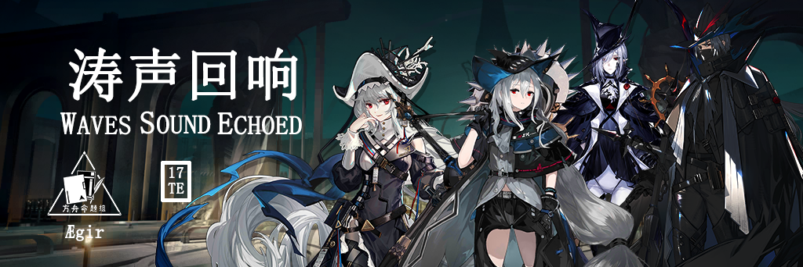
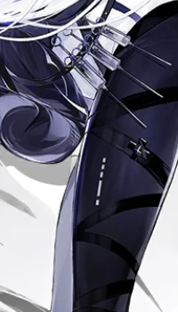
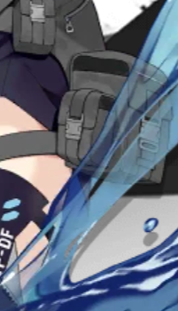
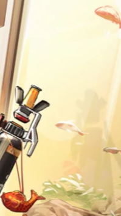
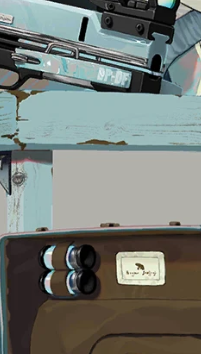
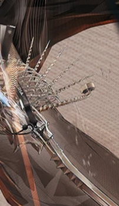
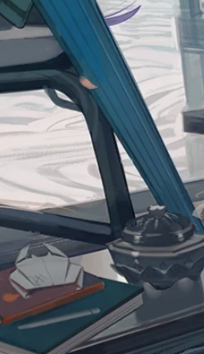

 {.centering}

先哲与你们同在，阿戈尔与你们同在。”{.centering}

——赫库兰尼姆的最后一条广播记录{.aright}

<!-- more -->

**【1】深海猎人血脉相连，他们通常会拥有为整个深海猎人阵营带来加成的天赋，但有的深海猎人只有自身在场时，阵营加成天赋才能生效。这位深海猎人是**

|  |  |  |  |
| :---: | :---: | :---: | :---: |
| A | B | C | D |

**【2】伊比利亚和阿戈尔互为邻国，但一个在陆地上，一个在水下。以下干员立绘截取部分中，属于阿戈尔国家阵营的一项是**

|  |  |  |  |
| :---: | :---: | :---: | :---: |
| A | B | C | D |

**【3】深海猎人通常具有统一的白色头发、红色虹膜的特征，但安哲拉是个例外。关于安哲拉的档案资料，以下说法中错误的一项是**

A.安哲拉是白炽的保镖，二人在雷姆必拓的罗德岛办事处向罗德岛递交了简历

B.安哲拉的武器实际上是一把弩，只是外观看上去像铳，实际上不是铳

C.安哲拉接受的深海猎人改造程度远小于斯卡蒂等人，但这仍然违反了生物应有的尊严

D.安哲拉很早就听说了罗德岛的事情，并且对加入罗德岛有很大的热情

**【4】游戏中我们和深海猎人的第一次接触要追溯到“骑兵与猎人”活动，当时斯卡蒂执行任务的地点是卡西米尔的**

A.流水村

B.倒水村

C.滴水村

D.烧水村

**【5】歌蕾蒂娅和乌尔比安作为深海猎人的二队长和三队长，其战斗技能可以使敌人或自身发生位移。关于他们的战斗技能，以下说法不正确的一项是**

|  |  |  |  |
| :---: | :---: | :---: | :---: |
| A.歌蕾蒂娅的该技能会优先拉动距离自己最远的目标 | B.歌蕾蒂娅的该技能可以减慢敌人的移动速度并对其造成法术伤害 | C.乌尔比安的该技能进行专精时可以强化拖拽力度 | D.该技能使乌尔比安自身的位移实际上是一次再部署效果 |

**【6】阿戈尔不止是国家名称，也是一个种族的名称，其对应现实原型为各类海洋生物。以下干员截取立绘中，对应干员种族不属于阿戈尔的一项是**
 	 	 	 
|  |  |  |  |
| :---: | :---: | :---: | :---: |
| A | B | C | D |

**【7】盐风城主教昆图斯、翻译家阿玛雅、先哲玛利图斯……许多人们都为了海嗣这一生命形态而献出了自己的一切。以下剧情描述中说法不正确的一项是**
 	 	 	 
A.昆图斯在目睹了首言者被深海猎人杀死后，完全转化为了海嗣，最终被深海猎人合力击杀

B.阿玛雅十分向往海嗣大群的社会结构，并支持人性无用论，被幽灵鲨重创后，最终转化为了“大群意志”，屠谕者

C.玛利图斯原为参与设计了斗智场的阿戈尔先哲，但在亲眼目睹了地底巨兽及其记忆后自愿转化为海嗣

D.在故事集“为更好的自己”中，深海教会的势力已经扩张到了伊比利亚的村庄中，深海教会在此宣传海嗣社会的大群理念

**【8】在集成战略“水月与深蓝之树”中，我们进入新的一层时有概率听见大群的呼唤。关于以下四个呼唤，其效果描述和其图标对应关系不正确的一项是**

|  |  |  |  |
| :---: | :---: | :---: | :---: |
| A.争斗：本层中，所有我方单位和敌方非领袖单位攻速+50，我方单位受到的治疗和生命回复效果-70% | B.枯荣：战斗掉落的源石锭+100%；进入一个战斗节点后，立即失去1点目标生命（最多降至1） | C.众我：本层我方指挥经验获取+50%；敌方单位的防御力+50% | D.适应：本层每次战斗结算额外获得1目标生命上限，但损失的护盾值和目标生命提高至2倍 |

**【9】集成战略“水月与深蓝之树”的四个结局为我们展现了海嗣对于泰拉大陆影响的平行世界结局。关于这四个结局文本的部分描述，以下说法中不正确的一项是**

A.平凡即是喜乐：乌尔比安在追杀深海主教西塞罗的过程中发现了其与深海教徒往来的书信，并发现阿戈尔高层早已被深海教徒渗透，他们在尝试让伊莎玛拉苏醒。

B.静谧时代：大静谧席卷了泰拉，人类在海嗣的围攻下被迫退守到最后的堡垒中，团结现在已经一无是处，水月为了保护博士而回归大群。

C.息潮的代价：伊莎玛拉失败了，海嗣离开陆地重返大海。斯卡蒂的意识在斗争中重新占据了上风，但此时的她已经无法原谅自己，她害怕现身。

D.如星空般深蓝：海嗣完成了对泰拉陆地的改造，使其再也没有源石和荒野。最终海嗣族群在完成个体分离后飞升，前往宇宙，并且接受了能够与人类共存的信号。

{style="float:left;max-width:20%;margin-right:1em"}

*扫一扫二维码查看本期答案*

[点我也可以哟ヾ(≧▽≦*)o](https://www.wjx.cn/vm/mwx7FSR.aspx)<eod />

<FakeAds />