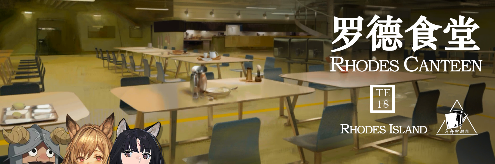 {.centering}

营养均衡的饮食生活，调整好生活的节奏，再加上适当的运动，只要注意这三点，自然会有强健的身体！{.centering}

——海猫于2024年夏活直播时{.aright}

<!-- more -->

**【1】源石虫是泰拉世界中最常见的生物之一，以下对于几种基本源石虫的说法中，不正确的一项是**

| 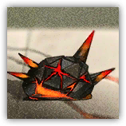 |  |  |  |
| :---: | :---: | :---: | :---: |
| A.这种源石虫的防御力和法术抗性都是 0 | B.这种源石虫的攻击可以让干员防御力下降 | C.这种源石虫可以从战场中出现，并造成凋亡损伤 | D.这种源石虫的攻击是法术伤害，并能造成灼燃损伤 |

**【2】庞贝是一种特殊的源石虫领袖单位，关于它的说法，以下不正确的一项是**

A.庞贝的生命值降低至一半以下时会进入狂暴状态，攻击速度提升

B.庞贝被阻挡时，会对一定范围内我方单位造成法术溅射伤害

C.庞贝就算进入了保护目标点（蓝门），扣除的目标生命值也只有 1 点

D.庞贝在水月与深蓝之树、探索者的银淞止境和生息演算玩法中都出现过

**【3】在故事集《午间逸话》中，香草提及了她饲养的源石虫和磐蟹们，请问以下哪一项不是香草的宠物名称**

A.大黑

B.豆豆

C.圆圆小刺

D.坚强

**【4】钳兽是一种在河、湖、沼泽等水域地形附近常见的感染生物，以下不属于钳兽的一项是**

| 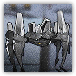 | 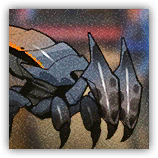 | 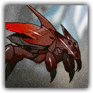 | 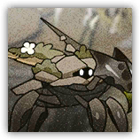 |
| :---: | :---: | :---: | :---: |
| A | B | C | D |

**【5】泰拉世界中的兽主通常都具有动物外形、有人类水平的智力、会说人话等特征。以下不属于兽主的一项是**

A.沙炫风 a.k.a.MC. 舸瑞

B.丹增

C.米奥，热烈的考验者

D.阿涅塞

**【6】在作战中我们往往也能看到很多自然地形，关于这些地形，以下说法中不正确的一项是**

A.部署在草丛中的我方单位会获得隐匿效果，但阻挡敌人时仍会被攻击

B.部署在芦苇丛中的我方单位会获得迷彩效果，但芦苇丛燃烧时不会获得迷彩

C.部署在巨蕈周围4格的我方单位会获得防御力和法术抗性提升效果，但不可叠加

D.部署在溟痕上的我方单位会受到法术伤害和神经损伤，但可以被小帮手减少

**【7】在生息演算中，我们可以利用食材来制作不同的食物。以下食物中，没有以泰拉世界中国家命名的一项是**

|  |  | 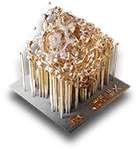 |  |
| :---: | :---: | :---: | :---: |
| A | B | C | D |

**【8】每年除夕夜，干员们都会给博士送来祝福和自己家乡的菜肴，其中阿米娅总是不会缺席。请问以下哪一道菜品不是阿米娅送给博士的**

A.青菜萝卜罐头

B.雷姆必拓西瓜蛋糕

C.木瓜叶馅饼

D.奶油夹心饼干

**【9】在和怪物猎人联动的故事集落叶逐火中，我们看到东国有很多野生动物，以下组别中的动物里，不具有捕猎关系的一组是**

|  |  | 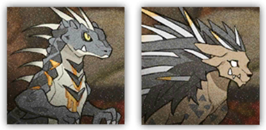 |  |
| :---: | :---: | :---: | :---: |
| A | B | C | D |

**【10】（附加题）《罗德厨房·回甘》漫画中收录了10道和罗德岛干员相关的菜品，以下对图片中菜品的介绍中错误的一项是**

| 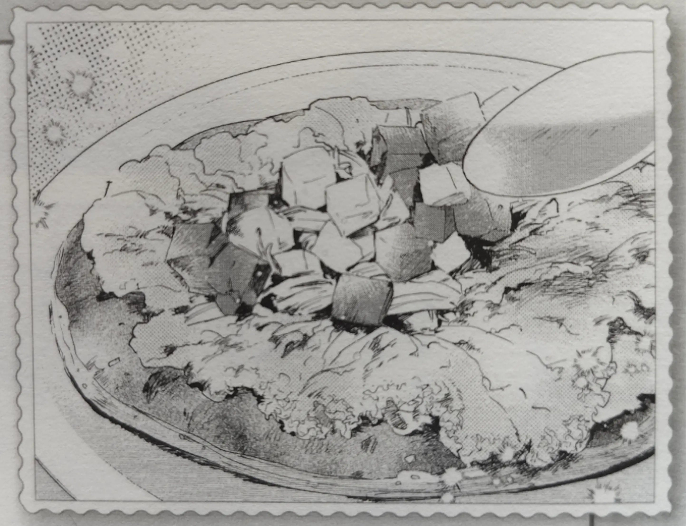 | 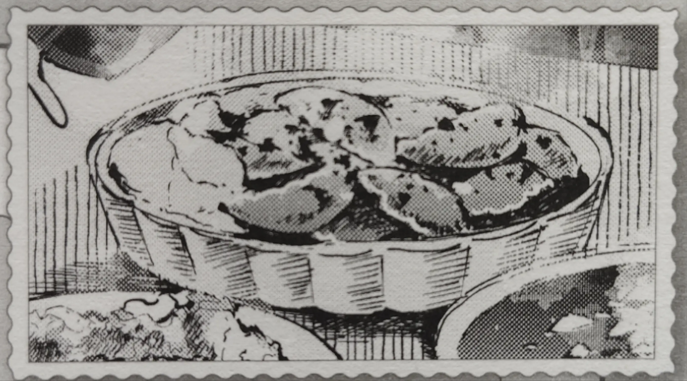 | 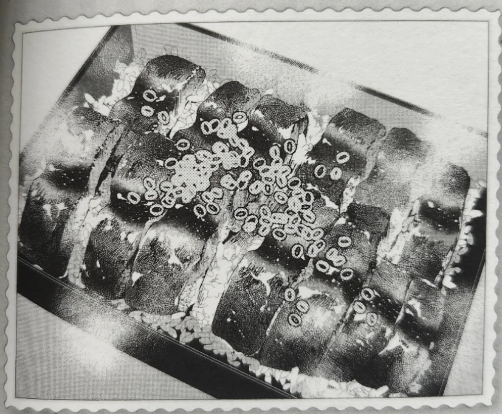 | 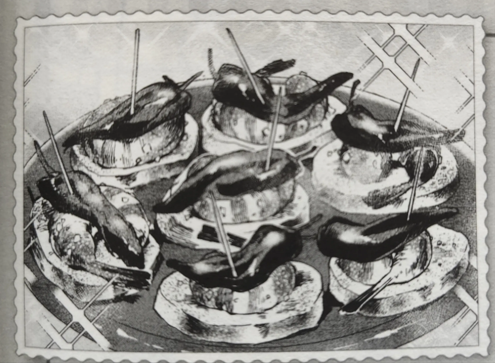 |
| :---: | :---: | :---: | :---: |
| A.角峰做的松饼早餐卷广受罗德岛上干员们的喜爱，甚至到了去晚了就没有早餐吃的地步 | B.早露因为沉浸于工作中而错过了晚饭饭点，但古米和凛冬给她做了家乡的乌萨斯饺子 | C.伊芙利特等人为水月准备了仿蒲烧鳝鳞饭，但在去拿饭的时候被水月误以为是不喜欢自己做的饭而感到失落 | D.棘刺的特制蒜香壳虾塔帕斯中有一个特辣版本，不出意外地被极境吃到了 |

{.image-left-float style="max-width: 20%;"}

*扫一扫二维码查看本期答案*

[点我也可以哟ヾ(≧▽≦*)o](https://www.wjx.cn/vm/OvlXMfQ.aspx)<eod />

<FakeAds />