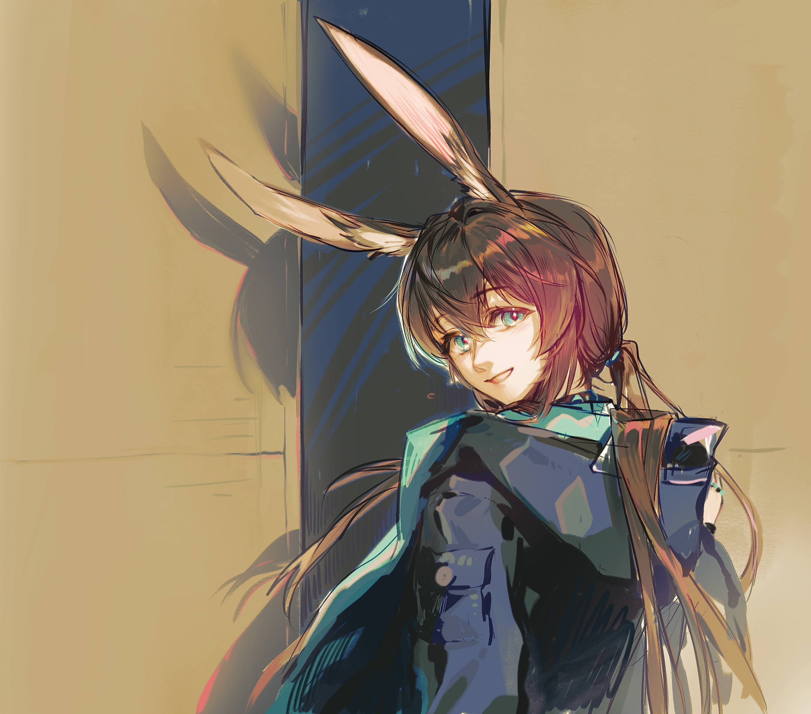

趁着理智还没占领昏昏沉沉的脑袋{.textkai}

她还可以稍微抱着那丝不切实际的幻想{.textkai}

但被叫住时，她还是迟疑的回过头{.textkai}

是啊，她长高了好多。{.textkai}

<!-- more -->

“特蕾西娅小姐？”

阿米娅和特蕾西娅都不会忘记她们第一次单独见面的时候。失眠的小卡特斯身上还穿着松松垮垮的睡衣，抱着一个和她差不多高的大枕头，踩着小碎步穿行在陆行舰走廊的内部。她本来想去找博士，但是她忘记了博士的房间应该怎么走。该往左还是往右，在第三个还是第五个路口。阿米娅忘记了。她只记得博士和凯尔希医生商量说，要把她的房间换到离他们近的地方，这样的话她就可以随时找到他们。

可是今天晚上走廊上空空荡荡的，也没有什么人在行走。巴别塔正在荒地上缓慢地前进，干员们要么在会议室里开会，要么就已经睡着了。阿米娅迷迷糊糊地走了半天，都没看到博士在哪里。反倒是她在一个记不清有没有来过的路口，看到了一扇虚掩着的门。鹅黄的光亮从门缝里透出来，将走廊里清冷的暗色缓缓驱散。

阿米娅推开门，看见了那位粉白色长发的女性。这也是她第一次在这样的情况下，试探着叫出她的名字。

“啊，原来是阿米娅。”特蕾西娅有些惊讶地转过头，笑着朝她走过来，“怎么，很晚了哦。”

阿米娅摇摇头，她的刘海有一段时间没有剪了，垂下来挡住了半边眼睛：“我睡不着。”

“原来是这样。”特蕾西娅并没有责怪阿米娅是个不睡觉的坏孩子，她只是点点头，然后把门关上，轻轻牵起阿米娅的手，“所以你来找我了？”

阿米娅摇摇头。“我是来找博士的。”

真是有点过于诚实的孩子，连一点漂亮话都还没学会。特蕾西娅哭笑不得，她牵着阿米娅的手走到另一侧桌边，然后慢慢坐下。她从桌上拿起了一个小小的绘本，里面画着五彩斑斓的图案。

“特蕾西娅小姐在做什么？”阿米娅看了一眼不远处的那张桌子，在她进门的时候特蕾西娅就站在那张桌子旁边，眉头紧锁着，似乎在想什么事情。阿米娅不知道，所以她想问特蕾西娅。

“在工作。”特蕾西娅笑了笑，她把绘本放在阿米娅的膝盖上，然后轻轻翻开第一页，“不过，现在可以给阿米娅讲几个小故事。”

“好。”阿米娅乖巧地回答。年幼的小孩子的好奇心很快就消失了，随即转变成了对绘本故事的期待。阿米娅似乎很久之后才意识到这一点：大人们在“工作”的时候并不会随时带着一个绘本。哪怕在那个时候，她只是一个刚刚离开雷姆必拓的小兔子，她以为大人们都是这样的。

就像博士那样，就像凯尔希医生那样，就像罗得岛上好多好多的干员们一样。她所接触的那些大人们，似乎都随时准备着陪伴她长大。阿米娅的记忆里有这么一段短暂的岁月，在巴别塔缓慢穿行于荒地的丘陵之间，双月照下的时候，只要自己叫他们的名字，他们就会情不自禁地微笑起来。

“特蕾西娅小姐？”

阿米娅明明记得，那只是一个平常到再平常不过的晚上。巴别塔安静地停靠在卡兹戴尔城外的荒地里，双月悬挂在天空，光辉黯淡。她好像做了一个噩梦，梦见自己躺在雷姆必拓的那个废墟里，任她如何呼唤，都没有人回应。火舌翻腾，意识蒸发，结晶在她体内疯狂生长，最后堵住了她的喉咙。

阿米娅吓醒了，好在她很快就意识到自己只是在做梦。可是在那之后她怎么都睡不着，所以她抱着枕头下了床，想去找博士。她之前就听说博士和凯尔希医生他们在准备着什么“夺回卡兹戴尔”的作战之类的，那个眉飞色舞地给自己讲述这个宏图伟业的萨卡兹神情激动，导致她压根就没有听清。

不过特蕾西娅小姐也许还在。在阿米娅的记忆里，如果她没有找到博士，那么特蕾西娅小姐就一定会在。而且不管什么时候，只要她叫出她的名字，似乎总能得到回应。特蕾西娅给了她这样的感觉。

可是，当阿米娅又一次在巴别塔这只庞然的巨兽体内失去了方向感，她发现她再也没有找到特蕾西娅小姐。博士和凯尔希医生也不在，许许多多的干员都不在。那些平日里总是要凑过来给自己打招呼，揉揉脑袋的哥哥姐姐，也都不知道去了哪里。整个世界里仿佛只剩下她一个人。

阿米娅感到没由来的害怕，所以当她听到脚步声和金属嗡鸣的声音的时候，她只是小心翼翼地走了过去。她发现主控室里的灯还亮着，门大开着。可是这一次，房间里面惨白的灯光却没能照亮门外的黑暗。一点都没有。

直到四年后重新见到特蕾西娅，阿米娅都一直以为，那是她和特蕾西娅的最后一次见面。当时的她还只是一个不谙世事的孩子，没有看到满地的尸体和鲜血，没有闻到刺鼻的血腥和恶臭，她穿着整洁无比的衣服，站在门口，轻轻地呼唤特蕾西娅。而特蕾西娅也回过了头。

后面的事情，阿米娅很少再谈起。那时候的她无论如何也无法理解究竟发生了什么，而那场灾难的后续却需要她用一辈子来慢慢忘记。

在很长的一段时间里，阿米娅没有像其他所有人那样，追问一个真相，或者所谓答案。并不是因为她对此漠不关心。这仅仅只是因为她有些忘记了应该向谁追究这份责任。

她有答案，几乎所有人都有一个答案。但那个答案无人验证。

所以他们离开了，他们又留下了。巴别塔变成了罗德岛，故事一次又一次翻篇。

阿米娅知道，她必须尽快长大，要比任何都成长得快，才能帮助凯尔希医生，帮助博士和特蕾西娅小姐。

可那终究不是她所应该承受的重任。

在内化宇宙里，阿米娅没有问特蕾西娅，当初究竟是怀揣着什么样的心情，将那顶王冠刺进自己的胸膛。就像她没有问博士，当初究竟发生了什么，究竟为什么会这样。

因为过去太久了。阿米娅对自己说。

博士也好，特蕾西娅也好。等到他们重新再见的时候，已经过去了好多年。

他们会认出自己吗，会因为自己长高了而惊讶吗？

阿米娅必须承认，在某一个短暂到足以忽略的瞬间，她这样想过。

在他们分别之前，他们都还像是普通得再普通不过的一家人。博士和凯尔希医生会因为小事开玩笑，特蕾西娅小姐歪着头微笑，他们会发现自己，然后和她一起看绘本，听故事。

可是重新见面的时候，切尔诺伯格和伦蒂尼姆都变成了废墟。熟悉的朋友一个一个离去。阿米娅知道，她已经长大了，很多事情也再也回不去了。甚至当她意识到，也许那些让人怀念的往事，也仅仅只是因为自己的年幼而看似美好，她难免会有些失落。

阿米娅没有和任何人说过，很偶尔，很偶尔，当她一个人躺在床上，看着窗外双月黯淡的光，她还是会抱紧怀里的枕头，不安地蜷缩成一团。

“特蕾西娅小姐？”

当阿米娅从一场已然模糊的噩梦中醒来时，她发现自己的脸上满是泪痕。特蕾西娅坐在她的床边，微笑着看着她。

这个单词几乎是下意识地从阿米娅的嘴里逃了出来。在她如梦似幻，脑袋还昏沉一片的时候，她仿佛又一次看到了过去的幻影，如此真切清晰。下一秒她就意识到自己做出了错误的判断，比梦境更让人神伤。

“早上好，阿米娅。”魔王回答。

“早上好。”阿米娅揉了揉眼睛，从床上爬起来。

“我检测到你的精神波动很剧烈。”魔王平静地说，“还好吗？”

阿米娅愣了一下，然后摇了摇头。她勉强挤出一个笑脸，然后下了床：“只是做了一个噩梦而已。”

每天早上洗漱的时候，看见玻璃里自己身边的那副面孔，阿米娅都会不由自主地感到恍惚。哪怕她应该已经习惯了这样的生活，但她还是会情不自禁地遐想另外一种可能。

如果特蕾西娅小姐没有离开，她是不是也会像现在这样，安静地等自己洗漱，再坐在她身后帮她梳头发？

有时候，阿米娅总是不着边际地想这些事情。

她还是会经常失眠，还是会经常到那个会议室去。长高了不少，有时候还是要抱着枕头睡觉，但枕头已经很小了。小时候的睡衣早就穿不上了。只是她已经过了看绘本的年纪，也早已经不会在罗德岛上迷路了。

可是，她再也没有见过有一天的深夜里，鹅黄的光从小小的门缝里钻出来，驱散了所有的黑暗和寒冷。那或许只是小孩子才走得到的地方。

“特蕾西娅小姐。”阿米娅说。

魔王从镜子里看着她，却一个字都没有说话。

“您在这里吗？”

魔王没有说话。

阿米娅知道，她不应该得到答复。哪怕她希望凯尔希医生和博士能够向她解释，魔王和特蕾西娅小姐究竟是什么关系。但她到底没有问出口。她还没有勇气承受一个确定的现实，所以至少现在，至少今天，趁着理智还没占领昏昏沉沉的脑袋。她还可以稍微抱着那丝不切实际的幻想，从那双眼睛里看到陌生的影子，填满了熟悉的轮廓。

阿米娅知道的。他们已经长大了，世事总是改变。

阿米娅有些尴尬地挠了挠头，转身准备出门。就在她的手即将碰到门锁的时候，魔王从身后叫住了她。

阿米娅迟疑地转过头，看着那熟悉到让人眼睛发酸的面容，突然用熟悉的语调说话。

 {.centering}

“真的，长高了好多呢。”

但理智就在一瞬间消失，变成了发自内心的笑容。

“嗯！”<eod />

（责任编辑：广英和荣耀；网页排版：Baka632；绘图：粥）

<FakeAds />