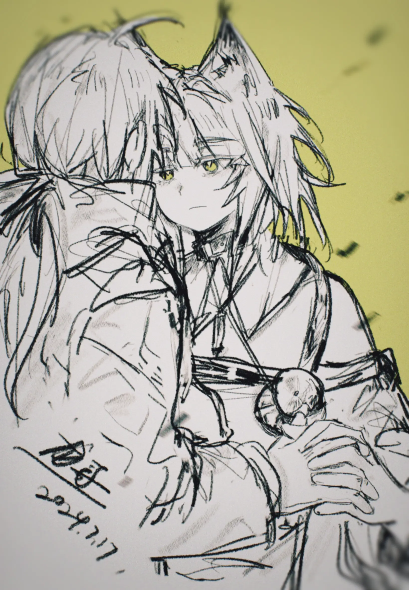

在我们脚下，罗德岛低吼着{.textkai}

朝着日出的方向昂扬行驶{.textkai}

身侧原野有羽兽腾空{.textkai}

年轻而鲜活，留下幸福自由的长鸣{.textkai}

<!-- more -->

## 1{.centering}

每次信使来的时候，罗德岛上都会变得格外热闹，我带着孩子们穿过C2舱道走进货物集散仓库的时候，早就有许多干员在房间里围成了一团。信使是从维多利亚来的，他带来了信件，商品，还有工坊特制的圣诞节糖果，虽然圣诞节已经过去了三个月，但孩子们喜欢这些带有漂亮绿色包装的点心。我牵着泡普卡的小手，站在人群后面伸长了脖子张望，那个菲林男士正照着单据一件件交付堆在面前的货箱，他的制服是干净的，靴子却沾满了泥垢。等轮到我们的时候，他从另一只单独的袋子里面拿出了三只绿色的盒子，将它们一一交到我手上，“迟到的圣诞快乐！”他弯下腰捏了捏铃兰的脸蛋。我跟他道了谢，然后领着孩子们到一边的角落里分发糖果。当我把最后一枚太妃糖塞进红的嘴里时，那个菲林族的信使向我走了过来，我注意到他手里拿着一件并不很大的方形包裹。

“博士，”他微笑着说，“这里还有一件。”

“给我的？”

“不是，”他走近了，压低声音说道，“给凯尔希医生的。”

“那就送去给她好了。”我说。

“医生从早忙到晚的，我们这些人哪里好去打扰她？也就您和她抬头不见低头见的。”

我颇为无奈地看了看他，从他手里接过了那件包裹。“其实她没你们想的那么可怕。”我拿着笔想了想，最终还是在收件栏上写了凯尔希的名字。“下次有东西，你们直接送她办公室去好了，就放在门口也可以。”

从我和凯尔希共事以来已经过去了两年。那时我从切尔诺伯格的废墟中被挖出来，穿过倾颓的城市和绵延的天灾云，他们终于让我回到了这座堪称工业奇迹的“罗德岛”陆行舰上。之后的一段日子，我就像一只新糊成的白色风筝一样，受阿米娅和许多其他同伴的手牵引着，在记忆的碧空中漂浮着目睹了这片大地上的种种。然而即使两年过去，许多冒险与苦难早已被抛在身后的此刻，罗德岛上依然充满了让我捉摸不透的事物，其中尤以这个那位医疗部的菲林女士为甚。在我对罗德岛生活的描摹中，凯尔希几乎可以说是这艘船的一个零件，她在舰船的核心部位中精密运行着，日以继夜，从不故障。她这种一丝不苟的生活作风已经到了令许多人害怕的程度，我知道某些年轻一点的干员私底下里称她为“巫婆”，类似这样的绰号莫名的令我感到厌恶，然而她自己大概并不在乎。

我拿着包裹经过凯尔希办公室的门口时，房门正紧闭着。我敲了敲门，但没有回应，于是我小心地将门推开一条缝，透过缝隙我看见了那个端坐在书桌前整理表格单据的纤细身形，卤素灯的影子从白色塑料隔帘的另一端透过来，衰弱的白光将宽敞的房间染成了幽暗的淡蓝色。我蹑手蹑脚地走进去，看见自己的影子打在墙上，渐渐与室内的幽暗融为一体，飘忽恍若漩涡中的鱼影。

我走到她身后，假装咳嗽了一声，“维多利亚的信使送了件东西来，说是给凯尔希医生的。”

“谢谢。放在那边吧。”她注视着手中的书写板，不以为意地说。

我把包裹放在手术椅上，松开手时我看见了在封口处的那张带着些微破损的的贴票，上面写着维多利亚边境自治郡，多伦郡，布吉街，19，再后面的数字已经看不清了。

“还有什么事？”

“没事，只是好奇这包裹里是什么。”我说。“你在多伦郡有朋友？”

 “十多年前在那边呆过一阵子。”她叹了口气，放下手中的案卷，转动办公椅朝向了我。“虽然我很想拒绝，但如果你想聊天的话，博士，控制在两分钟之内。”

 “那倒也不必，只是随口问问而已。” 

她带着古怪的神色看了我一眼，接着起身走了过来，将包裹拿起来上下翻看着，眼中的困惑闪烁不定。她将表面的油纸拆开，成堆的塑料填充物露了出来，在那之下的是一只精美的银色盒子，整体由锡一类的金属铸就，有着银质的鸢尾花雕饰和椭圆形的老式锁扣。这是一只外形上带有厚重年代感的首饰盒。

这是你的吗？我问凯尔希，而后者没有加以理睬。她打开了那只盒子，露出它空荡荡的内部结构，在中心的黑色的绒制方格中，只有一串项链寂寞地躺在那里，菱形的坠饰上一颗翠绿色的宝石莹莹闪烁着，那光泽不知怎的让我胸口一紧。被项链压在下面的还有一张白色的信纸，被什么人折成四分之一大小的一叠，隐约的墨迹在它的表面勾勒出细密的纹路，这使它看起来如同一片偶然落入的玉兰花瓣。

后来我离开了凯尔希的办公室。走在冷硬的舱内走廊上时我不住地回想那串翠绿色的项链，还有凝视着它的，凯尔希那双清澈而冷静的眸子，我觉得它们是相似的，但又并非完全相同。也许那的确是凯尔希的东西，那条项链，那只盒子，曾经作为菲林女士的一个片段真切地存在过，而如今却不过是遗失在岁月中的蒙尘旧物。我开始想象凯尔希过去的样子，她戴着那串项链，穿着维多利亚式的鲜艳衣裙，踩着轻快的步伐行走在遥远国度的土地上，她嘴角勾勒出的笑容风情万种，她的发丝清扬如同柳树的枝梢，她翠绿色的眼睛，她的眼睛……我无法再继续想象，我想要将宝石一样的眼睛填充进脑中勾勒出的凯尔希的形象里，突然间却被一种强烈的无力感所笼罩，我无法想象凯尔希用柔情的眼神看着我的样子，在我零碎的记忆中，她的眼睛仿佛从未真正地注视过谁，她总是透过了眼前的重重阻滞，遥望着这片大地烟尘弥漫的彼端，而那种视线，我回想起来，仿佛亘古不变的，永远透着一种散发着雨露气味的深深的哀愁。

## 2{.centering}

今天早上我准时来到了自己的办公室，在里面闷着头干了一上午的活。十点钟的时候阿米娅按例来帮我泡咖啡，她在我的办公室里走动时我总是无法专注于手头的工作，我不自觉的关注着她的一举一动，每次她两只手摇摇晃晃地把装满水的水壶提到放咖啡机的桌案上，或是伸手去够放在橱柜上层的咖啡豆时，我都要偷偷地为她捏一把汗。有好几次我叫她放弃这种具有奇怪仪式感的行动，泡咖啡这种小事我完全可以自己做，而她微笑着拒绝了。

“博士平时工作已经很辛苦了，这些杂事就请交给我帮忙吧。”

看着个头仅到自己胸前的小女孩为了自己忙前忙后实在是一种煎熬。每次从阿米娅进门开始，我就会在心里默数180秒，大部分时候，在我数完之前，热腾腾冒着白气的咖啡就会被端上我的办公桌，她会微笑着轻声问候我，然后蹑着步子悄然地离开，而我则回到桌面上堆积如山的案卷之中。今天我也在心中默默地读着秒，我一直数，数到200秒时依然能听见水沸腾时的咕噜声，阿米娅脚步轻柔从这头踱到那头，我知道她心里一定有些不寻常的话想跟我说。

“最近凯尔希医生的样子有点奇怪。”她终于开口了，她清脆的声音里藏有一种稚嫩的忧郁。

“华法林医生说，她已经连续三天三夜没有从办公室里出来了，连灯都没有熄过。”

“她经常这样。”

“可那样是不对的呀。人得要吃饭，要睡觉，不然再厉害的人也会倒下去的。凯尔希医生身上的担子很重，我知道，但是这样下去她会拖垮自己的。”

 阿米娅说着，声音越来越激动。这时烧水壶发出一声尖锐的长鸣，她赶忙手忙脚乱地将水壶移开。

“博士，去看看凯尔希医生吧。”

她担心凯尔希，担心得不得了。也许她不想看到凯尔希熬夜工作之后形容枯槁的模样，也许她知道凯尔希绝不想让阿米娅因为自己而难过，从而选择了隐藏自己的情感。不管怎样，我答应了她的请求，并安慰她凯尔希一定不会有事 ，离开时她勉强地对着我笑了笑，那笑容如同一根尖针扎在心头，在隐痛中我度过了一个日光散漫的上午。

午休时我在食堂里四处张望，并没有找见凯尔希的身影，问了在窗口执勤的干员们，他们也都说没有见过，我于是想到凯尔希大概还没有从办公室里出来。我要了两份火腿三明治，用一只塑料餐盒装着，又拿了一杯热豆浆，打算给凯尔希送过去。

走到凯尔希门前我悄悄往里张望，通过门缝我看见了她穿着白色实验袍的身影。适时她并没有坐在往常办公的位置上，而是伫立在靠近门口的橱柜前，她手里拿着那只缺了角的白色马克杯，正在往里倒咖啡，褐色的液体从机器里汩汩地流出来，很快就把杯子装满了，但凯尔希的侧脸上神情恍惚，这让我有种不好的预感。果然，咖啡从杯子里满了出来，滚烫的液体淌过凯尔希端着杯子的那只手，滴在地上时，白色的烟雾也随之升起，而她双目鳏鳏，似乎全无察觉似的，依旧虚无地站在那里。我夺门而入，冲开门扉时发出巨大的哐啷一声，凯尔希似乎吓了一跳，她猛的抬起头来，身体不自觉地往后缩去，而此时知觉归来，她似乎感觉到手上剧烈的灼痛，手突然地一振，马克杯便应声落在了地上，其中的内容物漫延开来，将地上散落的一些纸张染上深沉的颜色，整个房间里飘荡着咖啡馥郁的香气。

我快步地走上前去，想要抓住凯尔希端杯子的那只手，混乱中我隐约看到了她手上胭脂一样的绯红色肌肤，她一定是被烫伤了。但我伸出的手接触到的却是某种冷硬的结晶状物，是Mon3tr，它黑色的节肢状的身躯突然拦在了我们中间，而在它怀中的凯尔希，她的眼睛投射出一种尖锐的敌意，那样的眼神让我感到莫名其妙。

“你的手没事吧？”我退后半步，问道。

“谁允许你进来的？”

“没人允许我，但是我要是不进来你就要把自己烫出泡了。”

她似乎终于清醒过来。她眼睛低垂着，快速地遮住了手上烫伤的部分，又命令Mon3tr收敛了肢爪，然后站起身来，用她一贯镇定而温和的声调，说：“我没事，你出去吧。”

“虽然这方面你肯定比我来得专业，但我还是建议你赶快冰敷一下。”

“我知道。让我一个人呆着吧。”

她的声音有些虚弱，还带着某种妥协似的态度。我从来没用听过凯尔希用那样的语气说话，惊讶使我没法立即做出回应。我动作僵硬地把手里的食物放在一边的桌案上，朝着凯尔希使了个眼色后，老老实实地从门口退了出去。掩上门时我留意到了那双藏在走廊拐角的长耳朵，我径直走过去，看见的是阿米娅那张惊惶的小脸，见到我时她的眼神不自然地闪烁着，想必她是听到了在办公室里发生的骚乱。

“博士，”阿米娅抬起头来，略带踌躇地说，“你可不可以，可不可以不要讨厌凯尔希医生。”

“我不会的。”我摸了摸她的头，“她或许只是太累了。”

每个人都有不想让人看到的一面，对于一部分人来说，他们掏空心思找到一张掩盖自身脆弱的面具，一戴就是一辈子，我想那已经是一件很累的事情，更何况对于一个遍历沧海桑田的漂泊的长生者。在几个世纪的苦旅之中，她找到了什么，藏起了什么，如今又在坚持着什么，致使自己始终在北风呼啸的原野上踽踽独行呢？这些问题的答案，眼下我都还尚未知晓。我牵起阿米娅的手，与她一同向舰船下层走去，她小小的手掌是纤细而炽热的，握在我的手心里，就好像有一团微小的火苗在静静地燃烧着。                        

## 3{.centering}

我走进酒吧的时候，一些别的干员已经坐在吧台上边上了，我走过去时他们纷纷站起来向我致意，从他们的笑容中我读出了某种不同往常的调侃意味。我走到靠边的位置上坐下来，叫来了吧台执勤的干员，同时坐在一边的黑角也顺势凑了上来。

“博士，听说您又和凯尔希医生杠上了？”

“来一杯威士忌苏打。”我点了单，朝着黑角摆了摆手，示意我并不想谈这件事。可他依然赖在旁边，用一只手支撑着倚在吧台上，我注意到他带着的他晚酌时专用的露出口鼻的面具。

“其实俺有时候也挺佩服您的。”他说着，似乎已经有了些醉意。“每次您惹火了凯尔希医生之后，总是可以全身而退，到底咋做到的呢。”

“这次不能怪我，她脾气上来了，我是正好撞枪口上。”我颇为不耐地说，酒端了上来，球形的冰块在杯中滴溜溜地转动着。

“凯尔希医生对你是不太客气，大伙都看得出来。”

我小口的呷着酒，平时顺口的饮品，这时喝在嘴里也很不是滋味，大概他们把威士忌的牌子换掉了。我暗自叹了口气，现在想起来，其实我也不知道他们以前用的是什么牌子，说到底我还是那个从石棺中醒来，行走在陌生的土地上，脑海中空空如也的人，这些年从未改变过。

“你说，我是不是欠了凯尔希什么东西，只是我自己不记得了？”我突然问道。

“不知道，可能是感情债吧。”黑角做出一副一本正经的样子回答道。

“这话你敢当着她的面说吗？”

他哑然失笑，伸手拍了拍我的肩膀，之后便转过去跟别的干员说话了。我低下头，杯中的酒液金黄灿烂，发酵的香味一阵阵地传来，那是属于时光特有的味道。也许我真的欠过她什么，只要与他人建立联系，多少都会留下亏欠，这是再正常不过的事情，而对此我也并非毫无线索。在切尔诺伯格的地下，凯尔希曾经向我诉说过她的怨恨，那时她给了我一个名字。没错，那个名字，当我默念它时，罗德岛的一切都变得疏离而陌生，黑暗如潮水般涌来。如果不去想它，日子也就这样过下去，但一旦想起了它，那个名字就像一颗突然打入的子弹，毫不留情地击破这脆弱的和平，它浮现在酒杯里，浮现在灯柱上，它在凌晨三点的镜子里，在舰桥暗紫的天空中，在显示航线的电子屏幕上，走廊里消毒水的气味，训练场上每天洒下的汗水，工程部彻夜响着的机械转轴声，阿米娅早晨端来的冒着白气的咖啡，一切仿佛都将那个名字蕴涵其中。特雷西娅，特蕾西娅，W的声音中带着讥诮，凯尔希的诉说哀怨而低沉，她们都曾向我提到过这个名字，并且显然是有意为之的。恐惧感蓦然降临，它并非是拿着镰刀的穿着黑袍的死神形象，而是一缕名为“过往”的无色无味的雾，它在空无一物的白色中悄然升起，身侧万物似乎都受其晕染，变成了透明而毫无生气的模样。我缩起肩膀打了个寒颤。

“特蕾西娅，是谁呢。”我小声说。我并没有刻意向谁发问，不过是借由语言将自己拉回现实的桎梏中，周围干员们谈话的声音也很响亮，没有人留意到我梦呓似的话语。

这时门口出现一个熟悉的身影。煌从走廊的拐角处砰地窜出来，瞪圆了一双车灯似的眼睛在酒吧的门口四下张望。她很快发现了我，蒸汽火车发出呜呜的声音直冲过来，一把便把我的兜帽揪在了手里。

“都什么时候了，博士你还在这喝！”她手只一提，我整个人几乎就从座椅上腾空而起，那瞬间我甚至觉得她一只手能把我连带脚下的椅子粘着地板一块拎起来。“人家都找上门来了！”

“什么？你别急慢点说，发生什么了？”

“发生什么，哼哼，自己去看看呗。”她声音里并没有恼怒，反而透出一种奇怪的兴奋，一手抓着我就往门外走去。我不知道她葫芦里卖的什么药，但也没有反抗这位以勇悍著称的精英干员的力气，只能由着她把我硬生生拖拽着出了酒吧。原先与我坐在一起的人们沉默地看着这场闹剧，他们震惊着面面相觑了一阵子，很快就让好奇心占据了上风，几个好事的干员尾随着我们也走了出来，我们一行乌合之众就这样朝着来宾接待区域大步前进着。

煌带领我们来到了第二会客室，房间里的灯亮着，但我没有听到说话的声音。煌回头示意我们安静，接着便提着步子摸到了会客室的门边，我们也照她的样子跟着摸了上去。门是半掩着的，我和干员们像一串豌豆荚一样挨个从边缘处探出脑袋，接着便看见了房间内的情况。那是一个男人，一个约莫四十上下，身着华服，梳着油光锃亮的背头的菲林族男人。他坐在圆形茶桌的边上，在源石台灯黯淡的灯光中，他的眼睛透露出浮冰一样的怯懦而动摇的神色，在他对面的是凯尔希医生，她披着工作时的那身白色的实验袍，坐着的模样依旧是那么超拔而端庄，我之前见她时那种疲惫的神态已然不见了踪影。

“您读过我的信了吗？”

“嗯。”

“那就好，那就好。”男人说着，似乎很局促地扭了扭身子。“那我想，您应该明白我此行的目的了。”

他扭捏的姿态被我们看在眼里。“他是为凯尔西医生来的？”黑角问，我和煌同时做出了噤声的手势。

“修士，从你离开维多利亚之后，我没有一天不曾想起你。那时的你是那么美丽，那么高贵，简直不像是真实存在于这个世界上的人，而且这么多年过去了，在我看你是一点都没有改变，也许连时间都偏爱你。你离开之后，文森特爵士他们也常提起你，只是每次我听到你的名字时，就会无法克制地感到揪心。我也不怕告诉你，修士，爱人是不犯法的，我为你而写的诗歌数之不尽，几乎堆满了我的书房；我找过一些情人，但她们都不过是肉胎凡骨，没有一个及得上你的万分之一；为了你我甚至想过去死，现在想想真有点可笑，但到头来却也没有那个勇气，因为我想要是死了就再也见不到你了……”

他喋喋不休地念，凯尔希安安静静地听，那时她的神情平静如同一汪的青蓝色的冷湖。煌扭头对我低声道：“我赌这个月工钱，她肯定瞧不上这个男人。”

“我又没有工钱跟你赌。”

“谁说要真赌了。凯尔希这么傲的人，这软蛋还真是痴心妄想。”

“她其实也不是高傲，”我指正她，“只不过是太过务实而已。”

我们小声争论的时候，那个菲林族的男人站了起来，他不知道为什么瞬间爆发出一阵高昂的神气。他对着依旧安坐着的凯尔希，突然大声地说道：“修士，有个问题困扰了我许多年，今天我终于可以跟你请教了。”

“但说无妨。”

“当时，我将那串项链送给你时，你是微笑着收下的，我们还一起跳了舞，不知道你还记不记得。那时我觉得你一定是感受到了我的心意，为此我彻夜难眠。可是为什么，为什么你离开维多利亚的时候，甚至不愿意将它带走，而是把那些首饰全都留在了旧宅里呢？对你来说，这些玩意儿真的就一文不值？”

许多双眼睛都向凯尔希望去，不知道为什么，这一瞬间，我似乎跟这个维多利亚的老贵族取得了某种共情，我们共同期待着凯尔希对这个问题的回答。

“如果您执意要知道的话，我是可以告诉你。没什么不同，那些首饰也好，在维多利亚度过的那些日子也好，和多伦郡诸君的友情也好，对我来说都是一样的，是脑中储存的信息片段而已。”凯尔希神情坦然地说着，“都是已经是过去的事情了，而眼下我有许多更紧要的事，当你必须盯紧脚下的路时，追忆往昔已然成为了一种奢侈。男爵大人，您依然保有这种奢侈，这是你的幸运，也是你的不幸。无论您是要沉溺其中，或是将它带入坟墓，我都不会加以指责，但你要知道，并非人人都是活在回忆中的。”

她拿出那只银色的首饰盒，我猜信和项链也都原封不动地装在里面。她将盒子放在桌上，向着男人那边推了过去。

“这些东西已经不属于我了，请您收好。今天已经晚了，我会让人在罗德岛上给您安排一间客房的。”她站起来微微欠了欠身，接着便朝着门的方向走来。随着她的逼近，我们一伙人手忙脚乱地从门边散开，但是已经太迟了。凯尔希走出来时，我们像一群恶作剧败露的小孩一样满脸呆滞地缩成一团，她的眼神探照灯一样地从我们的脸上一一扫过，在我的脸上似乎停留得尤其久，但什么也没说。她转身离开，很快身影就消失在了拐角处。

那天晚上，我在窗边坐着迟迟没有困意。在迷离的天色中，我感觉这夜晚似真似幻，就像是一块很大的幕布将现实的舞台整个罩住。穿过远空的深蓝色部分，我隐约看见一颗翠绿色的流星从云间划过，带着一条银色的尾焰，孤单地坠向了阴影中起伏不定的原野。它消失的瞬间，从我头顶上方的某处，骤然响起了许多断断续续的呜咽声。

## 4{.centering}

凌晨大概四五点的时候，有人叩响了我的房门。我大声回应说我没休息，请他进来说话，接着便隔着门传来了煌高声的喊叫。

“博士你快去看看，凯尔希好像在实验室出事了！”

我连忙从椅子上跳起来，披上外套走出门去，我开门时走廊尽头隐隐传来一些纷乱的脚步声，有不少人正朝着后舱方向赶去，我和煌也加入了他们。

我们来到实验室门口时，可露希尔正指挥工程部的人在路口摆放分割带。我问她发生了什么，她打着哈欠跟我解释了一通有的没的，我半个字也没听懂，只知道是凯尔希在实验的时候出现了操作失误，弄得个房间里都是焦糊味。我不由得想到，如果凯尔希从我之前进她办公室之后还是一直不眠不休地工作，到今天就是第四天了。

“凯尔希人呢？”

“让她一边呆着去了。”可露希尔说，“这个人真是，什么事都往自己身上揽，机器也经不起这么折腾啊。”

“可她也从来没折腾出过事来啊，今天真是怪了。”煌说道。

“哎呀，有句话怎么说来着，常在卡兹戴尔走，哪能不挨铳，要不叫她多学学我呢，劳逸结合可是很重要的。”

我从闲聊着的两人身边走开，一路沿着尾舱通道找了过去，最后在尾部甲板上看到了那个熟悉的身影。凯尔希倚在甲板边缘的栏杆上，侧着脸望向远方黑暗中层层叠叠的山脉，夜航灯投下的婆娑影子将她苍白的面容分割成了一些黯淡的薄片，在夜色里无声的漂浮着。我在她身后站了一会，最终还是走了上去。

“你最近有点不在状态，”我向她搭话道，“老是给自己用药，效果也会越来越差，也是时候该休息休息了。”

她听我说完，只是似有似无地应了一声，眼睛依然沉默着看向远处。这种固执的态度多少让我有些窝火。

“是因为那个什么维多利亚的男爵吗？”

“为什么这么说？”

“只是想知道你对他的看法，你当时话说得挺重的。”

“一个可怜的人。”凯尔希说着，伸出手理了理发梢。“他为了自己塑造的偶像而活，沉浸在往日的幻象中，就算我不说，他也终将会有醒悟的一天。但愿以后他能振作起来重新开始。”

“这个世界上没有人能真的重新开始。”

“你真这么想？”

“看看我就知道了，”我回答说，“进了棺材，把一切都忘了个干净，最后不还是回到了罗德岛上。就算没有记忆，到头来人还是会走回自己原先的道路，更何况对大部分人来说，就连遗忘也是件足够困难的事情了。”

凯尔希带着惊异的眼神看了看我，也许是因为太过疲惫，她并没有像往常一样出言讽刺我，只是发出了一阵深深的叹息。我感觉自己好像说错话了。

慌乱中我试着转换话题，“要不你跟我说说你以前的事情吧，”我转过身去，换成用背部抵住栏杆的姿势，“你以前在维多利亚待过？是去干什么了？”

“只是去避难而已。我在切尔诺伯格的事情你已经听说了，逃出乌萨斯以后，有一个拉特兰修士把我介绍给了多伦郡的文森特伯爵。他利用权位庇护于我，而我则给他一些施政方面的建议。”

“贵族的客卿？”

“严格来说我只是寄人篱下而已，并没有那种政治上的从属关系。但即使如此，伯爵和他的朋友还是给了我相当好的礼遇，他们是一群有教养的人。”

我摸了摸下巴，知悉凯尔希的过往让我多少有些兴奋。“那时你也像这样，成天玩命的工作？好不容易混入上流社会了，总得去逛个沙龙或者参加个舞会啥的吧。”

“注意你的言辞。”凯尔希睨了我一眼。“我从来没有自愿地加入过你所谓的上流社会，对我来说，在罗德岛还是在维多利亚都没有本质上的区别，我只不过在履行自己的职责而已。”

“不过伯爵倒是一个喜欢热闹的人。他常在家里举办社交舞会，我去过几次。”

“那不挺好的，”我猛地一拍大腿，“你这不是知道怎么放松自己吗？我看罗德岛也可以搞个舞会什么的，大伙交流交流感情，你也可以闲下来稍微活动活动，整天呆在办公室里，我看你人都快石化了。”

“你没资格说我。”

我无奈的笑了笑。我觉得凯尔希也笑了，虽然阴影中我看不清她的脸庞，但可以感受到周围的空气正泛起细密的柔波，这使我想到了那双透明的薄唇抿起时的样子，这样的联想带来了一种类似失重的错觉，我突然有一种预感，下一秒，我会说出一些平时绝不会说的话。

“凯尔希。”

“嗯。”

“你会跳舞吗？”

“以前的确学过一点，所以？”

“你看，我不是失忆了吗，说不定以前也是会跳的，现在就……”我说着，脑海里突然浮现出那个维多利亚的男人战战兢兢的样子，我想我和他其实也没什么区别。“要不咱俩试试？就当是舞会的预演了。”

“现在可不是是开玩笑的好时机，博士。”凯尔希叹了口气，“我也差不多该回去看看实验室修复得怎么样了，还得检查丢了些什么东西，失陪。”

“然后呢，把自己关在房间里，打上两针继续干活？差不多得了，别老是把什么都扛在肩上向前走，偶尔也让别人收拾收拾你的烂摊子，我看可露希尔乐意得不得了。”

她的脚步在舱门出停住了，她转身的时候，我故意摆出了从书上看来的交谊舞的架势，一手搂住了航灯投下的长长的影子，一手搭在微明的夜空中。凯尔希站在一旁，双手抱胸，似乎面无表情地看着我。我咽了口唾沫，开始自顾自地摆动起来，一二三四，一二三四，我一边小声地打着节拍，一边偷偷的向凯尔希的方向望去，从她模糊的神情上我感觉到，自己这时的样子一定很滑稽。

“你的身体协调性真是让人不敢恭维。”

“对一个失忆的人你还能要求什么呢。”

凯尔希走上前来，朝着我的小腿肚轻轻踢了一下，我知道她是在帮我调整姿势，接着她又用手推着我的双肩，使整个胸腔扩展开来，我长出了一口气，呼吸吹得她的发丝一阵摇晃。当她开始扳弄我的上臂时，我低头看见了她纤细的锁骨和雪白的胸脯，她回头，我们终于四目相对，我看到她沉静的眼睛里闪烁着朦胧的光彩。

我说：“我觉得我准备好了。”

她应道：“拭目以待。”

{.image-right-float style="max-width: 40%;"}

我确信自己是不会跳舞的，可当凯尔希引导着我时，一切的动作都变得那么自然而和谐，如同影子在光的追逐中形变流转。当她的手搭上我的手，我出乎意料的十分平静，脑海中的沉寂使我的感官变得尤为敏锐。凯尔希手的触感和阿米娅是不同的，那只手温凉而柔软，轻轻握住时如同握住一把细沙，似乎稍不注意便会在风中流失殆尽。透过薄薄的实验袍我触碰到了那纤细的腰肢，她轻轻摆动时不显风情，反而透露出一种克制的典雅，使人联想到那些闪耀神性光芒的白色石膏雕像。四野里一片寂静，我们的舞没有音乐，在冥冥之中响起的是罗德岛庞大舰体开动时低沉的轰鸣声。脚下的舰舱里有许多人在来回走动，他们正在为凯尔希所犯的小小错误进行着善后工作，他们奔忙着，抱怨着，但绝不会想到，默默推动着整艘舰船向前迈进，那个始终承担着无数生命重压的凯尔希医生，竟然临时逃避了自己的责任，在后甲板无人知晓的方寸阴影中，跳了一支没有任何意义，甚至显得有些稚拙的舞蹈。

“其实我一直想说，对不起。”我突然开口。我清楚地感觉到凯尔希的身体微微地一颤。“你知道这是为什么。”

“我知道道歉于事无补。但我什么也不记得，什么也没有，我能给你的也就只有这句道歉了。”

旋转中，凯尔希翠绿的发梢在眼前闪逝而过，如同一阵飘动的凄迷的烟雾。

“无妨，”她说，“对于已经死去的人，原本就没有什么能为她做的。”

前进三步，后退一步，如此反复三次，最后的旋转之后，我们松开手，分立两端。我小心地向她看去，从她低垂的眼眸中，我突然产生一种深深的渴望，我多想一个人的生活其实是可以重新开始的，如果你忘记了，或者表现出不在乎的样子，那些发生过的事就都可以不作数，但我没办法欺骗自己，而她只会比我更清醒。其实我也好，这支舞也好，这个子爵，那个伯爵，以及那些微不足道的珠宝零碎，漫长旅途中可能产生过的刻骨的眷恋，炽热的冲动，甚至那个我已经遗忘的，对她来说无比重要的名字，一切都不过是她生命中的浮光掠影，它们每一次的消逝都使她亘古不变的孤独变得愈发深重。我与她与这艘名为罗德岛的大船，我们都处于一片名为历史的大海上，脚下往事汹涌，头顶天色缥缈。

“还记得吗，”她问，“在切尔诺伯格地下，我说我想要对你施加报复。”

“说不定我真的会有动手的那一天。”

“如果那一天注定要来，那就让它来好了。”我喃喃道“只希望到时一切都已经尘埃落定，罗德岛也不再需要我这个指挥官了。”

这时天色已经几近破晓，远空在晨曦的渲染中逐渐变为黛色，几缕光线穿过云层洒下，抬眼望去，我们眼前的大地不知何时已经开满了虚幻的金色花朵，它们来自于一个我们曾深切冀望着的崭新的明日。

“是啊，”凯尔希说，在清晨的阳光里我总算看清楚了，她带着倦意的微笑是那样的光彩夺目。“总会尘埃落定的。”

我们并肩而立，影子在晨光的照射下交叠起来。在我们脚下，罗德岛的舰体低吼着，朝着日出的方向昂扬行驶，从来如此，以后亦然。仿佛间我看见有几只羽兽突然从原野中腾空而起，身姿是那么的年轻而鲜活，它们从尘土里脱身，向着遥远的天空翱翔而去，在我们头顶留下了几声幸福而自由的长鸣。<eod />

（责任编辑：广英和荣耀；网页排版：Baka632；绘图：龙哥之铜仁梦想）

<FakeAds />