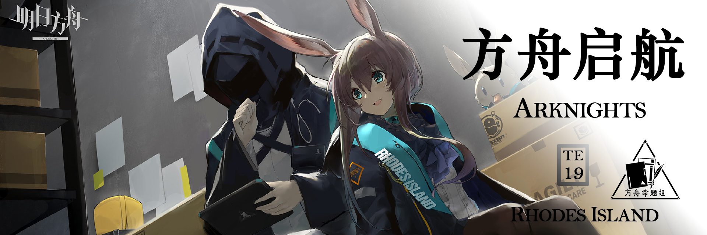

 {.centering}

不知不觉这个系列已经陪着大家到第19期了，可喜可贺！然而由于命题人面临的学业和工作压力逐渐增加，在这里不得不遗憾地告诉各位读者，本栏目以后不会再定期更新了（悲）。{.centering}

本期就稍微收个尾吧，总结了明日方舟自开服以来到今天的有代表性的事迹。重铸未来，方舟启航！也在一年的末尾，祝各位刀客塔们诸事顺利，我们有缘再见！{.centering}

——命题人{.aright}

<!-- more -->

**【1】明日方舟在2019年5月1日（Android端）正式开服前进行过3次公开测试，其中最早的一次是在2017年12月1日，其官号在新浪微博上发布了测试公告。请问以下哪位干员没有在该公告的配图中出现**

|  |  |  |  |
| :---: | :---: | :---: | :---: |
| A | B | C | D |

**【2】“骑兵与猎人”是明日方舟开服后的第一个SideStory活动，但其配套卡池并非开服后的首个标准寻访卡池。请问以下哪位干员在正式开服后的首个标准寻访卡池中出现概率提升**

|  |  |  |  |
| :---: | :---: | :---: | :---: |
| A | B | C | D |

**【3】在2019年11月，明日方舟曾和肯德基联动，并推出了一些干员的联动限定时装。其中能天使的联动时装需要购买的指定套餐中。被一部分玩家吐槽很难吃的汉堡叫做**

A.泡菜炙烤鸡肉堡

B.泡菜肥牛鸡腿堡

C.酸菜肥牛鸡腿堡

D.酸菜炙烤鸡肉堡

**【4】危机合约 #0“荒芜行动”于2020年3月17日开启，其中常驻地图“破碎大道”为不少博士留下了深刻的印象，在高危机等级的攻略中更是有“伊狮拦教”的趣闻说法。在由“巅峰计划”发布的28级（满级为30）通关视频中，其并未选择以下哪一个词条**

A.目标：隐秘行动I  最多可编入7名干员进入作战

B.目标：深度渗透II   部署费用的自然回复速度下降50%

C.目标：最后防线  我方防御点可承受的敌方数量变为1

D.环境：低能见度  禁止部署远程单位

**【5】2020年8月25日，集成战略 #1“刻俄柏的灰蕈迷境”上线。以下哪一选项不是该玩法中的区域（层数）名称**

A. 蜜饼山脉

B. 云霄迷宫

C. 意识帝国的古老疆土

D. 迷雾歧途

**【6】在2021年，明日方舟又先后上线了多维合作和连锁竞赛玩法，某种程度上它们可视为2024年推出的促融共竞和矢量突破的前身。关于这4种玩法，以下说法中不正确的一项是**

A. 在多维合作中，两名玩家分别负责上层和下层的防守，目标是成功通关

B. 在促融共竞中，选择阵地足球玩法可进行PVP对抗，目标是把球踢进对方玩家的球门

C. 在连锁竞赛中，将干员驻守在据点中会增加最终挑战的理智消耗，但并不会使其更简单

D. 在矢量突破中，将干员驻守在特别战线中可以使我方干员在最终挑战里获得各类增益

**【7】2周年庆的SideStory“覆潮之下”为我们首次揭开了海嗣谜团的一角，其中浊心斯卡蒂也作为明日方舟里的首位干员异格形态登场。以下哪一幅图不是取自浊心斯卡蒂立绘中的**

|  |  |  |  |
| :---: | :---: | :---: | :---: |
| A | B | C | D |

**【8】2022年1月10日，明日方舟与上海美术电影制片厂的联动活动上线，玩家可获取联动干员“九色鹿”。明日方舟还与许多其他厂商进行过联动，其中不包括的一项是**

|  |  |  |  |
| :---: | :---: | :---: | :---: |
| A | B | C | D |

 {style="float:right;max-width:40%;margin-right:1em"}

**【9】随着2022年2月15日故事集“阴云火花”的开启，“粉毛航空”正式落地，澄闪的立绘从正式放出到这一天一共经过了多久**

A. 702天

B. 661天

C. 635天

D. 586天

**【10】2022年10月29日，《明日方舟：黎明前奏》动画开始播出，主线剧情终于迎来了动画化。以下哪一项不属于明日方舟IP相关的动画衍生作品**

A.《鲤氏侦探事务所》

B.《罗德岛源石记事》

C.《可露希尔的秘密档案》

D.《小刻的画图写话》

**【11】2023年的四周年庆活动“孤星”给不少博士留下了深刻印象。通常来讲，游戏内的活动关卡编号应当为活动英文名首字母+（EX或S）+数字的形式，但孤星的英文翻译为Lone Trail，关卡名并未用LT命名，而是和以下哪首背景音乐有关**

A. Ad astra

B. The Coming of the Future

C. Rhine Lab

D. Control’s Wishes

**【12】2024年4月11日，在5周年庆典之前开放的SidesStory“巴别塔”为我们解释了许多明日方舟自开服以来埋下的伏笔。关于巴别塔的剧情及其解释，以下说法中最不恰当的一项是**

A. “源石计划”是博士所在的前文明用于应对灾难的方式之一，与此同级别的项目还有“深蓝之树”和“天堂支点”

B. 凯尔希作为前文明留下的一员，在见证了特蕾西娅对源石的改造后唤醒了博士，希望博士能够改变泰拉大陆的现状

C. 博士被唤醒后为了认识这片大地，出发走遍了泰拉大陆上的所有国家，并在此期间救下了阿米娅，结识了暴行

D. 博士为了能继续执行源石计划，选择与特雷西斯合作，关闭了全舰防御系统，间接导致了特蕾西娅的死亡

{style="float:left;max-width:20%;margin-right:1em"}

*扫一扫二维码查看本期答案*

[点我也可以哟ヾ(≧▽≦*)o](https://www.wjx.cn/vm/wKqCEL4.aspx)<eod />

<FakeAds />