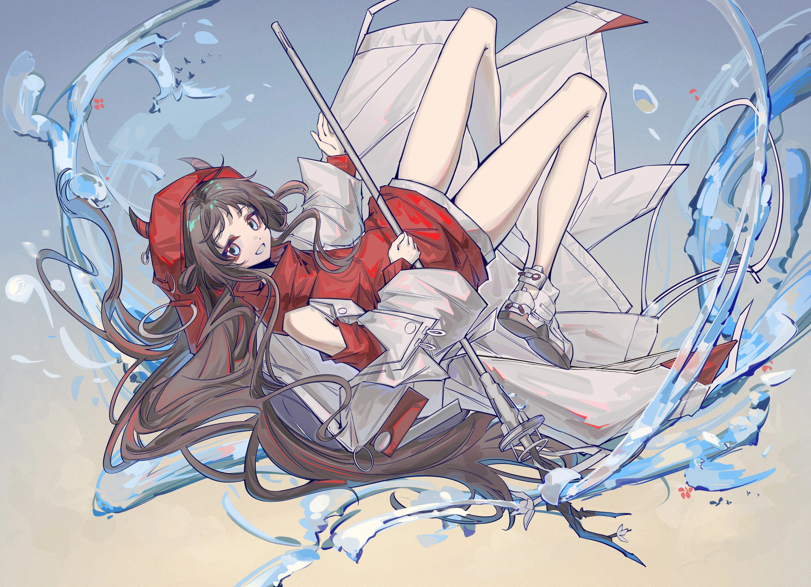

三月的风还有些凛冽{.textkai}

她在墓前放上一朵花{.textkai}

事情已经过去，变得不那么重要{.textkai}

只余下后日谈轻轻回想{.textkai}

<!-- more -->

## 1.

明椒面对很多事情总是后知后觉。

比如说看完一部电影散场很久后，才明白镜头最后的暗示；比如说在某一天的深夜，才知晓某个人话语中的真正含义；比如说在二十某岁生日的那一天，才回忆起十岁生日后自己的遭遇均是并不幸福的苦中作乐。

 {.centering}

明椒的生日是罗德岛上的朋友们一起帮她庆祝的。明椒难得地熬了夜，她的作息一向规律，所以醒来之后她一直觉得脑袋有些隐隐作痛。明椒揉了揉太阳穴，然后踩着凳子把墙上好友们布置的彩带扯掉，又稍微地打扫了一下地板和桌面。简单收拾完毕，明椒去了医疗部，今天不是她当班，不过她向来是有时间就会去帮忙的，比起在宿舍里学习书本上的知识，她更喜欢在医疗部多见见真实的例子。

早上的医疗部里只有两位正当班的实习小医生，和她们简单打过招呼后，明椒便轻车熟路地找了个边角的地方坐下，想完成昨天搁置的读书笔记。太阳穴的微微刺痛扰得她总不能集中精神，她的笔悬停在笔记本上，注意力飘到两位实习医生的对话上——

“说起来，明天的三天连休，你有什么安排吗？”

“我会去看望一下我待在卡兹戴尔的奶奶——奶奶她似乎非要我去曼弗雷德的墓前看看呢。”

“诶，原来你是曼弗雷德那派的吗？”

“我个人倒对他、对卡兹戴尔没有那么深刻的感情，可是奶奶是得到他关照过的……”

“我对他可没什么好印象，毕竟我住在伦蒂尼姆的姑妈的瘸腿可是拜他所赐。”

对于争议人物的讨论没给两个人带来什么隔阂，他们的话题很自然地随机过渡到下一个地方。只是某一个熟悉的名字让明椒胸口一紧——她已经许多年没有再听到那个名字了，只是她没想到，这次再听到却是和“死亡”挂上了钩。

明椒并非从不阅读新闻，更何况特雷西斯的死亡也和罗德岛有着千丝万缕的联系。总之，在那场人人熟知的事件最后，军事委员会的旗帜倒下了，但换上新标志的建筑物里的人却没有变动多少——据说曼弗雷德很平静地接受了这一切，他被换上了新的名衔，然后依旧在为了卡兹戴尔效力。

再然后，明椒便再不曾特意关注过他的消息。

明椒搜索到了相关的讯息，曼弗雷德是几个月前因为心脏相关的疾病去世的，关于疾病的由头没什么统一的结论，但基本指向过劳这几个字。在看到这些报道时明椒滑动终端的手顿了一会，在难得地和他有所接触的日子，他似乎就是这样——明椒可以在半夜起夜时看见他办公室亮着的灯，也总是偶尔在早起时看见他靠在窗子旁边皱着眉头看书。

褒贬不一的曼弗雷德的死讯，终究是没传到明椒的耳朵里，只是以这样的巧合让她有偶然得知的机会。

三天的假期，明椒想去拜访一些老朋友。

## 2.

明椒费了点力气，才在箱子的某个旮旯角找到那个有些生锈的铁盒，灰尘随着铁盒打开一同飞出来，明椒在盒子里翻了翻，然后找到了那张现在已经有点发了黄的纸条，上面写着一个地址——明椒上次去拜访还是好几年前了，明明当时不用这张纸条她也清晰地记得这个地址的，只是随着罗德岛停靠在各地、随着她越来越长的外勤时间，她便也少了时间到卡兹戴尔来，以至于现在她不得不翻找出这张纸条。

明椒顺着纸条上的地址找到了那间屋子，敲门之前，她心里有些惴惴不安——要是没有人回应怎么办？要是开门是她并不熟悉的人的怎么办？不过，动作比思绪更快，抢先在门上扣出咚咚的声音。然后，门打开了。

“罗迪！”明椒看见门后熟悉的人，提着的心终于落了下来，她高兴地挥手和他打招呼。罗迪是当时明椒所在的雇佣兵小队的成员，也是队长格林的旧友，队伍里的所有人都不习惯用敬称喊他，久而久之，明椒也习惯了这么喊他。

“明椒？！你可好久没来了。”罗迪对明椒的拜访有些意外，他笑了起来，比起明椒的记忆中，他的脸上爬上了更多的皱纹。

“转为正式医生之后，我的工作就越来越忙了……”明椒说这话时有点心虚，虽然这确实是原因之一，忙碌的工作不至于她连抽出来拜访照顾她旧友的机会都没有。

“明椒你的个头都快赶上我了……”罗迪一边端来茶水一边发出感慨，“当时你还只是个跟在队伍后面唯唯诺诺的小家伙呢。”

回忆起那时候的事情，明椒还有点脸红，作为一个连杀人都下不去手的小雇佣兵，她明明可以称得上是队伍的累赘，但是格林和罗迪他们却一路上都带着他照顾着她。

“罗迪，你和马修斯他们还有联系吗？”

“当时进了伦蒂尼姆之后，小队就被重新打乱拆散了，我倒是知道贝德、哈维那几个家伙的去向，战争结束之后，他们领了钱就去哥伦比亚西部大拓荒了，至于剩下的家伙，我几乎没有联系——现在还会偶尔见上几次的，也只有明椒你了。”

旧友的谈话总是会围绕着过去的回忆和近况，聊着聊着，他们的话题也自然地落到曼弗雷德身上。

“几个月前，我去参加了曼弗雷德的葬礼。”罗迪喝下一口茶之后慢慢开口，“那里的人比我想象得多——说实话我对他没什么想法，格林是死在那场战争里没错，但是我是住在卡兹戴尔，看他为这里的建设一步步出力的人。”

明椒端着茶杯，不知道应该说些什么，她心中的那杆秤摇摆不定。

罗迪似乎看出了明椒的犹豫，他给明椒的杯子里添上新的热茶，平衡了杯子里液体的温度，然后又再度开口：“明椒，我有个故事想讲给你听。那是我们小队刚到伦蒂尼姆时的故事……”

格林小队连着好几天的急行，终于按时抵达了伦蒂尼姆，队伍里的每个人都累得够呛。在倚靠着其他队伍的旁边，他们也铺了几张布作为床，然后轮流开始休息。明椒是睡得最快最沉，她从没有这样背着大行李赶路的经验，疲惫早就已经席卷了她的全身，到最后她几乎是凭着一点意志支撑下来的，大家也都心照不宣地没有喊她起来。

罗迪坐在火堆旁边发呆，从稍远一点的小队里传来喧闹的声音，他忍不住伸长脖子去看，直到风把那句“曼弗雷德将军来了”送到他的耳边。罗迪看见附近小队们都开始摇醒自己队伍里的同伴，醒过来的萨卡兹雇佣兵们大多都朦胧着睡眼，然后在听到了曼弗雷德在附近的消息后马上开始把外套往身上套。

罗迪也如法炮制，喊醒了小队的成员们，他刻意把明椒留在了最后一个，哪怕只是几分钟，他希望这个小女孩能多休息一会。明椒的身子蜷缩成一团，手里还紧紧地抱着自己的大背包，仿佛是在抱着一个柔软的抱枕。

“明椒、明椒……”罗迪蹲下身子，喊着她的名字并轻轻推着她的身体。明椒似乎进入了熟睡的状况，她的眼皮只是轻微动了动，从喉咙中飘出小小的应声。

就在罗迪打算用更大的力气摇醒她的时候，有一个陌生的声音在他周围响了起来：“……怎么会有这么小的孩子？”

罗迪忽地抬起头，和一个黄头发的萨卡兹对上了视线——从他的衣装上来看，这也绝非是一位普通的萨卡兹雇佣兵。罗迪的余光看见周围有几个萨卡兹向这里投来的目光，顿时猜到这位就是“曼弗雷德将军”。

“曼弗雷德将军，我马上叫醒她。”罗迪如此应着，然后惶恐地低下头就要伸手去推醒明椒。

“不用，就让她睡着吧。”曼弗雷德制止了罗迪的行为，他低下头看着躺在地上熟睡的女孩，然后又看向罗迪，“这个孩子是什么来头？”

“她是和我们一同从哥伦比亚来的雇佣兵，是队伍里的医疗兵。”格林代替了慌得不知如何回应的罗迪答道。

曼弗雷德再度看向明椒，他的眉头又紧皱了起来。

罗迪明白，曼弗雷德是在表示自己对这个“童子军”的不满，在这种环境下还能呼呼大睡的雇佣兵并不是他所需要的——可是既然明椒已经身处这里，如果真的被赶出队伍，她又要如何顺利地离开呢。

曼弗雷德收回视线，冲着身边的副官招了招手，副官迎了上去，曼弗雷德从他手里抽走了深色外套，蹲下身子盖在了熟睡中的明椒身上——

“诶、可是那时我醒来后，格林说那是他的外套。”听到这里，明椒忍不住打断了罗迪。

“那是格林要我们都保守的秘密。”罗迪笑了起来，“格林说你要是醒来知道将军来过，还对你呼呼大睡的样子皱了眉，一定会害怕得束手束脚的。 ”

明椒还对那件被她误以为主人是格林的外套记忆犹新，当她抱着外套想还给格林时，后者却对她说：“小姑娘，你留着吧。今天之后我们就要被调去不同的队伍了，等到战争结束，我再和你讲这衣服的故事吧。”

之后的故事，自不用多言。格林没有回来，厚重的外套也在没有还给他的机会。再然后，那件外套如今仍作为明椒对格林回忆的一部分，放在她的宿舍的某个箱子里。

其实明椒那时就应当注意到了，格林说的并不是“等到战争结束再还给我”，而是“等到战争结束再和你讲这衣服的故事”，况且那外套的布料和藏在深色下的暗纹，也不像是格林所属物的风格。

和罗迪道了别，明椒朝着下一个地方走去。

## 3.

明椒站在卡兹戴尔新建的学堂门口，现在正值上课的时间，学校的大门是关上的，没有提前联系的拜访实在有些唐突，于是明椒也打消了进去的念头。就在她站在门口想多看看学校的时候，有个上户外活动课的萨卡兹女孩隔着铁门怯生生地问她：“请问，您有什么事吗？”

“啊、我是来拜访赫德雷先生的，但是我没有先和他联系过……”

“原来是来找赫德雷老师的。”女孩子打断了明椒的话，“那我去把他喊来。”

几分钟之后，女孩便拖着赫德雷的手把他拉到了明椒面前。

“明椒？”赫德雷的语气夹杂着惊喜，“罗娜说门外有人来找我，原来是你啊，好久不见。”

正巧赫德雷下午没有上课的安排，他领着明椒进了办公室坐下。

“我从Pith那里听说了，你现在已经是正式的医生了。”

“这一切都离不开赫德雷先生的帮助。”明椒有些不好意思的点点头，“我现在得到的，绝离不开之前赫德雷先生每月按时寄来的那些书。”

在明椒十八岁生日前，每个月都能收到赫德雷从卡兹戴尔寄来的书。赫德雷说他在卡兹戴尔开了一个小小的补习班，收集了各种各样的书籍，他也只是每月从中挑一些顺便寄给明椒，那些书看起来也确实不是新书，几乎每一本书的书页里都有留痕——在复杂的文字上会有拼音的注释，在难以理解的地方也会有用钢笔写上的批注。

虽然赫德雷说得很简单，但是明椒知道那些书并不是随便挑选的，每个月固定会寄来的书，一开始是带着拼音或者佐以图片的故事书，接着是一些稍难点的小说和文学类书籍，再然后就会是一些医学研究或者是历史相关的书。无论哪一本，都正合适于她的年龄和学识。

对此，明椒也总是一本不落地读完，并认认真真地给每一本书写了读后感寄回给赫德雷。

听到明椒的话，赫德雷却没有直接回应明椒的话，他叹了一口气，反倒是提起了一个完全不相干的话题：“曼弗雷德的事情，你应该已经知道了吧？”

“是的。”明椒有点困惑，她不知道赫德雷为什么突然提起这件事。

“我一直犹豫着要不要把这件事和你说，但是既然约定的另一方已经离世了，我想这应该也不算毁约了吧。”

明椒感觉到自己的心脏随着赫德雷这句话被牵起来砰砰直跳，她已经多多少少猜测到赫德雷要说什么了。

“那些寄给你的书，其实都是曼弗雷德拜托我转寄给你的。”

明椒的心情有些复杂，她咬着唇思考着要说什么样的话，最后只是吐出了短短的“为什么”。

“他担心你有所顾忌，不愿也不肯收下由他寄过去的书籍，所以才托我这样做。我一直承着不属于我的道谢，抱歉，这是我与他的约定，所以现在才把这件事告诉你听。”赫德雷起身，从旁边书桌的抽屉里拿出一沓厚厚的信封，“这是这几年你寄来的读后感。我一并拿给曼弗雷德看过，虽然最后又被他退了回来，但是每一封都有拆开看过的痕迹。”

明椒拿过最顶上的一个信封拆开，幼稚的字体是十四岁时的她留下的痕迹，她读了几行，很快回想起这是某本小说的读后感。在信纸的某处还能看见被水洇开的圆印，那是她写到一半又去重新读那本书时，流下的眼泪不小心落到信纸上导致的。

下一封信是十七岁的她写的、然后是十六岁……光是阅读这些读后感，明椒就能想起当时第一次读这本书的情景。

——直到十八岁的最后一本书。

和她的十八岁生日恰好同一天抵达的包裹里，比往常多放了一张便签大小的纸，纸上的字祝她生日快乐、祝她前程似锦。

其实明椒那时就应当注意到了，便签上的字体和以往书里批注的字体都一样——罗德岛上想要找到赫德雷的字迹并不难，只要稍微一比对就能知道这些批注、这张便签都并非出自赫德雷的手。

当时曼弗雷德交到尚且年少懵懂的明椒手里的《萨卡兹战争史》她读不懂，但是十八岁生日包裹里的《萨卡兹战争史》，即使没有批注，她也一字不落地读完了。

## 4.

从卡兹戴尔的学堂离开后，明椒径直回了罗德岛。

明椒低头往宿舍的方向走去，纷飞的思绪让她没有注意到面前的来人，以至于她和对面撞了个满怀。

“啊、对不起……”明椒慌忙地抬起头道歉，对上的是博士的眼神，正值休假日，所以他今天没有穿着以往那套厚重的衣服，而是改为了便服。

博士似乎没有因此而责备明椒，他抱着手臂微笑着看着明椒：“怎么了？你看起来似乎有很多烦恼，要不要和我去喝点东西？”

明椒没有什么安排，于是也就应了下来，随着博士一同到了某个酒水吧，博士对着服务员要了一杯啤酒，然后又用手指了指身旁的明椒：“给她一杯果汁。”

等到服务员走远，博士却才突然醒悟过来：“啊、抱歉，明椒，我忘了你已经成年好久了。”

“没事的，我也还是更习惯喝果汁。”明椒微微一笑，或许因为她自少年时就待在罗德岛上，博士或是其他照顾过她的精英干员们好几个时候都没记起这件事，总是下意识地用对待孩子的态度对她。

“这样一看，时间过得还真快呀。我还记得你第一次在伦蒂尼姆见到我的时候，还把我当成了Logos带着的俘虏。”

明椒的脸有点红，还好这时候服务员端着他们的啤酒和果汁来了，她赶忙拿过果汁小小地啜饮了一口。

“你还记得你当时是怎么来到罗德岛的吗？”博士喝了一口酒，然后如此问道。

明椒当然记得。

伦蒂尼姆的战争即将结束，在只剩下维多利亚内部关于王权的争斗中，罗德岛的人悄然撤离了那里。

“明椒小姐，你要不要来罗德岛？”阿米娅向她这么问了。

明椒赞同罗德岛的理念，也讨厌在当雇佣兵时那些残忍棘手的任务，可她总觉得无论如何，总觉得自己还不能这么轻松地离开，于是她对阿米娅说：“可以先带我小队里的队员们离开吗？我、我想我还有没做完的事情……”

“明椒小姐……”“那你就去吧，先把需要做的事情做完，然后我和阿米娅会在罗德岛等你的。”阿米娅还想说些什么，但博士打断了她的话，他对阿米娅比了一个手势，表示没问题的，于是阿米娅也不再继续出声了。

博士拜托了Misery悄无声息地把明椒送了回去，大势已去，特雷西斯的军队节节败退，然后，明椒又一次见到了曼弗雷德。

曼弗雷德见到明椒的第一刻，显然有一瞬的惊讶，但他很快恢复了平日的那个神情：“你怎么还活着？”

“对不起、我没能完成任务，也和小队里的其他人走散了”明椒低下头，“曼弗雷德将军，请您按照规矩责罚我吧……”

明椒不能清楚地说出自己为什么一定要回去，虽然战争的落败绝不可能是她一个人导致的，只是她想到曼弗雷德给了她那么多的机会，对于没能回应他期待的事，她总想至少要道歉、至少要赔罪，即使惩戒的结果是失去生命——至少她让小队的成员都先走了，她这么想。

明椒低着头，她听见曼弗雷德好像吸了一口气，于是她抬起头来，想看着曼弗雷德以直面自己的结局——

“滚开！”曼弗雷德的声音中充斥着怒火，周围不少的雇佣兵都朝这里看了过来，曼弗雷德扬起手，将巴掌落在了明椒脸上，“你这个叛徒，不要再出现在我的面前！”

曼弗雷德说完这句话便走了，留下明椒一个人在原地，按理说曼弗雷德的那一下理应下了重手，她却没有感觉到想象中的疼。

周围的雇佣兵们见此情景，也都收下了小声议论的声音，然后从明椒的身边绕开。

于是明椒离开了，她一个人走了好远，然后她忽然感受到身后有被某个人拍打的感觉，她回过头，看到了自己之前小队的队员：“你们怎么来了？”

“小丫头，我们放心不下你。”老财说道，“我就知道你这个死脑筋想回去找将军……”

“怎么样？他对你做了什么吗？”司机紧接着问道。

明椒的脸已经一点痛感也没有了，她也不想让自己的队友们担心，所以她轻轻地摇了摇头，然后说：“算了，我们一起去罗德岛吧。”

……

从回忆中脱身而出，明椒回应了博士的问题：“嗯，记得，当时我被曼弗雷德赶了出来，所以就顺势到了罗德岛。”

“那你肯定讨厌透他了，他的巴掌是不是把你打得很疼？”博士带着关心的语气问她。

“其实现在回想起来好像也没有那么疼——”明椒自然地接过了话，才说了一半，她突然意识到哪里不对——明明这件事连她的小队成员们都不知道的，“不对，博士你怎么知道这个事情的？”

博士用一只手撑着脸，眯起眼睛露出有些意问深长的微笑：“你猜猜看？”

知道这件事的人并不多，如果不是从明椒这里得知的，那只有可能是后来和罗德岛有所联系的人——明椒几乎是脱口而出的：“是曼弗雷德告诉你的？”

博士点了点头。

“可是他为什么要……”话说到一半，明椒突然收了声。

可是曼弗雷德为什么要告诉博士？答案不是已经呼之欲出了吗？

在那一天，在众多的萨卡兹面前，曼弗雷德分明就是故意那么做的，他故意表露出生气的样子，故意把巴掌落在她的脸上，故意把她赶出了队伍。

她早就该明白的。

明椒手里的果汁一下没拿稳，杯子里的液体溅了出来。她重新看向博士，而后者此时已经喝完了杯子里的啤酒，转头对着服务员又要了一杯——博士或许在她和阿米娅对话之时，就已经知道她会回去，而曼弗雷德会故意放走她。

“我和曼弗雷德提起你在罗德岛上过得很好，还活用了做医疗兵的经验成为了医疗干员。他说，你和他想象中的一样，成为了没有经历战争时应该成为的样子。”

“我……”明椒想说些什么，博士却把手指放在了唇边示意她不必开口。

“明椒你不需要觉得愧疚或者抱歉——既然曼弗雷德他将一切都瞒下，本身便是不想让你知道的，所以也不必介怀于自己的后知后觉。”

博士完全看穿了明椒的所思所想，然后用恰如其分的话语去宽慰了她。

“当然，如果你还是很在意的话……”博士一边说着，一边拿走了明椒手里的杯子，取而代之的是往她手里塞了一张纸条，“要不要去看看他？”

……

纸条上写着的是卡兹戴尔的某个墓园，是一个只要明椒肯随便在路边拦下一个居民问问就能知道的地方。

墓碑下埋葬着某个在卡兹戴尔稍有名气的、具有争议色彩的人物。

三月的风还有些凛冽，明椒深吸了一口冰冷的空气，在他的墓前献上了一束花。<eod />

（责任编辑：广英和荣耀；网页排版：Baka632；绘图：LOF@伊凌）

<FakeAds />