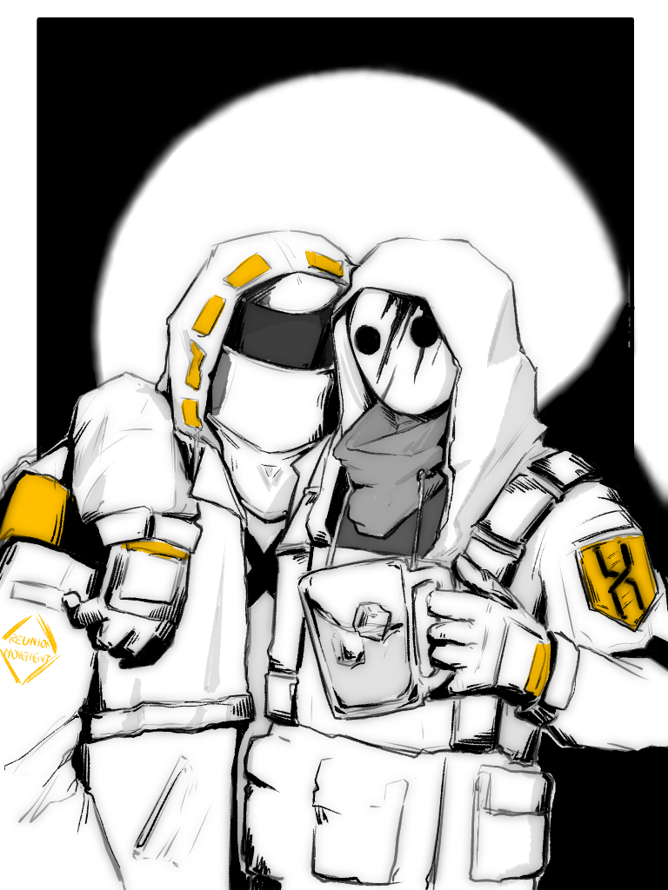

有些人关注着宏大叙事{.textkai}

但他们更在意那宏大之下的点点滴滴{.textkai}

也许该弄一辆属于自己的摩托车了吧？{.textkai}

这样“大学生”就不必用腿跑了。{.textkai}

<!-- more -->

“你说领袖？不用担心，她们不是坏人。”

凯文把大学生往身后的拐角又藏了藏，大学生好像不太喜欢凯文叫他大学生，他给出博士的代号，就像叶莲娜大姐的代号是霜星一样。现在跟随在身边的整合运动成员都开始喊他博士了，只有凯文还在心底默默喊他大学生。

凯文没上过学，近些年来大家的日子都不好过，尤其在乌萨斯这个地方。父亲去了前线，据说是为了镇压雪原上的感染者游击队，全家人没谁为了这个消息高兴。普通人离战争太远，弟弟连被门槛绊倒都会大声哭闹，母亲勉力安慰后又在用不起蜡烛的夜晚低声啜泣，他们无法想象炮火的余星落在人的身上会带来什么。

在感染之后，凯文想偷偷离开家，在乌萨斯平民的村落里，一家人要是出了一个感染者，是会被全家驱逐的。他不想连累家人，于是趁着夜色出逃，初春的乌萨斯还飘着雪，松树狰狞的树枝在月色下更像是卫兵队的旗帜。那时凯文的年纪并不大，做事没有现在带着博士躲避追击时这么熟练，母亲很快就发现了他的离开，噔噔踩过木地板的沉闷响声宛如惊雷，可屋外却是明月高悬。凯文很清楚地记得那一天的情景，弟弟藏在母亲的身后，像酒馆角落里沉默的木桶，手中攥着的围裙打上了层层叠叠的补丁；母亲的手指死死抠住门框，光着的脚冻成青色，滴滴答答的眼泪融化了台阶上的雪泥，很快又被风吹干了，脸上的泪痕成了城镇外装饰的灯带。凯文不敢回头，也没要母亲塞给他的食物和钱袋，只是在心底一遍又一遍想象家人的最后一面。

乌萨斯的春天对凯文而言是难以言说的伤痛，而他已经很久很久没有想起这些了。

给博士做心肺复苏时，凯文摸到了衣服下凸起的肋骨，脱口而出的一句：你比我的弟弟还要瘦。他的感情和想法在随后而来的追击中是那么的无关紧要，然而在某一瞬得以喘息的时刻，凯文总是想起来——母亲把那些微博的抚恤金积攒起来，自己去帮人洗盘子、送货物，一天打三份工的工资，全部留在那个由碎布头缝起来的钱袋子里，母亲一遍又一遍地念叨，要等父亲从前线回来后，就要卖掉这边的房子，去圣骏堡，让凯文兄弟俩都去上大学。好像上了大学，一切就会变得好起来。

见到博士后，他才开始明白，母亲当初的期望或许是正确的。

夜晚的龙门贫民窟不如其他城区那般繁华，线路故障的霓虹灯闪烁，刚好让凯文看见了远处垃圾堆里的一点蓝色。

博士压低了声音，跟凯文靠得极近，震动的胸腔贴住凯文的后背，竟然有种相依为命的错觉。他说：“塔露拉真的让你们听我的指挥吗？”

凯文一手压下博士的兜帽，等着巡视的无人机群飞过后才用同样的音量回复博士：“博士，刚从切尔诺伯格出来时你不是这么说的。”

短短数日的逃亡足够让博士明白，凯文不是个计较太多的人，或者说，计较太多的人不会跟着整合运动活到现在，这片土地上漫溢的痛苦几乎融入了氧气，心不够大的人无法容纳生存必要的能量。博士在反复确认凯文——这个整合运动的士兵，可能是他苏醒后面对的陌生组织的具体化代表——最本真的意愿，他是否真的愿意把一生仅有一次的生命交付到不知底细、临时上任的指挥官手里，最大的可能是：凯文并不是很懂“指挥官”的含义，正如先前所说，他没有读过书，字也不认识几个。

所以博士选择用行动说话。他敲了敲凯文的兜帽，“在罗德岛的持续追击下，我们没办法顺利和塔露拉汇合，如果你们不够信任我，计划无法顺利进行，我也不知道会发生些什么。”

“会死，我知道。”凯文拉住博士的手，紧紧攥着，力气不比他把人从石棺里拉出来的时候小，他甚至给了博士一点缓解腿麻的时间，在大学生可以自由活动的情况下，凯文必须保存体力，以备随时背起人跑路。“离开乌萨斯的那天我以为我会死，但我后来遇见了整合运动，领袖们带领大部队先出发时我以为我被抛弃了，霜星大姐却把认证卡给了我。还有更多的时候，在荒野上跟人抢食，去偷罐头，去反抗罗德岛的袭击，每一次我都以为我要死了，但我还是活下来了。我见到你了，博士。”

他的声音在龙门的夜风中轻得要散开，“我只是个士兵，不是官儿，也不是一支小队的队长，我不清楚领袖为什么要把营救你的任务交给我，就现在看来，我完成的还算不错，没让大姐和领袖失望。”

“所以，你也不要太担心。我没那么容易死！”士兵不懂博士的隐忧，也不懂他这句话的分量究竟多么沉重。博士又想起凯文交付信任时对他解释的原因，仅仅是因为他们的兜帽很像。博士不再问些什么，因为什么都不需要问了。

凯文离开的路线并不是博士事先规划的那一条，略微有一点偏差，博士眼睁睁看着他把自己护在身边，冲向了远处的垃圾堆。

急刹，停步，弯腰，凯文捡起一张蓝色的纸。

“哈！龙门币！还是五块钱！”那张纸币被污水沾得边角卷曲，凯文用衣角擦干净了，把它仔细折好后放进博士的口袋。

“帮我收好了。”他说，“说不定以后还能用得上。”

即便是博士也不免在此时此刻感觉到些许哭笑不得，同时心中又有一股难言的愁绪，在敌对组织如此紧锣密鼓的追击下，他们真的有再度回到龙门的一天吗？换个说法是，那时候的龙门还存在吗？

可他无法对凯文言说，这个过一天算一天的士兵还对以后的生活抱有期望，不管这期望是寄托在整合运动上，还是寄托在两位领袖，甚至于博士身上，还是口袋里这一张折叠整齐的钱币。

“五块钱能买什么？”博士问这话的时候真像个呆在象牙塔里不事生产的大学生。

“阿丽娜，就是我们的另一位领袖，她负责后勤工作，许多整合里的朋友先认识钱，这样去黑市做交易就不会被那些黑心商人骗了。五块钱也不算少了，之前我看见有个小孩买了一瓶汽水，还有两根棒棒糖，就用了五块钱。”似乎是嫌弃博士跑得太慢了，凯文半蹲下身，把人往他背上一揽，轻飘飘的人被乌萨斯小伙子托在背上，面罩摩擦在凯文的兜帽上，哗哗的声响。

“等出了城，就会有人来接应我们的。”

博士看过龙门的地图，负责渗透作战的幽灵交给他地图时很紧张，实际上跟随他们这一队的幽灵也不太认识路，每次都要把地图看过好几十遍才放心，博士把地图还给她时，她长舒一口气，蹦蹦跳跳地离开了。因此博士清楚，龙门这座移动城市外是大片的荒野，没有载具很难开展移动，他对整合运动了解不深，做出多种计划成了博士的行事准则，可是凯文的回答绝对不在他的任何一种设想里。

“车？你是说载具？”乌萨斯人诚实地摇头，后脑勺要和博士撞上，“就连领袖都是靠腿走的，我们倒是收了些没人要的载具，你知道吗，整合运动想要搞载具只能从黑市弄，锈锤那群天杀的丧良心，上次给我们的载具发动机都坏了！也没人会修，现在那些东西还在阿丽娜驻守的大部队营地。”

“所以我们只能用腿了？”博士问。“不说四个轮子八个轮子带履带的，就连一辆三轮，一张摩托都没有？”

凯文扭头想看博士一眼，透过白色面具上两个圆滚滚的豆豆眼，博士看出一股没被知识污染过的清澈。

 {style="float:right;max-width:40%;margin-left:1em"}

他无可奈何，人肉摩托也是摩托，不过是轮子换成腿。博士抱住凯文的肩膀，免得被奔跑的士兵颠下去，他挨近了凯文的脸侧，慢慢宣布：“在教你认字之前，我还是先教你开车吧，骑摩托也行！”

士兵没有说话，负重移动让他的躯体逐渐疲惫，可他的精神好得出奇。原来这就是有盼头的日子，他想。本以为到了整合运动后不会过得比现在更好了，谁知他还有不用去学校就能学到知识的一天。奔跑在贫民窟曲折离奇的小巷，凯文的身后聚集起了装束相同的伙伴，直到离开龙门重新踏上荒野的那一刻，自由的气息从胸口萌发。要凯文担心的事情太多了，生活里不起眼的一句话都够他快乐很久，可是那一点微末的欣喜里又掺杂了不安与忐忑。

仅仅五块钱，足够买下博士的知识吗？那也太便宜了。

龙门和凯文家乡的距离不近，四月的乌萨斯还在下雪，龙门的城外已经绿草勃发，泥土的腥味还有博士身上混杂的灰尘味，逐渐跟整合运动的气息，凯文所熟悉的气息融合在一起。

队伍的引导和前进全权交给博士了，现在的士兵只关心那些宏大叙事下的点滴。博士说的摩托应该不会很难学吧？凯文暗下决心，等学会了一定要搞来一辆属于自己的摩托，那时候的他一定不用让大学生用腿跑了。<eod />

（责任编辑：一心之弓；网页排版：Baka632；绘图：白色鹦鹉）

<FakeAds />