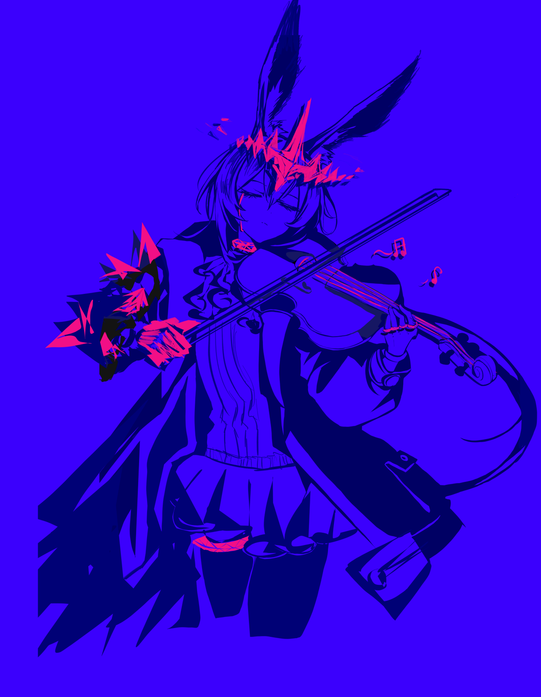

现在，她看到她的星星很久以前发出的光{.textkai}

而她还记得，当时她问博士的哪些问题{.textkai}

幸又不幸地，她是唯一的见证者{.textkai}

而那颗写信的星星，已经无可挽留地熄灭了{.textkai}

<!-- more -->

博士一定喝醉了。

在阿米娅刚进酒吧的时候，博士还好好地坐在卡座上，比她平时在办公室摸鱼的坐姿还要端正；桌上只有一个空杯，看不出之前喝了多少，她的脸上多了一些血色，不像平时那么苍白，不过眼神清明，远称不上有醉色。

此时的阿米娅还抱着博士也许喝得不多的想法，但所有猜测都在博士笑眯眯朝她招手，而她照做以后戛然而止。

如果不是理智彻底融化了，博士是决计不会允许自己手脚并用挂在别人身上的，阿米娅冷静地想。博士的呼吸洒在她的头顶，扫过耳朵，身体因酒精而燥热，暖融融的体温挟着甜津津的香气将她整个人裹起来。她知道用糖浆来掩盖酒精辛辣呛口的口感是很常见的做法，调制过的酒水就像闻起来有些凛冽的美丽饮料，很容易让人忘记它的危险之处。

博士就是这样喝多了吗？阿米娅不知道，但她觉得再这么靠着博士，她可能也要醺醺然了。

总而言之，先带博士回宿舍吧。

泰拉人的身体素质想搬运博士不要太轻松，不过博士比她高一头有余的身高还是带来了一些麻烦。阿米娅像一块被过量糖浆糊住的姜饼人，艰难但得体地向酒吧里的其他人道别，带着身上明显尺寸超标的挂件离开了。

罗德岛有自营的酒吧，阿米娅一直知道。高压工作与封闭环境催生的大量压力总是需要一点倾泻口的，因此这间 Mantra 提议，凯尔希拍板的酒吧便应运而生。但知道归知道，阿米娅直到今天才第一次踏入这里。拒绝未成年人进入的酒吧只对来接大人的 CEO 网开一面。博士酒品不错，作为一只醉鬼相当安分，没有胡乱动弹，也没有把下巴尖搁阿米娅脑袋上硌痛她。阿米娅能感觉到博士靠着自己，吐息平静绵长，末端的焦糖香味里夹着很轻的一点点烟熏气，仿佛呼吸的韵脚。

阿米娅心跳得很快，但面上不显，沉稳地把博士背回宿舍。就在她准备将博士放到沙发上的时候，博士忽然一反安分的常态缠住她不撒手。

“阿米娅！”她听见博士快乐地笑，重复着她的名字，“阿米娅！嘿嘿！”

“博士？”

博士又不说话了。她抱着阿米娅，像一个得到了想要玩偶的小孩，反复用脸颊去感受长耳朵的毛绒触感，醉鬼的快乐洋溢而出。

阿米娅却忽然哭了。

大地上的非萨科塔之间不存在真正的感同身受，但得到魔王传承的阿米娅是例外，只要她想，她可以对任何人的任何情绪感同身受。博士的心从不对她设防，她的喜悦也因此得以毫无保留地在阿米娅的内心洋溢着。她也为这喜悦所感染，不由自主地去看博士给她分享的一切——她看到了博士的过去，她的学校、家庭、工作、旅行，明亮的光影下每一个她理应认识的人，他们的名字和面孔都在时间和法术共同作用中漫漶不清，只有这些事发生当时的心情真切地被她记起。

当头棒喝，透骨酸心。阿米娅那点被感染的快乐转瞬之间雪融了个干净，她意识到博士为什么会叫她——喝醉的博士分不清时间上的矛盾，将她当成了回忆的参与者，吐露的也只能是如今的自己最熟悉的名字。

博士的快乐成了禁锢阿米娅的枷锁，她无法拒绝这份带毒的馈赠，在另一重不同于博士的温暖怀抱里，博士向她的母亲介绍朋友，阿米娅被她牵着，一句话也说不出口，泪流满面。

她从没见过这样的博士。那个从废墟里将她救出的学者在她们相识以前就已经失去了太多，沉甸甸的过去剥夺了她幸福的资格，将偶然的快乐无限压缩得连舒颜一笑都罕见，即使在特蕾西娅小姐将黑王冠传给她以前，年幼而敏感的阿米娅也能察觉，过去是博士不能触碰的伤口。

原来没有失去一切的博士是这样的，阿米娅心想，那一定是非常幸福的地方，无怪乎离开它的博士会选择将心神留在那里。

然而这不过是酒精作用下幸福的短暂还魂，柴火一旦熄灭，幻觉也会消失。博士大概只会睡一个怅然若失的好觉，可是误入的阿米娅却清楚地窥见博士被夺走了什么。正因为清楚那是怎样的无价之宝，博士的幸福才在感染她的同时唤起她无限翻涌的酸涩与痛苦。

---

星星也会熄灭吗？

会的呀，阿米娅，哪怕是星星也会有熄灭的时候。

它们熄灭的时候是什么样子？

先闪烁几下——以百年千年为单位地闪烁，你会看到它的亮度不再稳定，某一次过后突然地不再明亮了，光芒不再闪耀，而是黯淡发红。这时候它不再是不可直视的太阳，你可以清楚地看到它的边界，还可以测量到它在膨胀。但它越是膨胀，它的心脏就越是紧缩，最终的命运将由它自身的质量决定。它可能会就此熄灭，变成一颗安静的小球；也可能会爆炸，一下子爆发很亮很亮，能传出很远很远的光，然后变成一颗能干扰你的通讯信号的邪恶小球；如果它特别特别重，它也还会爆炸，但这一次留下的东西不比前两种结果，它不释放任何东西，它吸引一切——包括光。你将看不到它，但会观测到被吸引的一切指向一个共同的中心。这是旅行中最危险的天灾，如果载具被它吸引而不能及时逃离，等待乘客的命运就只剩下坠毁一种了。

博士旅行的时候有遇到过吗？

有几次吧？不过我发现得很快，通常在刚进入影响范围的时候多花点燃料还是能跑掉的。

我们脚下的大地也会被这样的星星吸引吗？

在你只能通过观察星星闪烁的微弱差别来判断它的状态的情况下，不会。星星离我们很远很远——远到你在同一时刻看到的它们的光，很有可能一颗来自几十年前，另一颗来自几百甚至几千年前。也有可能在你看到这些光的时候，发出光芒的星星在遥远的另一处天地中，已经不为人知地熄灭了。

{.image-right-float style="max-width: 40%;"}

咦，那些光不会随着星星熄灭消失吗？

已经诞生的东西是不会凭空消失的。还记得我们遇到的那个信使吗？

那个因为距离太远，他将信从萨米带到雷姆必拓的时候，写信的人已经去世的信使？

没错。死星的光也是这样的一封信，它不指定收信人，每一个看见的人都是它存在的见证者。

哇……

---

年幼的阿米娅躺在甲板上，为这句话努力地睁大眼睛去观察星星，想要分辨夜幕之下的哪些光是无主的信件，哪些光又是久远时间前投来，此刻与她对上的目光。星子们闪烁着，大差不差的光是她读不懂的话语，那时的她揣着满脑袋不着边际的猜测，很快就睡着了。

多年以后的现在，她却看到她的星星很久以前发出的光。幸又不幸地，她是唯一的见证者，只有她完全读懂了这封信，又清楚写信的星星已经无可挽留地熄灭了。<eod />

（责任编辑：广英和荣耀；网页排版：Baka632；绘图：Atae）

<FakeAds />
