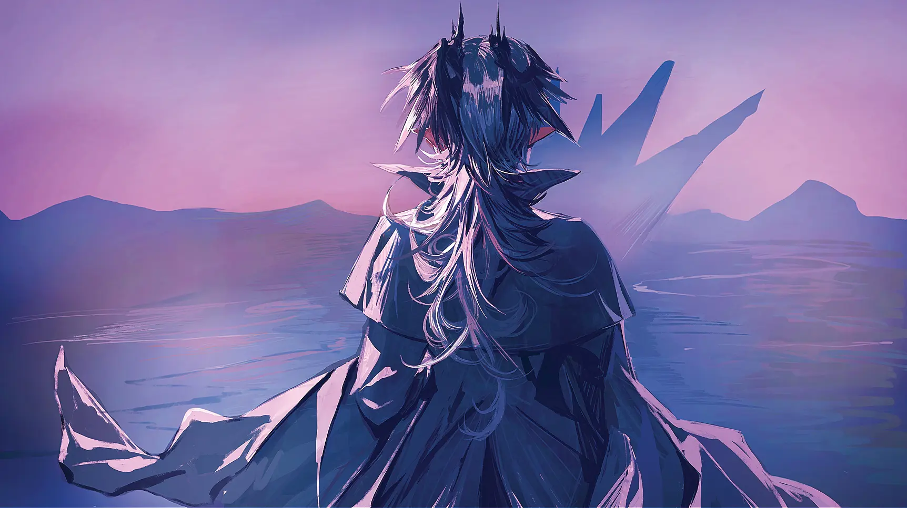

When I am laid, am laid in earth{.textkai}

May my wrongs create{.textkai}

no trouble in thy breast{.textkai}

but ah! forget my fate.{.textkai}

<!-- more -->

---

*“When I’m laid in earth —*

&emsp;&emsp;*To sing an elegy for you. ”*

“我等在此共同迎接战胜的硕果，与一位如影随形的来宾。它是一位不受欢迎的客人，无人能预知它的降临，但在它真正到来的时刻，你要像拥抱胜利那样拥抱它。”

特雷西斯诵读了黑石碑文的最后一段话，那是用古老的提卡兹语言写下的箴言，充满复杂的语意与怪异的音节，如今鲜有萨卡兹能流利地掌握。他用古语不急不缓地念了一遍，又以通用的萨卡兹语转述了一遍，他身旁，曼弗雷德忙着在记事本上奋笔疾书，阿斯卡纶仰望着环绕纪念碑的、高耸入云的六座雕像，而亲手刻下这些文字的人，特蕾西娅，站在两个孩子背后，微笑而沉默地注视着一切。

对于一个尚未抽条发育的幼年萨卡兹而言，六英雄塑像里的每一座都实在过分高大，腰以上的部分纷纷隐没在旷野枯涸而莫测的熏风里，看不清面容，阿斯卡纶只好转过头去，看她目所能及的两张熟悉面孔。特雷西斯还是喜怒不形于色的老样子，磐石一样严肃，阿斯卡纶猜测那座属于他的雕像从头到脚、连同盔甲的缝隙和内眼角处细微的纹路，都和本人别无二致。而特蕾西娅正从袖中取出手帕，俯身，准备帮曼弗雷德擦净脸庞上沾染的炭粉指印。雕像是挺立的，剑锋永远指向前方，永不弯折，阿斯卡纶想，可殿下面对他们时，好像总是弯着腰的。像是感应到了阿斯卡纶的目光，特蕾西娅立刻侧首望向她，回以一个王女标志性的慈和笑容。

“阿斯卡纶，怎么了？”她轻轻地问。

她的声音饱含安抚与鼓励，阿斯卡纶便诚实地提出了自己的困惑：“殿下，碑文上写的那位‘不受欢迎的客人’是谁？”

他们立于一天之中最鼎盛的时分、笼盖四野的炽日光辉里，阿斯卡纶看着那对无比宽容的瞳孔，源石结晶躲藏在特蕾西娅打着卷垂落的发丝间，折射出细碎光斑，如星屑闪烁。也许是正午骤然攀升的气温疲惫了她，也许是日光刺痛了她的眼，她竟觉得特蕾西娅的笑容变淡了。荒原，风声吞没了所有的余音，一直等到曼弗雷德的脸颊再度变得一尘不染，她也没有等到期望的答案。

从那以后近三十年，阿斯卡纶极少做梦。但在为数不多的被旧事搅动的浅眠夜晚，她偶尔会身处六英雄纪念碑下，退化为那个渺小而困惑的孩子。在场的两位王都不曾解答她的疑问，她也不曾料到，这个被岁月湮没的谜语，在所有当事人反目成仇、物是人非的许多年后，由另一位年轻的王庭之主轻描淡写地揭示了谜底。

公历 1098 年，罗德岛本舰，精英干员活动室，阿斯卡纶和同样重伤初愈的 Logos 作短暂告别。最初的源石已抵达卡兹戴尔，罗德岛不日启程，Logos 将继续留守本舰，而她将在卡兹戴尔逗留，协助新议长安顿巴别塔旧部。例行寒暄和公事交接终了，两方都没什么着重的情绪，冗长的战争结束，在更加漫长的、令人心力交瘁的重建与善后途中，余下更多的是被鲜血与汗水浸透的虚无。

活动室内只有他们，交谈停止后，气氛稍稍显得空荡。阿斯卡纶向来寡言，但他们大概好一段时间都不会再见面了，她忽然觉得，两个萨卡兹在阔别良久的故土多说几句也无妨。于是她提起了往事。回忆着久远得扭曲的特雷西斯的语调，她背诵了那段提卡兹箴言。“你听说过这段文字吗？”她问。

出乎她的意料，Logos 思索片刻，竟然颔首肯定，“小时候听母亲讲过。”提及在河谷度过的时光，女妖之主的眉眼都温柔地舒展开，露出一点点克制又暗含自豪的笑意，“毕竟她也是六英雄之一。”

阿斯卡纶当即追问：“这位‘如影随形的来宾’，它是谁？”

和过去沉默相对的魔王一样，Logos 没有马上回答，他的笑容也消融在透过落地舷窗涌入的午后日光里。阳光是非静止的河川，骨笔在他指尖匀速优雅地自转着，和光线并行，权能在其间隐秘而毋庸置疑地流淌，他望着她低声说：“是死亡。”

 {.centering}

女妖的主人站在此处，代表丧钟的王庭，而他的言语也如钟磬在阿斯卡纶耳边沉重奏鸣。多么显而易见啊，她早该领悟的，在卡兹戴尔的流亡史，在乌萨斯的冻土行军，在伦蒂尼姆的风暴前线，她成百数千次地面对，并与之擦肩而过。即使是天生目盲的萨卡兹，生满白翳的瞳仁也注定映射着死神的倒影，死亡是烙印在萨卡兹血肉神经里直觉性的答案。

她为别人带去了过多的死亡，由她创造的遗骸又遭到她无怜悯的遗弃，包括四年前在巡逻艇上抛落的一具又一具裹尸袋，每一只都和特蕾西娅遇刺有着板上钉钉的干系。她也见证了过多的死亡，包括不久前发生的一场，特雷西斯端坐在圣王会西部大教堂底部，无声无息地逝去。在舱门口抛尸，或是手握利刃、刺穿老师空洞的胸膛时，她都只感到了麻木不仁，阵痛后的虚无，没有过半分醒悟。在那片距离卡兹戴尔三十七公里的荒原上空，巡逻艇的航行高度足够她鸟瞰整片旷野，曾经触不可及的庞然巨物，六座雕像，变得像战棋游戏的棋子一般迷你滑稽，纪念碑的全貌终于一览无余。然而经过旷日持久的天灾侵蚀，雕像不可一世的面容早就模糊不清了，仅仅维持着森然的轮廓。高速掠过的熏风暖得令人窒息，她在风中眯起眼，尝试用她远超常人的动态视力聚焦，但她怎么也看不清。当她再一次阖上眼，她却忽然又能看得分分明明了，六人之中，特蕾西娅恬静的脸，双目紧闭，浸泡在血水中，像是坠入一场好梦；特雷西斯矿石化的脸，神色严峻，无情地平视前方，他已决心和象征伦蒂尼姆千年王权的地基一同轰然倒塌。倒映在她空无一物的眼眸，是两位王的末路。

Logos 手中骨笔依然旋转着，不知疲倦。女妖，萨卡兹的葬送者，无论何时何地，她们都为同胞的逝去而讴歌。阿斯卡纶想，她自己不知何时也成了送葬的一员。她埋葬了萨卡兹六英雄中的两名，她效忠半生的殿下，以及她的授业恩师、杀死殿下的仇敌。她救不了她的殿下，也没能让老师获得解脱。少年时代过早地目睹了那片荒原，或许就注定了她要拥抱生命中最重要的两个人的死亡。

传说中萨卡兹六英雄的胜利会师之地，旧日铁军早已淹没在了广袤尘寰的一隅，野草奔涌如海潮，只剩一片空寂的荒芜。阿斯卡纶终将重返荒芜的中心，在那里，她将分别为特雷西斯和特蕾西娅哀悼。端详着 Logos 修长五指间流光溢彩的赤金色符文，她想，她得厚着脸皮请他教授一段挽歌才行。

Logos 看出她并非心血来潮，这使他面露难色，“女妖们都有属于自己的骨笛，”他解释道，“旋律是王庭传承的一部分，很多乐曲我们甚至无法具体描述给外人。”

但 Logos 还是那个对同事太过重情重义的 Logos，他接着补充道：“当然，也有一些相对简单的旋律，我可以教你不含源石技艺的版本。你有没有趁手的乐器？”

阿斯卡纶点了点头，她伸手，从作战服的内衬口袋中取出一支小小的石制哨笛，雕刻手法略显粗糙，但结构清晰，音孔排列有据，是一件花了心思琢磨的旧物。它的原料是特雷西斯临终前丢给博士、博士又转交给她的，她年少时使用过的袖刃。她从不知那把小刀被特雷西斯随身携带着，直至他生命的尽头。这件他亲自打磨的、并不锋利的、意在收割他项上人头的凶器，他为什么要保存着它呢？她想不通，正如她一度解读不了纪念碑铭文的内容。

但总有一天阿斯卡纶会理解的，就像她刺穿特雷西斯躯体的瞬间，她突然理解了弑亲的悲哀。她的胸膛仿佛也豁开了一个被源石蛀蚀殆尽的洞。痛苦从那个骤然撕裂的洞里无穷地流了出来，滞涩而粘稠，她脑海里浮现出走马灯似的往日的种种，殿下在她的衬裙袖口留下的缝缝补补的针脚，老师在军事委员会议事厅的角落里悄悄塞进她掌心的玻璃纸糖，他们一起为曼弗雷德的生日制作的受了潮的蜡烛和发了霉的磅蛋糕，阿米娅在童稚酣梦中不自觉发出的呢喃，熔炉上空永不熄灭的火光和熏烟，所有美妙的、温情的、幸福的过往，都不得不义无反顾地奔赴那个黑洞，用于填补其无止境的空虚，然而统统不过是徒劳。像是走向一位受欢迎的朋友那样宁静地步入了她的死，特蕾西娅长眠于她引航灯塔般明亮的理想；像是迎接誓约战胜那样倨傲地迎接了他的死，特雷西斯为英雄时代拉上帷幕。众魂在海的另一端呼唤，他们都去见最重要的人了。而阿斯卡纶只是一个旁观者，她必须等待属于她的那位远方来客。

作为演奏的示范，Logos 在她面前吹响他的骨笛。他吹得比原本的节奏慢许多，旋律经过刻意延长，愈发苍凉而悲悯，哀而不伤。阿斯卡纶极认真地聆听着，目不转睛。吹奏自然休止，舷窗外的风停了，维什戴尔一路上制造的最后一丝天灾云也在卡兹戴尔的天际消弭无踪。在无懈可击的噤寂中，毫无预兆地，阿斯卡纶消失于一阵紫色的烟雾。升腾的雾里看花时，Logos 听到一声低沉的、轻柔的致谢。同一时刻，他瞥见一滴极其晶莹的、纯粹无暇的物质，如冰晶般剔透，如熹微星宿般闪烁，独一无二的一颗。他知道，那绝不是喜悦的泪水。<eod />

（责任编辑：黒子；网页排版：Baka632；绘图：落下一片河水）

<FakeAds />
