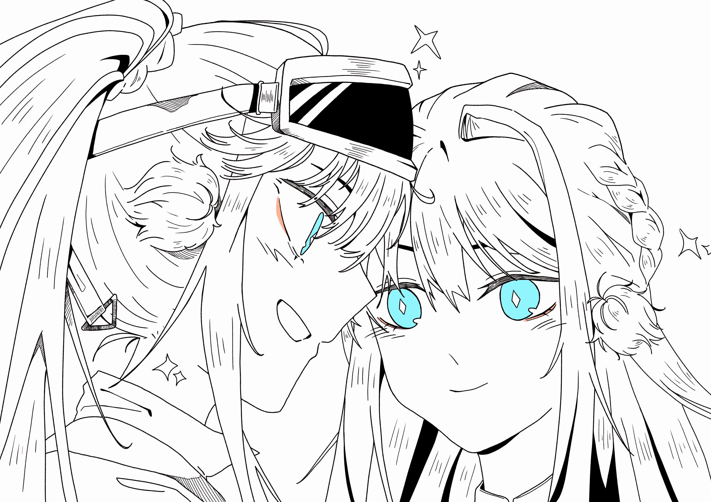

如闪耀的海蓝宝石{.textkai}

将璀璨的美丽投向世间{.textkai}

闪耀留给观众，悸动发自歌喉{.textkai}

此夜，唯星光璀璨{.textkai}

<!-- more -->

## Chapter 0

新年庆典的准备区很安静，演出人员在这里做着上台前的短暂整备。

星极轻轻地把手放在胸口，白色的丝绸手套下边传来了心跳的节奏。她深深吸了口气，逐渐平复了自己的心情。

青鸟已然在音乐的浪潮中找明了方向——今夜，便将为舞台带来无暇的天鹅湖之舞。

## Chapter 1

“埃琳娜，你觉得哪一种设计方案更好呢？”

星极在设计台铺开几份舞台演出服的设计图，和妹妹讨论适合庆典舞台演出的最终方案。

 {.centering}

罗德岛的新年庆典还有一个月，很多人都开始早早准备，拿出自己的特长准备展示一番。以往的庆典，星极都是坐在台下安静观看节目的那个人。

但今年，星极在心里感受到了一股莫名的悸动，一种想要站上舞台的冲动。回过神来，自己手中已经捏着那张写着“演出节目:舞蹈类”的报名单了。

“因为姐姐最近心情一直很好啊~”

本想再调侃几句石头脑袋终于开花的星源被姐姐送了一个脑瓜崩，老老实实地把关注点放回设计图上

“不是开玩笑啦，姐姐最近笑的次数比以前更多了……对了，姐姐有想好具体跳什么吗？”

“芭蕾吧……以前在家里学过，作为表演项目很合适。”

“芭蕾好啊！好久没看见姐姐跳舞了！”

听到姐姐定下目标，星源将她心中最适合的设计图向中间推了推。

“那么这一款如何？可以在舞裙以外添一些小装饰，把姐姐的 kirakira 都展现出来！”

## Chapter 2

制定好舞裙的初设计后，就需要动手制作独属于自己的衣装。

殿堂上的游禽是星极自己设计制作的，制作不算难事，但芭蕾舞裙与偶像服不同，更需要与舞曲和舞者相搭，而不只是能吸引眼球的特色。如何协调，怎样搭配适合芭蕾舞的衣装，就需要专业人士的帮助。

柏喙小姐在收到星极“想请您帮忙看看舞裙”消息的十分钟后，就提着自己的缝纫工具箱候在门外。两人因为那次闪耀阶梯的节目相识，很快就因衣装成了可以畅谈的朋友。

---

“这款珍珠发环，搭配这份金燕发带，稍微点缀一下盘发。”

柏喙小姐为身着白裙样衣的星极梳妆打扮，试着找出最适合芭蕾舞的装饰。

“……好，看镜子，怎么样？”

梳妆镜中出现了身着素雅白裙的美丽青鸟，海蓝色的长发盘起，由发带定型。珍珠发带在柔光灯下多了几分圆润的感觉，如夏夜远远招摇的星辰。

“我很喜欢，谢谢柏喙小姐。”

“如果是上台演出，可以在裙子上填一些有星空元素的蕾丝，整体的观感会更好些，星极小姐有没有什么想在裙子上添加的要素？”

我吗？

星极歪歪头，回忆自己这些天来的想法。

柏喙小姐曾经提过，自己在成为感染者后有和自己一样的迷茫时刻。是在罗德岛的生活改变了她，让她想要把感受到的，想要传达的心意都编制在针线之中。

这份感觉，星极也曾体验过。在得了矿石病后，因失去可能性原地踱步，熟悉的一切慢慢变得模糊，直到变成虚幻之月下的幻影。

但……

“在来到罗德岛后，朋友，大家都陪在我的身边点亮了我所见的黑白色世界。”

“我看到了璀璨的星河，带着熟悉的温柔的星河。在试着去碰触那星空之光时，我走出了那个曾经迷茫的过去。或许正是因为感受过那种闪光，才想要用舞蹈展现给大家吧。”

“呼呼，我大概明白星极小姐的感觉了，传达所见的光彩——来自大家的光彩。”

“那么，再在裙边加些这样的花纹如何？”

## Chapter 3

礼裙编制成型，少女不停息，开始为彩排练习做准备。

“好，到这里就可以。”

黑猫小姐替傀影挥了挥手，音乐中止在最高潮时。

负责舞曲伴奏的晓歌小姐与站在座位席正中的傀影观众席阶梯走下，来到彩排室的小舞台。初换新装的星极十指相扣，有些紧张地等待两位指导者的点评。

小时候的芭蕾舞训练让身体在听到音乐的那一刻就自己动了起来，但真的跳到高潮时，星极自己却有种不自在感——稍有生疏的芭蕾舞步有些跟不上自己的意志，提醒着舞者需要加倍温习努力。

但，掌声代替了语言，打消了淡淡漂浮的自我怀疑。

“很美哦，星极小姐。像是在音符的海浪里散步，跟上了舞曲节奏。”

先开口的是晓歌，她发自真心地给予点评。星极轻轻握住她的手，让怀疑自己的真心是否传达到位的晓歌放下心来。

“谢谢，如果没有晓歌小姐的伴奏，我也无法找到以前的感觉。”

---

“表演与舞蹈并非完全重合，所以我会尽量说说我的想法。”

来自剧团的傀影先生清了清嗓子，等待两位女士平复好心情才开口，指出存在的问题。

“虽然舞步有些小问题，但可以通过勤加练习很快回到最佳状态。”

“在你的动作中，我感觉你有很多想要诉说的‘故事’。那些故事是可以让观众们与你共鸣的琴弦，也是你起舞的起点。可以说一说您是为何起舞吗？”

---

“为了，目睹的色彩。”

星极双手下垂相握，向面前的两人坦白所想。

“在罗德岛的时光让我有机会去思考，不管是未来的方向，还是那如落日般灿烂却不可归的往日。”

“我找到了新的方式去注视星空，注视那闪耀的光芒。因为爱我的人的支持，我得以一窥那让人饱含热泪的暖光。”

两人一猫的听众聆听星极的自白，星极犹豫一刻，说出刚才起舞时的感觉。

“在刚才起舞时，我有一种冲动，一种想要把光芒分享给所有人的冲动，让所有人可以分享我的感动。”

心意一点点从身体深处溜出来，化为承载着情感的话语，正是这种情感让人们为舞蹈流泪，传递感动。

---

“让人获得幸福与温暖的光，和星极小姐一样的气质……”

“如闪耀的海蓝宝石，将璀璨的美丽投向世间。那么，这份心意还请您保存好留给各位观众，让她们见识您璀璨的光芒吧。”

两位导师认可了星极的答案，但不可一刻松懈，还有很多事需要做。

“这次我们换一个舞曲试试。”

“我和 Miss.Christine 都会注视你的舞步，以最严格的舞台标准——尽力在新年庆典前做到最好。”

不知何时溜到星极脚边的 Miss.Christine 扭过头来，用尾巴轻轻扫了扫小腿。似乎是错觉，星极看到 Miss.Christine 露出了欣慰的笑容。

## Chapter 4

“很好的故事呢。”

少女博士坐在星极身旁，双手托腮听她讲完了站在舞台前的故事。

“如果说不紧张绝对是假的，但是……”

星极顿了顿，对上博士的视线。

一双淡灰色的眼瞳，很特别的眼睛。倒映出穿起白色芭蕾舞裙，盘起头发，戴好发饰的青鸟小姐。在那清亮的眼瞳中，倒映的星极身影露出了灿烂的微笑。

“但是是‘想要把自己不是占星学者，属于星极的那一面展现给大家’的感觉带来的紧张。这样的我是诞生自罗德岛的，如宝石切面一般折射光彩的我。与往日的形象不同，却也是真实的我。”

“在罗德岛，我寻觅到了属于我的月与星空，我想要和大家分享我所见到的闪耀，那种难以忘却的，温暖闪耀的光。让大家能借着这种温暖找到自己的方向。”

博士握住星极的手，感受彼此的温度。星极的心跳透过指尖，传递着那股悸动。

“星极，感受到光的你，现在幸福吗？”

“很幸福呢。”

“那么——”

博士拍了拍星极的肩膀，牵起她的手。

“准备好展现属于自己的光芒了吗？”

## Chapter 5

舞台又重新陷入了黑暗与寂静，在帘幕拉上之刻，观众耳边响起了主持人的高喊：

“下一个节目，芭蕾舞表演，星极小姐！”

所有人的视线齐刷刷地锁在了那片红色的帘幕上。

哗啦。

在昏暗的灯光下，一位身着芭蕾白裙的人影出现在了舞台的中央。

突然间，耀眼的灯光打向了这位舞台的新主人。

为舞蹈预热的旋律慢慢响起，和弦如温柔的浪花，轻轻拍拂在场的每一个人。

在星极直面的观众席中，出现了闪闪发光的星星。

那是一根由工程手套握住的小小法杖，在暗色的观众席上轻轻摇摆，发出黄色的光点。

慢慢地，星星摇摆，观众席亮起的星光越来越多。

那些是带着星极走出过往之日的人的手，曾与星极并肩前行之人的手，因罗德岛改变人生的手，感受到温暖之光的人的手。

他们手中的应援棒点亮了观众席，温暖的波浪因音乐渐入高潮慢慢激荡起来，被人们捧起的星空照亮海面，倒映出深蓝色的世界最耀眼最温暖的色彩。

星极所见的那份闪耀化为温暖的光芒，在这舞台共鸣着，献给每一位观众。

星极向每一位感受到光的观众微微鞠躬。

“谢谢各位的喜爱，那么，请容我献上这一场表演。”

---

闪耀留给观众，悸动发自歌喉，此夜，唯星光璀璨。<eod />

（责任编辑：广英和荣耀；网页排版：Baka632；绘图：ajkr）

<FakeAds />
