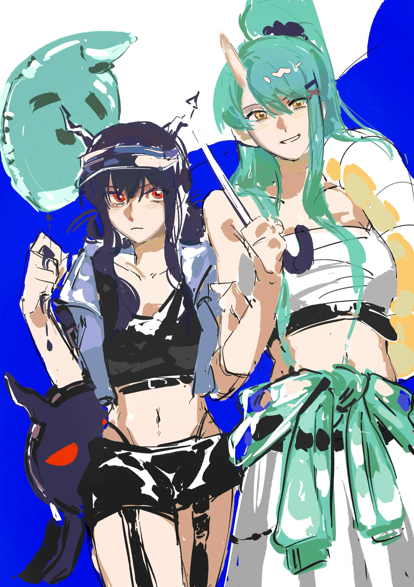

旧衣揭往事，大饼出乡香{.textkai}

清风拂山岗，明月照大江{.textkai}

<!-- more -->

星熊从东国回来，带了两件稀罕物。

一，是她这身夜露死苦的二十年前旧衣，二，是刷了酱的东国秘制大饼。大饼先是孝敬了文月，然后被一众同僚瓜分。衣服则威风凛凛穿在身上，诗怀雅从汐斯塔回到龙门，刚下了飞行器，以为有什么社会闲散分子攻了过来，正欲摆龙门阵，再揉揉眼定睛一瞧，这不咱们龙门铁骨铮铮的公务人员吗？！

老虎伙同老鼠，拉着星熊上摸下摸。

“你这是做什么？”

“去见旧人穿了旧衣，如何？”星熊只是笑笑，拿着佛珠假模假式一盘。

诗怀雅又长吁短叹一阵，问林雨霞怎么看。

林雨霞淡淡道：“龙门佛子。”

---

翌日，星熊就把衣服换回去了，诗怀雅好不容易抓到这么个话头，不想轻易善罢甘休，于是坐在办公室拉下百叶窗，调侃说：“怎么今日不参佛了？”

星熊连忙孝敬了一张东国煎饼，一盒叉烧：“酒肉穿肠过，佛祖心中留。”

吃人嘴软，诗怀雅毕竟是体面的大小姐，开玩笑开不过星熊这种在各类社会摸爬滚打的老油条，当即甚至为自己拿朋友开涮的行为产生了些许愧疚之情。

软弱的情感一发不可收拾，她索性继续深挖：“东国那一趟，我多少也知道……我缠着文月伯母讲的，你别怨她！就是……就是你现在怎么样？”

唉，在近卫局呼风唤雨的诗怀雅，面对这种自己所不能参与的生活和心情，也会在身体中孵出窘迫与不安。这窘迫无关于阅历和关系的深浅，只是……世上所有人为在意的人事物担忧，都是这个样，所谓近乡情怯，在感情里一通百通，无所转圜。

星熊如此高大，如此无所不能，在龙门却始终有一些人依靠她的同时为她操心。她在年轻时候，养成的最大习惯是成全和牺牲，但活到了现在，属于过去的故土永远逝去，她迎风点烟喝酒的时刻，难免想起所谓活到老学到老，此刻心中再起的波澜，便是隔世了。

在崭新滚烫的生命里，星熊意识到自己那种牺牲的论调之所以一直应验，也不缺是有人为自己擦屁股。她缓慢又坚定意识到自己同样被捧在别人手心，轻轻老脸一红。

想到这里，她看着诗怀雅，用那种可以被体察的柔情叹口气道：“我现在挺好的。”

诗怀雅也放松下来，又开了几句玩笑，放星熊出去当差。

和故国一样燥热温冷的夜降临，星熊一个人走回家，换了宽大的裤衩和 T 裇，坐在房间喝啤酒。世界静得要吃掉所有光亮，也公平含纳星熊。她从东国归乡，御机种种譬如朝露，电子时代到来，怪谈随着阴谋消散，这世上不再需要鬼。从良上岸的感受，恰似细砂抚掌，越是在意攥得越紧，昨日种种就越是随风逸去，难以挽留。

白炽灯的光影下是困虫许多只，星熊恍惚间想到自己刚到龙门的时候。这移动的城邦在大地轰鸣的开端，也带上了许多生命力比源石虫还要旺盛的蟑螂。御机不常有这种上古邻居，彼时星熊初来乍到，对东道主也十分尊敬，不仅没有对它们赶尽杀绝，反而在房间里豢养了一只，三餐按时上供。

她在各种场合不缺义气朋友，到哪里都能结识缘分，只是独处的时候，身边却恰到好处缺一个可以说点什么的人。小强充当了星熊一段时间的树洞，再后来，一条龙横空出世，双角峥嵘，有帝王之相，年轻又高傲，坦诚又倔强。

星熊站在这个人身边，为自己的人生和她的事业，为自己的过去和她的心，为属于人生的命题和她的未来保驾护航，肩并肩生死轮转的时候，仿佛不再有难以忍受的寂寞感觉。

一切尽在不言中，原来是这个道理。

回到御机的时候，一切怅然和模糊的情绪都在夏夜蒸腾。那个人走之的那天，天空尽是细雪，白驹一越，这隔世的日子来到御机，星熊心中被压下的飞蛾朝着业火扑去，从前那些可不为外人道的心情，从前那些不必多言自会有人懂的默契，在花火陌生熟悉的光影中炸开，落进星熊的眼睛里。温凉的河畔，回不去的故乡，出走的决绝，星熊忽然很想找人说一说。

但即便是诗怀雅主动问出来，星熊这个年纪，这个身份，竟然也只能像个真正的大人轻轻一笑。

她本以为这种关于自己的感受不必再多言了。

---

有人敲门——

星熊翻身打挺坐起来，这个时间，蝉鸣都消散落幕七年的生命，世界只剩下移动城邦疲惫的银龙呼啸之声，只有一个人会在这种不合时宜的节点过来。

只有一个人，哪扇门都可以任她推开。

吱呀———

年轻的龙风尘仆仆，蓝发半束着散在脖颈，夜露轻抚的面容带着不易察觉的倦色。她自来熟地坐去地板上，和同样打坐的星熊对视一眼，最后为自己倒了一杯水。

{.image-right-float style="max-width: 40%;"}

“回来了。”

“回来了。”

星熊笑笑，胸口扑腾了几只蝴蝶，击碎盈盈一揽月。

“不久前我第一次回来，你不在。”

“去东国了。”星熊摇摇头，起身拿出了冰箱里珍藏的一瓶酒，她自己爱喝些街头货，但不缺高级的供奉。她的小屋除了这个人，再没什么人来，于是这个人不在的时候，时间和好酒一样，都成了难以消磨的存在。

“去做什么？”

“处理旧事……”

片刻，高大的鬼狐疑道：“Missy 她们没同你讲？”

“……我进了城就来找你，没见其他人。现在的身份不便去近卫局，我准备回趟罗德岛再联系那老虎……”

听到了意料之外的答案。星熊撑住脑袋，突然痴痴笑了。随后就这么不客气歪去龙的腿上，从她这个角度看过去，两人的表情其实都被灯光晃住，模糊不清如梦似幻。一种异样的安心依旧袭击了星熊，让她唐突拥有把一切和盘托出的勇气和冲动。

“我老家被拆了。”

蓝发皱眉：“御机？”

“倒也没有那么大兴土木。”星熊哈哈一笑，伸手将自己的指头搁进对方空置的掌心“只是锻冶町。”

“我小时候在那里活着，活得不安、快乐、困惑……现在旧人散了，死了，锻冶町也被拆干净……我在东国，已没有什么牵挂。”

星熊说着想抽出自己的手去抚上眼睛，这是她自己都意识不到的动作。但现在，她胳膊还没来得及抬起，冰冷的指头被同样冰冷的掌心攥住，那不去言说的惯性逃避被打断，这一刻于情于理，星熊对宛如命运的这个人，是挣脱不了的。

“然后呢？”蓝发的龙放下酒杯，这下她另一只手也得了空，于是星熊额间的碎发被拨开，冰冷的气息覆盖她的神情，是红，红色的眼仁朝自己铺天盖地砸下来，圈住她的人生。

一般人被盯住总要发毛躲藏的，星熊在这人面前，终于习惯克制本能。

她于是任由对方拨弄她翠色的头发、抚弄她颤抖的眼皮……任由对方将沉默、担忧和两人多年不见的想念和愧疚砸向自己，星熊悉数收下，甘之如饴。

她几乎是幸福地呢喃：“我换身行头，去训练室吧？”

“我刚回来，饶了我吧。”

“放心，我自己练些东西，主要是这瓶见底了，我在训练室里还藏了一瓶好酒，谁也没发现。”

“噗嗤……”蓝发露出了今晚第一个无奈的笑容，“怎么藏住的？”

“以前我们在近卫局怎么藏，也就在这里怎么藏。”星熊朝她眨眨眼，后者露出了然的神色。

“那确实天知地知，你知我知而已。”

---

夏夜，潮湿温热的风袭击着机车上的星熊和后座的龙，这几年的龙门有些东西变了，有些东西始终没变，星熊的腰被一双手揽住，她知道此刻手的主人一定在看这城市的夜色。

训练室静得像一座坍塌的宇宙，毕竟大半夜的，除了她们没人有这样的闲情。

星熊轻车熟路凭空拿出一瓶酒。接下来一边事无巨细跟蓝发讲起自己此次的经历，一边把酒斟满一杯又一杯。她们为铁斋遥遥致敬，为死的活的生的死的洒脱的发疯的身不由己的叹谓，最后，月纱蒙下来，陈晖洁把自己挂在杠铃上，于月色中不省人事。

“别逞能了，老陈。”鬼笑了，无奈啧嘴，“我扶你回房间吧。”

“最后萌萌香还为你放了烟火。”龙倚着手臂，轻笑，“你也远不枉此行。”

星熊转了一把杯子：“是吗……我可是还有遗憾。”

“说说？”

“龙门的夏天潮湿，习俗也凋敝，况且如今的时代，生死之前，哪里什么机会看烟火呢？当时烟花落下来，我忽然想，你要是早回来几天去御机找我，那景色你也能看到。”

“哈……我已经看到了。”

蓝发歪歪扭扭从皮椅上下来，轻轻稳住脚步。

星熊凑过来扶住她。

“你看——”陈晖洁拿指尖去碰星熊的眼睛，“你这不是，把烟花盛满带回来给我了。”

鬼的心中想，哪里有烟花，你醉了，我的眼里分明是你的倒影。

她们互相依靠搀扶朝着电梯走去，脚步如水，很轻很轻。走到一半，陈晖洁彻底没了力气，星熊横打着把她抱起来，却没想到一番动作，竟又把神游的陈晖洁给晃醒了。

“你这衣服……”她伸手揉捻几个铆钉。

“有点夸张，是吧。”星熊摇头叹气，“Missy 和林小姐总拿我寻开心。”

“管她们呢。”陈晖洁拿指腹来回摩挲皮衣的材质，一巴掌拍去星熊胸口，“这不挺威风。”

---

诗怀雅打着哈欠到了办公室，发现星熊又精神地穿着那一身“龙门佛子”在招摇。

她连忙过去：“怎么又把行头焊上了？”

“有人觉得威风。”

“谁？古惑仔？刀马旦？我看今天还要接市民投诉。”

星熊仰天大笑出门去：

“请——”

伴随着新生的太阳，星熊一向慵懒的声音在走廊格外嘹亮：

“他强任他强，清风拂山岗；他横由他横，明月照大江。”<eod />

（责任编辑：广英和荣耀；网页排版：Baka632；绘图：再通宵就掌嘴）

<FakeAds />
