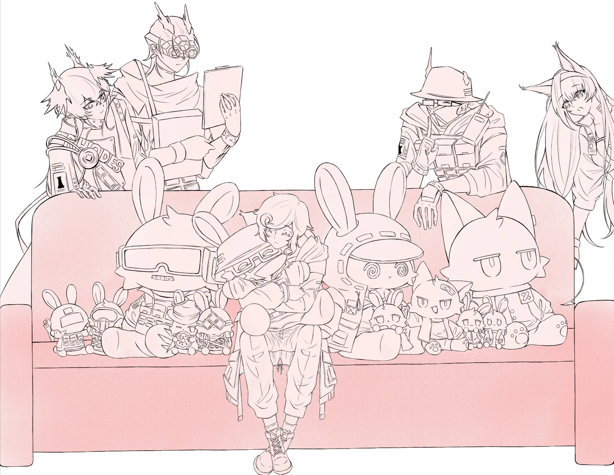

与精英干员一起战斗过的日子{.textkai}

像咽下一口滚热的汤{.textkai}

咀嚼即将构成身体一部分的食物{.textkai}

让思念与爱的热气，支撑漫长的一生{.textkai}

<!-- more -->

博士第一次亲眼确认，一把足够锋利的匕首在削下苹果皮的时候，汁水是不会到处飞溅的。给他提供样本的是精英干员Misery，萨卡兹坐在塌边，眼睛并不去看手上握着的利刃，青色的果皮却乖顺地一直垂落到白瓷果盘里。

清澈的香气在房间内蔓延，指挥官在Misery翻飞的指间饶有兴致地观察着小青蛇一样探出头并不停地拉长身子的果皮，不消多时，就忍不住伸手去够细长的蛇身。他细长的食指被萨卡兹轻轻推开。

“您会割到手。”Misery耐心地解释。

博士半躺在棉被堆里，不满地将裹在被中的双臂伸出来比划：“还有那么——长的距离呢。”

Misery左手抽空在抹布上一捺，一边将他的不老实的指挥官的胳膊重新塞回被子里，一边表演了半分钟的单手削苹果。

“啪嗒”一声，随着果皮完整地安全着陆，Misery的拇指也正好停住了锋利的刀尖。

若有似无的新鲜气息绕着二人的前额。博士陶醉地深吸一口气，企图绕过病中堵塞的鼻腔。再睁开眼，萨卡兹竟然带着削好的苹果站起身，转身欲走了。

“不是给我吃的吗？”

博士不明白，博士可怜巴巴地用眼睛扒拉着精英干员的手腕，希冀心软的Misery乖乖放下，好让他享受美味的战利品。

“不……”Misery肉眼可见地僵硬了一瞬，“是给您吃的，但不是现在。”

“你这个狠心的萨卡兹。”病人总有特权耍无赖，博士瘪着嘴摇摇头，“难道要等氧化了以后才肯给我？现在的它最好吃。”

“只是拿去煮汤，一会就好，博士。”Misery仍然坚持，“我现在去，不会让您久等。”

“什么？这是对苹果的亵渎！”指挥官大惊失色，“苹果怎么能煮汤？这还是一颗水灵灵脆生生响当当的青苹果！”

萨卡兹抿嘴笑了：“博士，您还是这么讨厌苹果汤。”

“我不讨厌。”谁的嘴都没有指挥官硬，他竖起一根手指，“Misery，我特许你不要煮这个可怜的青苹果，它看起来一点儿也不想被煮。”

“我说了不算，博士。”萨卡兹尾巴在身后钟摆似的一晃一晃，他好脾气地接话，“医生说您脾胃虚，必须煮着吃。”

博士板起脸：“哪个医生？我就是最厉害的医生。医生说博士需要补充维生素C。”

没有护目镜的遮挡，Misery宽容的眼神轻轻落在指挥官肩颈上。他毫不费力就能辨认出那里的筋骨和血管，与果皮颜色如出一辙的青色脉络蜿蜒其上，薄而透明的皮肤随着指挥官的呼吸微微起伏，让人惊讶于皮肤下暗流的鲜红竟然没透出半点颜色。

“您特许我不要煮，也就是说，您也同意我能煮。”萨卡兹心平气和地说，“就像您特许我说从前的旧事，我也可以不说一样。假使您没有预设我会去做，又何来的特许呢？”

被信任的下属用自己最拿手的方式搪塞，博士一时无言。

指挥官不寻常的老实逗得Misery微笑起来，他利落地从中间掰开青苹果，用匕首削下拇指大小的一块，两指拈起递到博士嘴边。

“就这一口。”

终归还是Misery会疼人啊！博士眼睛都亮了，生怕他反悔一样“啊呜”一声，将苹果块囫囵吞在口腔中。

Misery抽回手。他掉头就走，走廊灯照出的影子和他一块落荒而逃。

指挥官带着笑的话音还在身后追：“等你回来！我真想知道为什么说还是这么讨厌苹果汤。”

---

厚而深的汤碗一半陷在被里，博士反复将手心手背贴在碗边，烙饼般不停翻面，试图汲取一点暖意。

“很好喝的。”Misery看了半晌烙饼，忍不住劝，“再等下去就凉了。博士，不要拖延时间。”

主动权来到指挥官手里，萨卡兹无奈地看着博士重新眯起眼睛坏笑，打定主意绝不能太纵着，他刚想接过汤碗，自己拿勺子去喂，就听博士问：

“我一直喝这种东西吗？”

顶着指挥官犀利的眼光，Misery重重点头。

“我不信。”博士指出，“你刚才都说了，我很讨厌苹果煮的汤。”

他用勺子拨弄着软绵绵的果肉，从勺子上滴落的汤水十分粘稠，应该是放了点糖，而果肉的褐色已经让人分不出它是拿红苹果还是青苹果炖的了。

“正因为您讨厌，我才记得这么牢呀。”

“不老实。”

“您就喝了它吧，这么一点，很快就喝完了。”

“我有预感它的口感不会很美妙。”

“但它对您的身体有好处。”

闲下来的时候，也只有Misery愿意这样和博士踢皮球。两个人都心知肚明这样的谈话毫无内涵，不过有时唯有籍此才能建立一点对久违的假期的实感。让博士真正放下一切琐事与重负，漫无目的地扯闲话，是多么不容易啊。

“那讲讲我以前喝苹果汤的时候。”

“……”

“讲完我就喝。”

Misery一时语塞。

博士坏心眼地“嗯？”了一声，这种时候Misery就是比其他人好对付也好套话，倘若是Logos在这儿，想必面色都不变就能杜撰出一堆细节，事后再以其中的错漏向他告罪，说些“一时记岔了”的借口。

而精英干员Misery只是用那双柔软如鼷兽的眼睛，温和而责备地注视着他的指挥官。博士看得很清楚，萨卡兹一丝责怪的情绪想必刚刚攀到喉间，就又被对自己不纯熟的谎言的懊恼压下去。

“博士。”他只讲得出这一句。

热意温暖地拢着指尖，博士低下头看看苹果汤，忍不住轻笑一声。

Misery是个好萨卡兹，正因如此，博士格外不能对Misery使坏。

萨卡兹稍稍压下眉，明明待要责备，最终却又纵容着他时，他也就自觉地退后一步。

“讲一讲吧，Misery。”博士舀起一勺送进口中，热苹果海绵一样的肌理在舌尖散开，“苹果还是苹果汤都无所谓。我只是想听你讲。”

侧方好一会都没有声响，指挥官略带疑惑地抬起头，Misery正望着床对面收起来的输液架出神。

“您以前的身体没有这么差，虽然也说不上好。”Misery慢吞吞地移回视线，他注视着博士消瘦的脸颊，眼睛眨一眨，明晃晃的，像点滴落下的一瞬间。

“凯尔希医生说这段时间您饮食不当，睡眠也不足，才会突然病倒。”

博士一点也不愧疚，但还是沉默着喝了一口汤。

“除此之外，您的压力也很大，有的晚上我能听到细微的磨牙声，偶尔您还会做噩梦。”Misery不带一点批评意思地说着，“醒来时您不愿意告诉我梦的内容，但是我猜总绕不开那些事……啊，这和苹果汤好像没什么关系。”

“我说话就是这样颠三倒四的……从前的您确实没有喝过苹果汤，因为那时您的肠胃尚且能负担消化。青苹果大概太酸了吧，您说这种东西吃多了不好，拿来煮汤倒是很有营养，就是肯定很难吃。”

萨卡兹笑了一声。

“我们那时哪有条件煮汤？行军中不能生火，那一种青苹果和您现在端着的也不同，只是本地的野果，和这种来自大炎的由农学家精心培育的水果根本不能比。”

“那种果子又酸又小，果核比果肉还要多，能啃的只有薄薄一层，连萨卡兹吃了都倒牙，您咬下去的时候却面不改色。”

博士安静地小口啜饮着热汤。

“一晃这么多年过去了。”Misery注视着他的指挥官喝下不算喜欢的汤的样子，继续说，“从前可以吃的时候吃不到，现在有了更好的，我却只能狠心不让您吃。”

博士笑叹：“Misery，我说你狠心是开玩笑的，你是最好的萨卡兹啦。”

“我知道您的意思。”萨卡兹偶尔非常固执，“我只是责怪自己。”

“为什么呢？这又不是你的错。”

“这种事情能是谁的错呢？我自己过不去而已。前十几年太艰难，现在生活好了，您的身体却糟了……”Misery静静地垂下头，“……这一生也没有办法。”

博士喉头一梗，他只好用汤水去冲淡那股挥之不去的酸涩，甜汤腻软地挂在唇齿间，咂摸来咂摸去，都不是滋味。

苹果热汤本来就没有多少，一番话的功夫已然见底，Misery于是接过碗，站起来说：“我去洗碗，您再睡会吧。”

“刚吃完甜的就睡，待会梦见大虫子来啃我的牙。”博士开玩笑道。

Misery只是笑：“好过在啃苹果的时候看见半条虫子。”

“再这样我真的要闹了。”博士眨眼，“这里的两个人之中有两个人根本没啃到苹果。”

萨卡兹伸出手，轻柔地抚过指挥官的眼睛，长而浓密的眼睫划过他的手心。

“您好好休息，过段时间说不定呢。”

博士乖觉地闭上眼，感到Misery温热的掌心自脸颊离去，翘起掩在棉被下的嘴角。

---

也许日有所思，日也就会有所梦，Misery临走前调暗了灯光，在没有一扇可以联通外界的窗户的医疗室里，黄昏的光辉便拢在博士身上。

光怪陆离的角色一一走到博士面前，先是青苹果从白瓷盘里跳起来开始自我介绍，说她是来自云北的香蕉，特点是纯甜无酸，因此完全可以直接啃着吃。

博士问：“女士，且不论你为什么是香蕉，纯甜无酸就能啃着吃？那我刚刚亏大发了。”

香蕉青苹果女士轻蔑地瞥了一眼无知的人类，从门口飘了出去。

然后Misery的匕首折返回来，倒立在博士眼前，虽然按理来说一把匕首是没有反和正的，但它就是那样做了，博士循循善诱地说：“这位匕首……呃我不敢假定你的性别。非常感谢你在病人面前表演倒立，这对我枯燥的养病生活很有意义——所以能说说为什么吗？”

匕首比萨卡兹本人冷酷地多，祂泛着寒光，亮银色的刃面如水，博士认为祂的表情和冰块一样，这把匕首说：“那个青苹果——她太酸了！酸得我倒牙。”

博士疑心自己的记忆出了差错，他追问：“可是我并不觉得啊。”

匕首理所当然地摆摆身体：“你以前有没有吃过很酸的青苹果？”

“有是有，但是我不记得。”博士回答。

“那就对了！你都不知道什么是很酸很酸，又怎么能比较出来这个青苹果是酸还是甜呢？”

“不记得和不知道大概不太一样……”

匕首并不管他，自顾自跑走了，大叫着要把自己洗干净。

可以说话的对象都走开了，养病的闲人未免有些寂寞，博士张开双手，慢悠悠地沉下去，一直沉到深深的土地里。

 {.centering}

他惊奇地发现自己重新站立在大地上，可是头顶也是同样的一片大地。前方远远地有一块碑，他便走过去，离得近了，才发现上面刻了三个大字。

那三个字先是把他惊出了一身冷汗，又忽然敲醒了他。

“我在泰拉。哪里会有我看得懂的旧文字？”

博士念叨着，索性不走了，原地蹲下来。他心里隐约知道今夕何夕，只是飘飘渺渺地不愿意醒。

大地和大地的一片混沌间，渐渐有了人影。博士看着那些影子陆陆续续地接过各自的汤水，一饮而尽，随后轻快地落到桥的另一边。

在指挥官意识到那碗汤水是什么东西的时候，他也正好看见一个熟悉的影子。

断着角，长着尾巴，不知从何处来，也不知道要到何处去。

影子渐渐走得近了，他才觉得这影子大约和Misery是一类。这时他还蹲在原地，却在那影子正要接过汤水的时候，突觉有哪里不对。

和Misery是一类……

断着角……

不知从何处来……

汤水……

博士忽地站起，眩晕刹那间袭击他的大脑，他有意想拦，手却穿过了影子。

不会碰不到吧？博士抬起头，适应昏黄的眼睛看清了那影子的面容。

对方正盯着他，以一种出乎意料的表情，注视着博士的面容，然后腾出一只手。

萨卡兹隔着虚空，摸了摸博士的发顶。

“Scout……”博士喃喃，这名字好像植根在他潜意识里，自然而然地跟着透明的泪水一起流出，滴落到他的手腕上，又滑下去洗刷岸边的礁石。

Scout在战术目镜后冲他的指挥官微笑，然后就要喝下那碗汤。

博士着急去拦：“不能喝！”

Scout显然不懂孟婆汤的含义，他停下动作，神情茫然，面罩微微起伏，似乎说了什么。

但博士听不到。他转头去看石碑上的字，气急地开口：“这里是奈何桥，喝了这碗汤就会忘掉所有……”

他回过头，尾音讶异地掐灭在喉咙里。

萨卡兹手里哪里是什么奈何桥的孟婆汤，只是一碗苹果热汤，甚至还在安静地冒着热气。

Scout纯良地眨着眼睛，左右看看，似乎明白了博士听不到他说的话，他缓慢地伸出手，指向自己的心脏。

“时间到了，博士。”

“咚”的一声轰然炸响，指挥官耳畔响起真切的回音，就好像Scout真在说话一样。

萨卡兹摆了摆手。他在饮下这碗苹果热汤之前，最后做了一个手势。

“没关系。”和Misery一样的好萨卡兹向指挥官诉说最后的心里话，“不怪您呀。”

博士怔怔地站在原地。
“您回去吧，我要走啦。”
萨卡兹挥挥手，眯起眼笑了。他转身安静地迈上那座桥。

——他向天上去，他在地上寻。
博士拼命忍着眼眶的酸意，却还是不断有滚烫的液体从心底喷涌而出，半梦半醒间他知道自己永远忘不掉萨卡兹的眼睛，可悲痛再多再不能自抑，他最后还是得回到人间。指挥官睁开双眼，其中的热泪像是再也不能承受自身的重量，不断地划过脸颊、没入鬓发。在朦胧视野的一片昏黄中，他看见故人渐行渐远的背影。
身为羁旅客，大梦一浮生。

---

此后，Misery偶然念过一次：“博士最近都不挑嘴了。”

萨卡兹诧异地和同事说着，对面的女妖不咸不淡地投来一个“你在炫耀什么”的眼神。

Mechasnist插话：“你得让博士戒掉小零食才可以说这个话。”

Raidian也点头：“博士的问题不是挑嘴呀，他对零食可从来不拒绝。”

“这不一样……”Misery苦恼地挠头，“是不是因为我上次说的话……哎呀。”

Mantra问：说了什么？

迷迭香说：“难道是……把Misery……当做……枫树。”

Stormeye莫名其妙地问：“枫树？博士还让Misery在年会上演过枫树？”

Sharp唏嘘：“那可真爽。演树等于啥也不干。”

Logos说：“并非如此。”

Misery无奈：“好端端的提那个做什么……”

“哎呀我想听！”

“香香，当时你和博士在做什么呀？”

迷迭香认真地在终端里搜索关键词。

片刻后，她向大家展示了一张照片。

秋日清爽的街景里，博士正在和迷迭香一起，往Misery身上绑穿满枫树叶的棉线。

“这就是Misery枫树哈哈哈哈哈哈哈！”

Mechanist发出一阵惊天动地的大笑。

“蜜蜂。”Logos说。

众人一开始不解其意，室内安静了半分钟，突然充斥着快活的气息。

煌边捂着肚子边擦眼泪：“欸？别走啊！博士给你系的时候怎么就那么乖呢！现在跑什么……”

Misery愤愤的声音远远传过来：“我去给博士煮苹果汤！”

“博士还会喜欢喝那玩意？”

“我怎么觉得是黑暗料理呢。”

Mantra眯着眼睛想了想：如果多放糖的话，说不定没那么糟。

Touch摇头：“给博士喝的，不能多放。”

今日份的小小八卦结束，大家逐渐回到自己的工作状态里。

只是偶尔有人小声念一句：“蜜蜂。”

然后引来一场哄堂大笑。

---

Misery推门进入办公室的时候，博士恰在奋笔疾书。

精英干员放下汤碗，凑过去看，桌上平摊着一份关于新式训练办法的章程，博士正在其上划来划去修改着，见他来了，手里也没停。

“先喝汤吧，博士。”

“写完这一笔就好。”

“您的一笔可不知道有多久。”

“真的。”博士笑了，“就一笔。”

“好吧，我等您。”

等到指挥官果然如他所言，停笔转而端起碗的时候，Misery也就如愿隔着袅袅热气，看到博士宁静的眉眼。

博士喝得很乖，慢悠悠却不磨蹭，他好像将这件事当成了一件享受，抑或工作中短暂的休憩本就珍贵难得。

没人知道，博士咽下热汤的时候，总是同时压下胸膛间滚滚的热意。

斯人已逝，生者递过来的苹果热汤，总归还是要好好地喝下去。<eod />

（责任编辑：黒子；网页排版：Baka632；绘图：小满不想画）

<FakeAds />
