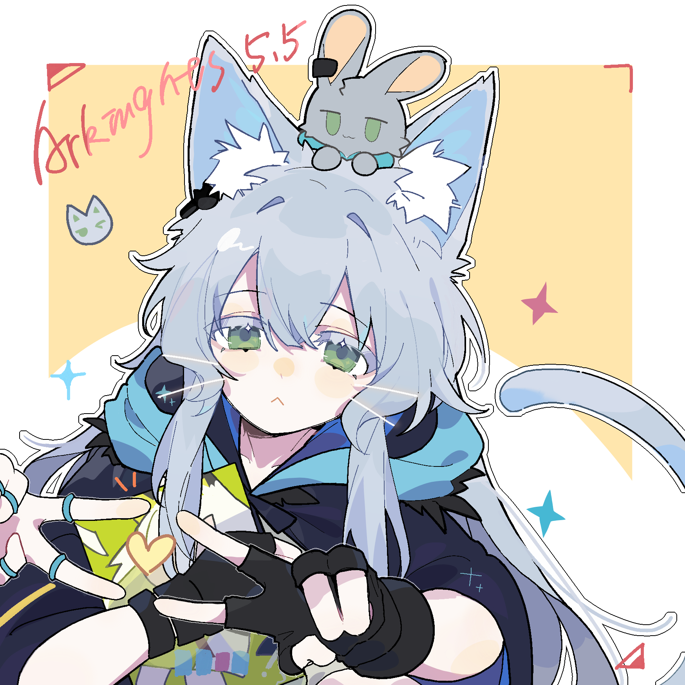

直到回忆将缠紧缝线{.textkai}

仍祈愿得聆怜颂言{.textkai}

我会作为谁的眼{.textkai}

去目视迷中迭{.textkai}

<!-- more -->

## 六

下午四点整，Whitesmith正在工程部工作间值班。在她面前，几组圆筒状施术单元被半悬空地固定在机械臂上，看起来重量不一般，她正在为其中的核心构件调整参数，以达到预期中的效果。工程干员每日的任务无非和器械或源石制品打交道，虽然对于外行人来说多多少少有些觉得无聊，但如果你随便敲开哪间工作室的门，都只会看见他们的眼睛挪不开自己手上捣鼓的东西。

在Whitesmith记录施术单元反馈数据时，眼角余光看见一只小手从机修工作车上拿走了一只扳手，不大一会又放回原位，继续伸向另一处的卡尺。她当然知道这是谁在偷偷摸摸摆弄那些工具，由于这次工作只是在调整施术单元，工作车上没放什么有危险的电力器械，就权且当作看不到，满足她的好奇心吧。

她突然感觉腰间被什么东西戳了一下，低头一看，那是一板研磨石，因为特殊需求被打磨成了纺锤形状。

“小猫，别闹，我正在干活呢。之前你不是和我保证过不去动工作间里面看起来奇奇怪怪的东西吗，它们会麻烦到你的，还记得吗。”

“哦，抱歉，我只是觉得这块石头很好看。”

小菲林把手里的研磨石放回了托盘里。她跨身坐在一旁断电待机的备用机械臂上，晃动着双腿看Whitesmith操作那些好像很高深的东西。

“Whitesmith，那是什么？它们长得像小烟囱。”

“这是尾部发信器式施术单元，可以减轻释放源石技艺产生的负荷。你肯定见过它，就是Mantra女士尾巴上那个大大的东西。”

“Mantra，是那个长得好高好高的斐迪亚吗？她的年龄有好几个我那么多，而且不爱说话，也很忙。”

“Mantra女士总是要做很多艰难的外勤任务，她的这套施术单元经常能看见报修呢。而且她其实也没表面看起来那么冷淡，也许你可以多和她接触接触，或者问问那个经常跟着她转的极境干员，这位的话可就不少了。”

小菲林从机械臂上跳下来，落在地上没有发出声音，她从刚刚开始都一直赤脚在工作间里跑动。Whitesmith没有回头确认她去干什么了，她还得早点找出“响尾”上到底是哪个问题影响了它的运作效率。

---

为了方便凑近检查发信器，Whitesmith把自己的护面镜随手放在旁边的“桌子”上。可当她确认完毕发信器的差异性变化，向旁边伸手摸回护面镜时，却发现“桌子”连带着它一起消失了。

“你在找这个吗？”

当Whitesmith俯身查看护面镜是否掉在地上被轮椅挡住时，她听见背后传来小猫的声音。她回过身子，看见小菲林正坐在一台自动扫地机的顶壳上，她故意拿尾巴挡住了下端的红外窗口，使得扫地机笨拙地随机八个方向不停旋转。护面镜此时正被她从头上拿下来，递给了Whitesmith。一想到估计是恰好路过的她的脑袋被自己当做“桌子”，Whitesmith不由得噗嗤笑出来。

“Whitesmith，我在想，为什么房间里不能穿鞋子？”

“因为工作间里有很多精密的仪器或者组件，我们平时穿的鞋子如果带进这里面来会把它们弄坏，所以最好是换上为工作间特制的软底鞋。清理干净后光脚其实也可以，但指不定会踩到螺丝，那会很疼的。”

“可是，Whitesmith，我的鞋被喂给它吃掉了。”

“诶，你说什么？”

她看见菲林指着这台扫地机，顺手敲打着它的合成塑料外壳，用很迷惑的眼神看着自己。

“我以为是鞋子坏掉了，坏的东西要丢掉，所以就丢给它吸进去了。”

Whitesmith一边笑着向菲林解释清楚原因，一边想着要给她重新准备一双鞋子，人家等会离开的时候可不能光脚在罗德岛上到处跑。她打开终端，思索了一会，给次级置顶的联系人发了一条信息。

---

“Whitesmith，你在吗？我拿鞋子过来了。”

Whitesmith示意小菲林去帮自己开门。她走到门前，俯身按下按钮。她看见门外是一只棕色耳朵的卡特斯，提着一双新的制式短靴，眼睛很有精神地睁得很大。

“Whitesmith，我把你要的鞋子拿来了，可是这个尺码，它应该是给你准备的吧。你好，我叫阿米娅，我记得凯尔希医生和我提过你，我还见过你几面呢，可惜之前没有时间赶过来向你打招呼。”

“阿米娅——你的名字真好听。你好，我觉得很开心。”

Whitesmith停下工作转过身，手趴在轮椅靠背上看着两个孩子在相互认识，像这样的情景是最能令人感受到友谊为什么说是暖心的了，她同样这样觉得，于是手掩着嘴止不住偷偷地笑。她们先前有过几次照面，可阿米娅最近忙着和凯尔希在外头跑，而她也一直被精干们“看护”得太严实了。Whitesmith想到阿米娅最近刚好难得有空，就怀着私心给她们补上了这份迟到的见面。她觉得这两个孩子会相处得很合适，实际上看起来也的确是这样。

“阿米娅，我还要工作，离不开身，你可以带她去别的地方转转吗，她还不太熟悉罗德岛。”

“嗯，Whitesmith也要注意身体，早点休息。”

菲林刚刚穿上新鞋子，她抬起来头看见面前伸来的手，还有名为“阿米娅”的新朋友的笑容。两个人牵着手，一起轻快地跑出了工作间。

Whitesmith伸展了一下肩膀，关节嘎吱嘎吱作响。她看着工作间里仍然在敬职敬业清理灰尘的扫地机，外壳上不知道被谁涂了一幅简笔画——一只白菲林，还有一只萨卡兹的模样。

“小孩子，真好啊。”

下午五点整，她头后仰靠在了椅背上，决定闭上眼睛，稍微休息一会。

---

_你想听听她们两个孩子友谊的开始吗。那时既不是什么很特别的日子，也没有多么难忘的事发生，有的只是简单的微笑、简单的肢体接触，简单到从相识到熟知，前后连半个小时都没有。阿米娅和她就像是天生的伙伴，无论小猫有多么不安或紧张，阿米娅总能很好地安抚下她来，这兴许是因为阿米娅的能力吗？我觉得不是，情感是不需要什么外在的链接或者烙印去体现的，这纯粹是属于人性美活生生的例子，如果当你面对这样的一刻，岂能不发自内心地感到珍贵呢。相对于这一点，孩子间之所以能更多地找到这种品质，就是因为他们仍然保持着不容玷污的真善美，而源石病的解药，似乎也是与之同源的。源石病不仅仅是生产力进步的悲剧，更多的是，时代被人造的悲剧。_

_对于那一天，我记住的不算太多了，又或者说，我们之间发生平凡的每一刻都可以视作它的一部分。现在想起来，即使印象已经模糊不清，但还是觉得美好极了。你说对吧。_

_——[Whitesmith] 经可露希尔转述_

## 十

“咳咳……”

Mechanist故意使清嗓子的声音显得很突出，好将各位的注意力重新拉回来，但效果似乎并不怎么好。煌和迷迭香干员还在缠着其他工程干员，在工作间里四处游荡，好奇周围新鲜的器械或产品，而陪同的可露希尔正和Logos有一搭没一搭地聊天。以他们的性格来看，很明显是在恶趣味地不理睬他，Mechanist开始思考自己又在哪方面得罪这两位了，也许是因为前些日子偷拿可露希尔私藏的炽合金给结构性原理新搓了一对磁吸信号接收器，因为外形仿照自女妖的“耳羽”而致使Logos颇有不满那件事，据说是因为仿得还不够像，当事人表示很荒谬。

“各位，都没忘记这次访问的主要目的是什么吧，我们能不能加快些进程？”

“咦？我以为你去洗手间了呢，原来在和我们说话吗，真是不好意思呀。”

可露希尔坏笑得很令人讨厌，Logos则装作没事一般掏出手帕清理骨笔。Mechanist摇摇头，向着不远处那些正在研究全息投影仪的一个小孩和一个小孩似的大人招手，但大概是没有人注意到他的催促，不得不让结构性原理亲自出面把那两人推到跟前来。

---

罗德岛工程部有数十个业务各异的工作间，每个工作间对应着不同的工程干员社群，这些工作区域占据了罗德岛舰船很大也很重要的相当面积。在工作隔间最大的一个器材测试室内，Mechanist打开了场景灯供电，随着测试室光照系统被激活，如果有人先前观察过罗德岛室内训练场的话，就会发现这两处的装修大致是同一个人负责的，只不过测试室明显多出来很多专供给检验用的装置与仪器，当然，也要比一般的训练室凌乱得多，谁让工程干员总喜欢拿这些空间临时充当原料储藏室，还总是坚决地以各种理由拒绝清洁自动车进入呢。

在场地的正中央，有一堆看起来体积很大的东西被一块防水布罩着，Mechanist一走进来就感觉像是眼睛里放了光，虽然大家连他的脸都看不见，但变得饱满的语速和某种刻意营造的“神秘”感确实在说明他特别的情绪起伏。

“这批装备由我们工程部牵头了数个工作室共同研制，足足耗费了一个半月时间，目前纪录排在了罗德岛动力锅炉核心万用件之下。虽然它们还处于原型阶段，但实用性已经足够应用到一般烈度作战。而且，研发的全程都没有可露希尔的协助，完全没有！”

Mechanist走在最前头，丝毫不顾朝向谁在说话而比划着手地自问自答，不知道的还以为他和可露希尔有过什么私下的赌约，但可露希尔本人看起来漫不经心。煌和迷迭香走在最后头，前者捏着鼻子，看起来对测试室浓重的固源岩积灰味有些在意。

“Mechanist先生，能否劳烦你的分享欲稍作休歇，我奉凯尔希医生的指示协助测验新装置，所以还请让大家尽早面见这款你所说的得力杰作，时间宝贵。”

Mechanist挠了挠他那不存在的后脑勺，正好也已经走到堆放处的跟前，他转过身以十分正式的姿势面对四人，像在揭露某场拍卖会上的压轴戏般咳嗽了几声，小声指挥背后的结构性原理收起防水布。

“心急的先生与礼貌的女士们，荣我向你们介绍工程部本月的技术结晶，来自绝对强度的工艺保障，EX-42 歼灭器械套组。”

随着防水布被扯开，一组金属质感强烈的装备呈现在各位眼前。四列约有两米高的重剑模样器械被固定在地上，弧形摆开朝向它的观察者，正面漆上了醒目的01-4白色编号。说是比起重剑或者盾牌，它更像是某种充满暴力美学的合成钢板，以至于它的厚度和长度并不像一般干员可以操作的，想必重量也是惊人。在四列器械的正中央平台上，还有一个体积小得多的几何结构体，几个球状金属安置在立方体框架中，看起来像是特制信号仪，让人联想起某种磁场构筑装置。Mechanist重重拍在钢板器械上，以示它同时带给人的威压力与安全感

“源石技艺远程操作型器械，采用三层集成铆接工艺，通体锻造材料为高纯D32钢，佐以Whitesmith干员源石技艺加工，综合强度硬度远超过军事陆行舰防御层，并且内置有源石接收器，对源石技艺适应性更友好。这样的一组作战装备，即使身处于天灾之中也依然能无损坏投入使用，在测试中它即使面对移动地块也能造成显著破坏力，摧毁罗德岛全舰也不在话下……呃，凯尔希叮嘱过，也不能这么形容。”

Mechanist有点上了头，好像有说不完的话，一股脑地把对这些器械的赞美全部倾了出来，即使貌似只有结构性原理对此反应激烈，正在用它的机械手在保持平衡着模仿鼓掌动作。也难怪，许多工程干员只有在面对自己感兴趣的工程话题才展现出惊人的口才与幽默感。

“Mechanist，我们又怎么看得出来那大铁块子有什么傲人之处，比起它我更想听你讲讲这个小玩意。”

可露希尔凑上前，指着那个几何结构体，看来她对那些铁疙瘩的兴趣比不过研究这只长相奇特的仪器。

“哦，这是器械套组的附加产物，我给它命名为P.F.A感知鞣制仪，顾名思义它可以检测并调节源石技艺的作用程度，在迷迭香干员使用源石技艺操作这些器械时确保负面作用在可控范围内。为了研制它我琢磨了好久的时间，凯尔希医生告诉我迷迭香干员的源石技艺几乎没有外力控制的可能，因此这台仪器的原理更接近引导而非限制，特别的，它与那些器械内置的源石回路可以显著吸引源石技艺对此感知的优先级，如同挖渠排洪般避免感知扩散而造成意外危害。”

Mechanist依旧摇头晃脑地理论这些专有名词，除了可露希尔听得还算透彻，其他人在没有了解缘由前大概还是一知半解。

“煌，以后我都要用它们去作战吗？”

“嗯，这也大家是为了你的安全在着想，合格的战士总要有个趁手的武器对不对，要是不加以控制，你的源石技艺对身体影响还是很恶劣的。”

“试试吧，你能不能把它们抬起来？看起来好重哦”

迷迭香点点头，沉住气息专注于将自己与“源石剑”链接，在众人的注视下，四列器械缓缓与固定件分离，慢慢悬浮在了地面上。很快，它们就像是没有重量了一样在空中稍有迟钝地挥舞着，破开空气的沉重声音扑在了围观者的身边。

“到此为止，迷迭香干员。你仍需要加深与之的熟悉，且训练应当将防护措施准备充分，对于你我而言皆是。”

源石剑重新落回了地面，即使操纵者有意控制它的力度，但砸落的力度仍然使测试室地面凹陷成浅坑。迷迭香看起来有些疲惫，同时掌控四台这样的器械显然还是有些困难，而站在一旁张大嘴巴的煌就很明显对刚刚的演示有些不可思议了。

“这都什么啊……要是砸在人身上岂不是……小猫，我开始有点心疼你了，要面对你的敌人可真会后悔一辈子的”

“我这样子，煌会害怕我吗。”迷迭香抬起头，看向有些惊慌的煌。

“怎么可能，你就是你，就算你的作战方式再怎么奇怪也不会变啊，你只还会是我们的迷迭香，对不对，这也说明你的力量很强大了嘛，比我都厉害呐。对了，你也要记住凯尔希医生的话，就算遇到什么困难都只能用它们去战斗，千万不要松手，那样的失控会伤害到你的，我们谁也不希望你会受伤。”

“嗯，我会握得紧紧的，它们就是我的剑。”

---

Mechanist仍留在测试室里欣赏着他们制造的这些杰作，几个工程干员正尝试如何将它们安全地移动到装卸车上，以转移到训练场地。Logos表示测试室的强度不足以支撑迷迭香干员的训练要求，所以需要拜托工程部将其搬运到其他地方进行训练，原本迷迭香想要自己“拿着”过去，但这一想法立刻遭到了所有人的否决。

——出于罗德岛的建筑结构安全，只能室外使用，只能！经常检修被她摧毁的训练场的干员匆匆赶来，计算了这些器械的破坏力后原话是这样说的。

“多么美丽的的造物，浑身上下都是精心设计的工艺美学，这样的产品要是拎到哥伦比亚“新时代”科学技术博展赛上绕过安全原则参赛的话，起码也是个二等奖的含金量，就是不知道该划分到哪类领域。”

“他们居然就这么走掉了，连多看一眼都没有，果然还是只有我的小鹿懂我，这些十天半个月没碰过螺丝刀的家伙根本不知道工程部的精髓，难道是我改造的东西太少他们还没品鉴到？这不可能，休息室的沙发枕都被我安上自动寻路器了……算了，这才是真正的艺术啊，啧啧。”

---

_是我，这里是Mechanist。_

_EX-42 源石技艺远程操作型器械的效果非常出色，操作者成功使用它轻松粉碎了五层楼体积的花岗岩块，虽然还是原型产物，但性能已经足够完美了，只有大概在源石技艺链接水平上还有待提升。_

_老实说，没见到迷迭香干员的源石技艺前，我还以为这些器械是通过高燃动能推进去实现位移的，为此我还和凯尔希医生争论过加装源石回路的必要性，后来我见了影像资料就什么都清楚了。如此来看，这款型号设计的还算保守，更多偏向于防御性的对抗破坏，我已经有计划向凯尔希提交制造新型号的申请书，但考虑到制造经费和需求估计短时间内没有通过的可能。针对歼灭性质而言，这些“盾”还不够发挥出作为“剑”的作用，假如有一套更适配进攻型的器械，操作者可造成的理论杀伤力上限还会更高。_

_Whitesmith也是它们的主要创作者之一，这样的场面她没见到真是可惜，工程干员可是最希望自己的产品能被有效使用的。你问我之所以当时只有我在场？她的身体状况近期似乎不佳，长期的工作让她有些力不从心了。考虑到Whitesmith的健康，凯尔希多次要求她安心接受治疗，可她的工作室和干员们还在等她，所以我说工程部的工作量一点也不比外勤干员要低，罗德岛的后勤保障都是我们这些人在付出心血。总之，有时间多去看看她吧，她不方便走动，见到你们也会高兴一些。_

_——Mechanist_

## 九

_致迷迭香干员：_ {.aleft}

_看到这张便签留言以后，请速到中央主休息室一趟。事宜重要，越早越好。_

_拜托，你不能这么早就睡着了吧？一定要注意到啊。（涂黑）_

---

补办了干员认证以后，去哪里都比以前方便了很多，因为偶尔也会忘记，即使临时通行证的有效时长足够久，也会有到期停用的时候，再找可露希尔授权的话也会麻烦人家。

现在已经是接近凌晨的时间，岛上已经变了白日的忙碌，她这一路来并没有看见有其他干员经过，只有泛滥在走廊里的独属夜晚的幽静。在主休息室门前，她尽可能踮起脚，稍微后退了一些才让自己的脸出现在PRTS的识别范围里，显示屏上的仿真反馈从“待机中”切换成了“很高兴”的表情。

“干员迷迭香认证通过，主休息室欢迎您。现在是晚间23:10，PRTS建议您按时休息，以便次日保持充沛精力。”

主休息室里常亮的呼吸灯很奇怪地熄灭了，走廊侧的灯光在地上留下一道长方形的光墙，而只能看见舷窗外投射的月光与远处大地的背景影。迷迭香并不知道电灯开关具体安在了哪个位置，漆黑的环境对孩子自作主张的想象来说有着天生的抗拒，但为了不让留下便条的人感到期待落空的失望，她顶着黑幕的笼罩，将外衣裹得更严实了些，向前走出一步，再接着一步，慢慢地、轻轻地。

她听见空间里的某处传来滴水的异响，在黑暗中这种感知被放大了。正当她继续摸索着前进，瞳孔快适应下微光的环境时，她突然听见背后传来脚踩在枕头上，布料打滑的声音。

“煌，是你吗？我听见了。”

“哎呦，又是谁把枕头乱扔地上的，我明明什么都准备好了，真扫兴。”

迷迭香听见后方很小声的嘀咕，耳朵抖了抖。果然是她。

“我不明白，为什么要关灯呢。你有事情，你明明可以直接来找我的。”

在她想转头过去好好瞧瞧煌到底在捣鼓什么的时候，一双手捂住了迷迭香的眼睛，拦下了她。

“别别，我当然有个很重要而且不能面谈的事情。再怎么样，为了我辛苦的计划能保留至少那么一点点神秘感也好。”

“嗯，请快一点，很晚了。我们明天都还有训练，而且你下午伤到了自己的脚踝，应该早点休息。”

煌不说话，可迷迭香好像听见她很轻微的偷笑声，听起来咯咯的。她扶着煌的手臂，跟着她的指引慢慢向前继续走下去，遮住她目光的手指缝里渐渐漏出来橙黄色的光亮。

“小猫，来睁开眼看看吧？”

煌的手摆了下去，她睁开眼睛，首先填满她视野的，是火的光亮。许多个细小的烛火辐射着温和而宁静的颜色，在这黑暗中即使它们是那么微弱，也足够洋溢着无法言表的神圣，折倒影在眼睛里，一时迷不清。那些烛光向外逃逸的路径上，被一张张脸挡住去路，于是蜡烛点亮了他们的轮廓，每一位都是迷迭香无比熟悉的人，此刻正以各自的形式围在她的身边。这让她想起故事书里叙拉古旧猎人的篝火平安夜。

“原来，是谁的生日吗，我会不会来太晚了。”

“笨蛋，还看不出来吗？这当然是你的啦。”

迷迭香短暂地惊讶了一下，这才发现每一个人都在看着自己——Raidian三只手端着蜡烛与蛋糕托盘，一只手拎着手制的雪糕筒帽子；Outcast拿报纸挡住了自己总是在发光的光环，刚刚取下来的还时候有点头晕；Whitesmith没有加入第一梯队，在外围抚着手淡淡地笑着；ACE与Scout倚在桌边，兜着手斜看向迷迭香，露出一个很标准的“长辈的点头”；阿米娅举着彩带盒站在中间，因为耳朵立得太直而使Logos不得不拨到一边；至于Pith呢，她离得最远，看起来好像很冷漠，实际上一直自顾自拿着蛋糕叉子。每个人，每种姿态，同种默契，一样的想法。

“我不记得今天是我的生日，今年的已经过去几个月了，明年还很久。”

“你还记得上一次那么多人给你过生日是什么时候吗？没有印象，对不对。”

迷迭香看着煌一如既往过度兴奋的表情，仔细想了想，摇头表示没有结果。

“那就对了，我们都认为你会错过今年的生日，就决定私自为你补办了一个，当做为‘迷迭香’接风洗尘的庆贺，怎么样？”

她歪着头，有些不解。她以为的生日好像一直只是个有些特别的日子，可眼下这种“仓促”的秘密聚会，似乎也挺好。

“好啦，大家也别都光站着，你们聊得蜡油都快滴下来了。阿米娅，辛苦你帮我把那只切刀拿过来。”

“好～”

“哎哎，这不是才有点忘乎所以嘛。”

大家都行动了起来，开始了看样子有条不紊实则各自为命的布置打理——说是布置，其实也只是把主休息室白天的凌乱样子整理得干净些，甚至凯尔希不止一次惩罚过罪魁祸首——桌面被煌一把扫空，咒言使气球成批次地飘起来，蛋糕被推到正中央，薄绿叶点缀其上，它是香草味的。Whitesmith和Scout是唯二没有参与到布置中的人，后者还在慢悠悠吹口哨。

 {.image-right-float style="max-width: 40%;"}

一只坚实的大手拍在了不清楚做什么为好的迷迭香肩膀上。ACE不知道什么时候靠了过来，和她站在同一战线，带着看起来像是欣慰的表情看Outcast她们手忙脚乱的准备与起此彼伏的声音。

“适应得怎么样？别放不开，她们就是这性子，看起来好像很严肃老实，私底下都是两个面孔。给大家过生日是咱们的老传统了，而且还一定得是假装瞒着凯尔希的那种，以前是我给煌主持这些，现在也轮到她来给别人庆生了。”

“这样的机会，一年才有那么一次，也是很值得纪念的。先别管那么多，放空自己，好好开心一下。去吧，你看，她们在叫你呢。”

ACE半推着，迷迭香走到了闹哄哄的人群中间。Raidian几个人一起托着蛋糕，将它举到了迷迭香的面前，小小的蜡烛已经燃到了半截，一共十一根，每一支火苗都温暖地提醒她——原来，已经十一年了。

“快吹蜡烛吧，吹了它，明天的你就是新的一岁了。这么重要的时刻，你的愿望是什么呢，让烛火祈祷它有一天能实现吧。”

愿望，我的愿望？她平日里很少有这些想法，因为每一个许下的心愿总是很容易弄丢，于是慢慢地，她变得更相信自己的直觉与亲身实践。现在联想起来，所谓能组成愿望的东西，也只有寥寥可数几个组合的执念更为深刻，眼下，似乎答案也是相当确凿的。

“我……”

“唉呀，愿望说出来就不灵了——别都这么看着我啊，我不是故意打搅的，难道不就应该默念吗？”

煌挠挠后脑勺，大家不约而同都对她不合时宜的“热心指正”感到不满，还是Outcast依旧先出面开个玩笑帮她解围。

既然如此，迷迭香闭上眼睛，很郑重地在心里默念那个有效的“愿望”，一个字一个字地想。然后。

呼——蜡烛被吹灭了，一切又变节至黑夜中，火星的残余归于冷却。

---

入梦以后，她见到了一幅相似的梦境。

看不清的人敲敲门，走进空旷的房间里。他手里拿着一只小小的纸杯蛋糕，一束新花放在了她的手心。``

他说：今天是你的生日，7月6日，我给你准备了点礼物。她回答：谢谢你，今天是什么花？

她看见，梦里的那个她放下了手里的识字画本，接过那只蛋糕。

再然后，是良久的沉默。梦也在这里到头了。

---

_一开始其实是阿米娅先想起来这庄子事。不是因为快到12月了嘛，她突然想到问我们小猫的生日是什么时候，我想了想，也已经过去好几个月了，不过看样子我猜她的那会肯定没有好好办过什么生日会，所以就喊来其他几个人商量补办的事情。很顺利，大家有空的都来捧场，没时间的也出了些主意。就这样，这个计划瞒着她几天前定了下来。刚好，她这不也是刚刚真正成为我们的干员，新代号叫迷迭香，对吧，凯尔希起的名字还是那么文质彬彬的……是这样形容的吗？_

_蛋糕是Raidian和Pith她们凑合着做的，Raidian的小心思很卖力，Pith手艺不错，原来一个大术师的双手真的也能下得了厨房。起初本来没有那么多人，Outcast听到有蛋糕吃就乐呵呵参与进来了，ACE的说法是想“视察”效果，Scout也差不多，明明就是自己想来，干嘛还得找那么多奇怪的理由。倒是Logos，他好不容易才说服凯尔希给他的任务排期换一个休假顺序，虽然我打赌她肯定对这件事也心知肚明的。_

_我已经把便条留在她房间里了，大概很快就会到休息室这里来。一想到这么多人都要挤一挤躲起来就很想笑，到底是谁提出来这种开场方式的，我的那次怎么就如此直白，难道还能是因为队长的个人作风在带动吗？总之，那肯定是个很有意思的晚上，就这样，待会见。_

_——煌_

_Ps：我还是不太懂记录该怎么写，反正就随便来了。别笑我很流水账好吗。_

## 十一

那一日，天刚蒙蒙亮的时候，下了一场小雨。阴云的颜色与淅沥的水滴，全部映在房间的舷窗上，细微的雨声很安静，又不由得牵出心底积压的烦躁。于是，空气里沉淀了太多水分，湿润的触感让鼻腔也愈发郁闷，粘在皮肤上，沉沉的。

她坐在床上，不知醒了多久，盯着窗外找不见的太阳看。划在玻璃上的水珠，它们向下滑落聚成更大的流股，星星点点铺满了舷窗，落雨打在窗上的滴答声要比心跳声更清晰。她莫名感觉到一个很不安的念头，似乎天气也在向她传递着情绪。

寒冷时节的雨水的确很珍贵，但与夏季轰轰烈烈的强阵雨不同，它让人感到沉默，蔓延着一种荒凉的冷冽气息。时钟滴滴答答响，分针的转动要比原定的闹钟早了一些，雨也不停，它好像要一直落下去。

---

有人敲响了她的房间门，听起来有些急促，以至于缺失了平衡感。

“请进。”

门被推开了，她看清楚来访者是Raidian。她依然保持着和平常一样的淡淡笑容，但……有一种苦涩的味道，她分辨不清那是什么。Raidian始终站在门口，没有再向前一步的意愿，她的背影挡住了走廊的光照，使得背光中看不清真切的模样，有一种仍然梦中的虚幻感。她抬头看着Raidian，手臂发凉。

“迷迭香，你刚刚醒吗？我以为会打扰到你。”

“嗯，下雨的声音很小，但我听见了。我睡不着。”

她看见Raidian喉咙在抽动，也许是咽下了什么想说的话。她的表情太过僵硬了，以至于刚刚的微笑都糊成了另一种不明不白的凝重。迷迭香有些担心她。

“Raidian，你生病了吗？我感觉到你变得很奇怪，你让我读出一种想哭的味道。”

“……”

“迷迭香，请你跟我来一趟，越快越好。有件事情发生了，我想你必须得在场……请原谅我的私心决定，凯尔希医生原本不希望你……那么快知道的。”

“Raidian，那是什么。”

“Raidian？”

---

迷迭香跟着Raidian走了好久一段路，她才刚刚醒来，身体还不适应太多活动。她留意到，自己很少来过舰船稍底层的楼层，听说这里充满了热腾腾的管道与煤灰色的格栏网，驱动罗德岛的动力锅炉也许就在这里的某个地方。那一定是个很大的房间，她想。

最终，她们停在了一间看起来和“工业”二字毫不相干的房间前，外墙老化的漆色反而明显流露着医务作风的蓝绿色纹理。Raidian身子颤了一下，最终还是迈起脚领着迷迭香走进去，她跟在后面，什么都看得清楚。

进门前，她看了一眼墙上的指示牌，上面构成着橙与黄色调和的醒目大字——“罗德岛生物感染综合处理室”。这个名字，让她感觉很不安，也许凯尔希曾向她解释过它的意思，但现在已经不太记得了。

“Raidian，你来得太迟了些，大家都在等你们。”

“抱歉，我路上有些分心……我把她带来了。”

她听见那是凯尔希的声音。房间里充斥着一股冰冷的触感，比起病房的滴答声或者实验室的消毒水味，在这里……她嗅到了一种根源于人类本能的恐惧——死亡。这里几乎没有多余的装饰，除了棱角以外也看不见一点线缆的痕迹，只墙上排开了一列峻黑色立方体器械以及脚下贴有警戒线的合金地板。可唯独——本该因普遍的清冷而显得空旷的地方，此刻却异常地拥挤了。

迷迭香看见了很多熟悉的人站在这里，围在中心一个正闪烁着绿指示灯的密封容器旁，不说话。她下意识地想向他们说：早上好，可每一双无论善意与否的目光都迫使她压下了声音，于是只有她自己听得见这句问候。

她看见煌。她明明昨天才告别她离舰，现在却站在这里，咬着嘴唇，眼睛红红的，煌的那种温度没有了。

她看见Outcast。她侧头盯着舷窗，不知道看见什么，那顶永远戴着的帽子握在手里，光环已然黯淡。容器的边缘，放了两颗她给过自己的糖果。

她看见凯尔希。依然的沉默，依旧的冷肃，可与以往不同的是，她捧着一束新开的白花，可这花簇中央反光的薄片，那是什么？她看不清晰。

她看见ACE握拳的手，她看见难寻的Misery；Pith的耳羽低垂，Mantra闭着眼睛，甚至就连总是缺席的Mechanist都站在这之间，Stormeye挽着他肩膀。几乎所有归属于“精英干员”的人都聚在了这里，仅有的不在场者，他们大概已经肩负责任前往各地，他们正在天南地北的四方。

可唯独消失的某个总隐匿于舞台之后的人，使迷迭香敏锐地意识到了什么。她扯了扯Raidian的衣角。

“大家，发生什么了？我没看见Whitesmith，她昨天还陪我识字的。”

Raidian蹲了下来，视线与她平齐。她的手抚在迷迭香的脸上，为她擦去粘着的发丝——那一双是真正属于Raidian的有温度的手。可是这样本应该温馨的无声对白，却染上了不可言说的丝丝忧愁。

“迷迭香，你听我说。还记得我教过你的吗？要是遇到让你伤心、愤怒，甚至痛苦的事情，深呼吸，先别去想那么多，无论何时都一定要倾听到自己的声音，别让坏情绪打扰到你了，好吗？”

“好，可是……”

“迷迭香，请你过来，到我这里。”

凯尔希医生出声呼唤着她，可迷迭香却难以顺从自己的意愿，站立于原地迟迟不肯向前，不解地张望。这并非是在害怕某个人，而是她本能地意识到某种想要抗拒的不安感。来自Raidian的手推在了她的后背，最终，她还是站住了凯尔希的身边。

“迷迭香，我曾和你说过，这片大地总是平等地降下苦难，有时候连我们也难以追迹它的预兆，悲剧就在下一刻发生了。你总会见证这一经历，所以你要学会变得坚强，才能在面对疮痍时为自己擦去眼泪，拥护你仅有的那些珍贵而继续走下去。”

“至于……Whitesmith干员，她得了很重的病，即使是我也已经无能为力的病。她一直都爱着你，爱着罗德岛和组成它的每一个人，所以请不要忘记这份寄托于你的爱意，肩负它们，我们才真正能看见摧残于万千的病疾足以被治愈的那一天。现在，她就在这里，在我们的身边。去向她告别吧。”

迷迭香？她尚不能理解凯尔希的叮嘱，只是怅然着迈开腿，从众人中间分离的通道处走向容器的前方，去遵守大人的言语，去向“她”道别。

然后，她停下脚步，迟迟注视着光滑的截面处反射出自己的脸庞，无法辨析的情绪，无法抽离的想法，以及无法否定的耳边呢喃。

“Whitesmith，她还答应过我好多事情，我记不清了，她说会先帮我记着，再慢慢地一个一个实现。我们约好的。”

“她死了，对吗？”

迷迭香回过头去，征求一个将撕碎全部假象的回应，可所有人都无言地注视她，似乎失掉了给予肯定的勇气。由此，她已然得到答案。

“我想见见她，我不想忘记Whitesmith的模样，最后一面。”

“不要，小猫。那会吓到你的，而且Whitesmith她肯定也不会希望留给你这样的印象。”

“不会的，Whitesmith是我的家人，为什么我要害怕她？我只是想再见她一面。凯尔希医生说得对，我得学会坚强，眼泪要自己去擦。”

煌还想再劝阻些什么，但看见凯尔希点头的默许，最终选择在心里为之祈祷。容器的顶盖被电流激活以后，容许了光线的传递，因而将视线沟通于内外。

是的，她就在这里，她已经睡着了。如此平和的，宁静的，就像一切都没有发生，就像只是一个午后，她放下工作偶尔也需要放松的小憩，直到迷迭香走进工作间的打扰使她苏醒。唯有不同的是，黑色的结晶悄悄攀上了她的脸庞，什么时候在无声地生长着？那会很疼的，她心想。

一双手牵住了她，无需抬头，她很熟悉这软和的触感，那是阿米娅。迷迭香紧紧握住了她的手，从手心处汲取外来的温度，她已经忘记自己的手臂是从什么时候开始变得冰凉。

“凯尔希，我们该……”

凯尔希制止了欲上前的ACE。她将目光落在两位相依的孩子身上，做出了这个决定。

“迷迭香，从今往后，我们仍然会接受更多的生死别离，我知道这很残忍，但选择权不在于我们，唯一能做的便是尊重他的生命与付出。所以，如果下一次，我希望你能拥有为逝者送行的准备。来，我会教你怎么操作这台器械。”

---

是为了表现得更好，才能留住她珍爱的人与记忆吗？

是已经迷茫于心灵，就像提线木偶般模仿着言语吗？

是想要掩饰掉情感，记住一切的关联而睹物思人吗？

她知道，这都不是原因。

只是，她认认真真地遵从着凯尔希的指导，独自面对这部吞噬气息的“熔炉”，按下了它的按钮。操作很简单，即便如此她也悉心记入脑中，无论还能留下多少片段。这就是她踏入这间房间的第一次。

搭载容器的平台动了起来，那扇敞开的舱门，也正在慢慢闭合了。时间就像静止了般，入睡的人已经两隔，站着的人仍在注视，没有谁想离开。沉默的哀悼，沉默的呼吸，但绝不是沉默的。

舰船外，小雨仍未停止，雨雾匍匐于地平线的远端。你能听见吗？是火焰燃烧的声音大一些，还是水面被雨击打的淅沥更清晰些。但归根到底，朝阳也才刚刚投来晨沐，唤醒新一天的人们，它正在洗去属于昨夜所有的旧忆。

---

“迷迭香，这是Whitesmith留给你的东西，她没能亲自交给你。”

那是一台记录器，凝聚数不清的期待与约定，最终只遗憾为半成品的未完礼物。

---

“致罗德岛在舰干员们，各位早上好，这里是凯尔希。在数个小时前的凌晨，我岛发生了一件不幸的事——工程部重要奠基人，精英干员Whitesmith，因突发急性源石病而逝世，我代表医疗部对未能挽救她的生命而抱以沉重哀痛。”

“罗德岛不会忘记她的付出与成果，我们将肩负她的守望继续行走在治愈源石病的道路上。她的离开不会动摇罗德岛的决心，相反，我们才会深刻意识到，源石病始终指向泰拉这片大地的威胁。在罗德岛之外，在这桩事件发生的同一刻，又有多少人正因它而丧失性命，有多少家庭因它而支离破碎，又有多少感染者遭受着不公的争端，被剥夺活着的权利？这个数目，罗德岛无法计量，没有谁有资格去验证用生命堆筑的数字，但我们仍存有与苦难根源对抗的可能。”

“离开的人连接起过去与现在，在那之后，我们才拥有未来。在此，为Whitesmith干员的离去而默哀一分钟，为她送行。”

……

……

……

---

_今天，Whitesmith走了，她没和我道别。我会想她的。_

_晚安，Whitesmith，我收到你的礼物了。_

_那么，拜拜。_

_——迷迭香_

## 十二

夜里的羽兽，呜呜长啼，徘徊在谷与山林的间隙。风流婉转，惹得眺望星星的人被冷意刺痛眼睛，迸出点点泪花，周遭眼见不清。

白昼的航船于夜里停驻，风向标吱吱摇晃，履带的颤抖归于平静，甲板上，已不见繁忙人影。在这个夜将夜、熄将息的时候，迷迭香独自一人坐在瞭望平台的高处，双腿随风摆动于栏杆边缘，手中的终端正蓝光莹莹，而她看向罗德岛之外，比陆行舰更辽阔的良夜。没有人留意到这孩子是何时离开了自己的寝室，又为什么不告诉任何人，悄悄地任凭时间于没有月圆的夜中流逝，或许她即是此刻唯一付诸注视的见证者。

她会想些什么呢？终端的光标零星闪烁，不熟练的手指拼出文字。点击、然后是下一行，她将仅有的值得被记录的回忆如愿敲点成可翻阅的字节，删去那些多余的偶然臆想，只留下情感的真实。她就这么坐在无人关注的甲板角落，低着头断断续续地编写着自己的记录器。偶尔有晚风凌冽的几分钟，也会撇过眼睛望着风涌的方向，只是在纯粹不加以思考地发呆了。

她在想些什么呢？是那些似乎太过遥远而模糊不清的只言片语，还是今日一切发生地太多太快的不可置信？又在思念什么，又在追回什么？这些问题或许无法由本人去解答了。

一只羽兽落在了她的身边，隔着几米的距离自顾自啄食缝隙里的草籽。

她写下：九月中旬的日子，经过了荒原里的麦田地。雨后天晴，原来书本里的彩虹比七种颜色多得多。

羽兽慢慢踱着步，衔着一叶枯草，像在巡视这片包容在羽翼下的土地一般挺着胸脯，显得骄傲。

她写下：上个星期，ACE说我的训练进步了很多，离长大的日子又近了一点。

它突然张开翅膀，扑腾着卷起微微的风，然后带来短促的几声低鸣，引得原野上的同类开始了新一轮的呼号。

她写下：第三个四月，我又开始想你，可我已经忘记你的容貌了，对不起。有时候，我梦见妈妈没有离开我，如果是你，又还会记得我吗？

羽兽做好了飞离前的准备。也许是听见什么陌生的声音，让它自乱了脚步，因此才略显仓促地飞向黑夜。

是的，她也听见了，有人闯进了本该寂静的孤独，正凝视着她的背影。她停下记录。

“迷迭香，是你吗？一个人来这里，会让大家担心你的。”

“阿米娅？很晚了，你为什么不早点休息。”

阿米娅轻轻地走了过来。迷迭香抬起头，看着自己的朋友站在身边，她像是在设身处地般学着迷迭香的样子坐了下来，两个人一起相依着，默契不必出声，足够相互触碰到对方在寒风里的温度。

“我想来找你，可你不在寝室里。Mantra和我说过，有心事的人总会择一个安静无人打扰的地方，好让自己清醒或者更烂醉一些，所以我就来甲板了，你果然在这。”

“那，阿米娅，你可以陪陪我吗？我不想那么快回去。”

阿米娅没有再说话，她挽住了迷迭香的手臂，试图接纳迷迭香可能的“依靠”。她目光看向的地方是依稀可见的山的那一边移动城市的光景，即使被云层所遮挡几分，难以捉摸的霓虹灯火仍比夜色吸引人心。

也许是经历几分钟的沉默，它们先补充了这短暂的空白，直到有人率先开口。

“阿米娅，我不明白，明明Whitesmith死了，我为什么不会流眼泪。我是不是应该要觉得伤心，可是我就只是看着这些事情发生，然后结束掉，就这么回到以前一样的生活里。阿米娅，我是不是做错了什么，我是不是变得无情了？我不要这样。”

“我不知道我变得怎么了，我总以为Whitesmith还陪着我们，总是下意识地想去找她，可是每一个人都回过头来再告诉我一遍事实，我才知道她真的已经不在了。”

阿米娅回过头，正好对上了迷迭香的目光，它看起来很疲惫，睁得大大的眼睛写满了疑惑，以及失神，有什么东西缺失了，还没来得及填补回去。

“这都是没有的事，你没做错什么，每个人都有表达自己情绪的方式，煌会痛痛快快地哭一场，凯尔希医生就从不流泪，可是她们都是爱着Whitesmith的呀。迷迭香的思念太深了，深到连自己都骗得过去，所以，你只是……还需要一点时间去接受这些。”

“那阿米娅，那时的你，又是怎么表达的？”

回答她的，是一个实际行动——在迷迭香还没反应过来的时候，阿米娅抱住了她，属于卡特斯的耳朵错开抵在了她的脖子上。她听见耳旁轻微的抽泣声，只有在这个距离下才能因相心共鸣而放大得足以清楚感受到。

“抱歉，阿米娅，我让你觉得难受了。”

迷迭香重新抬头望向天空，那些天上的星星看着甲板上渺小的二人。这让她想起一个绘本故事——逝去的人，会变成挂在黑幕里的发光星星，思念着地上的你，抬头就可以看见他们的牵挂和叮嘱。她不知道阿米娅是否也知道这个故事，但她觉得即使是没有听说，在面对这些摸不到的“眼睛”时，想必也会有相似的感受吧。

那些被她想要记住的人，妈妈、爸爸、看不见的兄长、了无音讯的伙伴，现在，又多了一位她在罗德岛的家人，将来，还会不会再有呢？

她想起Raidian曾为她唱过的摇篮曲，安抚给心慌之人，嘱托着温驯的绵延希望。这首歌曾经哄着迷迭香入睡梦乡，现在，她也想亲自开口唱给那些已离去的大家，直到思念走进这个夜的循循梦里，作为赠予的送行。

在这之后，歌声渐轻，呼吸宁静。

---

——煌，你睡了吗？

——阿米娅？还没呢，刚洗漱完，什么事？

——我在甲板这里，麻烦你来一趟，我抱不动她……

——哈？

---

_“明月会佑你安眠，眼眸染上银白。”_

_“河水淌着你的名字，随涟漪轻声呢喃。”_

_“我亲爱的小纸船啊，请不必不安。”_

_“我将穿越潮汐，拥你入怀，护你归还。”_

_——迷迭香&Raidian_<eod />

（责任编辑：广英和荣耀；网页排版：Baka632；绘图：猫草草草）

<FakeAds />
