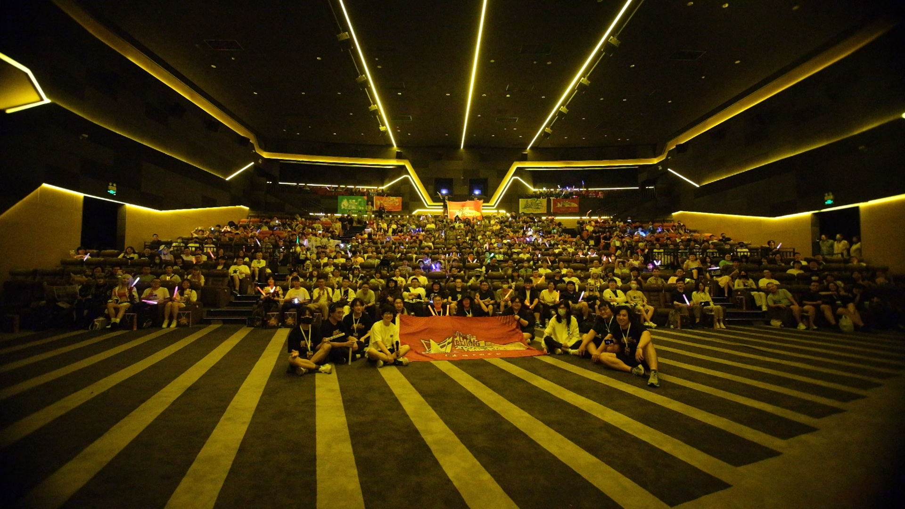

## Part I

1.首先欢迎您来到《回归线》的专访，先请您和读者们做个自我介绍。{.sp-qa .ques}

大家好哦！我是克斯！是b站的明日方舟up主，主要做周更舟梗和异克电台这两个栏目，也是同人社团StudioEutopia的主催。同时北京的一些和明日方舟/终末地相关的线下活动包括音律联觉观影，前瞻直播观影，新春会观影等活动都是我在主办。之前也是北京舟o春和景明/京台夕照的摊位区负责人。{.sp-qa .answ}

2.您入坑《明日方舟》的契机是什么呢？{.sp-qa .ques}

因为当时在学校是动漫社的社长，开服的那段时间看到社员们的朋友圈都在发一个非常酷炫的抽卡结算界面（比划），打听了一下叫明日方舟就入坑了\_(:з」∠)\_。{.sp-qa .answ}

谁知道这一玩就是七年。{.sp-qa .answ}

3.您最喜欢的《明日方舟》角色是谁？为什么喜欢他/她？{.sp-qa .ques}

最喜欢的角色那肯定是阿米娅！乖女儿嘬嘬嘬嘬嘬嘬嘬嘬嘬嘬嘬嘬嘬嘬（…………）{.sp-qa .answ}

4.您最喜欢的方舟剧情是哪一段？为什么选择它？{.sp-qa .ques}

最喜欢的果然还是孤星了，我一个不是很能记得住大群像里每个人人设性格的人，真的把孤星里每一个人都能记住，人物刻画的实在是太好了。以及这种和“未来”有关的故事，真的难以拒绝。正是每天都在幻想未来的无数种可能，关注着各种和未来相关的科技新闻，才让孤星故事的厚重感变的更重一些。24年音律联觉现场看到大火箭发射真的眼泪止不住的流。{.sp-qa .answ}

不行，看到这的你们也得哭。{.sp-qa .answ}

“已经没有什么能伤害到我了”{.sp-qa .answ}

“如若此后百年千年，来人漫步于繁星身侧，人们便要赞颂他的名”{.sp-qa .answ}

“（哭）”{.sp-qa .answ}

## Part II

1.能看到您的爱好以及参与的活动涉猎极广，不仅做游戏内的舟梗科普，还会关注游戏外的各种活动，以及参与一些同人线下活动的策划；而在方舟之外，我们也知道您有很多别的爱好，同时还在运营一个交通内容分享的账号。是什么驱动您在这么多领域的热爱与探索呢？{.sp-qa .ques}

方舟这边的话还是因为喜欢这个游戏嘛，所以就会相应的关注他周边的各种内容。{.sp-qa .answ}

其他的爱好我感觉可能是因为比较享受这种探索新领域的过程。其中小众的领域比较多，主要是在小众领域里很容易得到满足，当然换个说法可能是竞争没那么激烈（）。{.sp-qa .answ}

当然其实这么久下来我也发现了，自己只能做到半斤八两，想要去做更好的过程上就会丧失那种探索的乐趣，因为要的是持之以恒。但这个过程对自己来说就很煎熬，这个期间就会开始摸鱼尝试下一个领域，然后就这么一直循环下去。{.sp-qa .answ}

（所以有时候我都觉得我在东一榔头西一棒槌\_(:з」∠)\_ ）{.sp-qa .answ}

2.接着上面的问题，同时做这么多事情也需要很多的精力与热情，能和大家分享一下您是如何长期保持这样的热情与充足的精力呢？{.sp-qa .ques}

这个问题太好答了，不上班就行（？？？）{.sp-qa .answ}

鄙人在回答这个采访的时候，已经在24岁的年纪gap一年半了。上班真的会把自己的精力榨干，从而没有精力去干任何自己想做的事。 当时上班的时候一天工作8小时，但因为各种原因我单天通勤就要6个小时（致敬北京传奇通勤时间），我还坚持了半年。去掉吃饭睡觉的时间，每天留给自己的时间就只有半小时了能干啥呢是吧。{.sp-qa .answ}

虽然gap的这段时间里收入的确和工作没法比，但这段时间里做了很多自己想做的事，想做什么也自由一些，睡觉也基本都是自然醒。精力也就相应的比较充足吧哈哈哈。{.sp-qa .answ}

当然，不是鼓励大家像我一样辞职啊！！得先能养活自己了才有选择的余地嘛。{.sp-qa .answ}

3.您的《秩序京然》系列是讲罗德岛的干员们在北京这座城市的背景下发生的故事，您是如何想到要创作这样的将游戏世界与现实相结合的故事的呢？关于第三册要做什么现在有想法吗？{.sp-qa .ques}

最开始想做这种游戏和现实结合的想法是因为以前经常看日本的很多动画都有“圣地巡礼”的地方。想着国内有这样的作品有点少，所以就以这个切入点去完成《秩序京然》这个系列作品！不过在创作的时候并不想迎合大家对于北京的刻板印象，所以在创作的时候还是尽可能的去寻找那些刻板印象外但值得描写的故事！{.sp-qa .answ}

比如安洁莉娜和北京大学的那部分我就相当满意！大家的刻板印象可能是北京大学学生都是学霸，都是“学习机器”。但在那背后也有属于他们痛苦的学习过程，也有食堂里喜欢吃的饭菜，也会因为学校里的美景和猫咪学长留步，更会因为期末周的复习压力而崩溃。{.sp-qa .answ}

所以这种带有烟火气的内容，正是《秩序京然》系列的核心！{.sp-qa .answ}

关于第三册的话可能首要的任务是把原有的一册两角色拆分吧哈哈哈，出了很多次摊发现大家可能更倾向于一个本子里只有一位角色的图和故事。关于地点的话确实有点想法，比如音乐剧相关？或者公园，博物馆这样子。{.sp-qa .answ}

4.对于那些想要和您一样创作跨越次元的内容的作者，您有什么心得可以分享一下吗？{.sp-qa .ques}

首先是不要放过生活中的各种小细节！有时候这种小细节慢慢拓展就会成为一个可以创作的内容！{.sp-qa .answ}

其次是力保内容的真实，比如为了确保《秩序京然》里安洁莉娜的部分符合北京大学学生的习惯，专门采访了几位北大的同学向他们询问了学校生活和不少的细节，这些细节最后就落地成了创作的内容。也正是这些内容才会让熟悉这些的读者会心一笑。{.sp-qa .answ}

以及更重要的一点是要多为角色着想，想想他们到这个地方会经历什么和怎么去处理。当然也可以反向选择，比如这个地方更符合哪位角色的气质，也不失为一种方法。{.sp-qa .answ}

## Part III

1.前不久看到您发起了一个名为“流光定影”的项目，收集2025年《明日方舟》陪伴博士们的一些重要时刻。如果请您给自己选一张照片的话，您会选哪张呢？能讲讲这张照片的故事吗？{.sp-qa .ques}

我会选择这张，这是2025年音律联觉熠曲丰碑北京线下观影活动的合影。当时拍摄的相机不知道为什么拍照出现了问题，但拍视频就没有问题，所以这张合影是视频里的一帧，画质不比拍照是一个遗憾，但也更因为这个遗憾所以才选择了这张。{.sp-qa .answ}

 {.centering}

音律联觉观影是我搞这么多方舟线下活动的起点，当时是22年的灯下定影，从当时现场的70位博士到这次25年现场一共有430位博士，这一步一步走来真的特别的感慨。{.sp-qa .answ}

2.您觉得方舟给您和您身边人的生活带来了多少影响？{.sp-qa .ques}

家里的小纸片子变多了（目移）{.sp-qa .answ}

每次去各种活动，或者自己组织的活动都能收到很多的无料，放在家里妥善保管（点头）{.sp-qa .answ}

生活上可能就是更加的有盼头了吧，总会为着之后的故事和活动所期待着，比如音律联觉。{.sp-qa .answ}

3.您觉得为什么方舟能成为一个跨越次元影响了许多人，为许多人创造了现实中的更多故事的一部作品？{.sp-qa .ques}

哇这个问题好难{.sp-qa .answ}

可能是因为方舟是一个剧情导向的游戏，使得大家会因为一个角色或一个故事而产生共鸣，从而会逐渐的影响到生活中的所作所为。大概这就是作品的力量吧。{.sp-qa .answ}

4.最后，有什么是想对读者朋友，您的粉丝以及所有博士们说的吗？如果可以，也希望能为《回归线》留下一句赠言。{.sp-qa .ques}

谢谢大家能看完我的访谈！b站私信联系我说看完了，我给你发我社团制品的5元优惠券（？？？？）{.sp-qa .answ}

也谢谢大家一直对我的支持，无论是视频也好制品也好还是线下活动也好，真的都无比的感谢！{.sp-qa .answ}

祝各位博士们新的一年要啥有啥，吃嘛嘛香，学习进步，工作顺利，玩的开心！{.sp-qa .answ}

最后也祝《回归线》越办越好！上次cp看到需要排队领《回归线》真的好羡慕有这么多读者。{.sp-qa .answ}

最最后，“兄弟们，这个《回归线》我是真的喜欢！”<eod /> {.sp-qa .answ}

<FakeAds />
