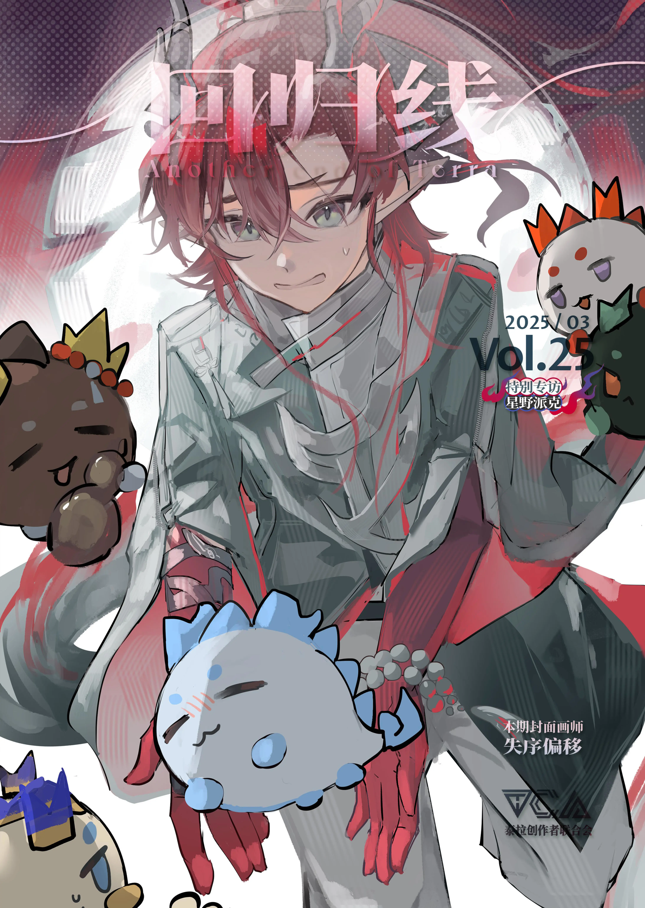
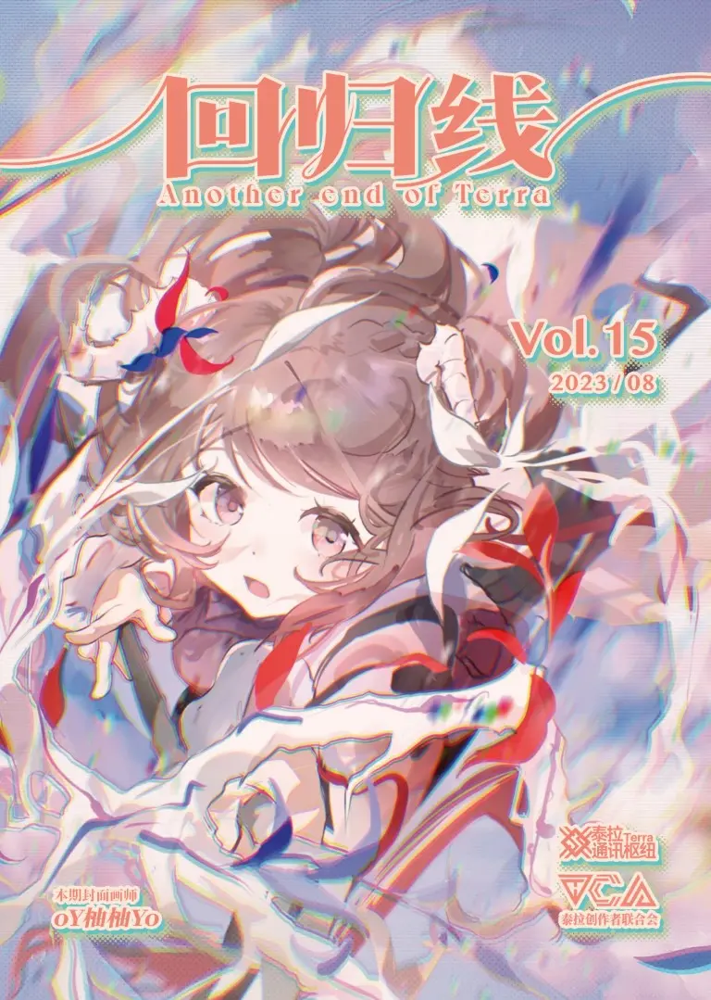
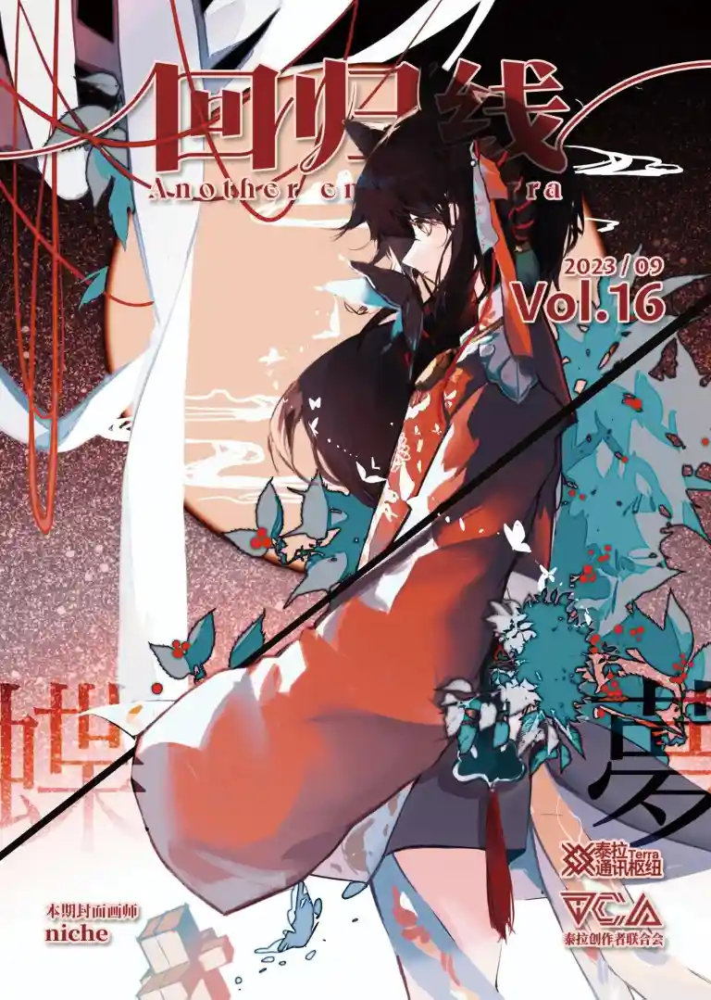
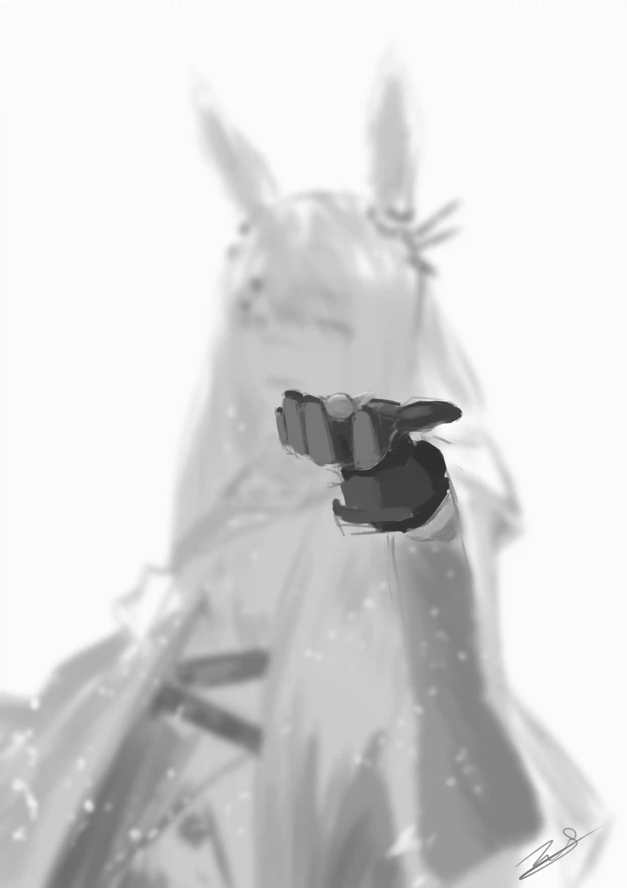
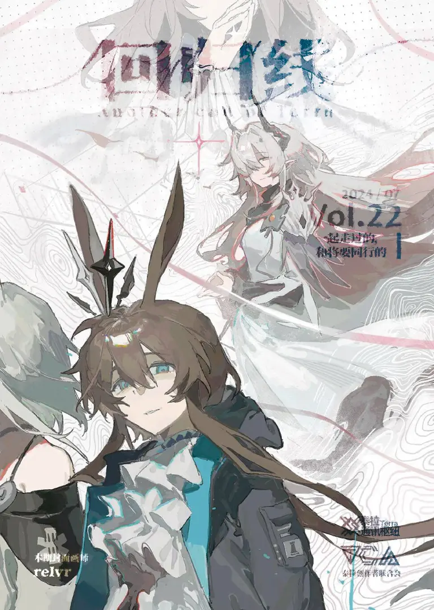

<!-- more -->

## **最新一期** {.centering}

<big>

**2025-03: Vol. 25 - 2025 年 03 月号** {.centering}

</big>

  

### [**在线阅读**](./2025-03/README.md) {.centering}

### [**前往下载页面**](https://pan.arktca.com) {.centering}

## **往期回顾** {.centering}

||||
|:-:|:-:|:-:|
|[2022-05: Vol. Special  绿华漫霜优秀作品集](2022-05/)|[2022-06: Vol.01  2022 年 06 月号](2022-06/)|[2022-07: Vol.02  2022 年 07 月号：相互的彼方](2022-07/)|
||||
|[2022-08: Vol. 03  2022 年 08 月号](2022-08/)|[2022-09: Vol. 04  2022 年 09 月号：乡愁和归处](2022-09/)|[2022-10: Vol.05  2022年 10 月号](2022-10/)|
|| | |
|[2022-11: Vol. 06  2022 年 11 月号：彼处水如酒](2022-11/)|[2022-12: Vol. 07  2022 年 12 月号](2022-12/) | [2023-01: Vol. 08  2023 年 01 月号：一个期许，或是一个承诺](2023-01/)|
||||
|[2023-02: Vol. 09  2023 年 02 月号](2023-02/)|[2023-03: Vol. 10  2023 年 03 月号：往昔是个漫长的夜](2023-03/)|[2023-03: Vol. 11  2023 年 04 月号](2023-04/)|
||||
|[2023-05: Vol. 12  2023 年 05 月号：IF](2023-05/)| [2023-06: Vol. 13  2023 年 06 月号](2023-06/) | [2023-07: Vol. 14  2023 年 07 月号：人生的路口](2023-07/) |
||  |  |
|[2023-08: Vol. 15  2023 年 08 月号](2023-08/)| [2023-09: Vol. 16  2023 年 09 月号：遗于身后之物](2023-09/) | [2023-10: Vol. 17  2023 年 10 月号](2023-10/) |
||  |  |
|[2023-12: Vol. 18  2023 年 12 月号：结束](2023-12/)| [2024-02: Vol. 19  2024 年 02 月号](2024-02/) | [2024-03: Vol. 20  2024 年 03 月号：希望的诸多表现形式](2024-03/) |
|||  |
|[2024-04: Vol. 21  2024 年 04 月号](2024-04/)| [2024-07: Vol. 22  2024 年 07 月号：一起走过的，和将要同行的](2024-07/) | [2024-09: Vol. 23  2024 年 09 月号](2024-09/) |
||  | NO INFO |
|[2024-12: Vol. 24  2024 年 12 月号：从前有座巴别塔](2024-12/)| [2025-03: Vol. 25  Vol. 25 - 2025 年 03 月号](2025-03/) | 敬请期待 |

<FakeAds />
